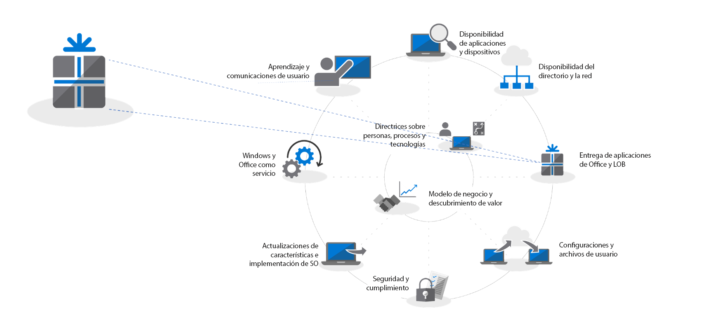
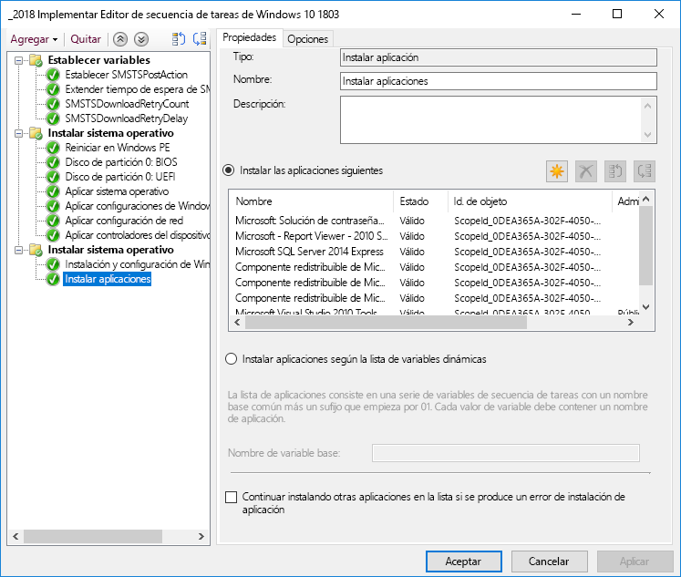
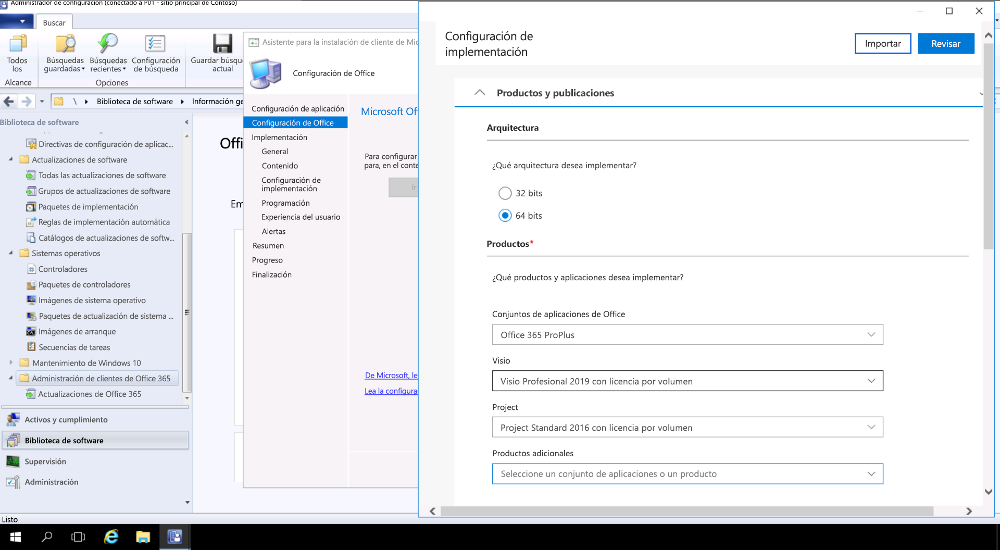

# Paso 3: Entrega de aplicaciones de Office y de LOB

<table>
<thead>
<td></td>
<td>
<strong>Paso 3: Entrega de aplicaciones de Office y de LOB</strong>

Asegúrese de que las aplicaciones están empaquetadas y listas para la instalación automática. Obtenga información sobre cómo el empaquetado Hacer clic y ejecutar con Office 365 ProPlus ofrece opciones nuevas para configurar, entregar y mantener actualizadas las aplicaciones de Office.
</td>
<td></td>
</thead>
</table>

>[!NOTE]
>Entrega de aplicaciones de Office y de LOB es el tercer paso en la rueda del proceso de implementación recomendado que trata las opciones para instalar y administrar Office y LOB. Para lograr una implementación correcta no omita los dos primeros pasos.  Para ver el proceso de implementación de escritorio completo, visite el [Centro de implementación de escritorio](https://aka.ms/HowToShift).
>

Ya tiene todo listo para entregar sus aplicaciones de Office y Línea de negocio (LOB). Hay varias maneras de hacerlo, incluidas algunas opciones nuevas e interesantes. Aunque algunas aplicaciones solo están disponibles como cualquier una versión compilada de 32 bits o 64 bits, otras como Office 365 ProPlus ofrecen las versiones de 32 bits y 64 bits como código compilado nativo, y una de las mayores decisiones que realizará es qué versión debe implementar. Para aprovechar las ventajas de la potencia de cálculo y RAM adicionales en nuevos dispositivos, Microsoft recomienda usar la versión de 64 bits cuando no haya ninguna dependencia de 32 bits. Para determinar las dificultades de compatibilidad relacionadas con cualquier complemento o archivos que pueda tener, se recomienda que vuelva a visitar el Paso 1 Preparación de dispositivos y aplicaciones antes de continuar.

Si no hay nada que lo impida, se recomienda implementar las versiones de 64 bits de todas las aplicaciones, incluido Microsoft Office. Las aplicaciones compiladas nativas de 64 bits ofrecen el mejor rendimiento y son la mejor opción para el futuro.

Existen varios métodos y modelos para instalar aplicaciones en Windows, de modo que vamos a ver las opciones de entrega.

[Administración de aplicaciones de Windows 10](https://docs.microsoft.com/es-ES/windows/application-management/)

## Implementaciones basadas en MSI

Para las aplicaciones de línea de negocio, es probable que use paquetes basados en MSI o archivos ejecutables, y que instale las aplicaciones como parte de una secuencia de tareas de implementación de sistema operativo. Windows 10 sigue funcionando con estos paquetes.

Las herramientas de implementación de software como System Center Configuration Manager y Microsoft Intune también están optimizadas para la entrega de aplicaciones empaquetadas como MSI. Después de validar las aplicaciones en Windows 10, puede usar System Center Configuration Manager (Rama actual) para la entrega. Si usa el Portal de empresa de Microsoft Intune, puede ampliar la selección de aplicaciones autorizadas por TI disponibles para la organización con el fin de incluir las más recientes y que los usuarios seleccionen ellos mismos las que necesitan.

## Creación de imágenes de equipo

Otro método popular de entrega de aplicaciones es la creación de imágenes del equipo. En este caso, las aplicaciones se instalan mediante una secuencia de tareas o de forma manual en un equipo de ejemplo, después se captura una imagen del sistema con las aplicaciones necesarias preinstaladas. El enfoque de creación de imágenes para compilar y capturar ahorrará tiempo cuando aprovisione nuevos equipos, pero recuerde que los sistemas operativos y las aplicaciones dentro de la imagen pueden quedarse obsoletos rápidamente. El modelo de actualización acumulativa en Windows 10 y Office 365 ProPlus ayuda con este problema, pero no lo elimina por completo. Por eso, se recomienda un enfoque de imagen ligera, en el que las aplicaciones se instalan desde fuera de la imagen en el momento de la implementación.

Si quiere incluir Office 365 ProPlus en la imagen, recuerde que se usa una activación basada en el usuario; el administrador del sistema no lo puede activar previamente. Use la herramienta de implementación de Office antes de preinstalar Office en el dispositivo del que se va a crear la imagen y omita el inicio de sesión del usuario. Cuando esté implementada la imagen los usuarios finales podrán iniciar sesión con sus credenciales de Office 365 y activar Office 365 ProPlus.

[Creación de una secuencia de tareas para instalar el sistema operativo](https://docs.microsoft.com/es-ES/sccm/osd/deploy-use/create-a-task-sequence-to-install-an-operating-system)

[Deploy Office 365 ProPlus as part of an operating system image](https://docs.microsoft.com/es-ES/deployoffice/deploy-office-365-proplus-as-part-of-an-operating-system-image) (Implementar Office 365 ProPlus como parte de una imagen de sistema operativo)

## Hacer clic y ejecutar de Office 

Office 365 ProPlus se instala mediante el método Hacer clic y ejecutar, que reemplaza el empaquetado basado en MSI en todas las versiones de la próxima publicación de Office 2019 para Windows. Aporta una serie de ventajas, incluyendo instalaciones más rápidas, actualizaciones más rápidas y eficaces y desinstalación más limpias. 

Los programas que se envíen a través de Hacer clic y ejecutar se ejecutan en un entorno virtual de aplicación en el equipo y de esta forma coexisten con otras aplicaciones sin conflicto, también ocupan aproximadamente la mitad del espacio en disco de lo que ocuparían como un paquete basado en MSI. Las aplicaciones de Office se entregan y se administra a través de la [Herramienta de implementación de Office](https://www.microsoft.com/en-us/download/details.aspx?id=49117) que es el motor de instalación de Office es necesario descargar, configurar y personalizar las aplicaciones de Office. La Herramienta de implementación de Office lee un archivo XML de configuración que proporciona las instrucciones de metadatos acerca de cómo configurar y personalizar la instalación de Office.

Microsoft recomienda usar la [Herramienta de personalización de Office](https://config.office.com/) para personalizar la configuración de implementación y crear el archivo XML de configuración. Mediante la Herramienta de personalización de Office puede establecer los idiomas y las aplicaciones que se instalarán, cómo se actualizarán las aplicaciones, la configuración de la aplicación y la configuración de la experiencia de instalación.

Si usa System Center Configuration Manager, puede seguir usándolo para la implementación general de Office 365 ProPlus. System Center Configuration Manager (Rama actual) tiene compatibilidad nativa con la Herramienta de personalización de Office actualizada, la personalización de paquetes para Hacer clic y ejecutar en tiempo de instalación y la administración de actualizaciones de software después de la instalación.

[Guía de implementación de Office 365 ProPlus](https://docs.microsoft.com/es-ES/deployoffice/deployment-guide-for-office-365-proplus)

[Desinstalación de versiones de MSI existentes de Office al actualizar a Office 365 ProPlus](https://docs.microsoft.com/es-ES/deployoffice/upgrade-from-msi-version)

[Administración de Office 365 ProPlus con Configuration Manager](https://docs.microsoft.com/es-ES/sccm/sum/deploy-use/manage-office-365-proplus-updates)

[Asignación de aplicaciones de Office 365 a dispositivos Windows 10 con Microsoft Intune](https://docs.microsoft.com/es-ES/intune/apps-add-office365)

## Aplicaciones basadas en el explorador

Hay algunas aspectos que debe considerar para asegurarse de que las aplicaciones basadas el explorador siguen funcionando como se esperaba. Si tiene determinados sitios y aplicaciones web con problemas de compatibilidad conocidos con Microsoft Edge, puede usar la lista de sitios del modo de empresa para que los sitios web se abran de forma automática con Internet Explorer 11.

Además, si sabe que los sitios de la intranet no van a funcionar de forma correcta con Microsoft Edge, puede configurarlos para que se abran de forma automática con Internet Explorer 11. En este proceso se usa un archivo XML para controlar si se utiliza IE11 en cada sitio, mediante la directiva de grupo para aplicar la configuración.

[¿Qué es el modo de empresa](https://docs.microsoft.com/es-ES/internet-explorer/ie11-deploy-guide/what-is-enterprise-mode#what-is-enterprise-mode)

Hasta ahora, hemos analizado métodos de implementación conocidos. Pero hay dos nuevos métodos para la implementación de aplicaciones que puede que desee considerar.

## Microsoft Store para Empresas 

Microsoft Store para Empresas proporciona una manera flexible de descubrir, adquirir, administrar y distribuir aplicaciones gratuitas y de pago para dispositivos Windows 10 a escala. Como administrador de TI, puede publicar aplicaciones de Microsoft Store seleccionadas, junto con sus propias aplicaciones personalizadas, en su propio almacén privado al mismo tiempo que asigna y volver a usar licencias según sea necesario. Los usuarios solo pueden usar esta tienda y, por lo tanto, solo pueden buscar e instalar aplicaciones autorizadas.

Las aplicaciones de la tienda se pueden crear de forma nativa como aplicaciones UWP o puede usar el Puente de dispositivo de escritorio para volver a empaquetar las aplicaciones existentes para Microsoft Store y agregar experiencias modernas para Windows 10. Excepto el código que se usa para mejorar las experiencias de Windows 10, la aplicación no se modifica y se seguirá ejecutando en modo de usuario de plena confianza.

## Creación de contenedores MSIX

Una nueva opción para el paquete de aplicaciones es MSIX. MSIX usa la tecnología de creación de contenedores disponible en Windows, lo que une los mejores aspectos del empaquetado de MSI, UWP y Hacer clic y ejecutar. Con las herramientas para migrar instaladores existentes como EXE, MSI, APPV y APPX directamente a MSIX, vemos que la Creación de contenedores MSIX proporciona una ruta unificada para las múltiples tecnologías de instalación que se usan hoy. La compatibilidad con MSIX se incluye en las versiones actuales de Windows: cualquier dispositivo con Windows 10 RS5 o versiones posteriores incluye todo lo que necesita para instalar y ejecutar aplicaciones empaquetadas de MSIX. Windows 10 integra dinámicamente contenedores MSIX que recibe y mantiene las aplicaciones separadas del sistema operativo.

La creación de contenedores significa la desinstalación y eliminación limpia de los paquetes, a diferencia de muchos paquetes actuales basados en EXE y MSI que pueden dejar elementos en el sistema. También significa que solo se necesitan credenciales de usuario estándar para instalar las aplicaciones; no se necesitan credenciales de administrador para instalar contenedores MSIX. Los contenedores MSIX también son más eficientes de actualizar. Cuando se publica una actualización, el uso de diferencias de nivel de bloque significa que solo se aplican los archivos binarios nuevos, lo que reduce la carga de la actualización, para implementaciones más rápidas con menos ancho de banda de red.

Encontrará más información sobre MSIX en el [sitio Tech Community de MSIX](https://techcommunity.microsoft.com/t5/MSIX/ct-p/MSIX).

## Siguiente paso

## [Paso 4: Archivos y configuración del usuario](https://aka.ms/mdd4)

## Paso anterior

## [Paso 2: Preparación de los directorios y la red](https://aka.ms/mdd2) 