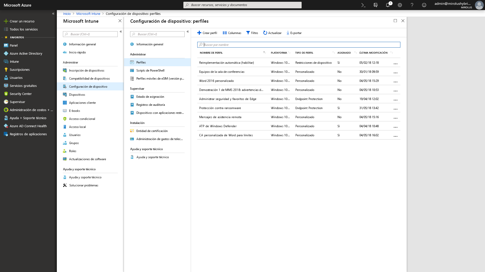

# Paso 5: Consideraciones de seguridad y cumplimientoStep 5: Security and Compliance Considerations

<table>
<thead>
<td></td>
<td>
<strong>Paso 5: Consideraciones de seguridad y cumplimiento</strong><strong>Step 5: Security and Compliance Considerations</strong>

Windows 10 y Aplicaciones de Microsoft 365 para empresas proporcionan nuevas formas de proteger sus datos, dispositivos y usuarios, y de detectar y responder rápidamente ante las amenazas. Además, obtenga información sobre cómo solucionar problemas comunes relacionados con el cifrado de discos, aplicaciones antimalware y directivas al migrar a Windows 10.Windows 10 and Microsoft 365 Apps for enterprise provide new ways to protect your data, devices and users and quickly detect and respond to threats. Also, learn how to deal with common problems associated with disk encryption, anti-malware apps and policies when moving to Windows 10.
</td>
<td></td>
</thead>
</table>

>[!NOTE]
>Seguridad y cumplimiento es el quinto paso del ciclo de proceso de implementación recomendado, que abarca consideraciones de seguridad y cumplimiento para Windows 10 y Aplicaciones de Microsoft 365 para empresas.Security and Compliance is the fifth step in our recommended deployment process wheel covering Windows 10 and Microsoft 365 Apps for enterprise security and compliance considerations. Para ver el proceso de implementación de escritorio completo, visite el [Centro de implementación de escritorio](https://aka.ms/HowToShift).To see the full desktop deployment process, visit the [Desktop Deployment Center](https://aka.ms/HowToShift).
>

Ahora es el momento de revisar las opciones para seleccionar como destino nuevas funciones de seguridad y cumplimiento como parte de la implementación de Windows 10 y Aplicaciones de Microsoft 365 para empresas, junto con las consideraciones y los bloqueadores de elementos comunes al cambiar desde versiones anteriores de Windows y Office.Now it's time to review options for targeting new security and compliance capabilities as part of your Windows 10 and Microsoft 365 Apps for enterprise deployment, along with the considerations and common blockers when moving from previous versions of Windows and Office. Muchas de las funciones relacionadas con la seguridad de Windows 10 impulsan el cambio a la plataforma más reciente.Many of the security-related capabilities in Windows 10 alone are driving the shift to the newer platform. Además, la integración con los servicios en la nube y las opciones de identidad con Azure Active Directory da acceso a protecciones nuevas y en continua actualización para datos, dispositivos y usuarios.Also, integration with cloud services and identity options using Azure Active Directory brings access to new and continually updated protections for your data, devices and users.

## Superación de posibles bloqueadores de implementación relacionados con la seguridadOvercoming Potential Security-Related Deployment Blockers

Antes de explicar las funciones nuevas que se pueden agregar al migrar a Windows 10 y Aplicaciones de Microsoft 365 para empresas, y conectar esas experiencias con la nube, comenzaremos con algunas tendencias que vemos que a menudo pueden interrumpir el progreso de la implementación.Before explaining new capabilities that you can add as you move to Windows 10 and Microsoft 365 Apps for enterprise and connect those experiences to the cloud, let’s start with a few trends we’re seeing that can often interrupt deployment progress.

### Cifrado de discoDisk Encryption

El primero de los desafíos iniciales que pueden aparecer es el cifrado del disco duro. Muchas soluciones de cifrado de disco duro no se pueden actualizar con facilidad desde una versión anterior de Windows a otra versión más reciente.First one of the initial challenges you might encounter is hard disk encryption. Many solutions for hard disk encryption cannot easily be upgraded from a previous version of Windows to a newer version of Windows.

Algunas soluciones de cifrado de disco permiten realizar las actualizaciones cuando se usa la opción "/reflectdrivers" con el programa de instalación de Windows en algunas versiones de sus plataformas, pero otras pueden requerir que se descifre la unidad antes de la implementación y, luego, volver a cifrarla después de instalar Windows 10. En algunas soluciones tampoco se permite cambiar del Registro de arranque maestro (MBR), con BIOS heredado, a Tabla de particiones GUID (GPT), necesario para UEFI. Esto es importante porque se necesita una versión de 64 bits de Windows 10 con UEFI para las nuevas funciones de seguridad basadas en la virtualización de Windows 10, que se describen a continuación.Some disk encryption solutions allow you to perform the upgrades when using the ‘/reflectdrivers’ option with Windows Setup on certain versions of their platforms, but others may require you to unencrypt the drive prior to deployment, then re-encrypt after Windows 10 is installed. Some solutions also do not allow you to move from Master Boot Record (MBR), using legacy BIOS, to GUID Partition Table (GPT), required for UEFI. This is important because a 64-bit version of Windows 10 with UEFI is required for the new virtualization-based security capabilities in Windows 10 and those are explained below.

Una opción para resolver estos problemas consiste en usar BitLocker en Windows 10, que se incluye en Windows 10 Pro y ediciones superiores. BitLocker permite interrumpir la protección para las actualizaciones del sistema operativo y las actualizaciones de características como parte del proceso.One option to resolve these issues is using BitLocker in Windows 10, which is included in Windows 10 Pro and higher editions. BitLocker allows you to suspend protection for OS upgrades and Feature Updates as part of the process.

[Implementación básica de BitlockerBitlocker basic deployment](https://docs.microsoft.com/windows/security/information-protection/bitlocker/bitlocker-basic-deployment)

### Compatibilidad de aplicaciones de antivirus y antimalwareAntivirus and Antimalware Application Compatibility

En segundo lugar, aunque hemos visto que más del [99 % de las aplicaciones de Windows son compatibles](https://www.microsoft.com/microsoft-365/blog/2018/09/06/helping-customers-shift-to-a-modern-desktop/) entre Windows 7 y Windows 10, las excepciones suelen ser las aplicaciones antivirus (AV) o los clientes de una red privada virtual (VPN). Estas aplicaciones suelen implementar prácticas y API de desarrollo no estándar, con formas sin documentar de proteger el sistema o conectarse a los recursos de la red.Second, while we’ve seen that more than [99% of Windows applications are compatible](https://www.microsoft.com/microsoft-365/blog/2018/09/06/helping-customers-shift-to-a-modern-desktop/) between Windows 7 and Windows 10, the exceptions are often anti-virus (AV) apps or Virtual Private Network (VPN) clients. These applications often implement non-standard development practices and APIs, using often undocumented ways to protect your system or connect you to network resources.

Como resultado, por naturaleza estas aplicaciones pueden ser frágiles al cambiar a una versión nueva de Windows. Si el software AV o VPN no funciona en Windows 10 o después de la actualización, la corrección suele consistir en reemplazar la aplicación por algo que sea compatible en Windows 10 y se haya probado.As a result, these apps by nature can be fragile to changes when shifting to a new version of Windows. If your AV or VPN software doesn’t work in Windows 10 or after upgrading, the fix is typically to replace the app you’re using with something supported and tested on Windows 10.

### Directivas de seguridadSecurity Policies

Es posible que la configuración de directiva de grupo de Active Directory que se usaba en versiones anteriores de Windows y Office no se traduzca directamente a Windows 10 y Aplicaciones de Microsoft 365 para empresas, y existen otras consideraciones con las funciones nuevas de seguridad y cumplimiento. Es recomendable usar Microsoft Security Compliance Toolkit para obtener una base de referencia de las directivas de seguridad para las versiones actuales de Windows y Office. Además, es importante examinar las directivas de administración de dispositivos móviles como parte de Microsoft Intune.Your Active Directory Group Policy settings used for older versions of Windows and Office may not translate directly to Windows 10 and Microsoft 365 Apps for enterprise, and there are different considerations with newer security and compliance capabilities. It’s a good idea to use the Microsoft Security Compliance Toolkit to get a baseline of the security policies for current versions of Windows and Office. Additionally, it’s worth looking into Mobile Device Management policies as part of Microsoft Intune.

## 

## Nuevas características de seguridad y cumplimiento de Microsoft 365New Security and Compliance Capabilities in Microsoft 365

Esas eran consideraciones para la migración de las protecciones actuales y los aspectos que tener en cuenta antes del cambio. Ahora veremos las funciones nuevas que se pueden aprovechar al migrar a Windows 10, Aplicaciones de Microsoft 365 para empresas y opciones basadas en la nube desde EMS y posteriores.Now, those were considerations for moving your current protections forward and things to be aware of before your shift. Now let’s take a look at new capabilities that you can take advantage of when moving to Windows 10, Microsoft 365 Apps for enterprise and cloud-based options from EMS and beyond.

### Administración de identidad y accesoIdentity and Access Management

Empecemos con la administración de identidad y acceso. Azure Active Directory es el plano de control de identidad para aplicaciones, dispositivos y servicios en la nube, y es la forma moderna de conectarse a Microsoft 365 y otros servicios en la nube. El acceso condicional permite definir requisitos de autenticación diferentes en función de dónde se inicie sesión, el dispositivo que se use, además de aspectos como los comportamientos anómalos.Starting with identity and access management. Azure Active Directory is the identity control plane for apps, devices and Cloud services and is the modern way to connect to Microsoft 365 and other Cloud services. Conditional access allows you to define different authentication requirements based on where you are logging in from, which device you're using, as well as things like anomalous behaviors.

En el nivel de dispositivo, la biometría puede proporcionar identificadores únicos para que el acceso a los dispositivos y las aplicaciones sea más sencillo y seguro, mientras se avanza hacia el objetivo de eliminar las contraseñas. Windows Hello ofrece la autenticación multifactor basada en dispositivos. Depende del propio dispositivo, del PIN, o bien de un identificador biométrico único como la cara o la huella digital, que se puede aplicar a través de una directiva.At the device level, biometrics can provide unique identifiers for simpler and more secure access to your devices and apps - as you move toward the goal of eliminating passwords. Windows Hello offers device-based, multi-factor authentication. It relies on the device itself, your PIN, or unique biometric identifier such as your face or fingerprint, which you can enforce via policy.

[Aspectos básicos de la administración de identidades de AzureFundamentals of Azure identity management](https://docs.microsoft.com/azure/active-directory/fundamentals/identity-fundamentals)

[Información acerca de las soluciones de identidad de AzureUnderstand Azure identity solutions](https://docs.microsoft.com/azure/active-directory/fundamentals/understand-azure-identity-solutions)

[Acceso condicional de Azure Active DirectoryAzure Active Directory Conditional Access](https://docs.microsoft.com/azure/active-directory/conditional-access/overview)

[Windows Hello para empresasWindows Hello for Business](https://docs.microsoft.com/windows/security/identity-protection/hello-for-business/hello-identity-verification)

### Seguridad basada en la virtualizaciónVirtualization-based security

Además de la identidad, también se puede habilitar la protección continua contra amenazas conocidas y desconocidas, y para ello Windows 10 usa la seguridad basada en la virtualización con el fin de garantizar la integridad del arranque y del código mediante Arranque seguro. También podemos ayudarle a evitar el robo de credenciales con Credential Guard, mediante el aislamiento de los secretos del usuario de Windows. Y Protección de aplicaciones puede aislar y mitigar las amenazas basadas en el explorador ejecutándolo en un contenedor aislado. Todas estas tecnologías usan la seguridad basada en la virtualización de Windows 10 y son cambios fundamentales que no se pueden replicar en un sistema con Windows 7 (tenga en cuenta que también necesitan UEFI, Windows de 64 bits y compatibilidad la extensión de virtualización con SLAT) en el nivel de hardware.Now beyond identity, you can also enable continuous protection against both known and unknown threats and to do this Windows 10 uses virtualization-based security at the core to ensure boot integrity and code integrity using Secure Boot. We can help also stop credential theft with Credential Guard by maintaining user secrets in isolation from Windows. And, Application Guard can isolate and mitigate browser-based threats by running the browser in an isolated container. All of these technologies use virtualization-based security in Windows 10 and are foundational changes that cannot be replicated on a Windows 7 system – note that these also require UEFI, 64-bit Windows and virtualization extension support with SLAT – at the hardware level.

[Más información sobre la seguridad basada en la virtualizaciónMore on Virtualization-based Security](https://docs.microsoft.com/windows-hardware/design/device-experiences/oem-vbs)

### Mejoras de seguridad de los servicios en la nubeSecurity enhancements from cloud services

Los servicios en la nube proporcionan otro nivel de protección opcional para mejorar la seguridad de Windows y Office. Pueden proporcionarle un nuevo nivel de control, en ocasiones en tiempo real, que puede detectar al instante, resistirse y responder a ataques y tipos de ataques nuevos, especialmente en comparación a los archivos de firma de AV y actualización de software tradicionales, en los que los tiempos de respuesta e implementación de actualización son intrínsecamente más lentos.Cloud services provide another layer of optional protection to improve Windows and Office security. These can give you a new level of often real-time control that can instantly detect, resist and respond to new attacks and attack types – especially compared to traditional software updating and AV signature files – where response and update deployment times are inherently slower.

Junto con Microsoft Intelligent Security Graph, tiene un acceso más rápido a la información y protección contra las amenazas emergentes. Estos son algunos ejemplos que puede aprovechar, comenzando con Office.Along with the Microsoft Intelligent Security Graph, you have faster access to both information and protections from emerging threats. Here are a few examples of what you can take advantage of, starting with Office.

**[Prevención de pérdida de datos](https://docs.microsoft.com/office365/securitycompliance/data-loss-prevention-policies)** se integra en Aplicaciones de Microsoft 365 para empresas y ayuda a informar a los usuarios de las directivas de seguridad cuando se detecta contenido de alto riesgo como números de identificación o tarjeta de crédito. Las directivas pueden informar o bloquear el envío y el uso compartido después de notificar a los usuarios.**[Data Loss Prevention](https://docs.microsoft.com/office365/securitycompliance/data-loss-prevention-policies)** built into Microsoft 365 Apps for enterprise, helps inform users of security policies when high risk content like credit card or identification numbers are detected. Policies can inform or block sending and sharing after notifying users.

**[Azure Information Protection](https://docs.microsoft.com/azure/information-protection/rms-client/client-admin-guide)** es un servicio complementario que se puede usar con Office, para permitir a los usuarios clasificar y etiquetar con facilidad sus archivos de Office. Puede desencadenar una acción automática en los archivos etiquetados, como el cifrado o el bloqueo del uso compartido.**[Azure Information Protection](https://docs.microsoft.com/azure/information-protection/rms-client/client-admin-guide)** is a complementary service that can be used with Office, allowing users to easily classify and label their Office files. It can trigger automatic action on labeled files, such as encryption or locking down sharing.

También se ha incluido la protección **[Vínculos seguros](https://docs.microsoft.com/office365/securitycompliance/atp-safe-links)** en las aplicaciones de Office para protegerle de una lista dinámica de sitios web malintencionados conocidos.We've also introduced **[Safe Links](https://docs.microsoft.com/office365/securitycompliance/atp-safe-links)** protection across Office apps to protect you against a dynamic list of known malicious websites.

Además, **[Datos adjuntos seguros](https://docs.microsoft.com/office365/securitycompliance/atp-safe-attachments)** en Outlook y como parte de Exchange Online va más allá del filtrado de correo electrónico para comprobar los datos adjuntos. Si se identifican datos adjuntos de alto riesgo, se informa al usuario de los datos adjuntos malintencionados conocidos y se quitan del correo electrónico.Additionally, **[Safe Attachments](https://docs.microsoft.com/office365/securitycompliance/atp-safe-attachments)** in Outlook and as part of Exchange Online goes beyond email filtering to inspect attachments. If a high-risk attachment is identified, Safe Attachments will inform the user of known malicious attachments and remove them from email.

**[Cifrado de mensajes de Office 365](https://docs.microsoft.com/office365/securitycompliance/encryption)** (OME) también se puede usar para proteger el correo electrónico y los datos adjuntos enviados, lo que garantiza que solo los destinatarios previstos pueden ver el contenido del mensaje. OME funciona perfectamente con la autenticación de cuentas de consumidor de Google, Yahoo o Microsoft, y los códigos de acceso de un solo uso permiten a los usuarios de otros servicios de correo electrónico recibir mensajes de forma segura.**[Office 365 Message Encryption](https://docs.microsoft.com/office365/securitycompliance/encryption)** (OME) can also be used to safeguard email and attachments sent, ensuring only intended recipients can view email content. OME works seamlessly with Google, Yahoo, and Microsoft consumer account authentication, and one-time passcodes allow users of other email services to securely receive email as well.

#### Protecciones adicionales de Windows 10Additional Windows 10 protections

**[Control de aplicaciones de Windows Defender](https://docs.microsoft.com/windows/security/threat-protection/windows-defender-application-control/windows-defender-application-control)** de Windows 10 funciona a partir de una lista de aplicaciones permitidas y bloqueadas en las que Microsoft ha comprobado la seguridad y todo esto se administra mediante directivas de Endpoint Protection con Microsoft Intune.**[Windows Defender Application Control](https://docs.microsoft.com/windows/security/threat-protection/windows-defender-application-control/windows-defender-application-control)** in Windows 10 operates off an approved allow and deny list of applications that Microsoft has checked for safety and all that is managed by endpoint protection policies using Microsoft Intune.

**[Protección contra amenazas avanzada de Microsoft Defender](https://docs.microsoft.com/windows/security/threat-protection/windows-defender-atp/overview)** es una plataforma unificada de protección preventiva, detección posterior a la infracción, investigación automatizada y respuesta. Protege los puntos de conexión de las ciberamenazas; detecta ataques y vulneraciones de datos avanzados, automatiza los incidentes de seguridad y mejora la posición de seguridad.**[Microsoft Defender Advanced Threat Protection](https://docs.microsoft.com/windows/security/threat-protection/windows-defender-atp/overview)** is a unified platform for preventative protection, post-breach detection, automated investigation, and response. It protects endpoints from cyber threats; detects advanced attacks and data breaches, automates security incidents and improves security posture.

**[Protección contra vulnerabilidades de seguridad](https://docs.microsoft.com/windows/security/threat-protection/windows-defender-exploit-guard/windows-defender-exploit-guard)** ayuda a reducir la superficie de ataques para las aplicaciones en ejecución impidiendo que el malware llegue a Windows y bloqueando el acceso de los procesos que no son de confianza a las carpetas protegidas.**[Exploit Guard](https://docs.microsoft.com/windows/security/threat-protection/windows-defender-exploit-guard/windows-defender-exploit-guard)** helps reduce the attack surface for running applications by preventing malware from getting into Windows and blocking untrusted processes from accessing protected folders.

#### Microsoft IntuneMicrosoft Intune

[Microsoft Intune](https://docs.microsoft.com/intune/introduction-intune) funciona como un servicio de administración basado en la nube para dispositivos móviles, incluidos los de IOS, Android y Windows, y ahora se puede configurar para la administración conjunta con el fin de complementar y expandir controles para cargas de trabajo específicas administradas por Configuration Manager. Una ventaja de esto es que se puede requerir a los dispositivos que acceden a recursos protegidos que se inscriban en la administración de dispositivos, incluso los no administrados, los que no estén unidos a un dominio o los que estén unidos a Azure AD. También puede aprovechar la aplicación de directivas pormenorizadas de configuración y cumplimiento normativo en el nivel de la aplicación y el sistema operativo. La configuración y las directivas de aplicación se pueden configurar de forma centralizada y ejecutarse en las aplicaciones de Aplicaciones de Microsoft 365 para empresas y la Tienda en Windows 10 con Microsoft Intune.[Microsoft Intune](https://docs.microsoft.com/intune/introduction-intune) serves as a Cloud based management service for mobile scenarios, including IOS, Android and Windows devices, and can now be configured for co-management to complement and extend controls for specific workloads managed by Configuration Manager. One advantage here is that, devices accessing protected resources can be required to enroll into device management – even non-managed, non-domain joined or non-Azure AD joined devices. You can also take advantage of granular configuration and compliance policy enforcement at the operating system and application level. Application policies and settings can be configured centrally and enforced for Microsoft 365 Apps for enterprise and Store apps in Windows 10 using Microsoft Intune.

## Siguiente pasoNext Step

## [Paso 6: Implementación del sistema operativo y actualizaciones de característicasStep 6: OS Deployment and Feature Updates](https://aka.ms/mdd6)

## Paso anteriorPrevious Step 

## [Paso 4: Archivos y configuración del usuarioStep 4: User Files and Settings](https://aka.ms/mdd4)
