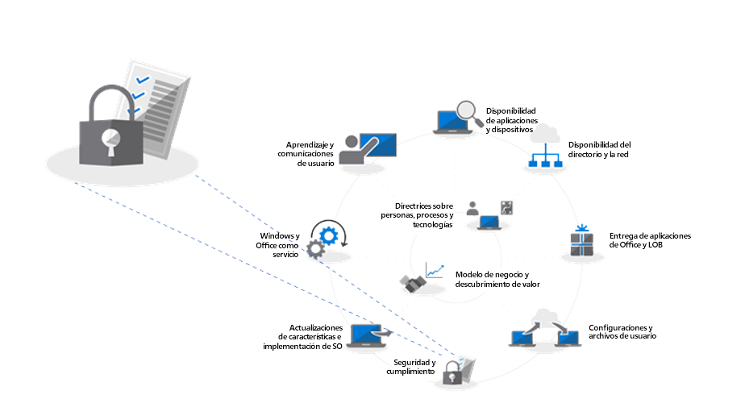
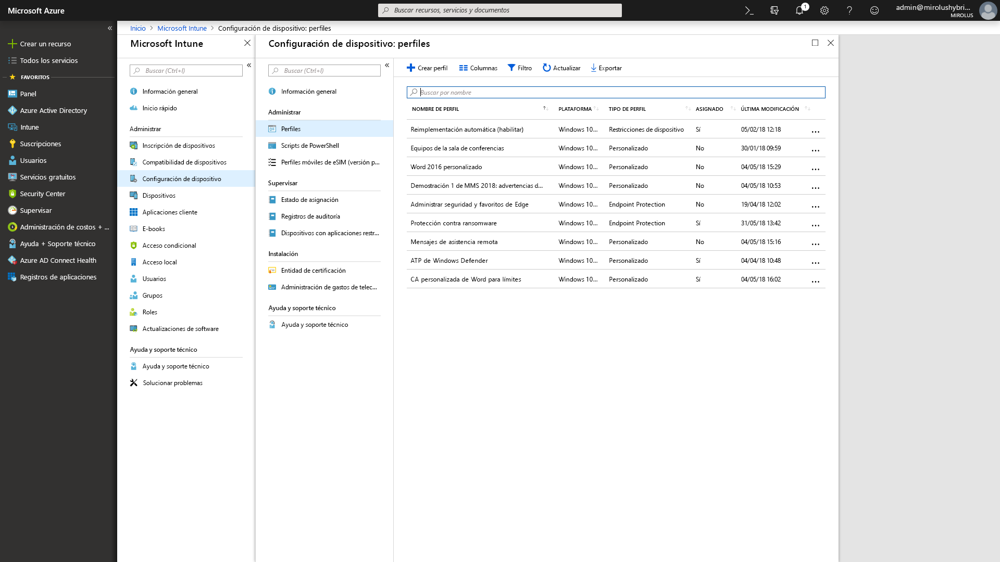

# Paso 5: Consideraciones de seguridad y cumplimiento

Revise las opciones para seleccionar como destino nuevas funciones de seguridad y cumplimiento como parte de la implementación de escritorios modernos junto con las consideraciones y los bloqueadores de elementos comunes al cambiar desde versiones anteriores de Windows y Office.

<table>
<thead>
<td></td>
<td>
<strong>Paso 5: Consideraciones de seguridad y cumplimiento</strong>

Windows 10 y Office 365 ProPlus proporcionan nuevas formas de proteger sus datos, dispositivos y usuarios, y de detectar y responder rápidamente ante las amenazas. Además, obtenga información sobre cómo solucionar problemas comunes relacionados con el cifrado de discos, aplicaciones antimalware y directivas al migrar a Windows 10.
</td>
<td></td>
</thead>
</table>

>[!NOTE]
>Seguridad y cumplimiento es el quinto paso del ciclo de proceso de implementación recomendado, que abarca consideraciones de seguridad y cumplimiento para Windows 10 y Office 365 ProPlus. Para ver el proceso de implementación de escritorio completo, visite el [Centro de implementación de escritorios modernos](https://aka.ms/HowToShift).
>

Muchas de las funciones relacionadas con la seguridad de Windows 10 impulsan el cambio a la plataforma más reciente. Además, la integración con los servicios en la nube de Office 365 y las opciones de identidad con Azure Active Directory da acceso a protecciones nuevas y en continua actualización para datos, dispositivos y usuarios.

## Superación de posibles bloqueadores de implementación relacionados con la seguridad

Antes de explicar las funciones nuevas que se pueden agregar al migrar a Windows 10 y Office 365 ProPlus, y conectar esas experiencias con la nube, comenzaremos con algunas tendencias que vemos que a menudo pueden interrumpir el progreso de la implementación.

### Cifrado de disco

El primero de los desafíos iniciales que pueden aparecer es el cifrado del disco duro. Muchas soluciones de cifrado de disco duro no se pueden actualizar con facilidad desde una versión anterior de Windows a otra versión más reciente.

Algunas soluciones de cifrado de disco permiten realizar las actualizaciones cuando se usa la opción "/reflectdrivers" con el programa de instalación de Windows en algunas versiones de sus plataformas, pero otras pueden requerir que se descifre la unidad antes de la implementación y, luego, volver a cifrarla después de instalar Windows 10. En algunas soluciones tampoco se permite cambiar del Registro de arranque maestro (MBR), con BIOS heredado, a Tabla de particiones GUID (GPT), necesario para UEFI. Esto es importante porque se necesita una versión de 64 bits de Windows 10 con UEFI para las nuevas funciones de seguridad basadas en la virtualización de Windows 10, que se describen a continuación.

Una opción para resolver estos problemas consiste en usar BitLocker en Windows 10, que se incluye en Windows 10 Pro y ediciones superiores. BitLocker permite interrumpir la protección para las actualizaciones del sistema operativo y las actualizaciones de características como parte del proceso.

[Implementación básica de Bitlocker](https://docs.microsoft.com/es-ES/windows/security/information-protection/bitlocker/bitlocker-basic-deployment)

### Compatibilidad de aplicaciones de antivirus y antimalware

En segundo lugar, aunque hemos visto que más del [99 % de las aplicaciones de Windows son compatibles](https://www.microsoft.com/es-ES/microsoft-365/blog/2018/09/06/helping-customers-shift-to-a-modern-desktop/) entre Windows 7 y Windows 10, las excepciones suelen ser las aplicaciones antivirus (AV) o los clientes de una red privada virtual (VPN). Estas aplicaciones suelen implementar prácticas y API de desarrollo no estándar, con formas sin documentar de proteger el sistema o conectarse a los recursos de la red.

Como resultado, por naturaleza estas aplicaciones pueden ser frágiles al cambiar a una versión nueva de Windows. Si el software AV o VPN no funciona en Windows 10 o después de la actualización, la corrección suele consistir en reemplazar la aplicación por algo que sea compatible en Windows 10 y se haya probado.

### Directivas de seguridad

Es posible que la configuración de directiva de grupo de Active Directory que se usaba en versiones anteriores de Windows y Office no se traduzca directamente a Windows 10 y Office 365 ProPlus, y existen otras consideraciones con las funciones nuevas de seguridad y cumplimiento. Es recomendable usar Microsoft Security Compliance Toolkit para obtener una base de referencia de las directivas de seguridad para las versiones actuales de Windows y Office. Además, es importante examinar las directivas de administración de dispositivos móviles como parte de Microsoft Intune.

## 

## Nuevas características de seguridad y cumplimiento de Microsoft 365

Esas eran consideraciones para la migración de las protecciones actuales y los aspectos que tener en cuenta antes del cambio. Ahora veremos las funciones nuevas que se pueden aprovechar al migrar a Windows 10, Office 365 ProPlus y opciones basadas en la nube desde EMS y posteriores.

### Administración de identidad y acceso

Empecemos con la administración de identidad y acceso. Azure Active Directory es el plano de control de identidad para aplicaciones, dispositivos y servicios en la nube, y es la forma moderna de conectarse a Office 365 y otros servicios en la nube. El acceso condicional permite definir requisitos de autenticación diferentes en función de dónde se inicie sesión, el dispositivo que se use, además de aspectos como los comportamientos anómalos.

En el nivel de dispositivo, la biometría puede proporcionar identificadores únicos para que el acceso a los dispositivos y las aplicaciones sea más sencillo y seguro, mientras se avanza hacia el objetivo de eliminar las contraseñas. Windows Hello ofrece la autenticación multifactor basada en dispositivos. Depende del propio dispositivo, del PIN, o bien de un identificador biométrico único como la cara o la huella digital, que se puede aplicar a través de una directiva.

[Aspectos básicos de la administración de identidades de Azure](https://docs.microsoft.com/es-ES/azure/active-directory/fundamentals/identity-fundamentals)

[Información acerca de las soluciones de identidad de Azure](https://docs.microsoft.com/es-ES/azure/active-directory/fundamentals/understand-azure-identity-solutions)

[Acceso condicional de Azure Active Directory](https://docs.microsoft.com/es-ES/azure/active-directory/conditional-access/overview)

[Windows Hello para empresas](https://docs.microsoft.com/es-ES/windows/security/identity-protection/hello-for-business/hello-identity-verification)

### Seguridad basada en la virtualización

Además de la identidad, también se puede habilitar la protección continua contra amenazas conocidas y desconocidas, y para ello Windows 10 usa la seguridad basada en la virtualización con el fin de garantizar la integridad del arranque y del código mediante Arranque seguro. También podemos ayudarle a evitar el robo de credenciales con Credential Guard, mediante el aislamiento de los secretos del usuario de Windows. Y Protección de aplicaciones puede aislar y mitigar las amenazas basadas en el explorador ejecutándolo en un contenedor aislado. Todas estas tecnologías usan la seguridad basada en la virtualización de Windows 10 y son cambios fundamentales que no se pueden replicar en un sistema con Windows 7 (tenga en cuenta que también necesitan UEFI, Windows de 64 bits y compatibilidad la extensión de virtualización con SLAT) en el nivel de hardware.

[Más información sobre la seguridad basada en la virtualización](https://docs.microsoft.com/es-ES/windows-hardware/design/device-experiences/oem-vbs)

### Mejoras de seguridad de los servicios en la nube

Los servicios en la nube proporcionan otro nivel de protección opcional para mejorar la seguridad de Windows y Office. Pueden proporcionarle un nuevo nivel de control, en ocasiones en tiempo real, que puede detectar al instante, resistirse y responder a ataques y tipos de ataques nuevos, especialmente en comparación a los archivos de firma de AV y actualización de software tradicionales, en los que los tiempos de respuesta e implementación de actualización son intrínsecamente más lentos.

Junto con Microsoft Intelligent Security Graph, tiene un acceso más rápido a la información y protección contra las amenazas emergentes. Estos son algunos ejemplos que puede aprovechar, comenzando con Office.

**[Prevención de pérdida de datos](https://docs.microsoft.com/es-ES/office365/securitycompliance/data-loss-prevention-policies)** se integra en Office 365 ProPlus y ayuda a informar a los usuarios de las directivas de seguridad cuando se detecta contenido de alto riesgo como números de identificación o tarjeta de crédito. Las directivas pueden informar o bloquear el envío y el uso compartido después de notificar a los usuarios.

**[Azure Information Protection](https://docs.microsoft.com/es-ES/azure/information-protection/rms-client/client-admin-guide)** es un servicio complementario que se puede usar con Office, para permitir a los usuarios clasificar y etiquetar con facilidad sus archivos de Office. Puede desencadenar una acción automática en los archivos etiquetados, como el cifrado o el bloqueo del uso compartido.

También se ha incluido la protección **[Vínculos seguros](https://docs.microsoft.com/es-ES/office365/securitycompliance/atp-safe-links)** en las aplicaciones de Office para protegerle de una lista dinámica de sitios web malintencionados conocidos.

Además, **[Datos adjuntos seguros](https://docs.microsoft.com/es-ES/office365/securitycompliance/atp-safe-attachments)** en Outlook y como parte de Exchange Online va más allá del filtrado de correo electrónico para comprobar los datos adjuntos. Si se identifican datos adjuntos de alto riesgo, se informa al usuario de los datos adjuntos malintencionados conocidos y se quitan del correo electrónico.

**[Cifrado de mensajes de Office 365](https://docs.microsoft.com/es-ES/office365/securitycompliance/encryption)** (OME) también se puede usar para proteger el correo electrónico y los datos adjuntos enviados, lo que garantiza que solo los destinatarios previstos pueden ver el contenido del mensaje. OME funciona perfectamente con la autenticación de cuentas de consumidor de Google, Yahoo o Microsoft, y los códigos de acceso de un solo uso permiten a los usuarios de otros servicios de correo electrónico recibir mensajes de forma segura.

#### Protecciones adicionales de Windows 10

**[Control de aplicaciones de Windows Defender](https://docs.microsoft.com/es-ES/windows/security/threat-protection/windows-defender-application-control/windows-defender-application-control)** de Windows 10 funciona a partir de una lista de aplicaciones permitidas y bloqueadas en las que Microsoft ha comprobado la seguridad y todo esto se administra mediante directivas de Endpoint Protection con Microsoft Intune.

**[Protección contra amenazas avanzada de Windows Defender](https://docs.microsoft.com/es-ES/windows/security/threat-protection/windows-defender-atp/overview)** es una plataforma unificada de protección preventiva, detección posterior a la infracción, investigación automatizada y respuesta. Protege los puntos de conexión de las ciberamenazas; detecta ataques y vulneraciones de datos avanzados, automatiza los incidentes de seguridad y mejora la posición de seguridad.

**[Protección contra vulnerabilidades de seguridad](https://docs.microsoft.com/es-ES/windows/security/threat-protection/windows-defender-exploit-guard/windows-defender-exploit-guard)** ayuda a reducir la superficie de ataques para las aplicaciones en ejecución impidiendo que el malware llegue a Windows y bloqueando el acceso de los procesos que no son de confianza a las carpetas protegidas.

#### Microsoft Intune

[Microsoft Intune](https://docs.microsoft.com/es-ES/intune/introduction-intune) funciona como un servicio de administración basado en la nube para dispositivos móviles, incluidos los de IOS, Android y Windows, y ahora se puede configurar para la administración conjunta con el fin de complementar y expandir controles para cargas de trabajo específicas administradas por System Center Configuration Manager. Una ventaja de esto es que se puede requerir a los dispositivos que acceden a recursos protegidos que se inscriban en la administración de dispositivos, incluso los no administrados, los que no estén unidos a un dominio o los que estén unidos a Azure AD. También puede aprovechar la aplicación de directivas detalladas de configuración y cumplimiento normativo en el nivel de la aplicación y el sistema operativo. La configuración y las directivas de aplicación se pueden configurar de forma centralizada y aplicarse en las aplicaciones de Office 365 ProPlus y la Tienda en Windows 10 con Microsoft Intune.

## Siguiente paso

## [Paso 6: Implementación del sistema operativo y actualizaciones de características](https://aka.ms/mdd6)

## Paso anterior 

## [Paso 4: Archivos y configuración del usuario](https://aka.ms/mdd4)
