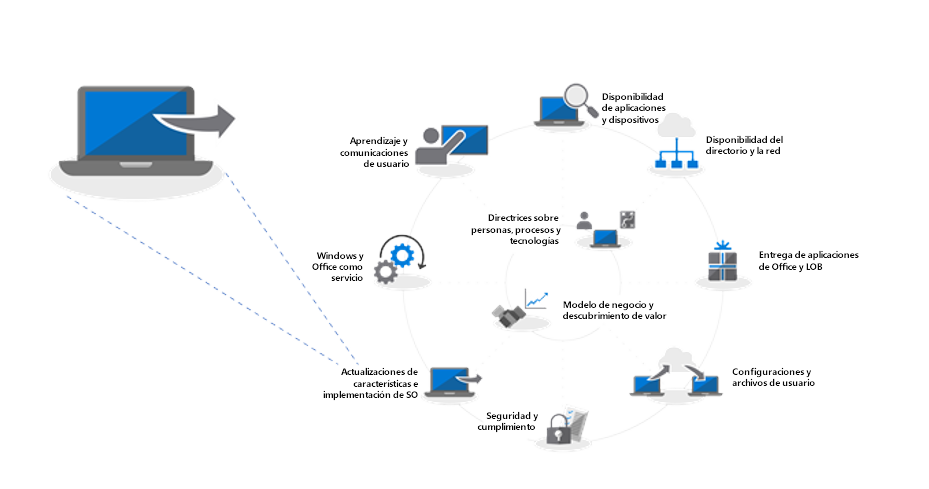
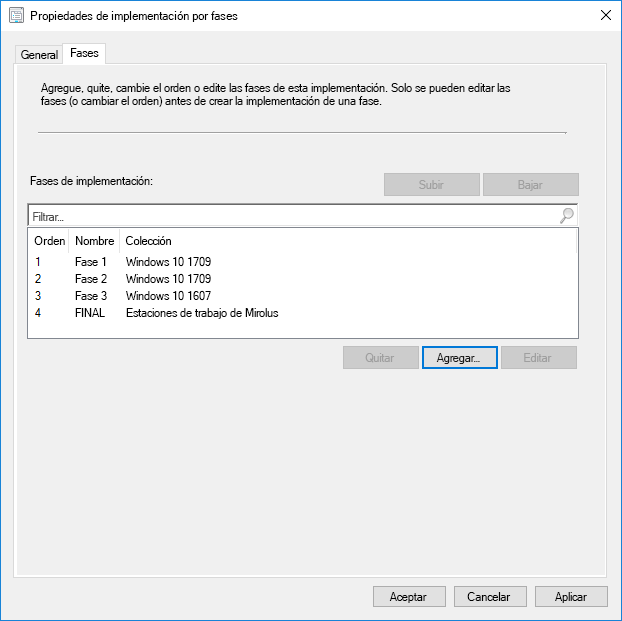
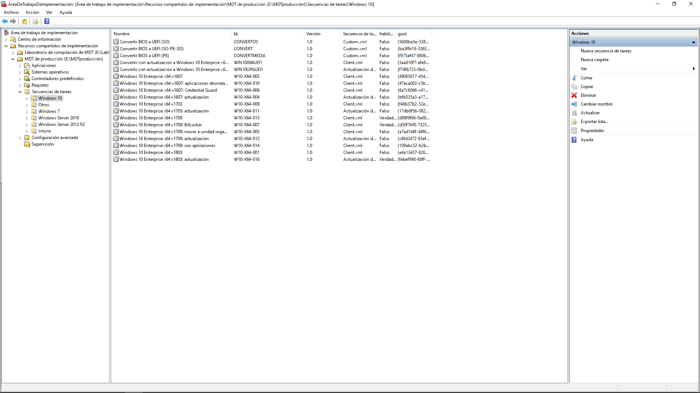

# Paso 6: Implementación del sistema operativo y actualizaciones de características

<table>
<thead>
<td></td>
<td>
<strong>Paso 6: Implementación del sistema operativo y actualizaciones de características</strong>

La implementación basada en secuencias de tareas se usa para automatizar la implementación por fases a gran escala de instalaciones completas, la restauración del equipo y la sustitución del equipo. Las secuencias de tareas de actualización también le ayudarán a estar al día con actualizaciones semestrales principales. Y Windows Autopilot es una incorporación reciente que moderniza el proceso de adquisición de nuevos equipos.
</td>
<td></td>
</thead>
</table>

>[!NOTE]
>La implementación del sistema operativo y la actualización de las características es el sexto paso del ciclo de proceso de implementación recomendado, que abarca la implementación de Windows 10, las actualizaciones y las actualizaciones de características. Para ver el proceso de implementación de escritorio completo, visite el [Centro de implementación de escritorio](https://aka.ms/HowToShift).
>

Si ha seguido el ciclo del proceso de implementación hasta ahora, ha completado, al menos parcialmente, los pasos de preparación de los dispositivo y las aplicaciones, ha preparado la infraestructura, ha configurado y recopilado los paquetes de aplicación, tiene un plan para migrar los archivos del usuario y establecer la configuración predeterminada, además de planes para retener los controles de seguridad existentes y posiblemente implementar otros nuevos.

Ahora ha llegado a la fase en la que se combinan todas estas piezas para automatizar tanto como sea posible la instalación de Windows 10 y Office 365 ProPlus, junto con los controladores, aplicaciones y cualquier otro elemento necesario.

Finalmente, la mejor medida del éxito de la implementación de un sistema operativo es cumplir las expectativas del usuario y evitar que su trabajo se interrumpa. Y en este paso, empezará a probar e implementar en usuarios piloto como parte de una implementación por fases. Como sugerencia, antes de la implementación general, tendrá que ir al paso 8 del ciclo del proceso de implementación ([Comunicaciones y aprendizaje del usuario](https://aka.ms/mdd8)) para asegurarse de que los usuarios estén informados y preparados para los cambios que se avecinan, y así poder medir la velocidad con la validación continua mediante una implementación por fases.

## Proceso de creación de imágenes de Windows

Muchas organizaciones usan el proceso de creación de imágenes de equipo para configurar y capturar un duplicado de Windows, incluido un conjunto de algunas aplicaciones estándar instaladas, o incluso una imagen más reducida solo con los tiempos de ejecución y las actualizaciones de las aplicaciones. La mejor forma de hacerlo consiste en usar una máquina virtual para este proceso con el fin de evitar cualquier problema de compatibilidad inesperado relacionado con los controladores y con fines de automatización.

Si se decide por la captura de la imagen, se recomienda automatizar la mayor parte posible para garantizar la imagen de mejor calidad y un proceso que se pueda repetir. Para la mayoría de las implementaciones, también se recomienda incluir la menor cantidad de personalización posible y de aplicaciones preinstaladas en la imagen de Windows antes de la captura. Es lo que se denomina un enfoque de "imagen ligera", que puede ahorrar ancho de banda general en la red mediante la eliminación del número de aplicaciones en la imagen. Si se empieza con una imagen base ligera, se pueden crear niveles sobre las aplicaciones requeridas, los idiomas y las configuraciones que se adapten de forma dinámica a los usuarios.

Durante el proceso de compilación y captura, herramientas como System Center Configuration Manager y Microsoft Deployment Toolkit usan la Herramienta de preparación del sistema, o Sysprep, junto con el comando "Generalizar" para volver a sellar la imagen antes de capturar la instalación de Windows 10 como una imagen.

La imagen capturada tendrá el formato de imagen de Windows, o WIM, como los medios de instalación estándar de Windows. Una vez obtenido el archivo WIM personalizado, puede usar otra secuencia de tareas como parte de la implementación de sistema operativo en System Center Configuration Manager o Microsoft Deployment Toolkit para realizar tareas relacionadas con la implementación, para aplicar la imagen y ejecutar tareas antes y después de aplicar la imagen de Windows.

[Creación de una imagen de referencia de Windows 10](https://docs.microsoft.com/es-ES/windows/deployment/deploy-windows-mdt/create-a-windows-10-reference-image)

[Creación de una secuencia de tareas para instalar el sistema operativo](https://docs.microsoft.com/es-ES/sccm/osd/deploy-use/create-a-task-sequence-to-install-an-operating-system)

### Tipos de implementación

Con la imagen personalizada lista, el tipo de instalación o migración se divide en las categorías siguientes:

  - En primer lugar, la **implementación sin sistema operativo**. Es el escenario que se usa para implementar una imagen en un disco limpio, o bien para volver a crear una imagen de un equipo en el que no quiere mantener los datos del disco

  - La segunda, similar a la implementación sin sistema operativo, es **Actualizar el equipo**, con la diferencia fundamental de que el estado del usuario se mantiene en el disco\* o se restaurará cuando se complete la instalación

  - Y la última es **Reemplazo del equipo**. Como su nombre indica, un equipo se va a reemplazar por otro. En este caso, suele haber una copia de seguridad de los archivos de usuario desde el primer equipo a una ubicación central, y después una restauración de esos archivos en el segundo equipo.

Los tres escenarios tienen en común que ejecutan una secuencia de tareas, y en cada caso se puede aplicar una imagen personalizada.

[Más información sobre los escenarios de implementación de Windows 10](https://docs.microsoft.com/es-ES/windows/deployment/windows-10-deployment-scenarios)

### Actualización local con automatización de secuencias de tareas

Además de estos tipos de implementación, ahora hay una nueva opción disponible como secuencia de tareas de System Center Configuration Manager con Windows 10: la actualización local con la secuencia de tareas Actualizar.

En las actualizaciones locales desde una versión anterior de Windows no se necesita una secuencia de tareas, pero es un enfoque recomendado en la implementación de escala empresarial. Una actualización local no permite aplicar una imagen personalizada con las aplicaciones, pero se puede actualizar el archivo install.wim predeterminado con servicios sin conexión. Por ejemplo, se puede hacer para asegurarse de que tiene aplicadas las actualizaciones de Windows más recientes antes de realizar las actualizaciones.

En la actualización local se usa el programa de instalación de Windows. El motor de configuración ejecuta varias comprobaciones previas a la instalación en busca de problemas de compatibilidad conocidos. También conserva el estado y las aplicaciones del usuario y solo quita lo que no es compatible con la versión de Windows 10 que se va a instalar. Con esta opción, se conservan las aplicaciones instaladas anteriormente y el estado del usuario. La actualización local también permite volver al sistema operativo instalado anterior si es necesario para solucionar problemas.

[Validación previa a la actualización de Windows 10 con setup.exe](https://blogs.technet.microsoft.com/mniehaus/2015/08/23/windows-10-pre-upgrade-validation-using-setup-exe/)

El escenario de actualización local se puede usar para migrar a Windows 10 desde versiones heredadas de Windows, así como para actualizar desde versiones anteriores de Windows 10. Cuando el programa de instalación de Windows complete la actualización, se puede seguir ejecutando la secuencia de tareas y actualizar aplicaciones como Office, reemplazar controladores y aplicar configuraciones personalizadas. Del mismo modo, la secuencia de tareas Actualizar se puede usar para realizar tareas previas a la instalación o comprobaciones antes de llevar a cabo la actualización.

[Actualización local de Windows 10 con Configuration Manager](https://docs.microsoft.com/es-ES/windows/deployment/upgrade/upgrade-to-windows-10-with-system-center-configuraton-manager)

[Creación de una secuencia de tareas para actualizar un sistema operativo en Configuration Manager](https://docs.microsoft.com/es-ES/sccm/osd/deploy-use/create-a-task-sequence-to-upgrade-an-operating-system)

### Implementación por fases

Mientras planea la implementación, tendrá que seleccionar como destino los equipos para las rutas de implementación sin sistema operativo, actualización y reemplazo. En este caso, el enfoque recomendado es usar una implementación por fases para colecciones de equipos similares. De esta forma, puede validar la compatibilidad, la entrega y automatización, la aceptación del usuario, el consumo de ancho de banda y otros factores antes de aumentar la escala de la implementación.

### Herramientas recomendadas: System Center Configuration Manager y Microsoft Deployment Toolkit

Con independencia del tipo de implementación elegido, deberá asegurarse de que se automatiza lo máximo posible para la previsibilidad y capacidad de repetición. Microsoft ofrece dos soluciones para automatizar la implementación de sistema operativo mediante secuencias de tareas automatizadas:

  - **[System Center Configuration Manager](https://docs.microsoft.com/es-ES/sccm/core/understand/introduction)** (ConfigMgr) proporciona funciones de implementación de sistema operativo integradas para complementar sus funciones de administración de actualizaciones de software y distribución de software. Configuration Manager se usa con frecuencia en organizaciones de todos los tamaños y admite los cuatro tipos de implementación de Windows. Opcionalmente, ConfigMgr se puede integrar con Microsoft Intune para agregar funciones adicionales para la implementación y administración de dispositivos.

  - Otra opción de implementación conocida y gratuita es **[Microsoft Deployment Toolkit](https://docs.microsoft.com/es-ES/windows/deployment/deploy-windows-mdt/get-started-with-the-microsoft-deployment-toolkit)** (MDT), que normalmente se usa en organizaciones de pequeño y mediano tamaño para la implementación de sistema operativo. Apenas requiere infraestructura. MDT se integra con Servicios de implementación de Windows (WDS) para el arranque de red. Admite los cuatro tipos de implementación, así como la instalación de aplicaciones, controladores y configuración. Y por supuesto, incluso se pueden integrar con Configuration Manager.

### Windows Autopilot

Una opción nueva de Windows 10 es la configuración de equipos nuevos como parte del ciclo de actualización de hardware mediante Windows Autopilot. Aquí puede trabajar con proveedores de hardware compatibles para personalizar la experiencia de configuración de Windows predeterminada (por ejemplo, mediante la eliminación de las opciones que se presentan a los usuarios, como los contratos de licencias o la configuración de telemetría).

Después, cuando un usuario inicia sesión en el equipo durante la instalación con sus credenciales de Azure AD, el dispositivo se inscribe en Microsoft Intune, que se puede encargar del proceso de implementación y aplicar las aplicaciones, las actualizaciones de software, la configuración y las directivas de cumplimiento. Windows Autopilot también puede evitar que el usuario acceda a la primera sesión hasta que se complete el aprovisionamiento.

[Introducción a Windows Autopilot](https://docs.microsoft.com/es-ES/windows/deployment/windows-autopilot/windows-10-autopilot)

[Requisitos previos de Windows Autopilot](https://docs.microsoft.com/es-ES/windows/deployment/windows-autopilot/windows-10-autopilot#prerequisites)

## Windows Update para empresas

Windows Update para empresas es un servicio gratuito que permite a los profesionales de TI mantener los dispositivos con Windows 10 siempre actualizados conectando directamente los dispositivos con el servicio de Windows Update. Windows Update para empresas puede configurarse a través de la directiva de grupo o mediante soluciones de MDM como Microsoft Intune y permite a los profesionales de TI crear [anillos de implementación](https://docs.microsoft.com/es-ES/windows/deployment/update/waas-deployment-rings-windows-10-updates) para validar las nuevas compilaciones. Está integrado en las herramientas de administración existentes como Windows Server Update Services (WSUS), System Center Configuration Manager (rama actual) y Microsoft Intune. Además, Windows Update para empresas es compatible con la entrega de punto a punto para optimizar la eficacia del ancho de banda y reducir la congestión en la red.

Para obtener más información sobre Windows Update para empresas, consulte la siguiente documentación:

- [Implementar actualizaciones mediante Windows Update para empresas](https://docs.microsoft.com/es-ES/windows/deployment/update/waas-manage-updates-wufb)
- [Configurar Windows Update para empresas](https://docs.microsoft.com/es-ES/windows/deployment/update/waas-configure-wufb)
- [Integrar Windows Update para empresas con las herramientas de administración existentes](https://docs.microsoft.com/es-ES/windows/deployment/update/waas-integrate-wufb)
- [Usar la directiva de grupo para configurar Windows Update para empresas](https://docs.microsoft.com/es-ES/windows/deployment/update/waas-wufb-group-policy)
- [Usar Microsoft Intune para configurar Windows Update para empresas](https://docs.microsoft.com/es-ES/intune/windows-update-for-business-configure)

## Paso siguiente 

## [Paso 7: Mantenimiento de Windows y Office](https://aka.ms/mdd7)

## Paso anterior

## [Paso 5: Consideraciones de seguridad y cumplimiento](https://aka.ms/mdd5)