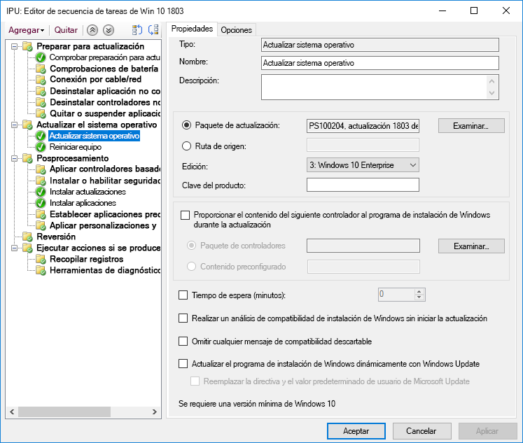
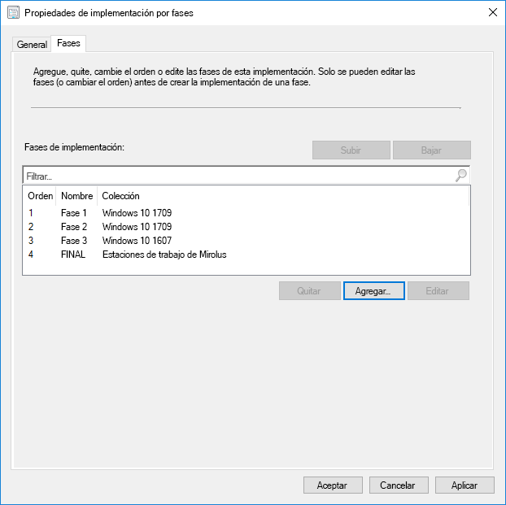
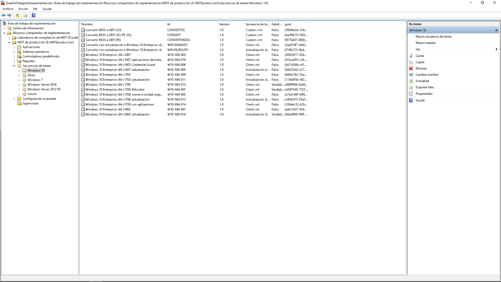

# Paso 6: Implementación del sistema operativo y actualizaciones de característicasStep 6: OS Deployment and Feature Updates

<table>
<thead>
<td></td>
<td>
<strong>Paso 6: Implementación del sistema operativo y actualizaciones de características</strong><strong>Step 6: OS Deployment and Feature Updates</strong>

La implementación basada en secuencias de tareas se usa para automatizar la implementación por fases a gran escala de instalaciones completas, la restauración del equipo y la sustitución del equipo. Las secuencias de tareas de actualización también le ayudarán a estar al día con actualizaciones semestrales principales. Y Windows Autopilot es una incorporación reciente que moderniza el proceso de adquisición de nuevos equipos.Task sequence-based deployment is used to automate large scale, phased deployment for bare metal installs, PC refresh and PC replacement. Upgrade task sequences will also help you stay current with major semi-annual updates. And Windows Autopilot is a recent addition that modernizes the new PC acquisition process.
</td>
<td></td>
</thead>
</table>

>[!NOTE]
>La implementación del sistema operativo y la actualización de las características es el sexto paso del ciclo de proceso de implementación recomendado, que abarca la implementación de Windows 10, las actualizaciones y las actualizaciones de características.OS Deployment and Feature Updates is the sixth step in our recommended deployment process wheel covering Windows 10 OS deployment, upgrades and Feature Updates. Para ver el proceso de implementación de escritorio completo, visite el [Centro de implementación de escritorio](https://aka.ms/HowToShift).To see the full desktop deployment process, visit the [Desktop Deployment Center](https://aka.ms/HowToShift).
>

Si ha seguido el ciclo del proceso de implementación hasta ahora, ha completado, al menos parcialmente, los pasos de preparación de los dispositivo y las aplicaciones, ha preparado la infraestructura, ha configurado y recopilado los paquetes de aplicación, tiene un plan para migrar los archivos del usuario y establecer la configuración predeterminada, además de planes para retener los controles de seguridad existentes y posiblemente implementar otros nuevos.If you’ve been following the deployment process wheel till now, you’ve at least partially completed the steps for device and app readiness, prepared your infrastructure, configured and collected app packages, have a plan in place for migrating user files and configuring default settings as well as have plans for retaining your existing security controls and perhaps deploying new ones.

Ahora ha llegado a la fase en la que se combinan todas estas piezas para automatizar tanto como sea posible la instalación de Windows 10 y Office 365 ProPlus, junto con los controladores, aplicaciones y cualquier otro elemento necesario.Now we’ve arrived at the stage where you’re putting all these pieces together to automate as much as you can to install Windows 10 and Office 365 ProPlus, along with the necessary drivers, apps and whatever else is needed.

Finalmente, la mejor medida del éxito de la implementación de un sistema operativo es cumplir las expectativas del usuario y evitar que su trabajo se interrumpa. Y en este paso, empezará a probar e implementar en usuarios piloto como parte de una implementación por fases. Como sugerencia, antes de la implementación general, tendrá que ir al paso 8 del ciclo del proceso de implementación ([Comunicaciones y aprendizaje del usuario](https://aka.ms/mdd8)) para asegurarse de que los usuarios estén informados y preparados para los cambios que se avecinan, y así poder medir la velocidad con la validación continua mediante una implementación por fases.Ultimately, the best measure of success with an OS deployment is meeting user expectations and avoiding disruptions in their work. And in this step, you’ll start testing and deploying to pilot users as part of a phased deployment. And one tip here, before you broaden deployment, you’ll need to skip ahead to step 8 on our deployment process wheel – [User Communications and Training](https://aka.ms/mdd8) to make sure users are informed and prepared for changes coming their way and that you can measure your roll-out pace with continuous validation using Phased Deployment.

## Proceso de creación de imágenes de WindowsWindows Imaging Process

Muchas organizaciones usan el proceso de creación de imágenes de equipo para configurar y capturar un duplicado de Windows, incluido un conjunto de algunas aplicaciones estándar instaladas, o incluso una imagen más reducida solo con los tiempos de ejecución y las actualizaciones de las aplicaciones. La mejor forma de hacerlo consiste en usar una máquina virtual para este proceso con el fin de evitar cualquier problema de compatibilidad inesperado relacionado con los controladores y con fines de automatización.Most organizations use the process of PC imaging to configure and capture a clone of Windows, including a base set of a few standard apps installed, or an even a thinner image with only application runtimes and updates. The best way to do this is using a virtual machine for this process to avoid any unexpected driver-related compatibility issues and for automation purposes.

Si se decide por la captura de la imagen, se recomienda automatizar la mayor parte posible para garantizar la imagen de mejor calidad y un proceso que se pueda repetir. Para la mayoría de las implementaciones, también se recomienda incluir la menor cantidad de personalización posible y de aplicaciones preinstaladas en la imagen de Windows antes de la captura. Es lo que se denomina un enfoque de "imagen ligera", que puede ahorrar ancho de banda general en la red mediante la eliminación del número de aplicaciones en la imagen. Si se empieza con una imagen base ligera, se pueden crear niveles sobre las aplicaciones requeridas, los idiomas y las configuraciones que se adapten de forma dinámica a los usuarios.If going the image capture route, it’s best to automate as much as possible to ensure the best quality image and a repeatable process. For most deployments, it is also recommended to put as little customization and pre-installed apps as possible in the Windows image prior to capturing. This is what is called a ‘thin image’ approach, which can save overall bandwidth on the network by eliminating the number of apps within the image. By starting with a thin base image, you can layer on required apps, languages and configurations dynamically tailored to users.

Durante el proceso de compilación y captura, herramientas como Microsoft Endpoint Configuration Manager (rama actual) y Microsoft Deployment Toolkit usan la Herramienta de preparación del sistema (Sysprep), junto con el comando "Generalizar" para volver a sellar la imagen antes de capturar la instalación de Windows 10 como una imagen.During the build and capture process, tools like Microsoft Endpoint Configuration Manager (Current Branch) and the Microsoft Deployment Toolkit use the System Preparation Tool – or Sysprep – along with the “Generalize” command to reseal your image before they capture the Windows 10 installation as an image.

La imagen capturada tendrá el formato de imagen de Windows, o WIM, como los medios de instalación estándar de Windows. Una vez obtenido el archivo WIM personalizado, puede usar otra secuencia de tareas como parte de la implementación de su sistema operativo en Configuration Manager o Microsoft Deployment Toolkit para realizar tareas relacionadas con la implementación, para aplicar la imagen y ejecutar tareas antes y después de aplicar la imagen de Windows.The captured image will have the Windows image – or WIM – format like standard Windows installation media. Once you have your custom WIM file, you can use another task sequence as part of your OS deployment in Configuration Manager or Microsoft Deployment Toolkit to perform deployment-related tasks, to apply the image and run tasks before and after your Windows image is applied.

[Creación de una imagen de referencia de Windows 10Create a Windows 10 Reference Image](https://docs.microsoft.com/windows/deployment/deploy-windows-mdt/create-a-windows-10-reference-image)

[Creación de una secuencia de tareas para instalar un sistema operativoCreate a task sequence to install an Operating System](https://docs.microsoft.com/configmgr/osd/deploy-use/create-a-task-sequence-to-install-an-operating-system)

### Tipos de implementaciónDeployment Types

Con la imagen personalizada lista, el tipo de instalación o migración se divide en las categorías siguientes:With your custom image ready, the installation or migration type will fall into the following categories:

  - En primer lugar, la **implementación sin sistema operativo**. Es el escenario que se usa para implementar una imagen en un disco limpio, o bien para volver a crear una imagen de un equipo en el que no quiere mantener los datos del discoFirst, **bare metal deployment**. This is the scenario used to deploy an image to a clean disk, or to reimage a computer where you don’t intend to keep any of the data on the disk

  - La segunda, similar a la implementación sin sistema operativo, es **Actualizar el equipo**, con la diferencia fundamental de que el estado del usuario se mantiene en el disco\* o se restaurará cuando se complete la instalaciónAnd second, similar to bare metal, is **Computer Refresh,** with the key difference that user state remains on the disk\* or will be restored after the install is complete

  - Y la última es **Reemplazo del equipo**. Como su nombre indica, un equipo se va a reemplazar por otro. En este caso, suele haber una copia de seguridad de los archivos de usuario desde el primer equipo a una ubicación central, y después una restauración de esos archivos en el segundo equipo.And last is **Computer Replacement**. Here as the name implies, you are replacing a PC with another PC. In this case, there is often a backup of user files from the first PC to a central location, then a restore of those files to the second PC.

Los tres escenarios tienen en común que ejecutan una secuencia de tareas, y en cada caso se puede aplicar una imagen personalizada.All three of these scenarios have something in common, they use a task sequence to run, and a custom image can be applied each time.

[Más información sobre los escenarios de implementación de Windows 10More About Windows 10 Deployment Scenarios](https://docs.microsoft.com/windows/deployment/windows-10-deployment-scenarios)

### Actualización local con automatización de secuencias de tareasIn-place Upgrade using Task Sequence Automation

Además de estos tipos de implementación, ahora hay una nueva opción disponible como secuencia de tareas de Microsoft Endpoint Configuration Manager (rama actual) con Windows 10: la actualización local con la secuencia de tareas de actualización.In addition to these deployment types, there is a new option available now as a Microsoft Endpoint Configuration Manager (Current Branch) Task Sequence with Windows 10 – and in-place upgrade using the Upgrade Task Sequence.

En las actualizaciones locales desde una versión anterior de Windows no se necesita una secuencia de tareas, pero es un enfoque recomendado en la implementación de escala empresarial. Una actualización local no permite aplicar una imagen personalizada con las aplicaciones, pero se puede actualizar el archivo install.wim predeterminado con servicios sin conexión. Por ejemplo, se puede hacer para asegurarse de que tiene aplicadas las actualizaciones de Windows más recientes antes de realizar las actualizaciones.In-place upgrades from a previous version of Windows do not require a task sequence, but it is a recommended approach when deploying at enterprise scale. An in-place upgrade does not allow you to apply a custom image with applications, but you can update the default install.wim using offline servicing. For example, you can to make sure it has the latest Windows updates applied prior to performing upgrades.

En la actualización local se usa el programa de instalación de Windows. El motor de configuración ejecuta varias comprobaciones previas a la instalación en busca de problemas de compatibilidad conocidos. También conserva el estado y las aplicaciones del usuario y solo quita lo que no es compatible con la versión de Windows 10 que se va a instalar. Con esta opción, se conservan las aplicaciones instaladas anteriormente y el estado del usuario. La actualización local también permite volver al sistema operativo instalado anterior si es necesario para solucionar problemas.In-place upgrade uses windows setup. The setup engine runs several small pre-installation checks looking for known compatibility issues. It also preserves the user state and applications and only removes what isn’t compatible with the version of Windows 10 being installed. With this option, previously installed applications and user state are preserved. In-place upgrade also allows you to roll-back to the previous OS installed if needed for troubleshooting purposes.

[Validación previa a la actualización de Windows 10 con setup.exeWindows 10 Pre-Upgrade Validation Using setup.exe](https://blogs.technet.microsoft.com/mniehaus/2015/08/23/windows-10-pre-upgrade-validation-using-setup-exe/)

El escenario de actualización local se puede usar para migrar a Windows 10 desde versiones heredadas de Windows, así como para actualizar desde versiones anteriores de Windows 10. Cuando el programa de instalación de Windows complete la actualización, se puede seguir ejecutando la secuencia de tareas y actualizar aplicaciones como Office, reemplazar controladores y aplicar configuraciones personalizadas. Del mismo modo, la secuencia de tareas Actualizar se puede usar para realizar tareas previas a la instalación o comprobaciones antes de llevar a cabo la actualización.The in-place upgrade scenario can be used to migrate to Windows 10 from legacy versions of Windows, as well as upgrade from previous versions of Windows 10. After Windows Setup completes the upgrade, your task sequence can continue to run and upgrade applications like Office, replace drivers, and apply personalization settings. Likewise, you can use the Upgrade Task Sequence to perform pre-installation tasks or checks prior to carrying out the upgrade.

[Actualización local de Windows 10 con Configuration ManagerPerform an in-place upgrade to Windows 10 using Configuration Manager](https://docs.microsoft.com/windows/deployment/upgrade/upgrade-to-windows-10-with-system-center-configuraton-manager)

[Creación de una secuencia de tareas para actualizar un sistema operativo en Configuration ManagerCreate a task sequence to upgrade an OS in Configuration Manager](https://docs.microsoft.com/configmgr/osd/deploy-use/create-a-task-sequence-to-upgrade-an-operating-system)

### Implementación por fasesPhased Deployment

Mientras planea la implementación, tendrá que seleccionar como destino los equipos para las rutas de implementación sin sistema operativo, actualización y reemplazo. En este caso, el enfoque recomendado es usar una implementación por fases para colecciones de equipos similares. De esta forma, puede validar la compatibilidad, la entrega y automatización, la aceptación del usuario, el consumo de ancho de banda y otros factores antes de aumentar la escala de la implementación.As you're planning your deployment, you'll be targeting computers for bare metal, refresh, replace and upgrade paths. The recommended approach in this case is to use phased deployment to collections of similar machines. This way, you can validate compatibility, delivery and automation, user acceptance, network bandwidth consumption, and other factors before increasing the scale of your deployment.

### Herramientas recomendadas: Microsoft Endpoint Configuration Manager (rama actual) y Microsoft Deployment ToolkitRecommended Tools: Microsoft Endpoint Configuration Manager (Current Branch) and the Microsoft Deployment Toolkit

Con independencia del tipo de implementación elegido, deberá asegurarse de que se automatiza lo máximo posible para la previsibilidad y capacidad de repetición. Microsoft ofrece dos soluciones para automatizar la implementación de sistema operativo mediante secuencias de tareas automatizadas:Regardless of the deployment type you choose, you’ll want to make sure it’s as automated as possible for predictability and repeatability. Microsoft offers two solutions to automate OS deployment using automated task sequences:

  - **[Microsoft Endpoint Configuration Manager](https://docs.microsoft.com/configmgr/core/understand/introduction)** (ConfigMgr) proporciona funciones de implementación de sistema operativo integradas para complementar sus funciones de administración de actualizaciones de software y distribución de software. Configuration Manager se usa con frecuencia en organizaciones de todos los tamaños y admite los cuatro tipos de implementación de Windows. Opcionalmente, ConfigMgr se puede integrar con Microsoft Intune para agregar funciones adicionales para la implementación y administración de dispositivos.**[Microsoft Endpoint Configuration Manager](https://docs.microsoft.com/configmgr/core/understand/introduction)** (ConfigMgr) provides built-in operating system deployment capabilities to complement its capabilities for software distribution and software update management. ConfigMgr is widely used by organizations of all sizes and supports all four Windows deployment types. Optionally, you can integrate ConfigMgr with Microsoft Intune to add additional capabilities for deployment and device management.

  - Otra opción de implementación conocida y gratuita es **[Microsoft Deployment Toolkit](https://docs.microsoft.com/windows/deployment/deploy-windows-mdt/get-started-with-the-microsoft-deployment-toolkit)** (MDT), que normalmente se usa en organizaciones de pequeño y mediano tamaño para la implementación de sistema operativo. Apenas requiere infraestructura. MDT se integra con Servicios de implementación de Windows (WDS) para el arranque de red. Admite los cuatro tipos de implementación, así como la instalación de aplicaciones, controladores y configuración. Y por supuesto, incluso se pueden integrar con Configuration Manager.And one other popular deployment option is the free **[Microsoft Deployment Toolkit](https://docs.microsoft.com/windows/deployment/deploy-windows-mdt/get-started-with-the-microsoft-deployment-toolkit)** (MDT) which is typically used by small and medium sized organizations for OS deployment. This requires very little infrastructure. MDT integrates with Windows Deployment Services (WDS) for network boot. It supports all four deployment types as well as installation of applications, drivers, and settings. And of course, MDT can even be integrated with Configuration Manager.

### Windows AutopilotWindows Autopilot

Una opción nueva de Windows 10 es la configuración de equipos nuevos como parte del ciclo de actualización de hardware mediante Windows Autopilot.A new option with Windows 10 is to configure new PCs as part of your hardware refresh cycle using Windows Autopilot. Aquí puede trabajar con proveedores de hardware compatibles para personalizar la experiencia de configuración de Windows predeterminada (por ejemplo, mediante la eliminación de las opciones que se presentan a los usuarios, como los contratos de licencias o la configuración de telemetría).Here you can work with supporting hardware vendors to customize the default Windows setup experience – for example by eliminating options presented to users, like Licensing Agreements or diagnostic data settings.

Después, cuando un usuario inicia sesión en el equipo durante la instalación con sus credenciales de Azure AD, el dispositivo se inscribe en Microsoft Intune, que se puede encargar del proceso de implementación y aplicar las aplicaciones, las actualizaciones de software, la configuración y las directivas de cumplimiento. Windows Autopilot también puede evitar que el usuario acceda a la primera sesión hasta que se complete el aprovisionamiento.Then, when a user signs in to the PC during setup using their Azure AD credentials, the device enrolls into Microsoft Intune, which can then take over the deployment process and apply applications, software updates configurations and compliance policies. Windows Autopilot can also optionally prevent the user from accessing the first session until provisioning is complete.

[Introducción a Windows AutopilotOverview of Windows Autopilot](https://docs.microsoft.com/windows/deployment/windows-autopilot/windows-10-autopilot)

[Requisitos previos de Windows AutopilotWindows Autopilot Prerequisites](https://docs.microsoft.com/windows/deployment/windows-autopilot/windows-10-autopilot#prerequisites)

## Windows Update para empresasWindows Update for Business for Feature Updates

Windows Update para empresas es un servicio gratuito que permite a los profesionales de TI mantener los dispositivos con Windows 10 siempre actualizados conectando directamente los dispositivos con el servicio de Windows Update.Windows Update for Business is a free service that enables IT Pros to keep Windows 10 devices always up to date by directly connecting the devices to the Windows Update service. Windows Update para empresas puede configurarse a través de la directiva de grupo o mediante soluciones de MDM como Microsoft Intune y permite a los profesionales de TI crear [anillos de implementación](https://docs.microsoft.com/windows/deployment/update/waas-deployment-rings-windows-10-updates) para validar las nuevas compilaciones.Windows Update for Business can be configured via Group Policy or through MDM solutions such as Microsoft Intune and allows IT Pros to create [deployment rings](https://docs.microsoft.com/windows/deployment/update/waas-deployment-rings-windows-10-updates) to validate new builds. Está integrado en las herramientas de administración existentes como Windows Server Update Services (WSUS), Microsoft Endpoint Configuration Manager (rama actual) y Microsoft Intune.It is integrated into existing management tools such as Windows Server Update Services (WSUS), Microsoft Endpoint Configuration Manager (Current Branch), and Microsoft Intune. Además, Windows Update para empresas es compatible con la entrega de punto a punto para optimizar la eficacia del ancho de banda y reducir la congestión en la red.Additionally, Windows Update for Business supports peer-to-peer delivery to help optimize bandwidth efficiency and reduce network congestion.

Para obtener más información sobre Windows Update para empresas, consulte la siguiente documentación:For more detailed information on Windows Update for Business please review the following documentation:

- [Implementar actualizaciones mediante Windows Update para empresasDeploy Updates Using Windows Update for Business](https://docs.microsoft.com/windows/deployment/update/waas-manage-updates-wufb)
- [Configurar Windows Update para empresasConfigure Windows Update for Business](https://docs.microsoft.com/windows/deployment/update/waas-configure-wufb)
- [Integrar Windows Update para empresas con las herramientas de administración existentesIntegrate Windows Update for Business with Existing Management Tools](https://docs.microsoft.com/windows/deployment/update/waas-integrate-wufb)
- [Usar la directiva de grupo para configurar Windows Update para empresasUse Group Policy to configure Windows Update for Business](https://docs.microsoft.com/windows/deployment/update/waas-wufb-group-policy)
- [Usar Microsoft Intune para configurar Windows Update para empresasUse Microsoft Intune to configure Windows Update for Business](https://docs.microsoft.com/intune/windows-update-for-business-configure)

## Paso siguienteNext Step 

## [Paso 7: Mantenimiento de Windows y OfficeStep 7: Windows and Office Servicing](https://aka.ms/mdd7)

## Paso anteriorPrevious Step

## [Paso 5: Consideraciones de seguridad y cumplimientoStep 5: Security and Compliance Considerations](https://aka.ms/mdd5)
