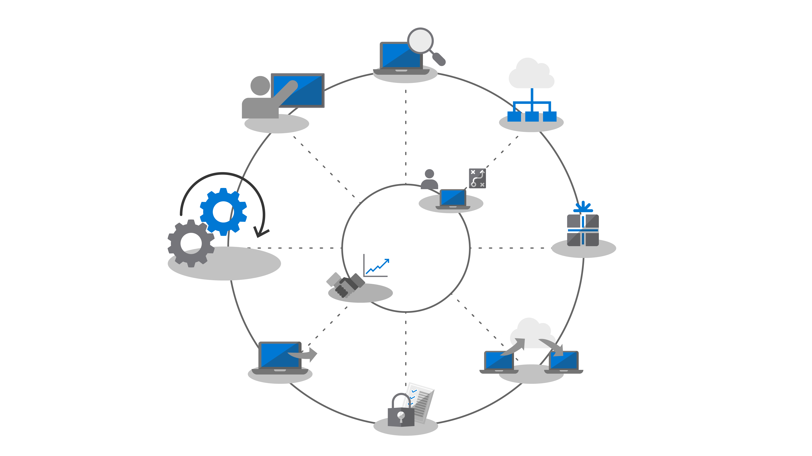
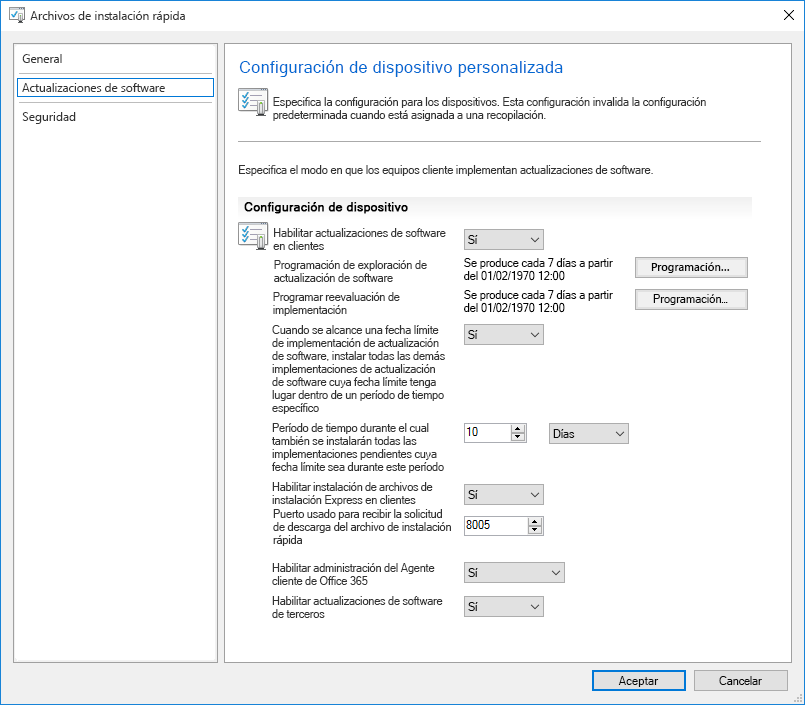
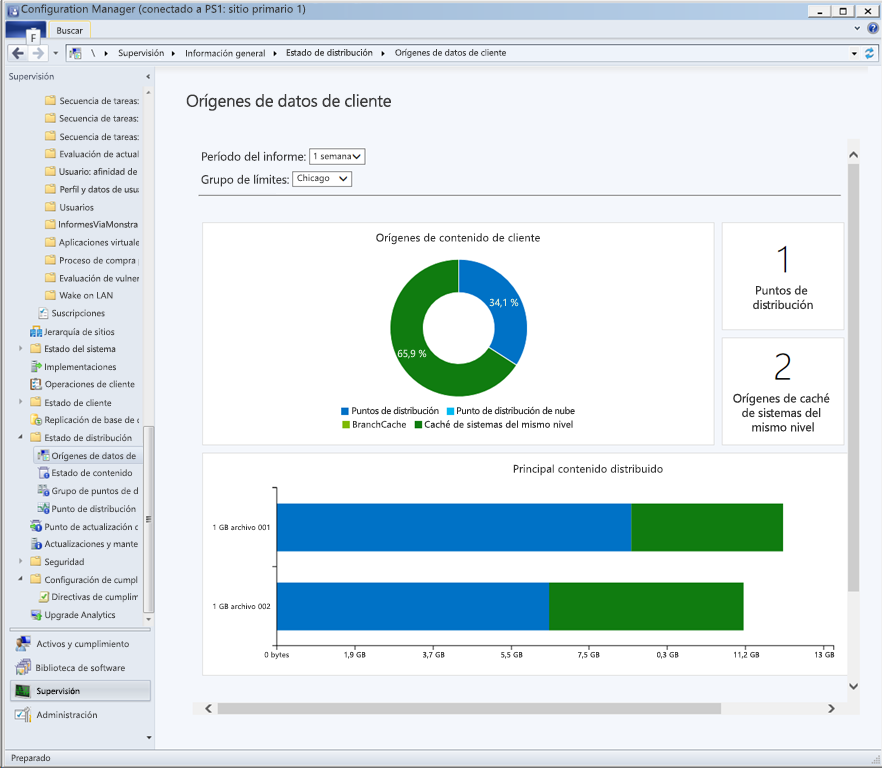
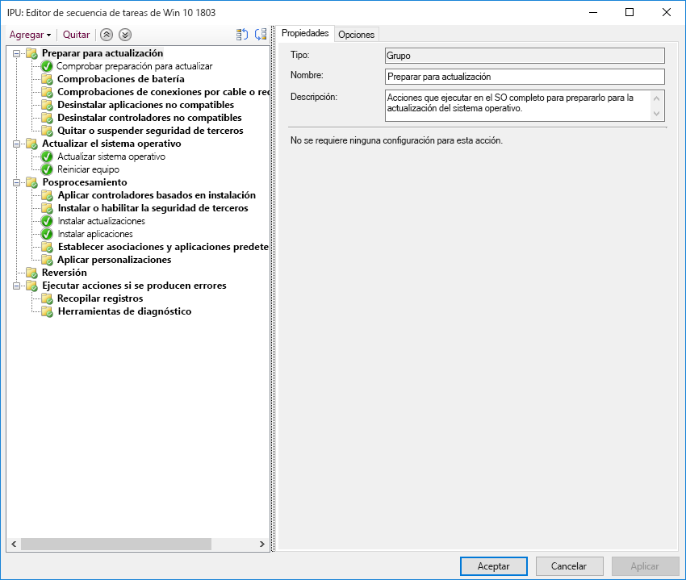

# Paso 7: Mantenimiento de Windows y Office

<table>
<thead>
<td></td>
<td>
<strong>Paso 7: Mantenimiento de Windows y Office</strong>

Windows 10 y Aplicaciones de Microsoft 365 para empresas agregan continuamente nuevas funcionalidades para seguir mejorando las experiencias de usuario y la seguridad con las innovaciones más recientes. Obtenga más información sobre cómo estar al día con actualizaciones semestrales y mensuales, cómo funciona el nuevo modelo de servicio, y las herramientas y opciones que tiene a su disposición.
</td>
<td></td>
</thead>
</table>

>[!NOTE]
>Mantenimiento de Windows y Office es el séptimo paso del ciclo de proceso de implementación recomendado, que cubre los aspectos de planificación para preparar las actualizaciones semianuales. Para ver el proceso de implementación de escritorio completo, visite el [Centro de implementación de escritorio](https://aka.ms/HowToShift).
>

Windows 10 y Aplicaciones de Microsoft 365 para empresas presentan nuevas opciones de mantenimiento, modelos de soporte técnico y escalas de tiempo de actualización. Estos cambios simplifican el proceso para mantenerse al día con las características más recientes. Además de estas actualizaciones, hay nuevas opciones de configuración para habilitar planes de mantenimiento que se adapten a sus necesidades. Veamos cómo puede prepararse para las actualizaciones de canal semestrales que ofrecen nuevas características y funcionalidades en Windows 10 y Aplicaciones de Microsoft 365 para empresas mientras aprovecha nuevas características de la rama actual de Microsoft Endpoint Configuration Manager.

[Ayudar a los clientes a pasar a Aplicaciones de Microsoft 365 para empresas y Windows 10](https://www.microsoft.com/microsoft-365/blog/2018/09/06/helping-customers-shift-to-a-modern-desktop/)

## Tipos de actualización

Las actualizaciones se dividen en dos categorías principales, actualizaciones de características y actualizaciones de seguridad y de calidad que contienen correcciones de errores, de fiabilidad y de seguridad acumulativas. En cuanto a la cadencia Windows y Office tiene un canal semestral que ofrece nuevas características dos veces al año en marzo y septiembre, mientras que las actualizaciones de seguridad y calidad se producen mensualmente. Además, solo para las aplicaciones de Office 365, le ofrecemos una opción de canal mensual totalmente compatible donde las actualizaciones contienen características nuevas y actualizaciones de calidad.

Si está acostumbrado a un ciclo más largo entre el sistema operativo y las actualizaciones de las aplicaciones, puede que se pregunte:

  - ¿Serán compatibles las actualizaciones?

  - ¿Tendré que volver a formar a mis usuarios?

  - ¿Y cuáles son los riesgos?

Para responder a estas preguntas y a las razones para implementar nuevas funcionalidades con más frecuencia, mostraremos algunas de las ventajas de este método

### Ventajas de la actualización de características

En primer lugar, nos hemos alejado del modelo pasado que presentaba grandes cambios cada tres años para implementar cambios más pequeños con actualizaciones de características dos veces al año. ¿Por qué? Porque las tendencias en la tecnología se mueven muy rápido, además de presentar amenazas de seguridad en constante evolución y esto mantiene la experiencia y la protección relevante. Algunas de las actualizaciones relacionadas con la seguridad, por ejemplo, no pueden entregarse mediante actualizaciones mensuales de seguridad o antivirus, puede que se trate de cambios de bajo nivel, como seguridad basada en la virtualización.

[Guía rápida de Windows como servicio](https://docs.microsoft.com/windows/deployment/update/waas-quick-start)

[Mitigue las amenazas con las características de seguridad de Windows 10](https://docs.microsoft.com/windows/security/threat-protection/overview-of-threat-mitigations-in-windows-10%20%20)

### Ventajas del modelo de actualización acumulativa

En segundo lugar, ofrecer actualizaciones de seguridad y calidad como un paquete de actualización acumulativa corrige muchos de los problemas del pasado. En ocasiones, era preciso elegir entre una docena o más de actualizaciones todos los meses tanto para Windows como para Office. Como puede imaginar, esto crea un conjunto casi imposible de matrices de prueba a modo de apoyo. Además, si instala una versión de Windows o de Office con más de un año, puede que lleve horas o días aplicar todas las actualizaciones que se han publicado desde la aparición de esa versión.

Con el modelo acumulativo, siempre se encuentra a una actualización de la más reciente y, por tanto, el número de actualizaciones que necesita implementar se reduce. Cada actualización se compila sobre las actualizaciones de meses anteriores y contiene todas las soluciones que necesita para ponerse al día. Las actualizaciones acumulativas son especialmente útiles cuando los equipos llevan varios meses desactivados y están en el almacén.

### Validación expandida de las actualizaciones

Otra ventaja es que, antes de distribuir las actualizaciones para una implementación amplia, publicamos compilaciones a través de los programas Insider de [Office](https://products.office.com/office-insider?tab=Windows-Desktop) y [Windows](https://insider.windows.com/), y esto nos permite recopilar datos de diagnóstico y comentarios antes de publicar actualizaciones para todos los usuarios. Ahora los programas Insider están disponibles para todo el mundo de forma que pueda comprender antes las actualizaciones. Cuando se publiquen las actualizaciones habremos recibido datos de diagnóstico de millones de configuraciones, así que cuando distribuimos las actualizaciones, la calidad será intrínsecamente más predecible

Y una cosa más: como las compilaciones de Aplicaciones de Microsoft 365 para empresas Insider reflejan actualizaciones de canal mensuales, si usa un canal semianual para presentar actualizaciones características de Office dos veces al año alineado con Windows, puede validar esas compilaciones, además de usar el canal semianual para publicaciones objetivo.

### Compatibilidad con herramientas de administración

También hemos pensado en cómo realizar una implementación de actualizaciones sin interrupciones. La rama actual de Configuration Manager se actualiza con frecuencia para dar soporte a la implementación de estas actualizaciones para Windows y Office y cualquier funcionalidad nueva.

[Implementación de actualizaciones de Windows 10 con Configuration Manager](https://docs.microsoft.com/windows/deployment/update/waas-manage-updates-configuration-manager)

[Administrar Aplicaciones de Microsoft 365 para empresas con Configuration Manager](https://docs.microsoft.com/mem/configmgr/sum/deploy-use/manage-office-365-proplus-updates)

## Información general sobre los canales de Office y Windows

Windows 10 ofrece tres canales de mantenimiento:

- [**El Programa Windows Insider**](https://docs.microsoft.com/windows/deployment/update/waas-overview#windows-insider) para que las organizaciones prueben las características proporcionadas en la próxima actualización de características y envíen comentarios sobre ellas
- **El Canal semianual** proporciona nuevas características con la publicación de Actualización de características dos veces al año
- **El Canal de mantenimiento a largo plazo** está diseñado solo para dispositivos especializados que necesiten una opción mantenimiento más larga

Microsoft 365 ofrece cuatro canales de mantenimiento:

- [**El Programa Office Insider**](https://support.office.com/article/What-is-Office-Insider-f4208185-b63a-4b68-9c7a-9a32d2411c16) para que las organizaciones prueben las características más recientes y funcionalidades de Office en desarrollo y envíen comentarios sobre ellos
- **El Canal mensual** proporciona a los usuarios las características más recientes de Office tan pronto como estén disponibles
- **El Canal semianual** proporciona nuevas funcionalidades con nuevas características dos veces al año
- **El Canal semianual (dirigido)** es una versión admitida por completo de Office que permite a los usuarios piloto y los evaluadores de compatibilidad de la aplicación probar y validar el siguiente Canal semianual

Para obtener más información acerca de los canales de mantenimiento de Windows y Office revise la siguiente documentación:

- [Overview of Windows as a Service](https://docs.microsoft.com/windows/deployment/update/waas-overview#servicing-channels) (Información general sobre Windows como servicio)
- [Información general sobre los canales de actualización de Aplicaciones de Microsoft 365](https://docs.microsoft.com/DeployOffice/overview-update-channels#BKMK_SAC)

## Implementación de actualizaciones por fases

Tratemos ahora la implementación de estas actualizaciones. Por cada publicación, recomendamos al menos tres fases de implementación para TI: validación, prueba piloto e implementación general. Cuando tenga Windows 10 y Aplicaciones de Microsoft 365 para empresas en marcha, podrá utilizar el mantenimiento mensual para estar al día al respecto de cualquier alerta de seguridad crítica y de calidad, y entonces pasará al mantenimiento semianual para las nuevas características.

### Actualización mensual

El modelo de servicio está diseñado para que pueda limitar la distribución de nuevas características a dos veces al año y, si es necesario, también puede omitir incluso la actualización semianual y seguir recibiendo actualizaciones de seguridad y de calidad. Como se indicó, la naturaleza acumulativa mensual significa que las actualizaciones aumentarán el tamaño cada mes.

#### Actualizaciones rápidas

Con una tecnología denominada "actualizaciones rápidas" en Windows y actualizaciones la compresión binaria de delta en Office, podemos reducir el tamaño de descarga de forma significativa. En ambos métodos, los motores de actualización comparan lo que está en el equipo y busca solo las diferencias necesarias para actualizar el contenido.

[Actualizaciones de calidad de Windows 10 explicadas y el final de actualizaciones de delta](https://techcommunity.microsoft.com/t5/Windows-IT-Pro-Blog/Windows-10-quality-updates-explained-amp-the-end-of-delta/ba-p/214426)

Windows Update para empresas y Windows Server Update Services han sido compatibles con las actualizaciones rápidas durante mucho tiempo, pero ahora hemos extendido esa compatibilidad a la rama actual de Microsoft Endpoint Configuration Manager para que también pueda usar las actualizaciones rápidas.

#### Compresión binaria de delta

La compresión binaria de delta en Office solo se usa si está actualizando al a versión más reciente de Aplicaciones de Microsoft 365 para empresas, por lo que no use este enfoque si necesita actualizar a partir de la versión anterior y no puede omitir las actualizaciones.

Los canales de actualización de Windows y Office pueden administrarse con Configuration Manager usando el proceso de objetivo y aprobación estándar. Además, puede usar las características de directivas y Windows para aplicar la actualización de los canales usados, además de las características relacionadas.

### Actualizaciones semianuales

Esas son las consideraciones para las actualizaciones mensuales, pasemos ahora a las actualizaciones semianuales.

Como tratamos en Preparación de dispositivos y aplicaciones, es preferible empezar sus preparativos para las actualizaciones grandes con las mismas herramientas establecidas en el Paso 1 del proceso de implementación.

En cuanto a las herramientas, puede usar las opciones de directivas con Windows Update para empresas, administración de actualizaciones de software con la rama actual de Microsoft Endpoint Configuration Manager, Windows Server Update Services (WSUS) o actualizar las directivas establecidas por Microsoft Intune. Si le preocupa el ancho de banda de la red, vea el Paso 2: preparación de directorios y red, para obtener información sobre cómo reducir el tráfico de red con optimización de distribución y otras tecnologías de almacenamiento en caché punto a punto.

[Canal semianual de Windows](https://docs.microsoft.com/windows/deployment/update/waas-overview#semi-annual-channel)

[Canal semianual para Aplicaciones de Microsoft 365](https://docs.microsoft.com/DeployOffice/overview-update-channels#BKMK_SAC)

#### Actualizar las secuencias de tareas

Instalar las actualizaciones de características más grandes a través de rutinas de administración de actualización de software estándar es una opción admitida, pero muchas organizaciones optarán por usar una secuencia de tareas de actualización con la rama actual de Microsoft Endpoint Configuration Manager o Microsoft Deployment Toolkit.

Una secuencia de tareas le permite crear comprobaciones o tareas personalizadas antes de instalar la actualización de características y le permite realizar tareas personalizadas tras la instalación de la actualización. Las tareas postactualización podrían incluir suspender servicios de forma temporal en caso necesario durante la actualización, la instalación y sustitución de controladores, la aplicación de mejoras o las características de personalización de la barra de tareas y la aplicación de mejoras personalizadas de Windows 10.

Si ya está usando secuencias de tareas para migrar sus equipos de Windows 7 a Windows 10 y tiene experiencia con esas herramientas, este es un buen lugar para empezar y proporciona control definitivo. Aunque puede usar una única secuencia de tareas para toda una actualización, es muy común que las organizaciones usen dos tareas. Una secuencia de tareas para asegurarse de que las máquinas están listas para la actualización que prepara discretamente todos los archivos de configuración necesarios en los equipos y uno que haga la actualización en sí. Este enfoque asegura que la productividad del usuario no se vea demasiado afectada.

[Creación de una secuencia de tareas para actualizar un sistema operativo en Configuration Manager](https://docs.microsoft.com/mem/configmgr/osd/deploy-use/create-a-task-sequence-to-upgrade-an-operating-system)

#### Compatibilidad de canal semianual para actualizaciones características

[Como se anunció en septiembre de 2018](https://www.microsoft.com/microsoft-365/blog/2018/09/06/helping-customers-shift-to-a-modern-desktop/), la escala de tiempo de las actualizaciones del canal semianual usará el modelo siguiente.

  - Todas las actualizaciones de características admitidas de Windows 10 Enterprise y educación, empezando con la versión 1607 serán compatibles durante 30 meses a partir de su fecha de salida original.

  - Todas las actualizaciones de características, empezando con la 1809, con un objetivo de septiembre, recibirán 30 meses de compatibilidad a partir de su fecha de salida.

  - Las actualizaciones de características futuras con fecha de salida marzo y empezando por la 1903, seguirán teniendo apoyo durante otros 18 meses a partir de su fecha de salida.

  - Las actualizaciones semianuales de Aplicaciones de Microsoft 365 para empresas seguirán teniendo apoyo durante 18 meses.

#### Opciones de automatización adicionales fuera de la secuencia de tareas

Si no usa secuencias de tareas personalizadas, puede ejecutar acciones personalizadas o aplicar archivos de controladores durante la actualización de características en la fase de preinstalación, antes de que la configuración acabe de ejecutar sus pruebas de compatibilidad, o en la fase de precompromiso, antes de que se aplique la actualización.

[Novedades de la configuración de Windows 10, versión 1803](https://docs.microsoft.com/windows/whats-new/whats-new-windows-10-version-1803%23windows-setup)

## Paso siguiente 

## [Paso 8: Comunicación con los usuarios y aprendizaje](https://aka.ms/mdd8)

## Paso anterior 

## [Paso 6: Implementación del sistema operativo y actualizaciones de características](https://aka.ms/mdd6)
