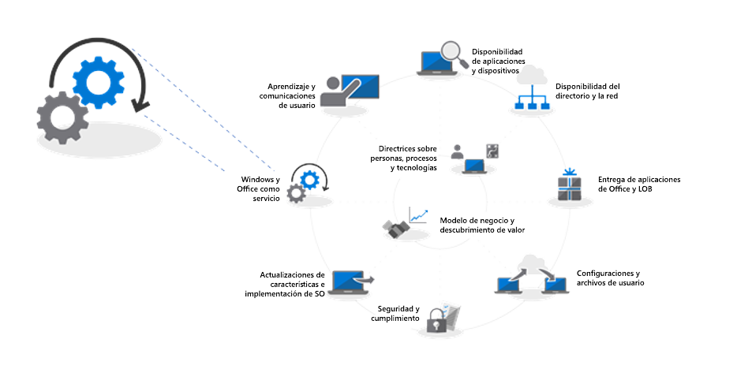
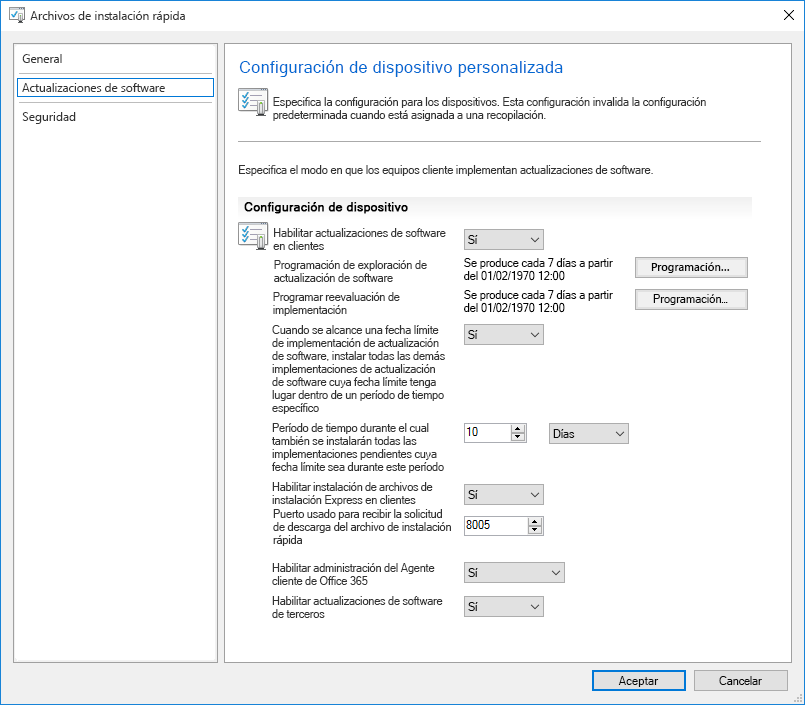
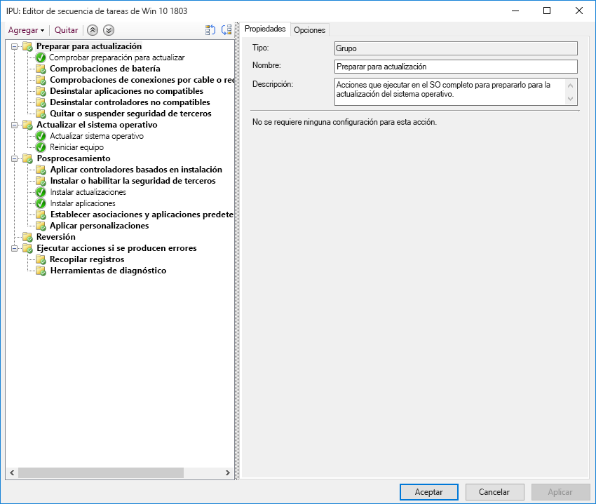

# Paso 7: Mantenimiento de Windows y OfficeStep 7: Windows and Office Servicing

<table>
<thead>
<td></td>
<td>
<strong>Paso 7: Mantenimiento de Windows y Office</strong><strong>Step 7: Windows and Office Servicing</strong>

Windows 10 y Office 365 ProPlus agregan continuamente nuevas funcionalidades para seguir mejorando las experiencias de usuario y la seguridad con las innovaciones más recientes. Obtenga más información sobre cómo estar al día con actualizaciones semestrales y mensuales, cómo funciona el nuevo modelo de servicio, y las herramientas y opciones que tiene a su disposición.Both Windows 10 and Office 365 ProPlus continually add new capabilities to keep bringing user experiences and security forward with the latest innovations. Learn how to stay current with semi-annual and monthly updates, how the new servicing model works and the tools and options you have.
</td>
<td></td>
</thead>
</table>

>[!NOTE]
>Mantenimiento de Windows y Office es el séptimo paso del ciclo de proceso de implementación recomendado, que cubre los aspectos de planificación para preparar las actualizaciones semianuales.Windows and Office Servicing is the seventh step in our recommended deployment process wheel covering the planning aspects of preparing for semi-annual updates to features. Para ver el proceso de implementación de escritorio completo, visite el [Centro de implementación de escritorio](https://aka.ms/HowToShift).To see the full desktop deployment process, visit the [Desktop Deployment Center](https://aka.ms/HowToShift).
>

Windows 10 y Office 365 ProPlus introducen nuevas opciones de mantenimiento, modelos de soporte y escalas de tiempo de actualización.Both Windows 10 and Office 365 ProPlus introduce new servicing options, support models, and update timelines. Estos cambios simplifican el proceso para mantenerse al día con las características más recientes.These changes simplify the process for staying current on the latest features. Además de estas actualizaciones, hay nuevas opciones de configuración para habilitar planes de mantenimiento que se adapten a sus necesidades.Along with these updates are new configuration options to enable servicing plans that meet your needs. Veamos cómo puede prepararse para las actualizaciones de canal semestrales que ofrecen nuevas características y funcionalidades en Windows 10 y Office 365 ProPlus mientras aprovecha nuevas características de la rama actual de System Center Configuration Manager.Let's learn how to prepare for semi-annual channel updates offering new features and capabilities in Windows 10 and Office 365 ProPlus while leveraging new features within System Center Configuration Manager Current Branch.

[Ayudar a los clientes a cambiar a Windows 10 y Office 365 ProPlusHelping customers shift to Windows 10 and Office 365 ProPlus](https://www.microsoft.com/en-us/microsoft-365/blog/2018/09/06/helping-customers-shift-to-a-modern-desktop/)

## Tipos de actualizaciónUpdate Types

Las actualizaciones se dividen en dos categorías principales, actualizaciones de características y actualizaciones de seguridad y de calidad que contienen correcciones de errores, de fiabilidad y de seguridad acumulativas.Updates fall into two main categories, feature updates and then quality and security updates which contain cumulative security, reliability and bug fixes. En cuanto a la cadencia Windows y Office tiene un canal semestral que ofrece nuevas características dos veces al año en marzo y septiembre, mientras que las actualizaciones de seguridad y calidad se producen mensualmente.In terms of cadence both Windows and Office deliver a semi-annual channel which delivers new features twice per year around March and September while quality and security Updates occur Monthly. Además, solo para las aplicaciones de Office 365, le ofrecemos una opción de canal mensual totalmente compatible donde las actualizaciones contienen características nuevas y actualizaciones de calidad.Additionally, unique to Office 365 applications, we offer a fully-supported Monthly Channel option where updates contain both new features and quality updates.

Si está acostumbrado a un ciclo más largo entre el sistema operativo y las actualizaciones de las aplicaciones, puede que se pregunte:If you’re used to a longer cycle between desktop OS and app updates, you might be wondering;

  - ¿Serán compatibles las actualizaciones?Will the updates be compatible?

  - ¿Tendré que volver a formar a mis usuarios?Will I need to keep retraining my users?

  - ¿Y cuáles son los riesgos?And what are the risks?

Para responder a estas preguntas y a las razones para implementar nuevas funcionalidades con más frecuencia, mostraremos algunas de las ventajas de este métodoTo answer those questions and the rationale for delivering new capabilities more frequently, we’ll some of the advantages of this approach

### Ventajas de la actualización de característicasFeature Update Benefits

En primer lugar, nos hemos alejado del modelo pasado que presentaba grandes cambios cada tres años para implementar cambios más pequeños con actualizaciones de características dos veces al año. ¿Por qué? Porque las tendencias en la tecnología se mueven muy rápido, además de presentar amenazas de seguridad en constante evolución y esto mantiene la experiencia y la protección relevante. Algunas de las actualizaciones relacionadas con la seguridad, por ejemplo, no pueden entregarse mediante actualizaciones mensuales de seguridad o antivirus, puede que se trate de cambios de bajo nivel, como seguridad basada en la virtualización.First, we’ve moved away from the model of the past that would introduce huge waves of change around every three years to now incremental smaller changes with feature updates twice per year. Why? With technology trends moving so fast in addition to rapidly evolving security threats, this keeps experiences and protections current. Some of the security related updates for example can’t just be delivered by monthly security updates or antivirus signature files; they may be low-level changes platform, like virtualization-based security.

  [Guía rápida de Windows como servicio](https://docs.microsoft.com/es-ES/windows/deployment/update/waas-quick-start)[Quick guide to Windows as a service](https://docs.microsoft.com/en-us/windows/deployment/update/waas-quick-start)

  [Mitigue las amenazas con las características de seguridad de Windows 10](https://docs.microsoft.com/es-ES/windows/security/threat-protection/overview-of-threat-mitigations-in-windows-10%20%20)[Mitigate threats by using Windows 10 security features](https://docs.microsoft.com/en-us/windows/security/threat-protection/overview-of-threat-mitigations-in-windows-10%20%20)

### Ventajas del modelo de actualización acumulativaCumulative Update Model Benefits

En segundo lugar, ofrecer actualizaciones de seguridad y calidad como un paquete de actualización acumulativa corrige muchos de los problemas del pasado. En ocasiones, era preciso elegir entre una docena o más de actualizaciones todos los meses tanto para Windows como para Office. Como puede imaginar, esto crea un conjunto casi imposible de matrices de prueba a modo de apoyo. Además, si instala una versión de Windows o de Office con más de un año, puede que lleve horas o días aplicar todas las actualizaciones que se han publicado desde la aparición de esa versión.Second delivering quality and security updates as a cumulative update package corrects many of the issues of the past. It used to be that you might pick and choose sometimes from a dozen updates or more each month for both Windows and Office. As you can imagine, this creates a nearly impossible set of test matrices for support. Also, if you install a version of Windows or Office that is a year or more old, it might take hours or sometimes days to apply all updates delivered since that version was released.

Con el modelo acumulativo, siempre se encuentra a una actualización de la más reciente y, por tanto, el número de actualizaciones que necesita implementar se reduce. Cada actualización se compila sobre las actualizaciones de meses anteriores y contiene todas las soluciones que necesita para ponerse al día. Las actualizaciones acumulativas son especialmente útiles cuando los equipos llevan varios meses desactivados y están en el almacén.With the cumulative model, you’re always one update away from being current and in doing so the number of monthly updates that you need to deploy is reduced. Each update builds upon updates from previous months and contains all of the fixes that you need to get current. Cumulative updates are especially helpful when PCs has been turned off for several months because they are in storage waiting to be reassigned to a different user.

### Validación expandida de las actualizacionesExpanded Validation of Updates

Otra ventaja es que, antes de distribuir las actualizaciones para una implementación amplia, publicamos compilaciones a través de los programas Insider de [Office](https://products.office.com/es-ES/office-insider?tab=Windows-Desktop) y [Windows](https://insider.windows.com/en-us/), y esto nos permite recopilar datos de diagnóstico y comentarios antes de publicar actualizaciones para todos los usuarios.Another advantage is that, before we roll out updates for broad deployment, we first release builds via the Insider programs for [Office](https://products.office.com/en-us/office-insider?tab=Windows-Desktop) and [Windows](https://insider.windows.com/en-us/), and this allows us to gather diagnostic data and feedback ahead of us releasing updates broadly. Ahora los programas Insider están disponibles para todo el mundo de forma que pueda comprender antes las actualizaciones.Now the Insider programs are open to everyone so that you can get ahead of understanding the updates. Cuando se publiquen las actualizaciones habremos recibido datos de diagnóstico de millones de configuraciones, así que cuando distribuimos las actualizaciones, la calidad será intrínsecamente más predecibleBy the time we release updates we will have received diagnostic data from millions of configurations, so when we do roll out updates, quality is now inherently more predictable

Y una cosa más: como las compilaciones de Office 365 ProPlus Insider reflejan actualizaciones de canal mensuales, si usa un canal semianual para presentar actualizaciones características de Office dos veces al año alineado con Windows, puede validar esas compilaciones, además de usar el canal semianual para publicaciones objetivo.AND one more thing, because Office 365 ProPlus Insider builds reflect monthly channel updates, if you are using semi-annual channel for Office to deliver feature updates twice per year aligned to Windows, you can validate those builds early as well using the semi-annual channel targeted releases.

### Compatibilidad con herramientas de administraciónSupporting Management Tools

También hemos pensado en cómo realizar una implementación de actualizaciones sin interrupciones. La rama actual de System Center Configuration Manager se actualiza con frecuencia para dar soporte a la implementación de estas actualizaciones para Windows y Office y cualquier capacidad nueva.We've also thought through how to make the deployment of updates seamless to you. System Center Configuration Manager Current Branch is updated frequently to support the roll-out of these updates to Windows and Office and any new capabilities.

  [Implementar las actualizaciones de Windows 10 con System Center Configuration Manager](https://docs.microsoft.com/es-ES/windows/deployment/update/waas-manage-updates-configuration-manager)[Deploy Windows 10 updates using System Center Configuration Manager](https://docs.microsoft.com/en-us/windows/deployment/update/waas-manage-updates-configuration-manager)

  [Administración de Office 365 ProPlus con Configuration Manager](https://docs.microsoft.com/es-ES/sccm/sum/deploy-use/manage-office-365-proplus-updates)[Manage Office 365 ProPlus with Configuration Manager](https://docs.microsoft.com/en-us/sccm/sum/deploy-use/manage-office-365-proplus-updates)

## Información general sobre los canales de Office y WindowsOverview of Windows and Office Channels

Windows 10 ofrece tres canales de mantenimiento:Windows 10 offers three servicing channels:

- 
  [
  \*\*El Programa Windows Insider**](https://docs.microsoft.com/es-ES/windows/deployment/update/waas-overview#windows-insider) para que las organizaciones prueben las características proporcionadas en la próxima actualización de características y envíen comentarios sobre ellas[**Windows Insider Program**](https://docs.microsoft.com/en-us/windows/deployment/update/waas-overview#windows-insider) for organizations to test and provide feedback on features shipped in the next feature update
- **El Canal semianual** proporciona nuevas características con la publicación de Actualización de características dos veces al año**Semi-Annual Channel** provides new functionality with Feature Update releases twice per year
- **El Canal de mantenimiento a largo plazo** está diseñado solo para dispositivos especializados que necesiten una opción mantenimiento más larga**Long Term Servicing Channel** is designed only for specialized devices needing a longer servicing option

Office 365 ofrece cuatro canales de mantenimiento:Office 365 offers four servicing channels:

- 
  [
  \*\*El Programa Office Insider**](https://support.office.com/es-ES/article/What-is-Office-Insider-f4208185-b63a-4b68-9c7a-9a32d2411c16) para que las organizaciones prueben las características más recientes y funcionalidades de Office en desarrollo y envíen comentarios sobre ellos[**Office Insider Program**](https://support.office.com/en-us/article/What-is-Office-Insider-f4208185-b63a-4b68-9c7a-9a32d2411c16) for organizations to test and provide feedback on the newest Office features and functionalities still in development
- **El Canal mensual** proporciona a los usuarios las características más recientes de Office tan pronto como estén disponibles**Monthly Channel** to provide users with the newest Office features as soon as they're available
- **El Canal semianual** proporciona nuevas funcionalidades con nuevas características dos veces al año**Semi-Annual Channel** provides new functionality with new features only twice per year
- **El Canal semianual (dirigido)** es una versión admitida por completo de Office que permite a los usuarios piloto y los evaluadores de compatibilidad de la aplicación probar y validar el siguiente Canal semianual**Semi-Annual Channel (Targeted)** is a fully supported build of Office that enables pilot users and application compatibility testers to test and validate the next Semi-Annual Channel

Para obtener más información acerca de los canales de mantenimiento de Windows y Office revise la siguiente documentación:For detailed information about Windows and Office servicing channels please review the below documentation:

- 
  [Overview of Windows as a Service](https://docs.microsoft.com/es-ES/windows/deployment/update/waas-overview#servicing-channels) (Información general sobre Windows como servicio)[Overview of Windows as a Service](https://docs.microsoft.com/en-us/windows/deployment/update/waas-overview#servicing-channels)
- 
  [Información general de los canales de actualización para Office 365 ProPlus](https://docs.microsoft.com/es-ES/DeployOffice/overview-of-update-channels-for-office-365-proplus#BKMK_SAC)[Overview of Update Channels for Office 365 ProPlus](https://docs.microsoft.com/en-us/DeployOffice/overview-of-update-channels-for-office-365-proplus#BKMK_SAC)

## Implementación de actualizaciones por fasesPhased Deployment of Updates

Tratemos ahora la implementación de estas actualizaciones. Por cada publicación, recomendamos al menos tres fases de implementación para TI: validación, prueba piloto e implementación general. Cuando tenga Windows 10 y Office 365 ProPlus en marcha, podrá utilizar el mantenimiento mensual para estar al día al respecto de cualquier alerta de seguridad crítica y de calidad, y entonces pasará al mantenimiento semianual para las nuevas características.Now let’s shift gears to how you will roll out these updates. For any release, we recommend at least three deployment phases for IT – validation, piloting and broad production deployment. Once you’re up and running on Windows 10 and Office 365 ProPlus, you'll use monthly servicing to stay current with critical security and quality updates, then you’ll move to semi-annual servicing for new features.

### Actualización mensualMonthly Updating

El modelo de servicio está diseñado para que pueda limitar la distribución de nuevas características a dos veces al año y, si es necesario, también puede omitir incluso la actualización semianual y seguir recibiendo actualizaciones de seguridad y de calidad. Como se indicó, la naturaleza acumulativa mensual significa que las actualizaciones aumentarán el tamaño cada mes.The service model is designed so you can choose to limit the roll-out of new features to twice per year, and if needed you can even skip a semi-annual update and continue receiving quality and security updates. As mentioned, the cumulative nature of monthly updates means each will increase in size per month.

#### Actualizaciones rápidasExpress Updates

Con una tecnología denominada "actualizaciones rápidas" en Windows y actualizaciones la compresión binaria de delta en Office, podemos reducir el tamaño de descarga de forma significativa. En ambos métodos, los motores de actualización comparan lo que está en el equipo y busca solo las diferencias necesarias para actualizar el contenido.Using a technology called "Express Updates" in Windows and Binary Delta Compression in Office, we can reduce the download size significantly. In both approaches, the update engines compare what’s on the PC and finds only the differentials needed to update what’s there.

[Actualizaciones de calidad de Windows 10 explicadas y el final de actualizaciones de deltaWindows 10 quality updates explained & the end of delta updates](https://techcommunity.microsoft.com/t5/Windows-IT-Pro-Blog/Windows-10-quality-updates-explained-amp-the-end-of-delta/ba-p/214426)

Windows Update para empresas y Windows Server Update Services han sido compatibles con las actualizaciones rápidas durante mucho tiempo, pero ahora hemos extendido esa compatibilidad a la rama actual de System Center Configuration Manager para que también pueda usar las actualizaciones rápidas.Windows Update for Business and Windows Server Update Services have supported express updates for a long time, but we've now extended that support to System Center Configuration Manager so that it can also use Express Updates.

#### Compresión binaria de deltaBinary Delta Compression

La compresión binaria de delta en Office solo se usa si está actualizando al a versión más reciente de Office 365 ProPlus, por lo que no use este enfoque si necesita actualizar a partir de la versión anterior y no puede omitir las actualizaciones.Binary Delta Compression in Office is only used if you're updating from the most recent version of Office 365 ProPlus-- so to use this approach you need to be updating from the previous build and can’t skip updates.

Los canales de actualización de Windows y Office pueden administrarse con Configuration Manager usando el proceso de objetivo y aprobación estándar. Además, puede usar las características de directivas y Windows para aplicar la actualización de los canales usados, además de las características relacionadas.Windows and Office update channels can be managed via Configuration Manager using the standard approval and targeting process. Additionally, you can use policy settings in Office and Windows to enforce update channels used, as well as related settings.

### Actualizaciones semianualesSemi-Annual Updates

Esas son las consideraciones para las actualizaciones mensuales, pasemos ahora a las actualizaciones semianuales.So those are your considerations for monthly updates, now let’s move to the larger, semi-annual updates.

Como tratamos en Preparación de dispositivos y aplicaciones, es preferible empezar sus preparativos para las actualizaciones grandes con las mismas herramientas establecidas en el Paso 1 del proceso de implementación.As we covered in Device and App Readiness, you’ll want to begin your preparation for these larger updates using the same readiness tools we set up in Step 1 of the deployment process wheel.

En cuanto a las herramientas, puede usar las opciones de directivas con Windows Update para empresas, administración de actualizaciones de software con la rama actual de System Center Configuration Manager, Windows Server Update Services (WSUS) o actualizar las directivas establecidas por Microsoft Intune. Si le preocupa el ancho de banda de la red, vea Paso 2: preparación de directorios y red para saber más sobre cómo reducir el tráfico de red con optimización de distribución y otras tecnologías de almacenamiento en caché punto a punto.As for tooling, you can use policy settings with Windows Update for Business, software update management via System Center Configuration Manager, Windows Server Update Services (WSUS), or update policies set by Microsoft Intune. If you are concerned about network bandwidth, see Step 2: Directory and Network Readiness, to learn about your options to reduce network traffic via Delivery Optimization and other peer to peer caching technologies.

  [Canal semianual de Windows](https://docs.microsoft.com/es-ES/windows/deployment/update/waas-overview#semi-annual-channel)[Windows Semi-Annual Channel](https://docs.microsoft.com/en-us/windows/deployment/update/waas-overview#semi-annual-channel)

  [Canal semianual para Office 365 ProPlus](https://docs.microsoft.com/es-ES/DeployOffice/overview-of-update-channels-for-office-365-proplus#BKMK_SAC)[Semi-Annual Channel for Office 365 ProPlus](https://docs.microsoft.com/en-us/DeployOffice/overview-of-update-channels-for-office-365-proplus#BKMK_SAC)

#### Actualizar las secuencias de tareasUpgrade Task Sequences

Instalar las actualizaciones de características más grandes a través de rutinas de administración de actualización de software estándar es una opción admitida, pero muchas organizaciones optarán por usar una secuencia de tareas de actualización con la rama actual de System Center Configuration Manager o Microsoft Deployment Toolkit.Installing the larger feature updates via standard software update management routines is a supported option, but many organizations will opt to use an Upgrade Task Sequence with System Center Configuration Manager or the Microsoft Deployment Toolkit.

Una secuencia de tareas le permite crear comprobaciones o tareas personalizadas antes de instalar la actualización de características y le permite realizar tareas personalizadas tras la instalación de la actualización. Las tareas postactualización podrían incluir suspender servicios de forma temporal en caso necesario durante la actualización, la instalación y sustitución de controladores, la aplicación de mejoras o las características de personalización de la barra de tareas y la aplicación de mejoras personalizadas de Windows 10.A Task Sequence allows you to create custom checks or tasks BEFORE to the installing the Feature Update and allows you to perform custom tasks AFTER the update installation itself has completed – post-update tasks might include temporarily suspending services if needed during the update, driver installation and replacement, application upgrades or taskbar and Windows 10 Start personalization settings.

Si ya está usando secuencias de tareas para migrar sus equipos de Windows 7 a Windows 10 y tiene experiencia con esas herramientas, este es un buen lugar para empezar y proporciona control definitivo. Aunque puede usar una única secuencia de tareas para toda una actualización, es muy común que las organizaciones usen dos tareas. Una secuencia de tareas para asegurarse de que las máquinas están listas para la actualización que prepara discretamente todos los archivos de configuración necesarios en los equipos y uno que haga la actualización en sí. Este enfoque asegura que la productividad del usuario no se vea demasiado afectada.If you’re already using task sequences to migrate your Windows 7 machines to Windows 10 and are well-versed with those tools, this is a great place to start and provides ultimate control. While you can use a single task sequence for the entire upgrade, it is quite common that organizations use two task sequences. One task sequence for making sure the machines are ready for the upgrade, that silently pre-stages all the required setup files on target computers, and one to do the actual upgrade. This approach ensures that your user productivity is less impacted.

  [Creación de una secuencia de tareas para actualizar un sistema operativo en Configuration Manager](https://docs.microsoft.com/es-ES/sccm/osd/deploy-use/create-a-task-sequence-to-upgrade-an-operating-system)[Create a task sequence to upgrade an OS in Configuration Manager](https://docs.microsoft.com/en-us/sccm/osd/deploy-use/create-a-task-sequence-to-upgrade-an-operating-system)

#### Compatibilidad de canal semianual para actualizaciones característicasSemi-annual channel support for feature updates

[Como se anunció en septiembre de 2018](https://www.microsoft.com/en-us/microsoft-365/blog/2018/09/06/helping-customers-shift-to-a-modern-desktop/), la escala de tiempo de las actualizaciones del canal semianual usará el modelo siguiente.[As announced in September 2018](https://www.microsoft.com/en-us/microsoft-365/blog/2018/09/06/helping-customers-shift-to-a-modern-desktop/), support timeline for semi-annual channel updates will use the following model.

  - Todas las actualizaciones de características admitidas de Windows 10 Enterprise y educación, empezando con la versión 1607 serán compatibles durante 30 meses a partir de su fecha de salida original.All currently supported feature updates of Windows 10 Enterprise and Education, starting with version 1607, will be supported for 30 months from their original release date.

  - Todas las actualizaciones de características, empezando con la 1809, con un objetivo de septiembre, recibirán 30 meses de compatibilidad a partir de su fecha de salida.All future feature updates, starting with 1809, with a targeting September will be supported for 30 months from their release date.

  - Las actualizaciones de características futuras con fecha de salida marzo y empezando por la 1903, seguirán teniendo apoyo durante otros 18 meses a partir de su fecha de salida.Future feature updates targeting March and starting with 1903 will continue to be supported for 18 months from their release date.

  - Las actualizaciones semianuales de Office 365 ProPlus seguirán teniendo apoyo durante 18 meses.Office 365 ProPlus semi-annual updates continue to be supported for 18 months

#### Opciones de automatización adicionales fuera de la secuencia de tareasAdditional setup automation options outside of task sequences

Si no usa secuencias de tareas personalizadas, puede ejecutar acciones personalizadas o aplicar archivos de controladores durante la actualización de características en la fase de preinstalación, antes de que la configuración acabe de ejecutar sus pruebas de compatibilidad, o en la fase de precompromiso, antes de que se aplique la actualización.If you don’t use Upgrade Task Sequences, you can now run custom actions or apply driver files during feature updates in the Pre-install phase – before setup runs its compatibility checks – or in the pre-commit phase – before the upgrade is applied.

  [Novedades de la configuración de Windows 10, versión 1803](https://docs.microsoft.com/es-ES/windows/whats-new/whats-new-windows-10-version-1803%23windows-setup)[What's new in Windows 10 setup, version 1803](https://docs.microsoft.com/en-us/windows/whats-new/whats-new-windows-10-version-1803%23windows-setup)

## Paso siguienteNext Step 

## [Paso 8: Comunicación con los usuarios y aprendizajeStep 8: User Communications and Training](https://aka.ms/mdd8)

## Paso anteriorPrevious Step 

## [Paso 6: Implementación del sistema operativo y actualizaciones de característicasStep 6 OS Deployment and Feature Updates](https://aka.ms/mdd6)