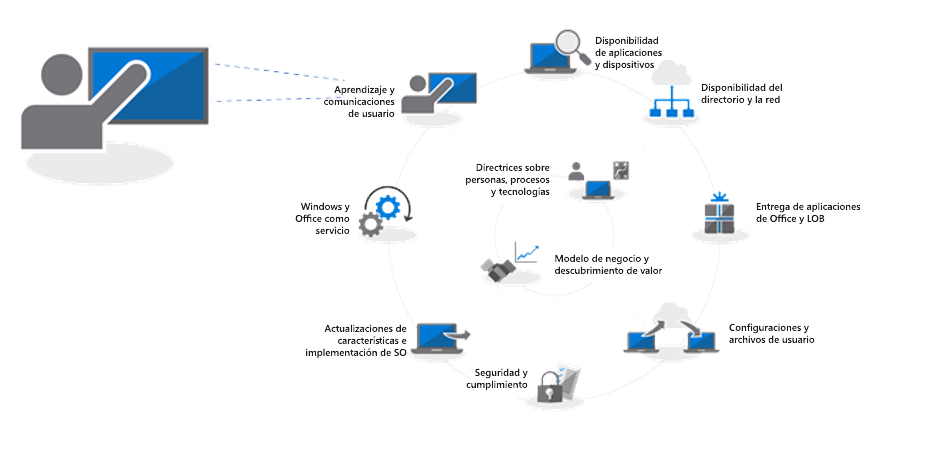
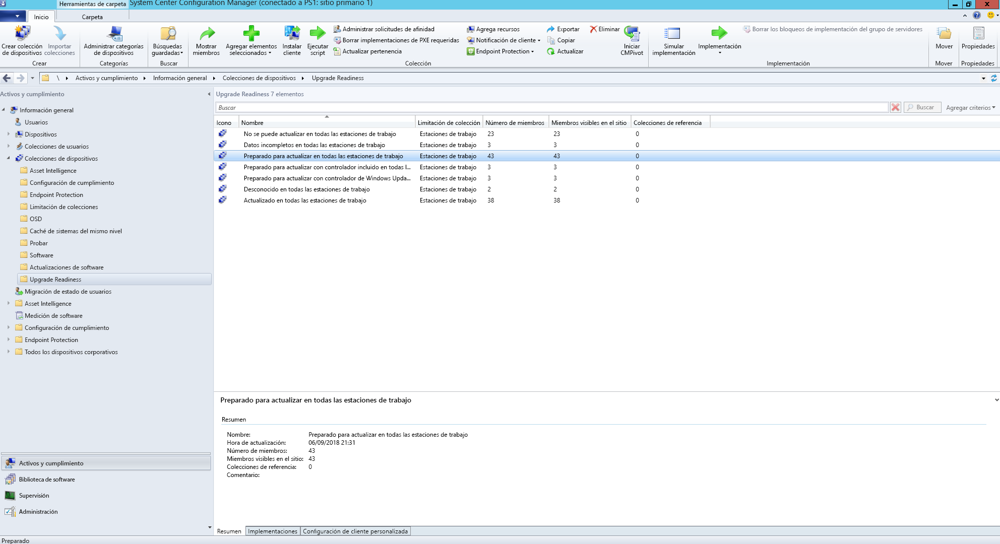
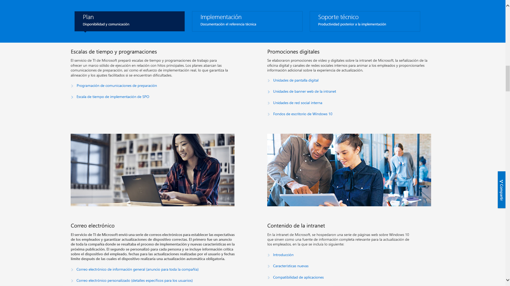

# Paso 8: Comunicación con los usuarios y aprendizaje

<table>
<thead>
<td></td>
<td>
<strong>Paso 8: Comunicación con los usuarios y aprendizaje</strong>

Asegúrese de que los usuarios están informados sobre las nuevas experiencias y las nuevas formas de trabajar al cambiar los equipos a Windows 10 y Office 365 ProPlus. Obtenga información sobre cómo aprovechar la asistencia para la adopción por parte de los usuarios con Microsoft FastTrack, los materiales de aprendizaje y las plantillas de comunicación, así como nuevas formas para supervisar la aceptación y el uso por parte de los usuarios.
</td>
<td></td>
</thead>
</table>

>[!NOTE]
>La comunicación con los usuarios y el aprendizaje es el octavo paso de nuestro ciclo de proceso de implementación y abarca consejos y recomendaciones para informar y preparar a los usuarios. Para ver el proceso de implementación de escritorio completo, visite el [Centro de implementación de escritorio](https://aka.ms/HowToShift).
>

Informar y preparar a sus usuarios para la experiencia de un entorno de trabajo moderno con Office 365, Windows 10 y los nuevos controles de seguridad y cumplimiento con Azure Active Directory es fundamental para impulsar su adopción. El truco consiste en determinar cómo introducir actualizaciones, puede que algunos usuarios teman que su productividad se vea afectada o cambios en su ritmo de trabajo si tienen que aprender algo nuevo.

La buena noticia es que si se muda de Windows 7 y Office 2010 u Office 2013, habrá muchos usuarios familiarizados con Windows 10 y versiones más recientes de Office ejecutándose en sus dispositivos personales y todo esto le ayudará a reducir el impacto del cambio.

## Prepárese para nuevas experiencias

Empezando con Office, si implementa Office 365 ProPlus por primera vez, puede comunicar los beneficios de iniciar sesión en las aplicaciones de Office y guardar archivos en ubicaciones de OneDrive o SharePoint para facilitar el uso compartido, reducir la ramificación de archivos y permitir la coautoría en tiempo real.

Hay disponibles comunicaciones detalladas y plantillas de formación para estas aplicaciones y también para otras locales o de navegador, como Teams y Planner.

También ofrecemos guiar a través de las nuevas capacidades de las aplicaciones, como adjuntar archivos vinculados de OneDrive a Outlook o usar las nuevas transiciones de transformación y las características de diseñador en PowerPoint.

En Windows 10, le ayudaremos a familiarizarse con sus usuarios con capacidades opcionales y predeterminadas como Windows Hello para iniciar sesión de forma segura usando biometría, actualizaciones de inicio para personalizar su experiencia Windows, una escala de tiempo para poder volver a aquello en lo que trabajaba, Cortana y mucho más.

También hay controles de seguridad y cumplimiento visibles a los que sus usuarios pueden estar expuestos. Enterprise Mobility + Security, que comprende Azure AD y Microsoft Intune, integra capacidades adicionales con Windows 10 y Office 365 que puede utilizar para su actualización de escritorio.

[Microsoft Enterprise Mobility + Security](https://www.microsoft.com/cloud-platform/enterprise-mobility-security)

Por ejemplo, si ha activado la autenticación multifactor, esta usa Azure AD y protege al usuario que inicia sesión al exigir una aplicación telefónica o un pin para acceder a los servicios de acceso con seguridad. Y Azure Information Protection facilita a los usuarios clasificar y etiquetar documentos.

[Configurar autenticación multifactor para usuarios de Office 365](https://support.office.com/article/set-up-multi-factor-authentication-for-office-365-users-8f0454b2-f51a-4d9c-bcde-2c48e41621c6)

Estas son solo algunas de las nuevas funciones que se presentarán a los usuarios y es posible que más de una les pille por sorpresa de forma más o menos positiva. Y estas sorpresas, sobre todo si alteran el ritmo normal de trabajo, pueden suponer más llamadas y tiques a su departamento de soporte técnico.

## Preparación proactiva e implementaciones medidas

Para ayudar a minimizar el riesgo asociado con los cambios en la experiencia del usuario, le recomendamos dos enfoques complementarios:

  - Comunicación proactiva con los usuarios para que sepan lo que pueden esperar

  - Uso de los anillos de implementación para controlar la velocidad de distribución

### Implementación por fases

La implementación con fases con anillos de implementación consiste en comenzar con grupos pequeños para, a continuación, ir ampliando la escala de implementación de forma medida con el tiempo. Normalmente, para cuando se ha trazado un plan de formación y comunicación, estos anillos y sus miembros ya han recibido formación. De este modo, puede reducir los riesgos potenciales y validar su enfoque conforme continúa abriendo la válvula de implementación, o pausar las actividades si es necesario, por ejemplo, si ve que recibe más llamadas de las esperadas al servicio técnico.

La creación de anillos de documentación funciona mejor en cooperación con unidades de negocios y sus administradores. Querrá conocer las fechas y las horas críticas que debe evitar al implementar o realizar cambios. Sin una planificación cuidadosa y la aceptación de las partes interesadas, será difícil conseguir que los usuarios se sientan cómodos con los cambios a los que se enfrenten.

### Fase 1: El equipo de TI y los primeros usuarios 

Suele ser mejor iniciar la implementación con el equipo de TI y algunos usuarios entusiastas que se presten voluntarios para el acceso anticipado. Estos "insiders" le ayudarán a probar sus comunicaciones, el impacto del cambio y la efectividad de su comunicación y formación. Durante esta fase, TI lleva a cabo pequeñas pruebas piloto, aprende sobre resolución de problemas y técnicas de automatización para ayudar durante las fases de implementación más amplias.

Es importante tener miembros comprometidos en la fase piloto inicial para asegurarse de que documentan sus observaciones y realizan comentarios sobre el proceso. Además, es bueno tener a algún campeón fuera del equipo de TI que ayude a extender de forma orgánica las nuevas capacidades y que, a menudo, serán la primera línea de apoyo cuando el resto de los usuarios necesite ayuda.

### Fase 2: Piloto 

Cuando se sienta cómodo con la primera fase, puede elegir un conjunto mayor de usuarios para la segunda fase piloto.  Esta debería comprender un grupo variado y representativo con distintos roles de usuario, tipos de dispositivos, aplicaciones de Windows y complementos de Office. Los datos que aporten estos grupos se usarán con el servicio de análisis para elegir el objetivo de los inicios de la fase 3, la implementación más amplia.

Recuerde que todos los equipos de esta fase y las futuras deben iniciar sesión con el servicio de análisis para que pueda recoger los datos de diagnóstico sobre el estado del dispositivo y la aplicación, además del ahorro de banda ancha de la optimización de distribución y el uso del inicio de sesión Windows Hello.

Para esta fase es especialmente importante comunicar los cambios y ayudar a los usuarios a aprovechar la ventaja de las nuevas capacidades. Los usuarios pueden priorizar o ignorar correos u otras comunicaciones de TI, de modo que ayuda reunirse con la administración para que ayude a comunicar los cambios y la adopción de nuevas herramientas y tecnología.

También necesitará su colaboración para conocer los horarios que debe evitar, de modo que minimice la molestia para el usuario. Por ejemplo, el equipo financiero puede que esté en un momento delicado al final del año fiscal o que los equipos de desarrollo de productos estén ocupados durante el lanzamiento de un producto.

En paralelo a la planificación de dispositivos, usuarios, departamentos y tiempos, puede comenzar a desarrollar sus planes de comunicación y formación, además de compilar contenido o recursos externos para ayudar a formar a los usuarios.

#### Microsoft FastTrack 

Para ayudar a su esfuerzo al a hora de reunir contenido de formación, puede acceder a un completo conjunto de vídeos de formación con instrucciones paso a paso en la biblioteca de productividad de Microsoft FastTrack.

[Biblioteca de productividad de Microsoft FastTrack](https://www.microsoft.com/microsoft-365/success/?rtc=2)

Hay cientos de temas, según las necesidades de su organización, como: crear contenido más impactante, compartir sitios y contenido, transformar el trabajo en equipo y mejorar la productividad con dispositivos modernos.

Además, si usa Microsoft 365 u Office 365, es muy posible que pueda optar a la ayuda de adopción de usuarios mediante el servicio Microsoft FastTrack. Representantes le guiarán a través de las mejores prácticas de adopción mientras repasa el proceso de implementación de Microsoft 365 (Windows, Office y EMS).

#### Microsoft IT Showcase 

La serie Microsoft's OT Showcase es otro gran recurso de contenido relacionado con la implementación de Windows 10. Incluye escalas de tiempo y horarios, plantillas de promoción digital, plantillas de correo electrónico y contenido de Intranet. Está basado en materiales usados para la implementación propia de Microsoft de Windows 10 y se ha modificado para que cualquier organización pueda darle uso.

[Preparing your organization for a seamless Windows 10 deployment (Preparar la organización para una implementación perfecta de Windows 10)](https://www.microsoft.com/itshowcase/windows10deployment)

Estos componentes y servicios juntos pueden funcionar bien durante la fase piloto. Y conforme comience a comprobar a qué reaccionan mejor los usuarios durante la formación, qué dispositivos marcar como objetivo y qué dispositivos o grupos de usuarios evitar o retrasar, puede comenzar a expandir su implementación en fases posteriores con un enfoque basado en los datos y la experiencia.

Conforme se expanda el piloto deberá publicar preguntas más frecuentes y contenido de autoservicio para ayudar a reducir proactivamente incidencias de soporte técnico.

### Fase 3 en adelante: Implementación de producción general 

Para cuando alcance las fases de implementación de producción general, habrá refinado sus herramientas relativas a los procesos, la comunicación, la formación y el autoservicio. Ahora puede usar los datos de diagnóstico recopilados más equipos de destino.

Lleve a cabo la implementación a una velocidad a la que pueda hacerse cargo su departamento de TI, servicio de asistencia, usuarios y capacidad de red. Siempre puede volver al paso 2 del proceso de implementación para optimizar su red más con caché de punto a punto, LEDBAT y otras técnicas que facilitarán la transferencia de datos relacionados con la implementación.

Además de los datos de diagnósticos que supervisar a través de las herramientas de análisis, también puede supervisar uso del servicio de Office 365 y Microsoft 365 de forma detallada con informes detallados de uso en la carga de trabajo en el centro de administración y el uso de los paneles de administración a través de Power BI. Estos son excelentes herramientas para ayudarle a configurar y controlar los objetivos mientras distribuye nuevas herramientas de trabajo conjunto, como Microsoft Teams, o nuevas formas de compartir archivos, como OneDrive.

La aceptación y adopción de nueva tecnología seguirá adelante incluso cuando todos los equipos de la organización tengan Windows 10 y Office 365 ProPlus instalados. Y los usuarios no tienen por qué cambiar la forma en la que trabajan, a menos que se tome el tiempo para informarles y darles formación acerca de las nuevas capacidades. Por último, con los nuevos modelos de mantenimiento, proporcionar nuevas capacidades en un calendario semianual continuado para Windows y, de forma opcional, en un calendario mensual para Office, la comunicación será continua.

## Paso anterior 

## [Paso 7: Mantenimiento de Windows y Office](https://aka.ms/mdd7)