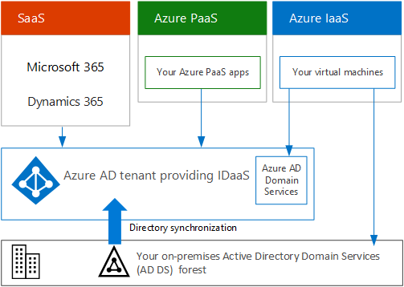

# Suscripciones, licencias, cuentas y espacios empresariales para las ofertas de la nube de Microsoft

Microsoft facilita una jerarquía de organizaciones, suscripciones, licencias y cuentas de usuario para un uso coherente de las identidades y la facturación en todas sus ofertas de la nube:
  
- Microsoft 365 y Microsoft Office 365
- Microsoft Azure
- Microsoft Dynamics 365

## Elementos de la jerarquía

Estos son los elementos de la jerarquía:
  
### Organización

An organization represents a business entity that is using Microsoft cloud offerings, typically identified by one or more public Domain Name System (DNS) domain names, such as contoso.com. The organization is a container for subscriptions.
  
### Suscripciones

Una suscripción es un contrato con Microsoft para utilizar uno o más servicios o plataformas de la nube de Microsoft, para los que se acumulan los cargos en función de un precio de licencia por usuario o en el consumo de recursos basados en la nube. 

- Las ofertas de la nube basadas en el software como servicio (SaaS) de Microsoft 365 y Dynamics 365 cobran precios de licencia por usuario. 
- Las ofertas de la nube de plataforma como servicio (PaaS) y de infraestructura como servicio (IaaS) de Microsoft (Azure) se cobran en función del consumo de recursos de la nube.
 
You can also use a trial subscription, but the subscription expires after a specific amount of time or consumption charges. You can convert a trial subscription to a paid subscription.
  
Organizations can have multiple subscriptions for Microsoft's cloud offerings. Figure 1 shows a single organization that has multiple Microsoft 365 subscriptions, a Dynamics 365 subscription, and multiple Azure subscriptions.

**Ilustración 1: Ejemplo de varias suscripciones para una organización**

  
### Licencias

For Microsoft's SaaS cloud offerings, a license allows a specific user account to use the services of the cloud offering. You are charged a fixed monthly fee as part of your subscription. Administrators assign licenses to individual user accounts in the subscription. For the example in Figure 2, the Contoso Corporation has a Microsoft 365 E5 subscription with 100 licenses, which allows to up to 100 individual user accounts to use Microsoft 365 E5 features and services.
  
**Ilustración 2: Licencias en las suscripciones basadas en SaaS para una organización**

>[!Note]
>Un procedimiento recomendado de seguridad es usar cuentas de usuario separadas a las que se les asignen roles específicos para funciones administrativas. No es necesario que a estas cuentas de administrador dedicadas se les asigne una licencia para los servicios en la nube que administran. Por ejemplo, no es necesario que se asigne una cuenta de administrador de SharePoint a una licencia de Microsoft 365.
>

Para los servicios en la nube basados en PaaS de Azure, las licencias de software están integradas en los precios del servicio.
  
For Azure IaaS-based virtual machines, additional licenses to use the software or application installed on a virtual machine image might be required. Some virtual machine images have licensed versions of software installed and the cost is included in the per-minute rate for the server. Examples are the virtual machine images for SQL Server 2014 and SQL Server 2016. 
  
Some virtual machine images have trial versions of applications installed and need additional software application licenses for use beyond the trial period. For example, the SharePoint Server 2016 Trial virtual machine image includes a trial version of SharePoint Server 2016 pre-installed. To continue using SharePoint Server 2016 after the trial expiration date, you must purchase a SharePoint Server 2016 license and client licenses from Microsoft. These charges are separate from the Azure subscription and the per-minute rate to run the virtual machine still applies.
  
### Cuentas de usuario

User accounts for all of Microsoft's cloud offerings are stored in an Azure Active Directory (Azure AD) tenant, which contains user accounts and groups. An Azure AD tenant can be synchronized with your existing Active Directory Domain Services (AD DS) accounts using Azure AD Connect, a Windows server-based service. This is known as directory synchronization.
  
En la ilustración 3, se muestra un ejemplo de varias suscripciones de una organización con un espacio empresarial de Azure AD común que contiene las cuentas de la organización.
  
**Ilustración 3: Varias suscripciones de una organización que usan el mismo espacio empresarial de Azure AD**

  
### Espacios empresariales

For SaaS cloud offerings, the tenant is the regional location that houses the servers providing cloud services. For example, the Contoso Corporation chose the European region to host its Microsoft 365, EMS, and Dynamics 365 subscriptions for the 15,000 workers in their Paris headquarters.
  
Azure PaaS services and virtual machine-based workloads hosted in Azure IaaS can have tenancy in any Azure datacenter across the world. You specify the Azure datacenter, known as the location, when you create the Azure PaaS app or service or element of an IaaS workload.
  
An Azure AD tenant is a specific instance of Azure AD containing accounts and groups. Paid or trial subscriptions of Microsoft 365 or Dynamics 365 include a free Azure AD tenant. This Azure AD tenant does not include other Azure services and is not the same as an Azure trial or paid subscription.
  
### Resumen de la jerarquía

Presentamos un breve resumen:
  
- Una organización puede tener varias suscripciones.
    
  - Una suscripción puede tener varias licencias.
    
  - Las licencias se pueden asignar a cuentas de usuario individuales.
    
  - Las cuentas de usuario se almacenan en un inquilino de Azure AD.
    
Aquí tiene un ejemplo de la relación de las organizaciones, suscripciones, licencias y cuentas de usuario.
  
- Una organización identificada mediante su nombre de dominio público.
    
  - Una suscripción a Microsoft 365 E3 con licencias de usuario.
    
    Una suscripción a Microsoft 365 E5 con licencias de usuario.
    
    Una suscripción de Dynamics 365 con licencias de usuario.
    
    Varias suscripciones de Azure.
    
  - Las cuentas de usuario de la organización en un inquilino común de Azure AD.
    
Multiple Microsoft cloud offering subscriptions can use the same Azure AD tenant that acts as a common identity provider. A central Azure AD tenant that contains the synchronized accounts of your on-premises AD DS provides cloud-based Identity as a Service (IDaaS) for your organization. 
  
**Ilustración 4: Cuentas locales sincronizadas e IDaaS para una organización**

  
Figure 4 shows how a common Azure AD tenant is used by Microsoft's SaaS cloud offerings, Azure PaaS apps, and virtual machines in Azure IaaS that use Azure AD Domain Services. Azure AD Connect synchronizes the on-premises AD DS forest with the Azure AD tenant.
  
## Combinación de suscripciones para varias ofertas de la nube de Microsoft

En la siguiente tabla se describe cómo combinar varias ofertas de la nube de Microsoft si ya se cuenta con una suscripción para un tipo de oferta de la nube (las etiquetas de la primera columna) y si se agrega una suscripción para una oferta de la nube diferente (que pasan por todas las columnas).
  
||**Microsoft 365**|**Azure**|**Dynamics 365**|
|:-----|:-----|:-----|:-----|:-----|
|**Microsoft 365**   |N/D    |Agregue una suscripción de Azure a la organización desde el portal de Azure.    |Agregue una suscripción de Dynamics 365 a la organización desde el Centro de administración de Microsoft 365.    |
|**Azure**   |Agregue una suscripción de Microsoft 365 a su organización.    |N/D    |Agregue una suscripción de Dynamics 365 a su organización.    |
|**Dynamics 365**   |Agregue una suscripción de Microsoft 365 a su organización.    |Agregue una suscripción de Azure a la organización desde el portal de Azure.    |N/D    |
   
Una forma sencilla de agregar suscripciones a su organización para los servicios basados en SaaS para Microsoft es a través del Centro de administración:
  
1. Inicie sesión en la Centro de administración de Microsoft 365 ([https://admin.microsoft.com](https://admin.microsoft.com)) con su cuenta de **Administrador de usuarios** o **Administrador global**.
    
2. En el panel de navegación izquierdo de la página principal del **Centro de administración**, haga clic en **Facturación** y, después, en **Servicios de compra**.
    
3. En la página **Servicios de compra**, compre las nuevas suscripciones.
    
El Centro de administración asigna la organización y el espacio empresarial de Azure AD de su suscripción de Microsoft 365 a las nuevas suscripciones para las ofertas en la nube basadas en SaaS.
  
Para agregar una suscripción de Azure con la misma organización y espacio empresarial de Azure AD que su suscripción de Microsoft 365:
  
1. Inicie sesión en el Azure Portal ([https://portal.azure.com](https://portal.azure.com)) con su cuenta de **Administrador de controlador de dominio de Azure AD** de Microsoft 365 o **Administrador global**.
    
2. En el panel de navegación izquierdo, haga clic en **Suscripciones** y después en **Agregar**.
    
3. En la página **Agregar suscripción**, seleccione una oferta y complete la información de pago y el contrato.
    
Si compró suscripciones de Microsoft 365 y Azure por separado y quiere acceder al espacio empresarial de Azure AD de Microsoft 365 desde su suscripción de Azure, vea las instrucciones en [Añadir una suscripción existente de Azure a su espacio empresarial de Azure Active Directory](/azure/active-directory/fundamentals/active-directory-how-subscriptions-associated-directory).
 
## Ver también

[Ilustraciones de la nube de Microsoft para arquitectos empresariales](../solutions/cloud-architecture-models.md)
  
[Modelos de arquitectura para SharePoint, Exchange, Skype Empresarial y Lync](architectural-models-for-sharepoint-exchange-skype-for-business-and-lync.md)
  
[Soluciones híbridas](hybrid-solutions.md)

## Paso siguiente

[Evaluar la conectividad de red de Microsoft 365](assessing-network-connectivity.md)
