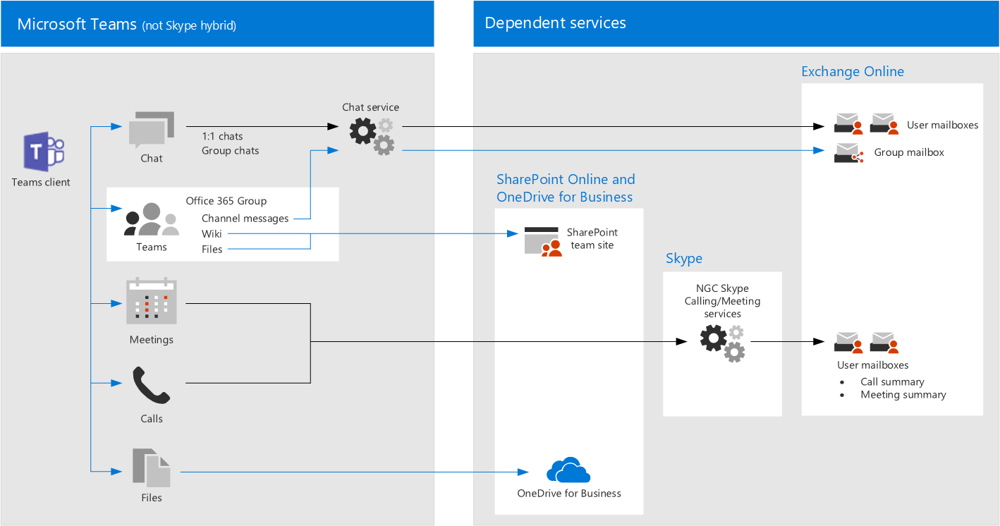

# Recomendaciones de directivas para proteger los chats, grupos y archivos de Microsoft TeamsPolicy recommendations for securing Teams chats, groups, and files

En este artículo se describe cómo implementar la identidad recomendada y las directivas de acceso a dispositivos para proteger los chats, grupos y contenido de Microsoft Teams, como archivos y calendarios.This article describes how to implement the recommended identity and device-access policies to protect Teams chats, groups, and content such as files and calendars. Esta guía se basa en las [directivas comunes de identidad y acceso a dispositivos](identity-access-policies.md), con información adicional que es específica de cada equipo.This guidance builds on the [Common identity and device access policies](identity-access-policies.md), with additional information that's Teams-specific. Como Microsoft Teams se integra con nuestros otros productos, vea también [recomendaciones de directivas para proteger los sitios y archivos de SharePoint](sharepoint-file-access-policies.md) y [recomendaciones de directivas para proteger el correo electrónico](secure-email-recommended-policies.md).Because Teams integrates with our other products, also see [Policy recommendations for securing SharePoint sites and files](sharepoint-file-access-policies.md) and [Policy recommendations for securing email](secure-email-recommended-policies.md).

Estas recomendaciones se basan en tres niveles diferentes de seguridad y protección para Teams que se pueden aplicar en función de la granularidad de sus necesidades: línea de base, confidencial y muy regulada.These recommendations are based on three different tiers of security and protection for Teams that can be applied based on the granularity of your needs: baseline, sensitive, and highly regulated. Puede obtener más información sobre estos niveles de seguridad y los sistemas operativos de cliente recomendados, a los que se hace referencia en estas recomendaciones en las [configuraciones de identidad y acceso a dispositivos](microsoft-365-policies-configurations.md).You can learn more about these security tiers, and the recommended client operating systems, referenced by these recommendations in the [Identity and device access configurations](microsoft-365-policies-configurations.md).

En este artículo se incluyen recomendaciones adicionales específicas de la implementación de Teams para cubrir determinadas circunstancias de autenticación, incluidas las de los usuarios externos a la organización, y necesitará seguir estas instrucciones para una experiencia de seguridad completa.Additional recommendations specific to Teams deployment are included in this article, to cover specific authentication circumstances, including for users outside your organization, and you will need to follow this guidance for a complete security experience.

## Introducción a teams antes de otros servicios dependientesGetting started with Teams before other dependent services

No es necesario que habilite los servicios dependientes para empezar a trabajar con Microsoft Teams.You don’t need to enable dependent services to get started with Microsoft Teams. Todo "simplemente funcionará".These will all ‘just work.’ Sin embargo, debe estar preparado para administrar lo siguiente:However, you do need to be prepared to manage the following:

- Grupos de Office 365Office 365 groups
- Sitios de grupo de SharePointSharePoint team sites
- OneDrive para la EmpresaOneDrive for Business
- BuzonesMailboxes
- Vídeos de secuencia y planes de Planner (si estos servicios están habilitados)Stream videos and Planner plans (if these services are enabled)

## Actualización de directivas comunes para incluir equiposUpdating common policies to include Teams

El siguiente diagrama ilustra el conjunto de directivas recomendadas para proteger chats, grupos y contenido en Teams.The following diagram illustrates the set of recommended policies for protecting chat, groups and content in Teams. El icono de lápiz indica qué directivas deben revisarse para asegurarse de que Teams y los servicios dependientes se incluyen en la asignación de aplicaciones en la nube.The pencil icon indicates which policies need to be revisited to be sure that Teams and dependent services are included in the assignment of cloud apps.

Estos son los servicios dependientes que se deben incluir en la asignación de aplicaciones en la nube para Teams:These are the dependent services to include in the assignment of cloud apps for Teams:

- Microsoft TeamsMicrosoft Teams
- SharePoint Online y OneDrive para la EmpresaSharePoint Online and OneDrive for Business
- Exchange OnlineExchange Online
- Skype Empresarial OnlineSkype for Business Online
- Microsoft Stream (grabaciones de reuniones)Microsoft Stream (meeting recordings)
- Microsoft Planner (tareas de Planner y datos del plan)Microsoft Planner (Planner tasks and plan data)

En esta tabla se enumeran las directivas que deben revisitarse y vínculos a cada directiva en [las directivas comunes de identidad y acceso a dispositivos](identity-access-policies.md), que tienen el conjunto de reglas más amplio para todas las aplicaciones de Office.This table lists the policies that need to be revisited and links to each policy in [Common identity and device access policies](identity-access-policies.md), which has the wider rule-set for all Office applications.

|Nivel de protecciónProtection level|DirectivasPolicies|Información adicional para la implementación de TeamsFurther information for Teams implementation|
|:---------------|:-------|:----------------|
|**Baseline****Baseline**|[Requerir MFA cuando el riesgo de inicio de sesión sea *medio* o *alto*Require MFA when sign-in risk is *medium* or *high*](identity-access-policies.md#require-mfa-based-on-sign-in-risk)|Asegúrese de que Microsoft Teams y los servicios dependientes se incluyen en la lista de aplicaciones.Be sure Teams and dependent services are included in the list of apps. Teams tiene también acceso de invitado y reglas de acceso externo que se deben tener en cuenta, obtendrá más información sobre estos en este artículo.Teams has Guest Access and External Access rules to consider as well, you'll learn more about these later in this article.|
|        |[Bloquear a los clientes que no sean compatibles con la autenticación modernaBlock clients that don't support modern authentication](identity-access-policies.md#block-clients-that-dont-support-modern-authentication)|Incluir equipos y servicios dependientes en la asignación de aplicaciones en la nube.Include Teams and dependent services in the assignment of cloud apps.|
|        |[Los usuarios de riesgo alto deben cambiar la contraseñaHigh risk users must change password](identity-access-policies.md#high-risk-users-must-change-password)|Obliga a los usuarios de Microsoft Teams a cambiar su contraseña al iniciar sesión si se detecta una actividad de alto riesgo para su cuenta.Forces Teams users to change their password when signing in if high-risk activity is detected for their account. Asegúrese de que Microsoft Teams y los servicios dependientes se incluyen en la lista de aplicaciones.Be sure Teams and dependent services are included in the list of apps.|
|        |[Definir directivas de protección de aplicacionesDefine app protection policies](identity-access-policies.md#define-app-protection-policies)|Asegúrese de que Microsoft Teams y los servicios dependientes se incluyen en la lista de aplicaciones.Be sure Teams and dependent services are included in the list of apps. Actualice la Directiva para cada plataforma (iOS, Android, Windows).Update the policy for each platform (iOS, Android, Windows).|
|        |[Requerir aplicaciones aprobadasRequire approved apps](identity-access-policies.md#require-approved-apps)|Incluir equipos y servicios dependientes en esta Directiva.Include Teams and dependent services in this policy.|
|        |[Definir directivas de cumplimiento de dispositivosDefine device compliance policies](identity-access-policies.md#define-device-compliance-policies)|Incluir equipos y servicios dependientes en esta Directiva.Include Teams and dependent services in this policy.|
|        |[Exigir equipos PC compatiblesRequire compliant PCs](identity-access-policies.md#require-compliant-pcs-but-not-compliant-phones-and-tablets)|Incluir equipos y servicios dependientes en esta Directiva.Include Teams and dependent services in this policy.|
|**Confidencial****Sensitive**|[Requerir MFA cuando el riesgo de inicio de sesión es *bajo*, *medio* o *alto*Require MFA when sign-in risk is *low*, *medium* or *high*](identity-access-policies.md#require-mfa-based-on-sign-in-risk)|Teams tiene también acceso de invitado y reglas de acceso externo que se deben tener en cuenta, obtendrá más información sobre estos en este artículo.Teams has Guest Access and External Access rules to consider as well, you'll learn more about these later in this article. Incluir equipos y servicios dependientes en esta Directiva.Include Teams and dependent services in this policy.|
|         |[Requerir equipos *y* dispositivos móviles compatiblesRequire compliant PCs *and* mobile devices](identity-access-policies.md#require-compliant-pcs-and-mobile-devices)|Incluir equipos y servicios dependientes en esta Directiva.Include Teams and dependent services in this policy.|
|**Extremadamente regulado****Highly regulated**|[Requerir *siempre* MFA*Always* require MFA](identity-access-policies.md#require-mfa-based-on-sign-in-risk)|Independientemente de la identidad del usuario, la organización usará la MFA.Regardless of user identity, MFA will be used by your organization. Incluir equipos y servicios dependientes en esta Directiva.Include Teams and dependent services in this policy.
| | |

## Arquitectura de servicios dependientes de TeamsTeams dependent services architecture

Como referencia, el siguiente diagrama ilustra los equipos de servicios en los que se basa.For reference, the following diagram illustrates the services Teams relies on. Para obtener más información e ilustraciones adicionales, consulte [Microsoft Teams y los servicios de productividad relacionados en microsoft 365 para arquitectos de ti](https://docs.microsoft.com/en-us/office365/enterprise/microsoft-cloud-it-architecture-resources#microsoft-teams-and-related-productivity-services-in-microsoft-365-for-it-architects).For more information and additional illustrations, see [Microsoft Teams and related productivity services in Microsoft 365 for IT architects](https://docs.microsoft.com/en-us/office365/enterprise/microsoft-cloud-it-architecture-resources#microsoft-teams-and-related-productivity-services-in-microsoft-365-for-it-architects).

## Habilitación del acceso externo y de invitado para Microsoft TeamsEnabling guest and external access for Teams

En Azure AD, los usuarios externos y invitados son los mismos.In Azure AD, guest and external users are the same. El tipo de usuario para ambos es invitado.The user type for both of these is Guest. Los usuarios invitados son usuarios B2B.Guest users are B2B users. Microsoft Teams diferencia entre los usuarios invitados y los usuarios externos de la aplicación.Microsoft Teams differentiates between guest users and external users in the app. Aunque es importante comprender cómo se trata cada uno de ellos en Teams, ambos tipos de usuarios son usuarios B2B de Azure AD y las directivas recomendadas para los usuarios B2B se aplican a ambos.While it's important to understand how each of these are treated in Teams, both types of users are B2B users in Azure AD and the recommended policies for B2B users apply to both.

### Acceso de invitado en Microsoft TeamsGuest Access in Teams

Además de las directivas para los usuarios que son internas a su empresa u organización, los administradores pueden habilitar el acceso de invitado para permitir, de forma individual para cada usuario, que los usuarios externos a su empresa u organización obtengan acceso a los recursos de Microsoft Teams e interactúen con personas internas para cosas como conversaciones de grupo, chat y reuniones.In addition to the policies for users who are internal to your business or organization, administrators may enable guest access to allow, on a user-by-user basis, people who are external to your business or organization to access Teams resources and interact with internal people for things like group conversations, chat, and meetings. Puede obtener más información sobre el acceso de invitado en el siguiente vínculo: [acceso de invitado de Teams](https://docs.microsoft.com/en-us/microsoftteams/guest-access)You can learn more about Guest Access at the following link: [Teams guest access](https://docs.microsoft.com/en-us/microsoftteams/guest-access)

### Acceso externo en Microsoft TeamsExternal Access in Teams

El acceso externo se confunde a veces con el acceso de invitado, por lo que es importante estar claro que estos dos mecanismos de acceso no interno son muy diferentes en realidad.External access is sometimes confused with guest access, so it's important to be clear that these two non-internal access mechanisms are actually quite different. Mientras que el acceso de invitado tiene lugar por usuario (se agrega un usuario cada vez), cuando un administrador habilita el acceso externo, le permite agregar todos los usuarios de un dominio externo al mismo tiempo a teams.While guest access occurs on a per-user basis (you add one user at a time), when an administrator enables external access it allows you to add all the users of an external domain at the same time to Teams. Sin embargo, estos usuarios externos tienen menos acceso y funcionalidad que una persona que se agregó mediante el acceso de invitado.However those external users have less access and functionality than an individual who's been added via guest access would have. Los usuarios de acceso externo pueden chatear con los usuarios internos a través de Teams.External access users can chat with your internal users via Teams.

Para obtener más información sobre el acceso externo y cómo implementarlo si es necesario, revise [Manage external Access in Microsoft Teams](https://docs.microsoft.com/en-us/microsoftteams/manage-external-access) .For more reading about external access, and how to implement it if you need to, please review [Manage external access in Microsoft Teams](https://docs.microsoft.com/en-us/microsoftteams/manage-external-access)

## Directivas de Microsoft TeamsTeams Policies

Fuera de las directivas comunes enumeradas anteriormente, hay directivas específicas de Microsoft teams que se pueden y deben configurar para administrar diversas funcionalidades de Teams.Outside of the common policies listed above, there are Teams-specific policies that can and should be configured to manage various Teams functionalities.

### Directivas de Microsoft Teams y ChannelsTeams and Channels Policies

Los equipos y canales son dos elementos que se usan con frecuencia en Microsoft Teams y hay directivas que se pueden aplicar para controlar lo que los usuarios pueden y no pueden hacer cuando usan equipos y canales.Teams and channels are two commonly used elements in Microsoft Teams, and there are policies you can put in place to control what users can and cannot do when using teams and channels. Aunque puede crear un equipo global, si su organización tiene 5000 usuarios o menos, es probable que le resulte útil tener equipos y canales más pequeños con fines específicos y en línea con las necesidades de su organización.While you can create a global team, if your organization has 5000 users or less, you are likely to find it helpful to have smaller teams and channels for specific purposes, in-line with your organizational needs.

Se recomienda cambiar la directiva predeterminada o crear directivas personalizadas y puede obtener más información sobre cómo administrar las directivas en este vínculo: [Manage Teams policies in Microsoft Teams](https://docs.microsoft.com/en-us/microsoftteams/teams-policies).Changing the default policy or creating custom policies would be recommended, and you can learn more about managing your policies at this link: [Manage teams policies in Microsoft Teams](https://docs.microsoft.com/en-us/microsoftteams/teams-policies).

### Directivas de mensajeríaMessaging Policies

La mensajería o el chat también se pueden administrar a través de la directiva global predeterminada o mediante directivas personalizadas, lo que puede ayudar a los usuarios a comunicarse entre sí de manera adecuada para su organización.Messaging, or chat, can also be managed through the default global policy, or through custom policies, and this can help your users communicate with one another in a way that's appropriate for your organization. Esta información puede revisarse en [Administración de directivas de mensajería en Microsoft Teams](https://docs.microsoft.com/en-us/microsoftteams/messaging-policies-in-teams).This information can be reviewed at [Managing messaging policies in Teams](https://docs.microsoft.com/en-us/microsoftteams/messaging-policies-in-teams).

### Directivas de reuniónMeeting Policies

Ninguna discusión de Microsoft Teams estaría completa sin planear e implementar directivas alrededor de las reuniones de Teams.No discussion of Teams would be complete without planning and implementing policies around Teams meetings. Las reuniones son un componente esencial de Teams, que permite a los usuarios reunirse y presentar de forma formal a muchos usuarios a la vez, así como compartir contenido relevante para la reunión.Meetings are an essential component of Teams, allowing people to formally meet and present to many users at once, as well as share content relevant to the meeting. Es esencial establecer las directivas adecuadas para la organización en relación con las reuniones.Setting the right policies for your organization around meetings is essential.

Consulte [Manage Meeting policies in Teams](https://docs.microsoft.com/en-us/microsoftteams/meeting-policies-in-teams) para obtener más información.Please review [Manage meeting policies in Teams](https://docs.microsoft.com/en-us/microsoftteams/meeting-policies-in-teams) for more information.

### Directivas de permisos de aplicacionesApp Permission Policies

Teams también le permite usar aplicaciones en varios lugares, como canales o chats personales.Teams also allows you to use apps in various places, such as channels or personal chats. Contar con directivas alrededor de las aplicaciones que se pueden agregar y usar, y dónde, es esencial para mantener un entorno enriquecido de contenido que también es seguro.Having policies around what apps can be added and used, and where, is essential to maintaining a content-rich environment that is also secure.

Para obtener más información sobre las directivas de permisos de la aplicación, consulte [Manage App Permission policies in Microsoft Teams](https://docs.microsoft.com/en-us/microsoftteams/teams-app-permission-policies).For more reading about App Permission Policies, check out [Manage app permission policies in Microsoft Teams](https://docs.microsoft.com/en-us/microsoftteams/teams-app-permission-policies).
