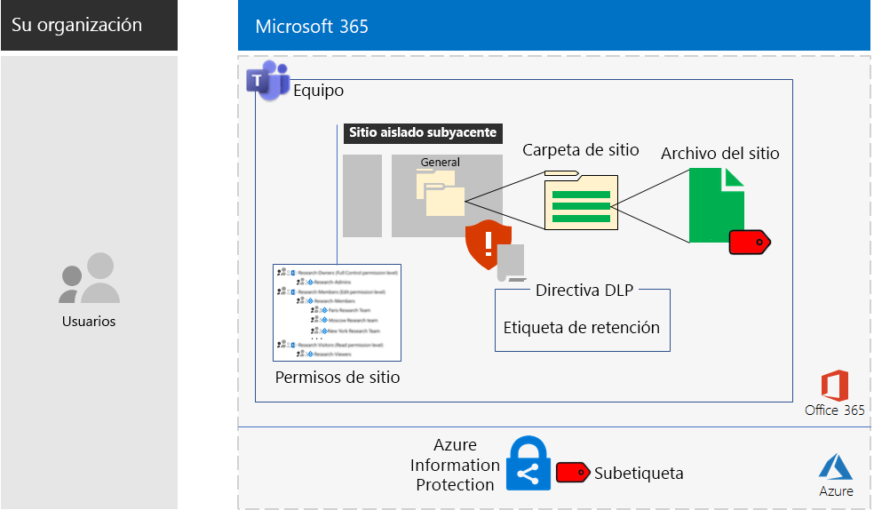

# Sitios de Microsoft Teams y SharePoint Online para datos altamente reguladosMicrosoft Teams and SharePoint Online sites for highly regulated data

*Este escenario se aplica a las versiones E3 y E5 de Microsoft 365 Enterprise**This scenario applies to both the E3 and E5 versions of Microsoft 365 Enterprise*

Microsoft 365 Enterprise incluye un conjunto completo de servicios en la nube para crear, guardar y proteger sus datos altamente regulados. Esto incluye:Microsoft 365 Enterprise includes a full suite of cloud-based services so that you can create, store, and secure your highly regulated data. This includes data that is:

- Datos sujetos a regulaciones regionales.Subject to regional regulations.
- Los datos más importantes para su organización, como pueden ser secretos comerciales, información de recursos humanos o financiera y estrategias de la organización.The most valuable data for your organization, such as trade secrets, financial or human resources information, and organization strategy.

Un escenario basado en la nube de Microsoft 365 Enterprise que cumpla estas necesidades de negocio requiere que usted:A Microsoft 365 Enterprise cloud-based solution that meets this business need requires that you:

- Almacene los activos digitales (documentos, diapositivas, hojas de cálculo, etc.) en un sitio de grupo de SharePoint Online o en la pestaña **Archivos** de un equipo de Microsoft Teams.Store digital assets (documents, slide decks, spreadsheets, etc.) in a SharePoint Online team site or in the **Files** tab of a Microsoft Teams team.
- Bloquee el sitio o equipo para evitar:Lock down the site or team to prevent:
   - El acceso únicamente a un conjunto específico de cuentas a través de la pertenencia a grupos, lo que incluye aquellas que pueden acceder al sitio de grupo de SharePoint Online y el nivel de permiso con el que cuentan, además de aquellas que pueden administrarlo.Access to only a specific set of user accounts through group membership, which includes those who can access the SharePoint Online team site and at what level of permission, and those who can administer it.
   - Que miembros del sitio concedan acceso a terceros.Members of the site from granting access to others.
   - Que aquellos que no sean miembros del sitio soliciten acceso.Non-members of the site from requesting access to the site.
- Configure una etiqueta de retención de Office 365 para los sitios de SharePoint Online o equipos de forma predeterminada para definir directivas de retención en los documentos del sitio o equipo.Configure an Office 365 retention label for your SharePoint Online sites or teams as a default way to define retention policies on the documents in the site or team.
- Bloquea la capacidad de los usuarios de enviar archivos fuera de la organización.Block users from sending files outside the organization.
- Cifre los recursos digitales confidenciales del sitio o grupo.Encrypt the most sensitive digital assets of the site or team.
- Agregue permisos a los recursos digitales más confidenciales de modo que requieran las credenciales válidas de una cuenta de usuario para abrirse si se comparten fuera del sitio.Add permissions to the most sensitive digital assets so that if even if they get shared outside of the site, opening the asset still requires the valid credentials of a user account that has permission.

En la tabla siguiente se asignan los requisitos de este escenario a una característica de Microsoft 365 Enterprise.The following table maps the requirements of this solution to a feature of Microsoft 365 Enterprise.

|||
|:-------|:-----|
| **Requisito****Requirement** | **Característica de Microsoft 365 Enterprise****Microsoft 365 Enterprise feature** |
| Almacenar recursos digitalesStore digital assets | Sitios de grupo de SharePoint Online y equipos en Office 365SharePoint Online team sites and teams in Office 365 |
| Bloquear el sitioLock down the site | Permisos de sitios de grupo de SharePoint Online y grupos de Azure ADAzure AD groups and SharePoint Online team site permissions |
| Etiquetar los recursos digitales del sitioLabel the digital assets of the site | Etiquetas de retención de Office 365Office 365 retention labels |
| Bloquear a los usuarios cuando envían archivos fuera de la organizaciónBlock users when sending files outside the organization | Directivas de prevención de pérdida de datos (DLP) en Office 365Data Loss Prevention (DLP) policies in Office 365 |
| Cifrar todos los recursos digitales del sitioEncrypt all of the digital assets of the site | Etiquetas secundarias de Azure Information Protection en Enterprise Mobility + Security (EMS)Azure Information Protection sub-labels in Enterprise Mobility + Security (EMS) |
| Añadir permisos a los recursos digitales del sitioAdd permissions to the digital assets of the site | Etiquetas secundarias de Azure Information Protection en EMSAzure Information Protection sub-labels in EMS |
|||

Esta es la configuración para un sitio de SharePoint Online.Here is the configuration for a SharePoint Online site.

Este escenario requiere que ya haya implementado:This solution requires that you have already deployed:

- La fase de [identidad](identity-infrastructure.md) y los pasos 1 y 2 de la fase de [protección de la información](infoprotect-infrastructure.md) de la infraestructura de base.The [Identity](identity-infrastructure.md) phase and steps 1 and 2 of the [Information protection](infoprotect-infrastructure.md) phase of the foundation infrastructure. 
- Para datos altamente regulados en sitios de grupo de SharePoint Online, [SharePoint Online](sharepoint-online-onedrive-workload.md).For highly regulated data in SharePoint Online team sites, [SharePoint Online](sharepoint-online-onedrive-workload.md).
- Para datos altamente regulados en equipos de Microsoft Teams, [Microsoft Teams](teams-workload.md).For highly regulated data in Microsoft Teams teams, [Microsoft Teams](teams-workload.md).

Las siguientes fases le guiarán a través del diseño, la configuración y la adopción de impulso de los sitios y grupos de datos altamente regulados de SharePoint Online.The following phases step you through the design, configuration, and driving adoption for SharePoint Online sites and teams for highly regulated data.

Para ver cómo Contoso Corporation, una organización multinacional ficticia pero representativa, diseñó un sitio de SharePoint Online para los equipos de investigación, vea esta [configuración de ejemplo](contoso-sharepoint-online-site-for-highly-confidential-assets.md).To see how the Contoso Corporation, a fictional but representative multi-national organization, designed a SharePoint Online site for its research teams, see this [example configuration](contoso-sharepoint-online-site-for-highly-confidential-assets.md).

Un grupo de datos altamente regulados requiere crear primero un sitio de grupo de SharePoint Online para datos altamente regulados. A continuación, se debe crear un equipo que use el grupo de Office 365 del sitio de grupo de SharePoint Online. Consulte el paso 4 de la fase 2 para obtener más información.A team for highly regulated data requires that you first create a SharePoint Online team site for highly regulated data. You then create a new team that uses the Office 365 group of the SharePoint Online team site. See Phase 2, Step 4 for more information.

Esta es la configuración de un equipo.Here is the configuration for a team.

## Requisitos previos de acceso a dispositivos e identidadesIdentity and device access prerequisites

Para proteger el acceso al sitio o grupo de SharePoint Online, asegúrese de haber configurado [directivas de acceso de identidades y dispositivos](identity-access-policies.md) y [directivas de acceso recomendadas de SharePoint Online](sharepoint-file-access-policies.md).To protect access to the team or SharePoint Online site, ensure that you have configured [identity and device access policies](identity-access-policies.md) and the [recommended SharePoint Online access policies](sharepoint-file-access-policies.md).

## Fase 1: DiseñoPhase 1: Design

Para crear un sitio o grupo de SharePoint Online para datos altamente regulados, primero debe identificar su propósito. Por ejemplo, el departamento de investigación y desarrollo de una empresa de fabricación tiene un sitio de SharePoint Online para almacenar las especificaciones de diseño actuales de los productos existentes y un sitio para colaborar en nuevos productos. Solo los miembros del departamento de investigación y desarrollo y determinados directivos podrán tener acceso al sitio.To create a SharePoint Online site or team for highly regulated data, you must first identify its purpose. For example, the research and development department of a manufacturing organization needs a SharePoint Online site to store current design specifications for existing products and a place to collaborate on new products. Only members of the Research & Development department and selected executives will be allowed to access the site.

Ese propósito impulsará la determinación de los elementos de configuración esenciales, como:That purpose will drive the determination of essential configuration items such as:

- Los conjuntos de permisos de SharePoint Online y los grupos de SharePointThe set of SharePoint Online permission sets and SharePoint groups
- El conjunto de grupos de acceso, los grupos de seguridad de Azure AD y sus miembros que se agregarán a los grupos de SharePointThe set of access groups, the Azure AD security groups and their members to add to the SharePoint groups
- La etiqueta de retención de Office 365 para asignar al sitio y el conjunto de directivas DLP para la etiquetaThe Office 365 retention label to assign to the site and the set of DLP policies for the label
- La configuración de una etiqueta secundaria de Azure Information Protection que los usuarios aplican a los recursos digitales más confidenciales almacenados en el sitioThe settings of an Azure Information Protection sub-label that users apply to highly sensitive digital assets stored in the site

Una vez determinadas, use estas opciones para configurar el sitio en la fase 2.Once determined, you use these settings to configure the site in Phase 2. 

### Paso 1: Sitio de SharePoint Online aisladoStep 1: An isolated SharePoint Online site

La versión bloqueada de un sitio de grupo de SharePoint Online recibe el nombre de sitio aislado. A diferencia de la configuración predeterminada de los sitios de grupo privados, los sitios aislados están configurados para impedir:The locked-down version of a SharePoint Online team site is known as an isolated site. Unlike the default settings of private team sites, isolated sites are configured to prevent:

- El acceso a los usuarios que no son miembros de grupos específicos.Access to those who are not members of specified groups.
- La solicitud de acceso.The requesting of access.
- La concesión de acceso no autorizado por parte de los miembros actuales de grupos específicos.The unauthorized granting of access by current members of specified groups.
- La administración del sitio por parte de miembros con acceso al grupo.Administration of the site by access group members.

La seguridad de los sitios de grupo de SharePoint Online que contienen recursos altamente regulados no cambia a menos que lo haga un administrador de SharePoint del sitio.The security of SharePoint Online team sites that contain highly regulated assets do not change unless done by a SharePoint administrator for the site.

Consulte [Diseñar un sitio de grupo de SharePoint Online aislado](https://docs.microsoft.com/office365/enterprise/design-an-isolated-sharepoint-online-team-site) para obtener los detalles que determinan el conjunto de niveles de permisos, grupos de SharePoint, grupos de acceso y miembros del grupo.See [Design an isolated SharePoint Online team site](https://docs.microsoft.com/office365/enterprise/design-an-isolated-sharepoint-online-team-site) for the details to determine the set of permission levels, SharePoint groups, access groups, and group members.

### Paso 2: Etiquetas de retención de Office 365 y directivas DLPStep 2: Office 365 retention labels and DLP policies

Cuando se aplican a un sitio de grupo de SharePoint Online, las etiquetas de retención de Office 365 proporcionan un método predeterminado de clasificación para todos los recursos digitales almacenados en el sitio.When applied to a SharePoint Online team site, Office 365 retention labels provide a default method of classifying all digital assets stored on the site.
 
En los sitios de SharePoint Online para datos altamente regulados, debe determinar qué etiqueta de retención de Office 365 usar.For SharePoint Online sites for highly regulated data, you need to determine which Office 365 retention label to use.

Para conocer las consideraciones de diseño de las etiquetas de Office 365, consulte [Etiquetas y clasificación de Office 365](https://docs.microsoft.com/office365/securitycompliance/secure-sharepoint-online-sites-and-files#office-365-retention-labels).For the design considerations of Office 365 labels, see [Office 365 classification and labels](https://docs.microsoft.com/office365/securitycompliance/secure-sharepoint-online-sites-and-files#office-365-retention-labels).

Use directivas DLP para proteger la información confidencial y evitar su divulgación accidental o intencionada. Para obtener más información, consulte esta [introducción](https://docs.microsoft.com/office365/securitycompliance/data-loss-prevention-policies).To protect sensitive information and prevent its accidental or intentional disclosure, you use DLP policies. For more information, see this [overview](https://docs.microsoft.com/office365/securitycompliance/data-loss-prevention-policies).

En los sitios de SharePoint Online con datos altamente regulados, debe configurar una directiva DLP para la etiqueta de retención de Office 365 asignada al sitio; esta directiva deberá bloquear a los usuarios cuando intenten compartir recursos digitales con usuarios externos.For SharePoint Online sites for highly regulated data, you must configure a DLP policy for the Office 365 retention label assigned to the site to block users when they attempt to share digital assets with external users. 

### Paso 3: Etiqueta secundaria de Azure Information ProtectionStep 3: Your Azure Information Protection sub-label

Para cifrar los recursos digitales más sensibles y establecer en ellos un conjunto de permisos, los usuarios deben aplicar una etiqueta de Azure Information Protection. Para usar las etiquetas de Azure Information Protection en sitios de SharePoint Online para datos altamente regulados, debe configurar una etiqueta secundaria de Azure Information Protection en una directiva con ámbito.To provide encryption and a set of permissions to your most sensitive digital assets, users must apply an Azure Information Protection label using the Azure Information Protection client. To use Azure Information Protection labels for SharePoint Online sites for highly regulated data, you must configure an Azure Information Protection sub-label in a scoped policy. 

Las etiquetas secundarias se encuentran bajo etiquetas existentes. Por ejemplo, puede crear la etiqueta secundaria Investigación y desarrollo en la etiqueta Muy confidencial. Una directiva con ámbito es aquella que se aplica únicamente a un subconjunto de usuarios. Para los sitios de SharePoint Online para datos altamente regulados, el ámbito es el conjunto de usuarios que sean miembros de los grupos de acceso del sitio.A sub-label exists under an existing label. For example, you can create a Research & Development sub-label under the Highly Confidential label. A scoped policy is one that applies only to a subset of users. For SharePoint Online sites for highly regulated data, the scope is the set of users that are members of the access groups for the site.

La configuración de la etiqueta secundaria aplicada se asocia al recurso. Aunque se descargue y comparta fuera del sitio, solo las cuentas de usuario autenticadas que tengan permisos podrán abrirlo.The settings of the applied sub-label travel with the asset. Even if it is downloaded and shared outside the site, only authenticated user accounts that have permissions can open it.

### Resultados de diseñoDesign results

Ha decidido lo siguiente:You have determined the following:

- El conjunto de grupos de SharePoint y los niveles de permisosThe set of SharePoint groups and permission levels
- El conjunto de grupos de acceso y sus miembros en cada nivel de permisosThe set of access groups and their members for each permission level
- La etiqueta de retención adecuada de Office 365 y la directiva DLP que tiene asociadaThe appropriate Office 365 retention label and the DLP policy that is associated with the label
- La configuración de la etiqueta secundaria de Azure Information Protection que incluye cifrado y permisosThe settings of the Azure Information Protection sub-label that include encryption and permissions

## Fase 2: ConfigurarPhase 2: Configure

En esta fase, debe tomar la configuración determinada en la fase 1 e implementarla para crear un sitio de SharePoint Online para datos altamente regulados.In this phase, you take the settings determined in Phase 1 and implement them to create a SharePoint Online site for highly regulated data.

### Paso 1: Crear y configurar un sitio de grupo de SharePoint Online aisladoStep 1: Create and configure an isolated SharePoint Online team site

Siga las instrucciones de [Implementar un sitio de grupo aislado de SharePoint Online](https://docs.microsoft.com/office365/enterprise/deploy-an-isolated-sharepoint-online-team-site) para:Use the instructions in [Deploy an isolated SharePoint Online team site](https://docs.microsoft.com/office365/enterprise/deploy-an-isolated-sharepoint-online-team-site) to:

- Crear y rellenar los grupos de acceso para cada nivel de permiso de SharePoint usado en el sitio.Create and populate the access groups for each SharePoint permission level used on the site.
- Crear y configurar el sitio de grupo aislado.Create and configure the isolated team site.

### Paso 2: configurar el sitio para una etiqueta de retención de Office 365Step 2: Configure the site for an Office 365 retention label DLP policy

Siga las instrucciones de [Proteger archivos de SharePoint Online con DLP y etiquetas de Office 365](https://docs.microsoft.com/office365/enterprise/protect-sharepoint-online-files-with-office-365-labels-and-dlp) para:Use the instructions in [Protect SharePoint Online files with Office 365 labels and DLP](https://docs.microsoft.com/office365/enterprise/protect-sharepoint-online-files-with-office-365-labels-and-dlp) to:

- Identificar o crear la etiqueta de retención de Office 365 y aplicarla a su sitio de SharePoint Online aislado.Identify or create the Office 365 retention label and apply it to your isolated SharePoint Online site.
- Crear y configurar la directiva DLP que bloquee a los usuarios cuando intenten compartir un recurso digital de su sitio de SharePoint Online fuera de la organización.Create and configure the DLP policy that blocks users when they attempt to share a digital asset on your SharePoint Online site outside the organization.

### Paso 3: Crear una etiqueta secundaria de Azure Information Protection para el sitioStep 3: Create an Azure Information Protection sub-label for the site

Siga las instrucciones de [Proteger archivos de SharePoint Online con Azure Information Protection](https://docs.microsoft.com/office365/enterprise/protect-sharepoint-online-files-with-azure-information-protection) para:Use the instructions in [Protect SharePoint Online files with Azure Information Protection](https://docs.microsoft.com/office365/enterprise/protect-sharepoint-online-files-with-azure-information-protection) to: 

- Crear y configurar una etiqueta secundaria de Azure Information Protection en una directiva con ámbito.Create and configure an Azure Information Protection sub-label in a scoped policy.
- Implementar el cliente de Azure Information Protection en los equipos usuarios.Deploy the Azure Information Protection client to user computers.

### Paso 4 (opcional): Crear un grupo para los datos altamente reguladosStep 4 (optional): Create a team for the highly regulated data

Si desea un grupo para datos altamente regulados, primero debe crear un sitio de SharePoint Online para datos altamente regulados. Al crear el sitio de grupo de SharePoint Online privado inicial, especifique un nombre de grupo de Office 365.If you want a team for highly regulated data, you first create a SharePoint Online site for highly regulated data. When you create the initial private SharePoint Online team site, you specify an Office 365 group name.

Cuando el sitio de SharePoint Online para datos altamente regulados esté completamente configurado, siga estos pasos para convertirlo en un equipo para datos altamente regulados:After the SharePoint Online site for highly regulated data is fully configured, use these steps to convert it into a team for highly regulated data:

1. Inicie sesión en Office 365.Sign in to Office 365.
2. En la pestaña **Página principal de Microsoft Office**, haga clic en **Grupos**.From the **Microsoft Office Home** tab, click **Teams**.
3. Desde la pestaña **Microsoft Teams**, en el panel **Unirse o crear un equipo**, haga clic en **Crear equipo**.From the **Microsoft Teams** tab, in the **Join or create a team** pane, click **Create team**.
4. En el panel **Crear su equipo**, haga clic en **Crear un equipo de un grupo existente de Office 365**.In the **Create your team** pane, click **Create a team from an existing Office 365 group**.
5. En la lista de grupos de Office 365, seleccione el nombre del grupo de Office 365 correspondiente al sitio de SharePoint Online para datos altamente regulados y, a continuación, haga clic en **Elegir equipo**.In the list of Office 365 groups, select the name of the Office 365 group corresponding to the SharePoint Online site for highly regulated data, and then click **Choose team**.

La pestaña **Archivos** del equipo nuevo incluye el contenido de la carpeta **General** del área **Documentos** del sitio de SharePoint Online correspondiente. Para ver el resto de los recursos del sitio de SharePoint Online para el equipo, haga clic en los puntos suspensivos y, a continuación, haga clic en **Abrir en SharePoint**.The **Files** tab of the new team lists the contents of the **General** folder of the **Documents** area of the corresponding SharePoint Online site. To see the rest of the resources of the SharePoint Online site for the team, click the ellipsis, and then click **Open in SharePoint**.

### Resultados de la configuraciónConfiguration results

Ha configurado lo siguiente:You have configured the following:

- Un sitio de SharePoint Online aisladoA SharePoint Online isolated site
- Una etiqueta de retención de Office 365 asignada al sitio de SharePoint Online aisladoAn Office 365 retention label assigned to the SharePoint Online isolated site
- Una directiva DLP para la etiqueta de retención de Office 365A DLP policy for the Office 365 retention label
- Una etiqueta secundaria de Azure Information Protection de una directiva con ámbito que los usuarios pueden aplicar a los recursos digitales más confidenciales almacenados en el sitio que cifra el recurso y exige permisosAn Azure Information Protection sub-label of a scoped policy that users can apply to the most sensitive digital assets stored in the site that encrypts the asset and enforces permissions
- Si es necesario, un equipo para datos altamente regulados basado en el sitio de SharePoint OnlineIf needed, a team for highly regulated data based on the SharePoint Online site

## Fase 3: Adopción por parte de los usuarios de la unidadPhase 3: Drive user adoption

Un sitio o grupo de SharePoint Online para datos altamente regulados solo puede proteger esos datos si siempre se usa para el almacenamiento y el acceso de recursos digitales confidenciales. Esta es la fase más difícil porque depende de que los usuarios cambien sus hábitos.A SharePoint Online site or team for highly regulated data can only protect that data if it is consistently used for storage and access of sensitive digital assets. This is the hardest phase because it relies on users changing their ways. 

Por ejemplo, los directivos acostumbrados a almacenar archivos confidenciales en unidades USB o en almacenamiento personal basado en la nube, ahora tendrán que almacenarlos de forma exclusiva en el sitio o grupo de SharePoint Online para datos altamente regulados.For example, executives that are used to storing sensitive files on USB drives or on personal cloud-based storage solutions will now have to store them exclusively in a SharePoint Online site or team for highly regulated data.

### Paso 1: Entrenar a los usuariosStep 1: Train your users

Tras completar su configuración, tome un conjunto de usuarios que pertenezcan a los grupos de acceso del sitio y fórmelos sobre los siguiente:After completing your configuration, train the set of users who are members of the site access groups:

- La importancia de usar el nuevo sitio o equipo para proteger recursos valiosos y las consecuencias de la filtración de datos altamente regulados, como las repercusiones legales, las multas, el ramsonware o la pérdida de ventaja frente a la competencia.On the importance of using the new site or team to protect valuable assets and the consequences of a highly regulated data leak, such as legal ramifications, regulatory fines, ransomware, or loss of competitive advantage.
- Cómo obtener acceso al sitio y a sus recursos.How to access the site and its assets.
- Cómo crear archivos nuevos en el sitio o cargar archivos nuevos almacenados de forma local.How to create new files on the site and upload new files stored locally.
- Cómo la directiva DLP les impide compartir archivos de forma externa.How the DLP policy blocks them from sharing files externally.
- Cómo usar el cliente de Azure Information Protection para etiquetar los recursos digitales más confidenciales con la etiqueta secundaria configurada.How to use the Azure Information Protection client to label the most sensitive digital assets with the configured sub-label.
- Cómo la etiqueta secundaria de Azure Information Protection protege un recurso incluso tras su filtración fuera del sitio o equipo.How the Azure Information Protection sub-label protects an asset even when it is leaked off the site or team.

Esta formación debe incluir ejercicios prácticos para que los usuarios puedan experimentar con estas operaciones y sus resultados.This training should include hands-on exercises so that the users can experience these operations and their results.

### Paso 2: Realizar revisiones periódicas de uso y archivosStep 2: Conduct periodic reviews of usage and files

En las semanas posteriores a la formación, el administrador de SharePoint del sitio o grupo de SharePoint Online puede:In the weeks after training, the SharePoint administrator for the SharePoint Online site or team can:

- Analizar el uso del sitio o grupo y compararlo con las expectativas de uso.Analyze usage for the site or team and compare it with usage expectations.
- Comprobar que los archivos más confidenciales se han etiquetado de forma correcta con la etiqueta secundaria de Azure Information Protection.Verify that highly sensitive files have been properly labeled with the Azure Information Protection sub-label.

Volver a dar formación a los usuarios que lo necesiten.Retrain your users as needed.

### Resultados de la adopción de usuariosUser adoption results

Los recursos digitales confidenciales se almacenan de forma exclusiva en sitios o grupos de SharePoint Online para datos altamente regulados y los datos más confidenciales tienen aplicada la etiqueta secundaria de Azure Information Protection.Sensitive digital assets are stored exclusively on SharePoint Online sites or teams for highly regulated data and that the most sensitive assets have the configured Azure Information Protection sub-label applied.

## Cómo Contoso Corporation implementó Microsoft 365 EnterpriseHow the Contoso Corporation deployed Microsoft 365 Enterprise

Contoso Corporation es un conglomerado industrial a nivel mundial ficticio pero representativo, con sede central en París, Francia.The Contoso Corporation is a fictional but representative global manufacturing conglomerate with its headquarters in Paris, France. Vea cómo Contoso diseñó, configuró y, después, impulsó la adopción de un [sitio de SharePoint Online seguro](contoso-sharepoint-online-site-for-highly-confidential-assets.md) para sus equipos de investigación en París, Moscú, Nueva York, Beijing y Bengaluru (Bangalore).See how Contoso designed, configured, and then drove the adoption of a [secure SharePoint Online site](contoso-sharepoint-online-site-for-highly-confidential-assets.md) for their research teams in Paris, Moscow, New York, Beijing, and Bangalore. 

## Vea tambiénSee also

[Guía de implementaciónDeployment guide](deploy-microsoft-365-enterprise.md)

[Guías del laboratorio de pruebasTest lab guides](m365-enterprise-test-lab-guides.md)

[Proteger sitios de SharePoint Online en un entorno de desarrollo y pruebasSecure SharePoint Online sites in a dev/test environment](https://docs.microsoft.com/office365/enterprise/secure-sharepoint-online-sites-in-a-dev-test-environment)
