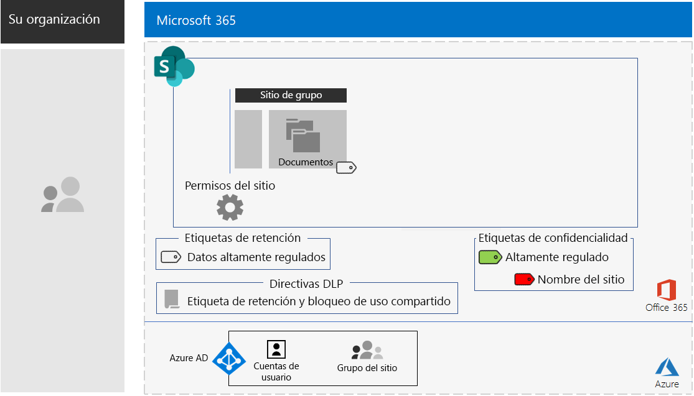
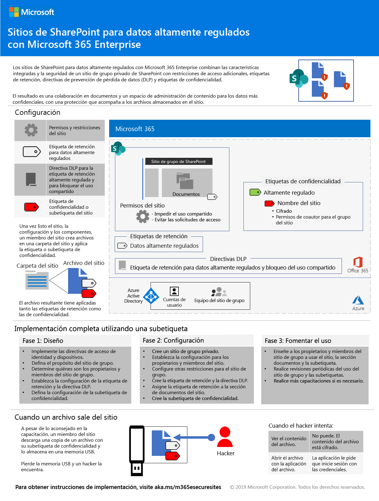
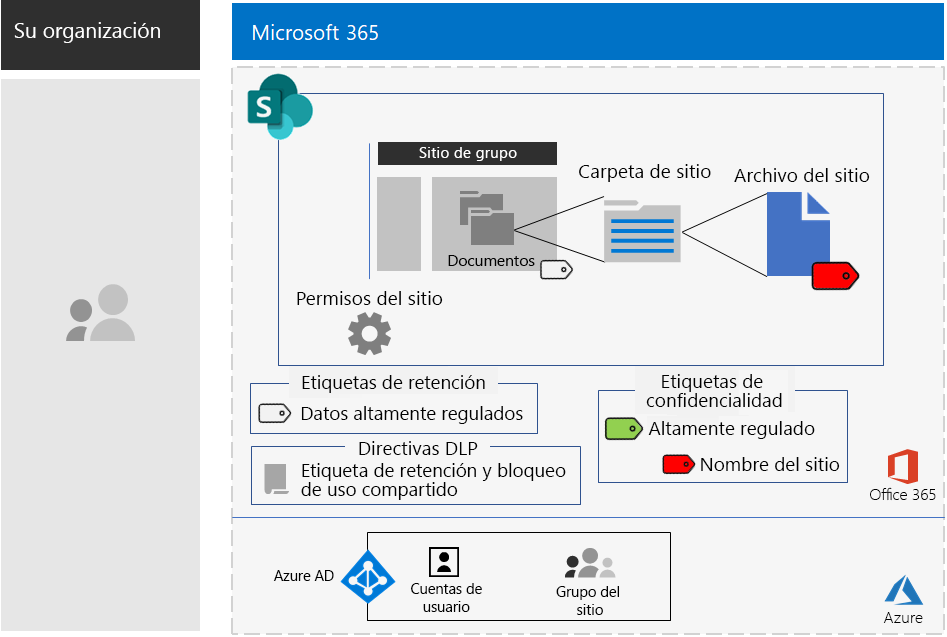

# Sitios de SharePoint para datos altamente reguladosSharePoint sites for highly regulated data

*Este escenario se aplica a las versiones E3 y E5 de Microsoft 365 Enterprise**This scenario applies to both the E3 and E5 versions of Microsoft 365 Enterprise*

Microsoft 365 Enterprise incluye una serie completa de servicios basados en la nube para que pueda crear, almacenar, proteger y administrar los datos altamente regulados almacenados en archivos de. Se incluyen datos que:Microsoft 365 Enterprise includes a full suite of cloud-based services so that you can create, store, secure, and manage your highly regulated data stored in files. This includes data that is:

- Datos sujetos a regulaciones regionales.Subject to regional regulations.
- Los datos más importantes para su organización, como pueden ser secretos comerciales, información de recursos humanos o financiera y estrategias de la organización.The most valuable data for your organization, such as trade secrets, financial or human resources information, and organization strategy.

>[!Note]
> Un escenario similar usando equipos de Microsoft Teams está [aqui](secure-teams-highly-regulated-data-scenario.md).A similar scenario using Microsoft Teams is [here](secure-teams-highly-regulated-data-scenario.md).
>

Un escenario basado en la nube de Microsoft 365 Enterprise que cumpla estas necesidades de negocio requiere que usted:A Microsoft 365 Enterprise cloud-based scenario that meets this business need requires that you:

- Almacenar archivos de (documentos, presentaciones de diapositivas, hojas de cálculo, etc.) en un sitio de grupo de SharePoint.Store files (documents, slide decks, spreadsheets, etc.) in a SharePoint team site.
- Bloquee el sitio para evitar:Lock down the site to prevent:
  - Acceso a los usuarios que no sean miembros del grupo de Office 365 para el sitio.Access to users who are not members of the Office 365 group for the site.
  - Que miembros del sitio concedan acceso a terceros.Members of the site from granting access to others.
  - Que aquellos que no sean miembros del sitio soliciten acceso.Non-members of the site from requesting access to the site.
- Configure una etiqueta de retención de Office 365 para los sitios de SharePoint de forma predeterminada para impedir que los usuarios envíen archivos fuera de la organización.Configure an Office 365 retention label for your SharePoint sites as a default way to block users from sending files outside the organization.
- Cifre la mayoría de los archivos confidenciales del sitio con un método de cifrado que se desplaza con el archivo.Encrypt the most sensitive files of the site with encryption that travels with the file.
- Agregue permisos a los archivos más confidenciales de modo que, incluso si se comparten fuera del sitio, aún se requieran las credenciales válidas de una cuenta de usuario para abrir el archivo.Add permissions to the most sensitive files so that if even if they get shared outside of the site, opening the file still requires the valid credentials of a user account that has permission.

En la tabla siguiente se asignan los requisitos de este escenario a una característica de Microsoft 365 Enterprise.The following table maps the requirements of this scenario to a feature of Microsoft 365 Enterprise.

|||
|:-------|:-----|
| **Requisito****Requirement** | **Característica de Microsoft 365 Enterprise****Microsoft 365 Enterprise feature** |
| Almacenar archivosStore files | Sitios de grupo de SharePointSharePoint team sites |
| Bloquear el sitioLock down the site | Permisos para grupos de Office 365 y para el sitio de grupo de SharePointOffice 365 groups and SharePoint team site permissions |
| Etiquetar los archivos del sitioLabel the files of the site | Etiquetas de retención de Office 365Office 365 retention labels |
| Bloquear a los usuarios cuando envían archivos fuera de la organizaciónBlock users when sending files outside the organization | Directivas de prevención de pérdida de datos (DLP) en Office 365Data Loss Prevention (DLP) policies in Office 365 |
| Cifrar todos los archivos del sitioEncrypt all of the files of the site | Etiquetas o sub-etiquetas de confidencialidad de Office 365Office 365 sensitivity labels or sublabels |
| Añadir permisos a los archivos del sitioAdd permissions to the files of the site | Etiquetas o sub-etiquetas de confidencialidad de Office 365Office 365 sensitivity labels or sublabels |
|||

Aquí tiene un ejemplo de configuración para un sitio de SharePoint seguro.Here is an example configuration for a secure SharePoint site.

Este escenario requiere que ya haya implementado:This scenario requires that you have already deployed:

- La fase de [identidad](identity-infrastructure.md) y los pasos 1 y 2 de la fase de [protección de la información](infoprotect-infrastructure.md) de la infraestructura de base.The [Identity](identity-infrastructure.md) phase and steps 1 and 2 of the [Information protection](infoprotect-infrastructure.md) phase of the foundation infrastructure. 
- [SharePoint](sharepoint-online-onedrive-workload.md).[SharePoint](sharepoint-online-onedrive-workload.md).

Las siguientes fases le guiarán a través del diseño, la configuración y el impulso de la adopción de los sitios altamente regulados de SharePoint.The following phases step you through designing, configuring, and driving adoption for SharePoint sites for highly regulated data.

 Para obtener un resumen de una página de este escenario, vea el [póster Sitios de SharePoint para datos altamente regulados](../media/teams-sharepoint-online-sites-highly-regulated-data/SharePointSitesHighlyRegulatedData.pdf).For a 1-page summary of this scenario, see the [SharePoint sites for highly regulated data poster](../media/teams-sharepoint-online-sites-highly-regulated-data/SharePointSitesHighlyRegulatedData.pdf).

También puede descargar este póster en formato [PDF](https://github.com/MicrosoftDocs/microsoft-365-docs/raw/public/microsoft-365/enterprise/media/teams-sharepoint-online-sites-highly-regulated-data/SharePointSitesHighlyRegulatedData.pdf) o [PowerPoint](https://github.com/MicrosoftDocs/microsoft-365-docs/raw/public/microsoft-365/enterprise/media/teams-sharepoint-online-sites-highly-regulated-data/SharePoint-Sites-Highly-Regulated-Data.pptx) e imprimirlo en tamaño carta, legal o tabloide (11 x 17).You can also download this poster in [PDF](https://github.com/MicrosoftDocs/microsoft-365-docs/raw/public/microsoft-365/enterprise/media/teams-sharepoint-online-sites-highly-regulated-data/SharePointSitesHighlyRegulatedData.pdf) or [PowerPoint](https://github.com/MicrosoftDocs/microsoft-365-docs/raw/public/microsoft-365/enterprise/media/teams-sharepoint-online-sites-highly-regulated-data/SharePoint-Sites-Highly-Regulated-Data.pptx) formats and print it on letter, legal, or tabloid (11 x 17)-sized paper.

## Requisitos previos de acceso a dispositivos e identidadesIdentity and device access prerequisites

Para proteger el acceso a los sitios de SharePoint, asegúrese de que configuró las [directivas de acceso a dispositivos e identidades](identity-access-policies.md) y las [directivas de acceso recomendadas de SharePoint](sharepoint-file-access-policies.md).To protect access to the SharePoint site, ensure that you have configured [identity and device access policies](identity-access-policies.md) and the [recommended SharePoint access policies](sharepoint-file-access-policies.md).

## Fase 1: DiseñoPhase 1: Design

Para crear un sitio de SharePoint para datos altamente regulados, en primer lugar debe identificar su propósito.To create a SharePoint site for highly regulated data, you must first identify its purpose. Por ejemplo, el departamento de investigación y desarrollo de una compañía de fabricación necesita un sitio de SharePoint para almacenar las especificaciones de diseño actuales para los productos existentes y un lugar para colaborar en nuevos productos.For example, the research and development department of a manufacturing organization needs a SharePoint site to store current design specifications for existing products and a place to collaborate on new products. Solo podrán acceder al sitio los miembros del Departamento de Investigación y Desarrollo y los ejecutivos seleccionados.Only members of the Research & Development department and selected executives will be allowed to access the site.

Ese propósito impulsará la determinación de los elementos de configuración esenciales, como:That purpose will drive the determination of essential configuration items such as:

- La etiqueta de retención de Office 365 para asignar a la parte de Documentos del sitio y las directivas DLP para la etiquetaThe Office 365 retention label to assign to the Documents portion of the site and DLP policies for the label
- La configuración de una sub-etiqueta de confidencialidad de Office 365 que los usuarios aplican a los archivos altamente confidenciales almacenados en el sitioThe settings of an Office 365 sensitivity sublabel that users apply to highly sensitive files stored in the site

Una vez determinados, use estos ajustes para configurar el sitio en la fase 2.Once determined, you use these settings to configure the site in Phase 2. 

### Paso 1 Etiquetas de retención de Office 365 y directivas DLPStep 1 Office 365 retention labels and DLP policies

Cuando se aplican a la parte de Documentos de un sitio de grupo de SharePoint, las etiquetas de retención de Office 365 proporcionan un método predeterminado de clasificación para todos los archivos almacenados en el sitio.When applied to the Documents portion of a SharePoint team site, Office 365 retention labels provide a default method of classifying all files stored on the site.
 
En los sitios de SharePoint para datos altamente regulados, debe determinar qué etiqueta de retención de Office 365 usará.For SharePoint sites for highly regulated data, you need to determine which Office 365 retention label to use.

Para conocer las consideraciones de diseño de las etiquetas de Office 365, consulte [Etiquetas y clasificación de Office 365](https://docs.microsoft.com/office365/securitycompliance/secure-sharepoint-online-sites-and-files#office-365-retention-labels).For the design considerations of Office 365 labels, see [Office 365 classification and labels](https://docs.microsoft.com/office365/securitycompliance/secure-sharepoint-online-sites-and-files#office-365-retention-labels).

Use directivas DLP para proteger la información confidencial y evitar su divulgación accidental o intencionada. Para obtener más información, consulte esta [introducción](https://docs.microsoft.com/office365/securitycompliance/data-loss-prevention-policies).To protect sensitive information and prevent its accidental or intentional disclosure, you use DLP policies. For more information, see this [overview](https://docs.microsoft.com/office365/securitycompliance/data-loss-prevention-policies).

En los sitios de SharePoint, debe configurar una directiva DLP para la etiqueta de retención de Office 365 asignada al sitio para bloquear a los usuarios cuando intenten compartir archivos con usuarios externos.For SharePoint sites, you must configure a DLP policy for the Office 365 retention label assigned to the site to block users when they attempt to share files with external users. 

### Paso 2: Su sub-etiqueta de confidencialidad de Office 365Step 2: Your Office 365 sensitivity sublabel

Para proporcionar cifrado y un conjunto de permisos a los archivos más confidenciales, los usuarios deben aplicar una etiqueta o subetiqueta de confidencialidad de Office 365.To provide encryption and a set of permissions to your most sensitive files, users must apply an Office 365 sensitivity label or sublabel. Crear una sub-etiqueta bajo una etiqueta existente.A sublabel exists under an existing label. 

Use una etiqueta de confidencialidad cuando necesite, un número reducido de etiquetas tanto para los equipos de uso global como para los individuales privados.Use a sensitivity label when you need is a small number of labels for both global use and individual private teams. Utilice una subetiqueta de confidencialidad cuando tenga un gran número de etiquetas o cuando desee organizar las etiquetas para sitios seguros bajo su etiqueta altamente regulada.Use a sensitivity sublabel when you have a large number of labels or want to organize labels for secure sites the under your highly regulated label. 

La configuración de la etiqueta o subetiqueta aplicada se desplaza con el archivo.The settings of the applied label or sublabel travel with the file. Incluso si se filtra fuera del sitio, solo las cuentas de usuario autenticadas que tengan permisos podrán abrir el archivo.Even if it is leaked outside the site, only authenticated user accounts that have permissions can open it.

### Resultados de diseñoDesign results

Ha decidido lo siguiente:You have determined the following:

- La etiqueta de retención adecuada de Office 365 y la directiva DLP que tiene asociadaThe appropriate Office 365 retention label and the DLP policy that is associated with the label
- La configuración de la sub-etiqueta de confidencialidad de Office 365 que incluye el cifrado y los permisosThe settings of the Office 365 sensitivity sublabel that include encryption and permissions

## Fase 2: ConfigurarPhase 2: Configure

En esta fase, debe tomar la configuración determinada en la Fase 1 e implementarla para crear un sitio de SharePoint para datos altamente regulados.In this phase, you take the settings determined in Phase 1 and implement them to create a SharePoint site for highly regulated data.

### Paso 1: Crear un sitio de grupo de SharePoint privado con propietarios y miembros del grupo de Office 365 correspondienteStep 1: Create a private SharePoint team site with owners and members of the corresponding Office 365 group

Siga [estas instrucciones]( https://support.office.com/article/create-a-site-in-sharepoint-online-4d1e11bf-8ddc-499d-b889-2b48d10b1ce8) para crear un sitio de grupo de SharePoint privado.Follow [these instructions]( https://support.office.com/article/create-a-site-in-sharepoint-online-4d1e11bf-8ddc-499d-b889-2b48d10b1ce8) to create a private SharePoint team site.

### Paso 2: Configurar ajustes de permisos adicionales para el sitio de grupo de SharePointStep 2: Configure additional permissions settings for the SharePoint team site

Desde el sitio de SharePoint, configure estos ajustes de permisos.From the SharePoint site, configure these permission settings.

1. En la barra de herramientas, haga clic en el icono de configuración y, luego, en **Permisos del sitio**.In the tool bar, click the settings icon, and then click **Site permissions**.
2. En el panel **Permisos del sitio**, en **Configuración de uso compartido**, haga clic en **Cambiar configuración de uso compartido**.In the **Site permissions** pane, under **Sharing Settings**, click **Change sharing settings**.
3. En **Permisos de uso compartido**, seleccione **Solo los propietarios del sitio pueden compartir archivos, carpetas y el sitio**.Under **Sharing permissions**, choose **Only site owners can share files, folders, and the site**.
4. Desactive **Permitir solicitudes de acceso** y, después, haga clic en **Guardar**.Turn off **Allow access requests**, and then click **Save**.

Con estas ajustes de configuración, se deshabilita la posibilidad de que los miembros del grupo de sitio compartan el sitio con otros miembros o que los usuarios que no son miembros soliciten el acceso al sitio.With these settings, the ability for site group members to share the site with other members or for non-members to request access to the site is disabled.

### Paso 3: Configurar el sitio para una etiqueta de retención de Office 365Step 3: Configure the site for an Office 365 retention label

Siga las instrucciones de [Proteger archivos de SharePoint con DLP y etiquetas de Office 365](https://docs.microsoft.com/office365/enterprise/protect-sharepoint-online-files-with-office-365-labels-and-dlp) para:Use the instructions in [Protect SharePoint files with Office 365 labels and DLP](https://docs.microsoft.com/office365/enterprise/protect-sharepoint-online-files-with-office-365-labels-and-dlp) to:

1. Crear y publicar una etiqueta de retención para datos altamente regulados (si es necesario).Create and publish a retention label for highly regulated data (if needed).
2. Configurar el sitio para la etiqueta de retención que creó en el paso 1.Configure the site for the retention label created in step 1.
3. Crear una directiva DLP para datos altamente regulados que usen la etiqueta de retención creada en el paso 2 y bloquee el envío de archivos fuera de la organización por parte de los usuarios.Create a DLP policy for highly regulated data that uses the retention label created in step 2 and blocks users from sending files outside the organization

#### Paso 4: Crear una sub-etiqueta de confidencialidad de Office 365 para el sitioStep 4: Create an Office 365 sensitivity sublabel for the site

A diferencia de una etiqueta de confidencialidad para datos altamente regulados que cualquier persona puede aplicar a cualquier archivo, un sitio seguro necesita su propia sub-etiqueta para que los archivos con la sub-etiqueta asignada:Unlike a sensitivity label for highly regulated data that anyone can apply to any file, a secure site needs its own sublabel so that files with the sublabel assigned:

- Se cifren y el cifrado se desplace con el archivo.Are encrypted and the encryption travels with the file.
- Contengan permisos personalizados para que solo los miembros del grupo de sitio puedan abrirlo.Contain custom permissions so that only members of the site group can open it.

Para lograr este nivel de seguridad adicional para los archivos almacenados en el sitio, debe configurar una nueva etiqueta de confidencialidad o una subetiqueta de la etiqueta general para archivos altamente regulados.To accomplish this additional level of security for files stored in the site, you must configure a new sensitivity label or a sublabel of the general label for highly regulated files. Solo los miembros del grupo del sitio la verán en la lista de sub-etiquetas para la etiqueta altamente regulada.Only group members for the site will see it in the list of sublabels for the highly regulated label.

Siga las instrucciones de [aquí](https://docs.microsoft.com/microsoft-365/compliance/encryption-sensitivity-labels) para configurar una etiqueta o sub-etiqueta de la etiqueta que está usando para archivos altamente regulados con los siguientes ajustes:Use the instructions [here](https://docs.microsoft.com/microsoft-365/compliance/encryption-sensitivity-labels) to configure a label or a sublabel of the label you are using for highly regulated files with the following settings:

- El nombre de la etiqueta o sub-etiqueta contiene el nombre del sitio para facilitar la asociación al asignar la etiqueta o subetiqueta a un archivo.The name of the label or sublabel contains the name of the site for easy association when assigning the label or sublabel to a file.
- El cifrado está habilitado.Encryption is enabled.
- El grupo del sitio tiene permisos de Coautor.The site group has Co-Author permissions.

### Resultados de la configuraciónConfiguration results

Ha configurado lo siguiente:You have configured the following:

- Configuraciones de permisos más restrictivas en el sitio de SharePointMore restrictive permission settings on the SharePoint site
- Una etiqueta de retención de Office 365 asignada a la parte de Documentos del sitio de SharePointAn Office 365 retention label assigned to the Documents portion of the SharePoint site
- Una directiva DLP para la etiqueta de retención de Office 365A DLP policy for the Office 365 retention label
- Una etiqueta o sub-etiqueta de confidencialidad de Office 365 que los usuarios pueden aplicar a los archivos más confidenciales almacenados en el sitio, el cual cifra el archivo y solo permite el acceso de coautoría a los miembros del grupo de sitio del equipoAn Office 365 sensitivity label or sublabel that users can apply to the most sensitive files stored in the site, which encrypts the file and only allows Co-Author access for members of the team site group 

Aquí está la configuración resultante que utiliza una sub-etiqueta de la etiqueta altamente regulada.Here is the resulting configuration that uses a sublabel of the Highly regulated label.

Este es un ejemplo de un usuario que ha aplicado la sub-etiqueta a un archivo almacenado en el sitio.Here is an example of a user that has applied the sublabel to a file stored in the site.

## Fase 3: Adopción por parte de los usuariosPhase 3: Drive user adoption

Un sitio de SharePoint para datos altamente regulados solo puede proteger los datos si se usan de forma consistente para almacenar y acceder a archivos confidenciales.A SharePoint site for highly regulated data can only protect that data if it is consistently used for storage and access of sensitive files. Esta es la fase más difícil, ya que depende de que los usuarios cambien sus hábitos y preferencias.This is the hardest phase because it relies on users changing their habits and preferences. 

Por ejemplo, los empleados acostumbrados a guardar archivos confidenciales en unidades USB o en soluciones de almacenamiento personal basadas en la nube, ahora tendrán que almacenarlos de forma exclusiva en el sitio de SharePoint para datos altamente regulados.For example, employees that are used to storing sensitive files on USB drives or on personal cloud-based storage solutions will now have to store them exclusively in a SharePoint site for highly regulated data.

### Paso 1: formar a los usuariosStep 1: Train your users

Tras completar su configuración, tome un conjunto de usuarios que sean miembros del sitio:After completing your configuration, train the set of users who are members of the site:

- La importancia de usar el nuevo sitio para proteger archivos valiosos y las consecuencias de la filtración de datos altamente regulados, como las repercusiones legales, las multas, el ramsonware o la pérdida de ventaja frente a la competencia.On the importance of using the new site to protect valuable files and the consequences of a highly regulated data leak, such as legal ramifications, regulatory fines, ransomware, or loss of competitive advantage.
- Cómo obtener acceso al sitio y a sus recursos.How to access the site and its files.
- Cómo crear archivos nuevos en el sitio o cargar archivos nuevos almacenados de forma local.How to create new files on the site and upload new files stored locally.
- Cómo la directiva DLP les impide compartir archivos de forma externa.How the DLP policy blocks them from sharing files externally.
- Cómo etiquetar los archivos más confidenciales con la etiqueta o sub-etiqueta del sitio.How to label the most sensitive files with the label or sublabel for the site.
- Cómo la etiqueta o sub-etiqueta protege un archivo incluso cuando se filtra el sitio.How the label or sublabel protects a file even when it is leaked off the site.

Esta formación debe incluir ejercicios prácticos para que los usuarios puedan experimentar con estas operaciones y sus resultados.This training should include hands-on exercises so that the users can experience these operations and their results.

### Paso 2: Realizar revisiones periódicas de uso y archivosStep 2: Conduct periodic reviews of usage and files

En las semanas posteriores a la formación, el administrador del servicio de SharePoint para el sitio de SharePoint puede:In the weeks after training, the SharePoint administrator for the SharePoint site can:

- Analizar el uso del sitio y compararlo con las expectativas de uso.Analyze usage for the site and compare it with usage expectations.
- Comprobar que los archivos más confidenciales se han etiquetado de forma correcta con la etiqueta o sub-etiqueta de confidencialidad.Verify that highly sensitive files have been properly labeled with the sensitivity label or sublabel.

  Puede ver qué archivos tienen una etiqueta asignada viendo una carpeta en SharePoint y añadiendo la columna **Confidencialidad** a través de la opción **Mostrar/ocultar columnas** que está en **Añadir columna**.You can see which files have a label assigned by viewing a folder in SharePoint and adding the **Sensitivity** column through the **Show/hide columns** option of **Add column**.

Volver a dar formación a los usuarios que lo necesiten.Retrain your users as needed.

### Resultados de la adopción de usuariosUser adoption results

Los archivos altamente regulados se almacenan exclusivamente en sitios de SharePoint para datos altamente regulados y los archivos más confidenciales tienen la etiqueta o sub-etiqueta de confidencialidad para el sitio aplicado.Highly regulated files are stored exclusively on SharePoint sites for highly regulated data and the most sensitive files have the sensitivity label or sublabel for the site applied.

## Cómo la empresa Contoso usó un sitio de SharePoint para datos altamente reguladosHow the Contoso Corporation used a SharePoint site for highly regulated data

Contoso Corporation es un conglomerado industrial a nivel mundial que es ficticio y representativo a la vez.The Contoso Corporation is a fictional but representative global manufacturing conglomerate. Vea cómo Contoso diseñó, configuró e impulsó la adopción de un [sitio de SharePoint Online seguro](contoso-sharepoint-online-site-for-highly-confidential-assets.md) para sus equipos de investigación en París, Moscú, Nueva York, Beijing y Bengaluru (Bangalore).See how Contoso designed, configured, and then drove the adoption of a [secure SharePoint site](contoso-sharepoint-online-site-for-highly-confidential-assets.md) for their research teams in Paris, Moscow, New York, Beijing, and Bangalore. 

## Vea tambiénSee also

[Teams para datos altamente reguladosTeams for highly regulated data](secure-teams-highly-regulated-data-scenario.md)

[Cargas de trabajo y escenarios de Microsoft 365 EnterpriseMicrosoft 365 Enterprise workloads and scenarios](deploy-workloads.md)

[Biblioteca de productividad de Microsoft 365](https://aka.ms/productivitylibrary)(https://aka.ms/productivitylibrary)[Microsoft 365 Productivity Library](https://aka.ms/productivitylibrary) (https://aka.ms/productivitylibrary)

[Guía de implementaciónDeployment guide](deploy-microsoft-365-enterprise.md)
