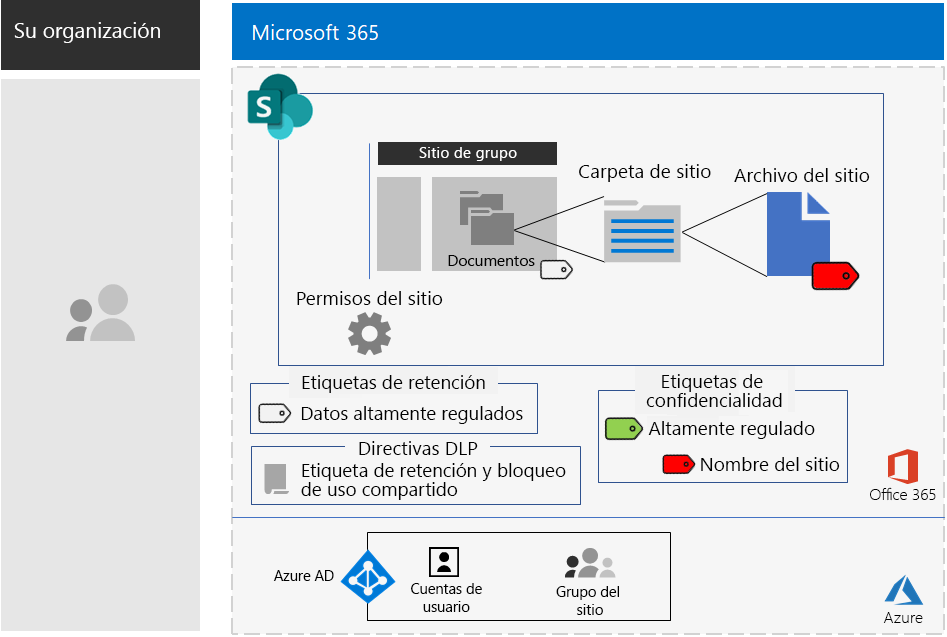

# Sitios de SharePoint para datos altamente regulados

*Este escenario se aplica a las versiones E3 y E5 de Microsoft 365 Enterprise*

Microsoft 365 Enterprise incluye una serie completa de servicios basados en la nube para que pueda crear, almacenar, proteger y administrar los datos altamente regulados almacenados en archivos de. Se incluyen datos que:

- Datos sujetos a regulaciones regionales.
- Los datos más importantes para su organización, como pueden ser secretos comerciales, información de recursos humanos o financiera y estrategias de la organización.

>[!Note]
> Un escenario parecido al uso de Microsoft Teams está en desarrollo.
>

Un escenario basado en la nube de Microsoft 365 Enterprise que cumpla estas necesidades de negocio requiere que usted:

- Almacenar archivos de (documentos, presentaciones de diapositivas, hojas de cálculo, etc.) en un sitio de grupo de SharePoint.
- Bloquee el sitio para evitar:
  - Acceso a los usuarios que no sean miembros del grupo de Office 365 para el sitio.
  - Que miembros del sitio concedan acceso a terceros.
  - Que aquellos que no sean miembros del sitio soliciten acceso.
- Configure una etiqueta de retención de Office 365 para los sitios de SharePoint de forma predeterminada para impedir que los usuarios envíen archivos fuera de la organización.
- Cifre la mayoría de los archivos confidenciales del sitio con un método de cifrado que se desplaza con el archivo.
- Agregue permisos a los archivos más confidenciales de modo que, incluso si se comparten fuera del sitio, aún se requieran las credenciales válidas de una cuenta de usuario para abrir el archivo.

En la tabla siguiente se asignan los requisitos de este escenario a una característica de Microsoft 365 Enterprise.

|||
|:-------|:-----|
| **Requisito** | **Característica de Microsoft 365 Enterprise** |
| Almacenar archivos | Sitios de grupo de SharePoint |
| Bloquear el sitio | Permisos de sitios de grupo de SharePoint y grupos de Azure Active Directory (Azure AD) |
| Etiquetar los archivos del sitio | Etiquetas de retención de Office 365 |
| Bloquear a los usuarios cuando envían archivos fuera de la organización | Directivas de prevención de pérdida de datos (DLP) en Office 365 |
| Cifrar todos los archivos del sitio | Sub-etiquetas de confidencialidad de Office 365 |
| Añadir permisos a los archivos del sitio | Sub-etiquetas de confidencialidad de Office 365 |
|||

Esta es la configuración para un sitio seguro de SharePoint.

Este escenario requiere que ya haya implementado:

- La fase de [identidad](identity-infrastructure.md) y los pasos 1 y 2 de la fase de [protección de la información](infoprotect-infrastructure.md) de la infraestructura de base. 
- [SharePoint](sharepoint-online-onedrive-workload.md).

Las siguientes fases le guiarán a través del diseño, la configuración y el impulso de la adopción de los sitios altamente regulados de SharePoint.

Para ver cómo Contoso Corporation, una organización multinacional ficticia pero representativa, diseñó un sitio de SharePoint para los equipos de investigación, vea esta [configuración de ejemplo](contoso-sharepoint-online-site-for-highly-confidential-assets.md).

## Requisitos previos de acceso a dispositivos e identidades

Para proteger el acceso a los sitios de SharePoint, asegúrese de que configuró las [directivas de acceso a dispositivos e identidades](identity-access-policies.md) y las [directivas de acceso recomendadas de SharePoint](sharepoint-file-access-policies.md).

## Fase 1: Diseño

Para crear un sitio de SharePoint para datos altamente regulados, en primer lugar debe identificar su propósito. Por ejemplo, el departamento de investigación y desarrollo de una compañía de fabricación necesita un sitio de SharePoint para almacenar las especificaciones de diseño actuales para los productos existentes y un lugar para colaborar en nuevos productos. Solo podrán acceder al sitio los miembros del Departamento de Investigación y Desarrollo y los ejecutivos seleccionados.

Ese propósito impulsará la determinación de los elementos de configuración esenciales, como:

- La etiqueta de retención de Office 365 para asignar a la parte de Documentos del sitio y las directivas DLP para la etiqueta
- La configuración de una sub-etiqueta de confidencialidad de Office 365 que los usuarios aplican a los archivos altamente confidenciales almacenados en el sitio

Una vez determinados, use estos ajustes para configurar el sitio en la fase 2. 

### Paso 1 Etiquetas de retención de Office 365 y directivas DLP

Cuando se aplican a la parte de Documentos de un sitio de grupo de SharePoint, las etiquetas de retención de Office 365 proporcionan un método predeterminado de clasificación para todos los archivos almacenados en el sitio.
 
En los sitios de SharePoint para datos altamente regulados, debe determinar qué etiqueta de retención de Office 365 usará.

Para conocer las consideraciones de diseño de las etiquetas de Office 365, consulte [Etiquetas y clasificación de Office 365](https://docs.microsoft.com/office365/securitycompliance/secure-sharepoint-online-sites-and-files#office-365-retention-labels).

Use directivas DLP para proteger la información confidencial y evitar su divulgación accidental o intencionada. Para obtener más información, consulte esta [introducción](https://docs.microsoft.com/office365/securitycompliance/data-loss-prevention-policies).

En los sitios de SharePoint, debe configurar una directiva DLP para la etiqueta de retención de Office 365 asignada al sitio para bloquear a los usuarios cuando intenten compartir archivos con usuarios externos. 

### Paso 2: Su sub-etiqueta de confidencialidad de Office 365

Para proporcionar el cifrado y un conjunto de permisos para los archivos más confidenciales, los usuarios deben aplicar una sub-etiqueta de confidencialidad de Office 365.

Crear una sub-etiqueta bajo una etiqueta existente. Por ejemplo, puede crear la sub-etiqueta Investigación y Desarrollo en la etiqueta Altamente Regulado. Para los sitios de SharePoint para datos altamente regulados, configure los permisos para que solo los miembros del sitio puedan abrir y cambiar el archivo al que está asociada la etiqueta.

La configuración de la sub-etiqueta aplicada se desplaza con el archivo. Incluso si se filtra fuera del sitio, solo las cuentas de usuario autenticadas que tengan permisos podrán abrir el archivo.

### Resultados de diseño

Ha decidido lo siguiente:

- La etiqueta de retención adecuada de Office 365 y la directiva DLP que tiene asociada
- La configuración de la sub-etiqueta de confidencialidad de Office 365 que incluye el cifrado y los permisos

## Fase 2: Configurar

En esta fase, debe tomar la configuración determinada en la Fase 1 e implementarla para crear un sitio de SharePoint para datos altamente regulados.

### Paso 1: Crear un sitio de grupo de SharePoint privado con propietarios y miembros del grupo de Office 365 correspondiente

Siga [estas instrucciones]( https://support.office.com/article/create-a-site-in-sharepoint-online-4d1e11bf-8ddc-499d-b889-2b48d10b1ce8) para crear un sitio de grupo de SharePoint privado.

### Paso 2: Configurar ajustes de permisos adicionales para el sitio de grupo de SharePoint

Desde el sitio de SharePoint, configure estos ajustes de permisos.

1.  En la barra de herramientas, haga clic en el icono de configuración y, luego, en **Permisos del sitio**.
2.  En el panel **Permisos del sitio**, haga clic en **Advanced permissions settings** (Configuración de permisos avanzada).
3.  En la nueva pestaña **Permisos** del explorador, haga clic en **Configuración de solicitud de acceso**.
4.  En el cuadro de diálogo **Configuración de solicitud de acceso**, desactive **Permitir que los miembros compartan el sitio y archivos y carpetas individuales** y **Permitir solicitudes de acceso** (de modo que las tres casillas estén desactivadas) y después, haga clic en **Aceptar**.

Con estas ajustes de configuración, se deshabilita la posibilidad de que los miembros del grupo de sitio compartan el sitio con otros miembros o que los usuarios que no son miembros soliciten el acceso al sitio.

### Paso 3: Configurar el sitio para una etiqueta de retención de Office 365

Siga las instrucciones de [Proteger archivos de SharePoint con DLP y etiquetas de Office 365](https://docs.microsoft.com/office365/enterprise/protect-sharepoint-online-files-with-office-365-labels-and-dlp) para:

1. Crear y publicar una etiqueta de retención para datos altamente regulados (si es necesario).
2. Configurar el sitio para la etiqueta de retención que creó en el paso 1.
3. Crear una directiva DLP para datos altamente regulados que usen la etiqueta de retención creada en el paso 2 y bloquee el envío de archivos fuera de la organización por parte de los usuarios.

#### Paso 4: Crear una sub-etiqueta de confidencialidad de Office 365 para el sitio

A diferencia de una etiqueta de confidencialidad para datos altamente regulados que cualquier persona puede aplicar a cualquier archivo, un sitio seguro necesita su propia sub-etiqueta para que los archivos con la sub-etiqueta asignada:

- Se cifren y el cifrado se desplace con el archivo.
-   Contengan permisos personalizados para que solo los miembros del grupo de sitio puedan abrirlo.

Para lograr este nivel adicional de seguridad para los archivos almacenados en el sitio, debe configurar una nueva etiqueta de confidencialidad que sea una sub-etiqueta de la etiqueta general para archivos altamente regulados. Solo los miembros del grupo del sitio la verán en la lista de sub-etiquetas para la etiqueta altamente regulada.

Siga las instrucciones [aquí](https://docs.microsoft.com/microsoft-365/compliance/encryption-sensitivity-labels) para configurar una sub-etiqueta de la etiqueta que está usando para archivos altamente regulados con los siguientes ajustes:

- El nombre de la sub-etiqueta contiene el nombre del sitio para su fácil asociación cuando se asigna la sub-etiqueta a un archivo.
- El cifrado está habilitado.
- El grupo del sitio tiene permisos de Coautor.

### Resultados de la configuración

Ha configurado lo siguiente:

- Configuraciones de permisos más restrictivas en el sitio de SharePoint
- Una etiqueta de retención de Office 365 asignada a la parte de Documentos del sitio de SharePoint
- Una directiva DLP para la etiqueta de retención de Office 365
- Una sub-etiqueta de confidencialidad de Office 365 que los usuarios pueden aplicar en los archivos más confidenciales almacenados en el sitio que cifra el archivo y solo permite el acceso de Coautor a los miembros del equipo de sitio de grupo. 

Esta es la configuración resultante.

Este es un ejemplo de un usuario que ha aplicado la sub-etiqueta de confidencialidad a un archivo almacenado en el sitio.

## Fase 3: Adopción por parte de los usuarios

Un sitio de SharePoint para datos altamente regulados solo puede proteger los datos si se usan de forma consistente para almacenar y acceder a archivos confidenciales. Esta es la fase más difícil, ya que depende de que los usuarios cambien sus hábitos y preferencias. 

Por ejemplo, los empleados acostumbrados a guardar archivos confidenciales en unidades USB o en soluciones de almacenamiento personal basadas en la nube, ahora tendrán que almacenarlos de forma exclusiva en el sitio de SharePoint para datos altamente regulados.

### Paso 1: formar a los usuarios

Tras completar su configuración, tome un conjunto de usuarios que pertenezcan a los grupos de acceso del sitio y fórmelos sobre los siguiente:

- La importancia de usar el nuevo sitio para proteger archivos valiosos y las consecuencias de la filtración de datos altamente regulados, como las repercusiones legales, las multas, el ramsonware o la pérdida de ventaja frente a la competencia.
- Cómo obtener acceso al sitio y a sus recursos.
- Cómo crear archivos nuevos en el sitio o cargar archivos nuevos almacenados de forma local.
- Cómo la directiva DLP les impide compartir archivos de forma externa.
- Cómo etiquetar los archivos más confidenciales con la sub-etiqueta del sitio.
- Cómo la sub-etiqueta protege un archivo incluso cuando se filtra el sitio.

Esta formación debe incluir ejercicios prácticos para que los usuarios puedan experimentar con estas operaciones y sus resultados.

### Paso 2: Realizar revisiones periódicas de uso y archivos

En las semanas posteriores a la formación, el administrador del servicio de SharePoint para el sitio de SharePoint puede:

- Analizar el uso del sitio y compararlo con las expectativas de uso.
- Comprobar que los archivos más confidenciales se han etiquetado de forma correcta con la sub-etiqueta de confidencialidad.

Volver a dar formación a los usuarios que lo necesiten.

### Resultados de la adopción de usuarios

Los archivos altamente regulados se almacenan exclusivamente en sitios de SharePoint para datos altamente regulados y los archivos más confidenciales tienen la sub-etiqueta de sensibilidad para el sitio aplicada.

## Cómo Contoso Corporation implementó Microsoft 365 Enterprise

Contoso Corporation es un conglomerado industrial a nivel mundial ficticio pero representativo, con sede central en París, Francia. Vea cómo Contoso diseñó, configuró e impulsó la adopción de un [sitio de SharePoint Online seguro](contoso-sharepoint-online-site-for-highly-confidential-assets.md) para sus equipos de investigación en París, Moscú, Nueva York, Beijing y Bengaluru (Bangalore). 

## Vea también

[Guía de implementación](deploy-microsoft-365-enterprise.md)

[Guías del laboratorio de pruebas](m365-enterprise-test-lab-guides.md)

