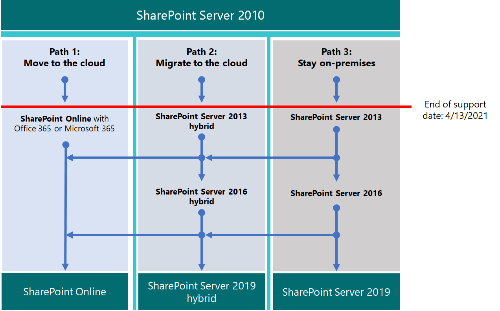

# Actualización desde SharePoint 2010

*Este artículo afecta tanto a Office 365 Enterprise como a Microsoft 365 Enterprise*

Microsoft SharePoint 2010 y SharePoint Server 2010 alcanzarán el final del soporte técnico el **13 de abril de 2021**. En este artículo se proporcionan recursos que le ayudarán a migrar los datos existentes de SharePoint Server 2010 a SharePoint Online en Microsoft 365 o a actualizar el entorno local de SharePoint Server 2010.

## ¿Qué es el *final del soporte técnico*?

La mayoría de los productos de Microsoft tienen un ciclo de vida de soporte técnico, durante el cual obtienen nuevas características, correcciones de errores, correcciones de seguridad, etc. Después de la fecha de finalización del soporte técnico, el producto no deja de funcionar, pero Microsoft ya no ofrece:

- Soporte técnico para los problemas que pueden surgir.

- Correcciones de errores para problemas que pueden afectar a la estabilidad y la usabilidad del servidor.

- Revisiones de seguridad para las vulnerabilidades que pueden hacer que el servidor sea vulnerable a las infracciones de seguridad.

- Las actualizaciones de zona horaria.

Esto significa que no habrá más actualizaciones, parches ni correcciones para el producto (incluidas las revisiones o correcciones de seguridad). El soporte técnico de Microsoft se desplazará completamente a las versiones más recientes.

Como fin de soporte para enfoques de SharePoint Server 2010, elimine los datos que ya no necesita antes de actualizar el producto y migrar los datos importantes.

> [!NOTE]
> Un ciclo de vida de software suele durar diez años a partir de la versión inicial. Los [proveedores de soluciones de Microsoft](https://go.microsoft.com/fwlink/?linkid=841249) pueden ayudarle a actualizar a la siguiente versión del software o a migrar a Microsoft 365 Migration (o a ambos). Asegúrese de que tiene en cuenta las fechas de fin de soporte para las tecnologías subyacentes fundamentales, especialmente para la versión de Microsoft SQL Server que está usando con SharePoint. Para obtener más información, consulte la [Directiva de ciclo de vida fijo](https://support.microsoft.com/help/14085).

## Planear con antelación

Compruebe las fechas en las que finaliza el soporte técnico del [sitio de ciclo de vida del producto](https://support.microsoft.com/lifecycle/search?alpha=SharePoint%20Server%202010). Planee las actualizaciones o migraciones teniendo en cuenta estas fechas. Recuerde que el producto *no dejará de funcionar* en la fecha indicada. Pero como la instalación ya no se revisará después de esa fecha, querrá planear una transición sin problemas a la siguiente versión del producto.

Esta matriz ayuda a trazar un curso entre las opciones de migración:

|Fin del producto de soporte|Bueno |Procedimientos|
|---|---|---|
|SharePoint Server 2010|SharePoint Server 2013 (local)|SharePoint Online|
||SharePoint Server 2013 híbrido con SharePoint Online|SharePoint Server 2016 (local)|
|||Búsqueda híbrida en la nube de SharePoint|

Si elige una opción en el extremo inferior de la escala (bueno), deberá comenzar a planear otra actualización justo después de la migración desde SharePoint Server 2010.

Estas son las tres rutas que puede realizar para evitar la finalización de la compatibilidad con SharePoint Server 2010.

> [!NOTE]
> La finalización del soporte técnico para SharePoint Server 2010 y SharePoint Foundation 2010 está programada para el 13 de abril de 2021. Sin embargo, asegúrese de comprobar el [sitio de ciclo de vida del producto](https://support.microsoft.com/lifecycle) en busca de las fechas más actuales.

## ¿Cuál es el siguiente paso?

SharePoint Server 2013 y SharePoint Foundation 2013 se pueden instalar localmente en sus propios servidores. O bien, puede usar SharePoint Online, que es un servicio en línea que forma parte de Microsoft 365. Puede elegir entre:

- Migrar a SharePoint Online.

- Actualizar SharePoint Server o SharePoint Foundation local.

- Realice las dos acciones anteriores.

- Implementar una solución [híbrida de SharePoint](https://docs.microsoft.com/sharepoint/hybrid/hybrid) .

Tenga en cuenta los costos ocultos de mantener una granja de servidores, incluido el mantenimiento o la migración de personalizaciones y la actualización de hardware. Si ha contabilizado estos factores, será más fácil realizar la actualización local. Si ejecuta la granja de servidores de SharePoint heredados sin una gran personalización, puede beneficiarse de una migración planeada a SharePoint Online. Para un entorno de SharePoint Server local, también puede considerar la posibilidad de mover algunos datos en SharePoint Online para reducir la sobrecarga de administración de hardware.

> [!NOTE]
> Los administradores de SharePoint pueden crear una suscripción a Microsoft 365, configurar nuevos sitios de SharePoint Online y, a continuación, quitar SharePoint Server 2010 sin problemas, tomando solo los documentos fundamentales en los sitios nuevos. A continuación, se pueden purgar los datos restantes del sitio de SharePoint Server 2010 en archivos locales.

|SharePoint Online|SharePoint Server local|
|---|---|
|Costo elevado en el tiempo (planificación/ejecución/comprobación)|Costo elevado en el tiempo (planificación/ejecución/comprobación)|
|Menor coste de fondos (no hay compras de hardware)|Costo mayor en fondos (adquisiciones de hardware)|
|Costo de tiempo único en la migración|Costo de tiempo único repetido por migración futura|
|Bajo costo total de propiedad/mantenimiento|Costo total de propiedad/mantenimiento elevado|

Un cambio único a Microsoft 365 tendrá un costo mayor cuando Organice los datos y decida qué debe llevar a la nube y qué debe dejar atrás. Pero después de migrar los datos, las actualizaciones futuras serán automáticas, ya que ya no necesitará administrar las actualizaciones de hardware y software. Y el tiempo de actividad de la granja de servidores será respaldado por un [contrato de nivel de servicio (SLA) de Microsoft](https://go.microsoft.com/fwlink/?linkid=843153).

### Migrar a SharePoint Online

Asegúrese de que SharePoint Online ofrece todas las características que necesita. Consulte [Descripción del servicio de SharePoint](https://docs.microsoft.com/office365/servicedescriptions/sharepoint-online-service-description/sharepoint-online-service-description).

No puede migrar directamente de SharePoint Server 2010 (o SharePoint Foundation 2010) a SharePoint Online. Gran parte del trabajo de migración es manual. Pero esta fase le ofrece la posibilidad de eliminar los datos y los sitios que ya no son necesarios antes del traslado. Puede archivar otros datos en el almacenamiento. 

Recuerde que SharePoint Server 2010 y SharePoint Foundation 2010 no dejarán de funcionar al final del soporte técnico. Por lo tanto, los administradores pueden tener un período en el que SharePoint aún se está ejecutando si los clientes olvidan mover algunos de sus datos.

Si actualiza a SharePoint Server 2013 o SharePoint Server 2016 y decide colocar datos en SharePoint Online, puede usar la [API de migración de SharePoint](https://support.office.com/article/Upload-on-premises-content-to-SharePoint-Online-using-PowerShell-cmdlets-555049c6-15ef-45a6-9a1f-a1ef673b867c?ui=en-US&amp;rs=en-US&amp;ad=US) para migrar información a OneDrive para la empresa.

|Ventajas de SharePoint Online|Inconvenientes de SharePoint Online|
|---|---|
|Microsoft proporciona el hardware de SPO y toda la administración de hardware.|Las características disponibles pueden diferir entre SharePoint Server local y SPO.|
|Usted es el administrador global de su suscripción y puede asignar administradores a los sitios de SPO.|Algunas acciones disponibles para un administrador de la granja de servidores de SharePoint Server local no existen (o no son necesarias) en el rol de administrador de SharePoint en Microsoft 365. Pero la administración de SharePoint, la administración de colecciones de sitios y la propiedad de sitios son locales en su organización.|
|Microsoft aplica revisiones, revisiones y actualizaciones al hardware y software subyacentes, incluidos los servidores SQL Server en los que se ejecuta SharePoint Online.|Como no hay acceso al sistema de archivos subyacente en el servicio, la personalización es limitada.|
|Microsoft publica [contratos de nivel de servicio](https://go.microsoft.com/fwlink/?linkid=843153) y se mueve rápidamente para resolver incidencias de nivel de servicio.|La copia de seguridad y restauración y otras opciones de recuperación están automatizadas por el servicio en SharePoint Online. Las copias de seguridad se sobrescriben si no se usan.|
|Las pruebas de seguridad y el ajuste del rendimiento del servidor se realizan continuamente en el servicio de Microsoft.|El servicio instala los cambios en la interfaz de usuario y en otras características de SharePoint, por lo que es posible que deban activarse o desactivarse.|
|Microsoft 365 cumple muchos estándares del sector: [ofertas de cumplimiento de Microsoft](https://go.microsoft.com/fwlink/?linkid=843165).|La asistencia de [FastTrack](https://go.microsoft.com/fwlink/?linkid=518597) para la migración es limitada.    Gran parte de la actualización será manual o a través de la API de migración de SPO que se describe en la [Guía de contenido de migración de SharePoint Online y OneDrive](https://go.microsoft.com/fwlink/?linkid=843184).|
|Los ingenieros de soporte técnico de Microsoft y los empleados del centro de recursos no tienen acceso de administrador sin restricciones a su suscripción.|Puede haber costos adicionales si la infraestructura de hardware necesita actualizarse para admitir la versión más reciente de SharePoint o si se requiere una granja secundaria para la actualización.|
|Los proveedores de soluciones pueden ayudarle con el trabajo único de migrar los datos a SharePoint Online.|No todos los cambios en SharePoint Online se encuentran en el control. Después de la migración, las diferencias de diseño en menús, bibliotecas y otras características pueden afectar temporalmente al uso.|
|Los productos en línea se actualizan automáticamente en el servicio. Las características pueden dejar de estar en desuso, pero no hay un verdadero fin del ciclo de vida de soporte técnico.|Hay un ciclo de vida de fin de soporte para SharePoint Server o SharePoint Foundation, así como los servidores SQL subyacentes.|

Si ha decidido crear un nuevo sitio de Microsoft 365 y migrar los datos de forma manual según sea necesario, compruebe las [Opciones de 365 de Microsoft](https://www.microsoft.com/microsoft-365/).

### Actualizar SharePoint Server local

A partir de SharePoint Server 2019, las actualizaciones deben realizarse en  *serie*. No hay forma de actualizar de SharePoint Server 2010 a SharePoint Server 2016 o a SharePoint 2019 directamente. Ruta de actualización en serie:

- SharePoint Server 2010 SharePoint \> server 2013 \> sharepoint Server 2016

Se toma tiempo y se planea seguir la ruta de acceso completa de SharePoint 2010 a SharePoint Server 2016. Las actualizaciones implican costos de hardware (también deben actualizarse los servidores SQL), el software y la administración. Además, es posible que haya que actualizar las personalizaciones o incluso abandonarlas. Asegúrese de documentar las personalizaciones críticas antes de actualizar la granja de servidores de SharePoint Server.

> [!NOTE]
> Es posible mantener la granja de servidores de SharePoint 2010 de fin de soporte, instalar una granja de servidores de SharePoint Server 2016 en hardware nuevo (por lo que las granjas de servidores independientes se ejecutan en paralelo) y, a continuación, planear y ejecutar una migración manual del contenido (para descargar y volver a cargar contenido, por ejemplo). Pero se pueden producir errores en estos movimientos manuales, como documentos que provienen de 2010 con una última cuenta modificada con el alias de la cuenta que hace el movimiento manual. Y algunos trabajos deben realizarse antes de tiempo, como volver a crear sitios, subsitios, permisos y estructuras de listas. Asegúrese de limpiar el entorno antes de la actualización. Considere qué datos puede mover a almacenamiento o ya no necesita. Esto puede reducir el impacto de la migración. Asegúrese de que la granja de servidores existente es funcional antes de realizar la actualización y, por supuesto, antes de su retiro.

Recuerde revisar las *rutas de actualización admitidas y no admitidas*:

- [SharePoint Server 2010](https://go.microsoft.com/fwlink/?linkid=843156)

- [SharePoint Server 2013](https://go.microsoft.com/fwlink/?linkid=843157)

Si tiene *personalizaciones*, es fundamental que planee cada paso de la ruta de migración:

- [SharePoint Server 2010](https://go.microsoft.com/fwlink/?linkid=843160)

- [SharePoint Server 2013](https://go.microsoft.com/fwlink/?linkid=843162)

|Ventajas locales|Desventaja local|
|---|---|
|Control total de todos los aspectos de la granja de servidores de SharePoint (y su SQL), desde el hardware del servidor hacia arriba.|Todas las interrupciones y correcciones son responsabilidad de la empresa. Pero puede participar en el soporte técnico de Microsoft si su producto no ha sobrepasado el final del soporte técnico.|
|Conjunto completo de características de SharePoint Server local con la opción de conectar la granja de servidores local con una suscripción de SharePoint Online a través de un híbrido.|La actualización, las revisiones, las revisiones de seguridad, las actualizaciones de hardware y todo el mantenimiento de SharePoint Server y su granja de SQL se administran de forma local.|
|Acceso completo para obtener más opciones de personalización que con SharePoint Online.|Las [ofertas de cumplimiento de Microsoft](https://go.microsoft.com/fwlink/?linkid=843165) deben configurarse manualmente de forma local.|
|Las pruebas de seguridad y el ajuste del rendimiento del servidor se realizan en sus instalaciones bajo el control.|Microsoft 365 puede poner características a disposición de SharePoint Online que no interoperen con SharePoint Server local.|
|Los proveedores de soluciones pueden ayudar a migrar datos a la próxima versión de SharePoint Server (y posteriores).|Los sitios de SharePoint Server no usarán automáticamente los certificados [SSL/TLS](https://go.microsoft.com/fwlink/?linkid=843167) como se ve en SharePoint Online.|
|Control total de las convenciones de nomenclatura y copia de seguridad y restauración, y otras opciones de recuperación en SharePoint Server local.|SharePoint Server local es sensible a los ciclos de vida de los productos.|

### Recursos de actualización

Comience por comparar los requisitos de hardware y software. Si el entorno actual no cumple los requisitos básicos, es posible que tenga que actualizar el hardware de la granja de servidores o de los servidores SQL Server en primer lugar. 

Puede decidir mover algunos de sus sitios al hardware "perenne" de SharePoint Online. Una vez que haya realizado la evaluación, siga las rutas de actualización y los métodos admitidos.

- *Requisitos de hardware y software para:*

    [SharePoint Server 2010](https://go.microsoft.com/fwlink/?linkid=843204)  |  [SharePoint Server 2013](https://go.microsoft.com/fwlink/?linkid=843206)  |  [SharePoint Server 2016](https://go.microsoft.com/fwlink/?linkid=843207)

- *Límites de software para:*

    [SharePoint Server 2010](https://go.microsoft.com/fwlink/?linkid=843247)  |  [SharePoint Server 2013](https://go.microsoft.com/fwlink/?linkid=843248)  |  [SharePoint Server 2016](https://go.microsoft.com/fwlink/?linkid=843249)

- *Información general sobre el proceso de actualización para:*

    [SharePoint Server 2010](https://go.microsoft.com/fwlink/?linkid=843251)  |  [SharePoint Server 2013](https://go.microsoft.com/fwlink/?linkid=843252)  |  [SharePoint Server 2016](https://go.microsoft.com/fwlink/?linkid=843359)

### Crear una solución híbrida con SharePoint Online y SharePoint Server local

Una instalación híbrida ofrece lo mejor tanto de forma local como en línea para algunas necesidades de migración. Puede conectar granjas de servidores de SharePoint Server 2013, 2016 o 2019 a SharePoint Online para crear un entorno híbrido de SharePoint: [obtenga información sobre las soluciones híbridas de SharePoint](https://support.office.com/article/4c89a95a-a58c-4fc1-974a-389d4f195383.aspx).

Si una granja de servidores híbrida de SharePoint Server es su objetivo de migración, conviene configurar los sitios y los usuarios que se moverán en línea y que deben permanecer de forma local. La clasificación del contenido de la granja de servidores de SharePoint Server como un impacto alto, medio o bajo para su compañía puede resultarle útil en esta decisión. Es posible que solo necesite compartir cuentas de usuario para el inicio de sesión y el índice de búsqueda de SharePoint Server con SharePoint Online. Pero este factor no puede ser tan claro hasta que vea cómo se usan los sitios. Si su compañía decide posteriormente migrar todo el contenido a SharePoint Online, puede mover todas las cuentas y datos restantes en línea y retirar la granja de servidores local. La administración y la administración de la granja de servidores de SharePoint se realizarán a través de las consolas de Microsoft 365 a partir de ese momento.

Asegúrese de familiarizarse con los tipos existentes de híbridos y cómo configurar la conexión entre su granja de servidores local de SharePoint y la suscripción a Microsoft 365.

|Opción|Descripción|
|---|---|
|[Ofertas de cumplimiento de Microsoft](https://go.microsoft.com/fwlink/?linkid=843165).|La asistencia de [FastTrack](https://www.microsoft.com/fasttrack/microsoft-365) para la migración es limitada.   Gran parte de la actualización será manual o a través de la API de migración de SPO que se describe en la [Guía de contenido de migración de SharePoint Online y OneDrive](https://go.microsoft.com/fwlink/?linkid=843184).|
|Los ingenieros de soporte técnico de Microsoft y los empleados del centro de recursos no tienen acceso de administrador sin restricciones a su suscripción.|Puede haber costos adicionales si es necesario actualizar la infraestructura de hardware para que sea compatible con la versión más reciente de SharePoint o si se requiere una granja de servidores secundaria.|
|Los socios pueden ayudarle con el trabajo único de migrar los datos a SharePoint Online.||
|Los productos en línea se actualizan automáticamente en el servicio. Las características pueden dejar de estar en desuso, pero no hay verdaderos extremos del soporte técnico.||

Si ha decidido crear un nuevo sitio de Microsoft 365 y migrar los datos de forma manual según sea necesario, compruebe las [Opciones de 365 de Microsoft](https://www.microsoft.com/microsoft-365/).

### Actualizar SharePoint Server local

No hay ninguna forma de omitir las versiones en las actualizaciones de SharePoint. Esto significa que las actualizaciones se realizan en serie:

- SharePoint 2007 \> SharePoint server 2010 SharePoint server \> 2013 \> SharePoint Server 2016

Para que la ruta de acceso completa de SharePoint 2007 a SharePoint Server 2016 signifique una importante inversión de tiempo y implicará hardware (también se deben actualizar los servidores SQL), el software y los costos de administración. Las personalizaciones deberán actualizarse o abandonarse de acuerdo con la criticidad de la característica.

> [!NOTE]
> Es posible mantener la granja de servidores de SharePoint 2007 de final de vida, instalar una granja de servidores de SharePoint Server 2016 en hardware nuevo (por lo que las granjas de servidores independientes se ejecutan en paralelo) y, a continuación, planear y ejecutar una migración manual del contenido (para descargar y volver a cargar contenido, por ejemplo). Pero hay algunos inconvenientes en estos movimientos manuales, como los movimientos de los documentos que reemplazan la última cuenta modificada por el alias de la cuenta que realiza el movimiento manual. Y la cantidad de trabajo debe realizarse antes de tiempo, como volver a crear sitios, subsitios, permisos y estructuras de listas. En cualquier caso, tenga en cuenta qué datos puede mover al almacenamiento o ya no necesita reducir el impacto de la migración.

Asegúrese de limpiar el entorno antes de la actualización. Asegúrese de que la granja de servidores existente es funcional antes de realizar la actualización y ciertamente antes de su retiro.

Recuerde revisar las *rutas de actualización admitidas y no admitidas*:

- 
  [SharePoint Server 2007](https://go.microsoft.com/fwlink/?linkid=843156)

- [SharePoint Server 2010](https://go.microsoft.com/fwlink/?linkid=843156)

- [SharePoint Server 2013](https://go.microsoft.com/fwlink/?linkid=843157)

Si tiene *personalizaciones*, es fundamental planear la actualización de cada paso de la ruta de migración:

- [SharePoint 2007](https://go.microsoft.com/fwlink/?linkid=843158)

- [SharePoint Server 2010](https://go.microsoft.com/fwlink/?linkid=843160)

- [SharePoint Server 2013](https://go.microsoft.com/fwlink/?linkid=843162)

|Pro local|Local con|
|---|---|
|Control total de todos los aspectos de la granja de servidores de SharePoint, desde el hardware del servidor hacia arriba.|Todas las interrupciones y correcciones son responsabilidad de la empresa. (Pero puede participar en el servicio de soporte de Microsoft si su producto no ha superado el fin del soporte técnico).|
|Conjunto completo de características de SharePoint Server local con la opción de conectar la granja de servidores local con una suscripción de SharePoint Online a través de un híbrido.|Actualización, revisiones, correcciones de seguridad y todo el mantenimiento de SharePoint Server administrado localmente.|
|Acceso completo para una mayor personalización.|Las [ofertas de cumplimiento de Microsoft](https://go.microsoft.com/fwlink/?linkid=843165) deben configurarse manualmente de forma local.|
|Las pruebas de seguridad y el ajuste del rendimiento del servidor se llevan a cabo en sus instalaciones bajo su control.|Microsoft 365 puede poner características a disposición de SharePoint Online que no interoperen con SharePoint Server local.|
|Los socios pueden ayudar a migrar datos a la próxima versión de SharePoint Server (y posteriores).|Los sitios de SharePoint Server no usarán automáticamente los certificados [SSL/TLS](https://go.microsoft.com/fwlink/?linkid=843167) como se ve en SharePoint Online.|
|Control total de las convenciones de nomenclatura y copia de seguridad y restauración, y otras opciones de recuperación en SharePoint Server local.|SharePoint Server local es sensible a los ciclos de vida de los productos.|

### Recursos de actualización

Comience por saber que cumple con los requisitos de hardware y software y, a continuación, siga los métodos de actualización admitidos.

- *Requisitos de hardware y software para*:

    [SharePoint Server 2010](https://go.microsoft.com/fwlink/?linkid=843204)  |  [SharePoint Server 2010](https://go.microsoft.com/fwlink/?linkid=843204)  |  [SharePoint Server 2013](https://go.microsoft.com/fwlink/?linkid=843206)  |  [SharePoint Server 2016](https://go.microsoft.com/fwlink/?linkid=843207)

- Límites *de software para*:

    [SharePoint Server 2007](https://go.microsoft.com/fwlink/?linkid=843245)  |  [SharePoint Server 2010](https://go.microsoft.com/fwlink/?linkid=843247)  |  [SharePoint Server 2013](https://go.microsoft.com/fwlink/?linkid=843248)  |  [SharePoint Server 2016](https://go.microsoft.com/fwlink/?linkid=843249)

- *Información general sobre el proceso de actualización para*:

    [SharePoint Server 2007](https://go.microsoft.com/fwlink/?linkid=843250)  |  [SharePoint Server 2010](https://go.microsoft.com/fwlink/?linkid=843251)  |  [SharePoint Server 2013](https://go.microsoft.com/fwlink/?linkid=843252)  |  [SharePoint Server 2016](https://go.microsoft.com/fwlink/?linkid=843359)

### Crear una solución híbrida de SharePoint entre SharePoint Online y local

Si la respuesta a sus necesidades de migración está en algún punto entre el control ofrecido por el entorno local y el menor costo de propiedad ofrecido por SharePoint Online, puede conectar granjas de servidores de SharePoint Server 2013 o 2016 a SharePoint Online a través de entornos híbridos. [Obtenga información sobre las soluciones híbridas de SharePoint](https://support.office.com/article/4c89a95a-a58c-4fc1-974a-389d4f195383.aspx)

Si decide que una granja de servidores híbrida de SharePoint Server beneficiará su negocio, familiarícese con los tipos existentes de híbridos y cómo configurar la conexión entre su granja de servidores local de SharePoint y la suscripción a Microsoft 365.

Puede que quiera crear un entorno de desarrollo y pruebas de Microsoft 365, que puede configurar con guías de entorno de [pruebas](m365-enterprise-test-lab-guides.md). Después de obtener una suscripción de prueba o de Microsoft 365, puede crear las colecciones de sitios, los sitios web y las bibliotecas de documentos en SharePoint Online a los que puede migrar datos. Puede realizar la migración manualmente, mediante la API de migración o, si desea migrar el contenido de mi sitio a OneDrive para la empresa, mediante el Asistente para la implementación híbrida.

> [!NOTE]
> Para usar la opción híbrida, la granja de servidores de SharePoint Server 2010 primero debe actualizarse de forma local a SharePoint Server 2013 o 2016. SharePoint Foundation 2010 y SharePoint Foundation 2013 no admiten conexiones híbridas con SharePoint Online.

## Resumen de opciones para el cliente y los servidores de Office 2010 y Windows 7

Para obtener un resumen visual de las opciones de actualización y migración a la nube para clientes de Office 2010 y servidores de Windows 7, consulte el [póster de final del soporte técnico.](../downloads/Office2010Windows7EndOfSupport.pdf)

En este póster se ilustran las diversas rutas de las que puede realizar para evitar los productos de cliente y servidor de Office 2010 y el fin de soporte de Windows 7, con las rutas de la opción y las opciones preferidas en Microsoft 365 Enterprise resaltado.

También puede [Descargar](https://github.com/MicrosoftDocs/microsoft-365-docs/raw/public/microsoft-365/downloads/Office2010Windows7EndOfSupport.pdf) este póster e imprimirlo en formato carta, legal o tabloide (11 x 17).

## Artículos relacionados

[Recursos para ayudarle a actualizar desde servidores y clientes de Office 2007 o 2010](upgrade-from-office-2010-servers-and-products.md)

[Overview of the upgrade process from SharePoint 2010 to SharePoint 2013](https://technet.microsoft.com/library/mt493301%28v=office.16%29.aspx)

[Procedimientos recomendados para actualizar de SharePoint 2010 a SharePoint 2013](https://technet.microsoft.com/library/mt493305%28v=office.16%29.aspx)

[Solucionar problemas de actualización de bases de datos en SharePoint 2013](https://go.microsoft.com/fwlink/?linkid=843195)

[Buscar proveedores de soluciones de Microsoft para ayudarle con la actualización](https://go.microsoft.com/fwlink/?linkid=841249)

[Directiva de servicio del producto actualizada para SharePoint 2013](https://technet.microsoft.com/library/mt493253%28v=office.16%29.aspx)

[Directiva de servicio del producto actualizada para SharePoint Server 2016](https://technet.microsoft.com/library/mt782882%28v=office.16%29.aspx)
