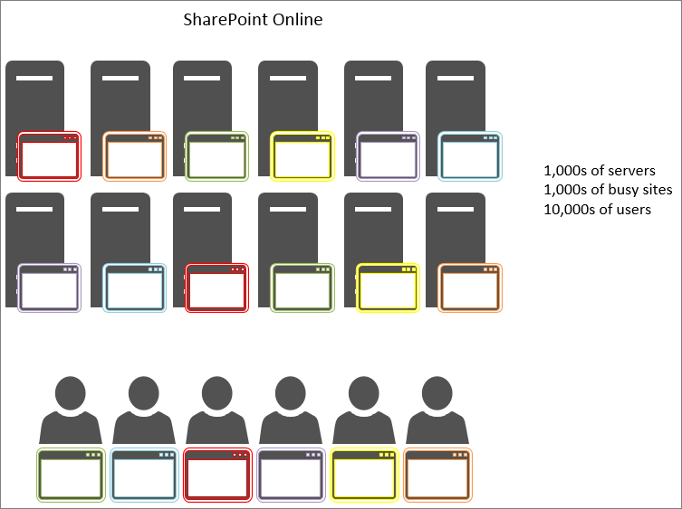

# Usar la memoria caché de objetos con SharePoint Online

En este artículo se explica la diferencia entre usar la memoria caché de objetos en SharePoint Server 2013 local y SharePoint Online.
  
El uso de la memoria caché de objetos en la implementación de SharePoint Online tiene un impacto negativo significativo. Cualquier dependencia de la memoria caché de objetos en SharePoint Online reducirá la confiabilidad de la página. 
  
## Cómo funciona la memoria caché de objetos de SharePoint Online y SharePoint Server 2013

Cuando SharePoint Server 2013 se hospeda localmente, el cliente tiene servidores front-end web privados que hospedan la memoria caché de objetos. Esto significa que la memoria caché está dedicada a un cliente y solo está limitada por la cantidad de memoria disponible y asignada a la memoria caché de objetos. Dado que solo se sirve a un cliente en el escenario local, los servidores front-end web suelen tener usuarios que hacen solicitudes a los mismos sitios una y otra vez. Esto significa que la memoria caché se llena rápidamente y permanece llena de los resultados de la consulta de lista y los objetos de SharePoint que los usuarios solicitan periódicamente.
  

  
Como resultado, la segunda vez que un usuario visita una página, el tiempo de carga de la página mejora. Después de un mínimo de cuatro cargas de la misma página, la página se almacena en caché en todos los servidores front-end web.
  
Por el contrario, en SharePoint Online hay muchos más servidores, pero también muchos más sitios. Cada usuario puede conectarse a un servidor front-end web diferente que no tiene la memoria caché rellenada. O bien, quizás la memoria caché se llene para un servidor, pero el siguiente usuario del servidor front-end web solicita una página de un sitio diferente. O bien, incluso si el siguiente usuario solicita la misma página que en su visita anterior, se equilibra la carga con un servidor front-end web diferente que no tiene esa página en la memoria caché. En este último caso, el almacenamiento en caché no ayuda en absoluto a los usuarios.
  
En la figura siguiente, cada punto representa una página que un usuario solicita y donde se almacena en caché. Los distintos colores representan a diferentes clientes que hacen uso compartido de la infraestructura SaaS.
  

  
Como puede ver en el diagrama, las posibilidades de que un usuario determinado entre en un servidor con la versión almacenada en caché de su página son muy pocas. Además, debido al gran rendimiento y al hecho de que los servidores se comparten entre muchos sitios, la memoria caché no dura mucho tiempo, ya que solo hay tanto espacio disponible para el almacenamiento en caché.
  
Por todas estas razones, confiar en los usuarios que se almacenan en caché objetos no es una forma eficaz de garantizar una experiencia de usuario de calidad y tiempos de carga de página en SharePoint Online.
  
## Si no podemos confiar en la memoria caché de objetos para mejorar el rendimiento en SharePoint Online, ¿qué usamos en su lugar?

Dado que no debe confiar en el almacenamiento en caché en SharePoint Online, debe evaluar métodos de diseño alternativos para las personalizaciones de SharePoint que usan la memoria caché de objetos. Esto significa usar enfoques para problemas de rendimiento que no se basan en el almacenamiento en caché de objetos para producir buenos resultados para los usuarios. Esto se describe en algunos de los otros artículos de esta serie e incluyen:
  
- [Opciones de navegación para SharePoint Online](navigation-options-for-sharepoint-online.md)
    
- [Minificación y agrupación en SharePoint Online](minification-and-bundling-in-sharepoint-online.md)
    
- [Uso de la red de entrega de contenido (CDN) de Office 365 con SharePoint Online](use-microsoft-365-cdn-with-spo.md)
    
- [Retrasar la carga de imágenes y JavaScript en SharePoint Online](delay-loading-images-and-javascript-in-sharepoint-online.md)
    

