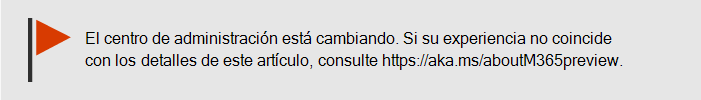
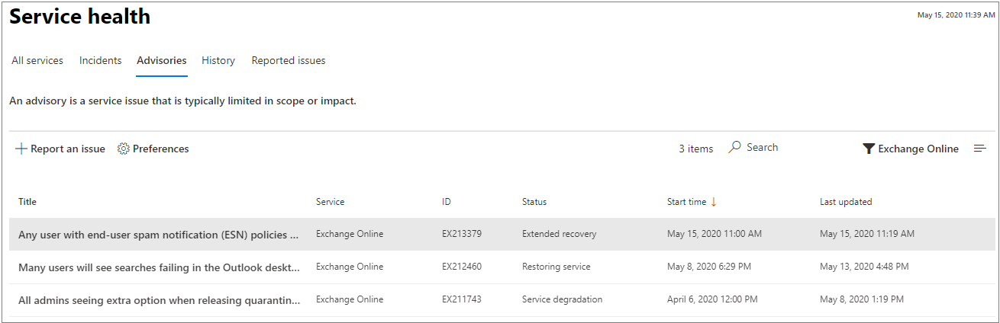

# Cómo comprobar el estado del servicio de Microsoft 365

Puede ver el estado de su servicios Microsoft, incluidos los servicios en la nube de administración de dispositivos  móviles, Office en la Web, Yammer, Microsoft Dynamics CRM Yammer y administración de dispositivos móviles, en la página Estado del servicio de [la Centro de administración de Microsoft 365](https://go.microsoft.com/fwlink/p/?linkid=2024339). Si experimenta algún problema con un servicio en la nube, antes de llamar al soporte técnico o de invertir tiempo intentando solucionarlo, puede comprobar el estado del servicio para determinar si se trata de un problema conocido que ya tenga una resolución en curso.

Si no puede iniciar sesión en el Centro  de administración, puede usar la página de estado del servicio para comprobar si hay problemas conocidos que le impidan iniciar sesión en el espacio empresarial.  También regístrate para seguirnos en [@MSFT365status](https://twitter.com/MSFT365Status) en Twitter para ver información sobre determinados eventos.

## Cómo comprobar el estado del servicio

1. Vaya a la Centro de administración de Microsoft 365 [https://admin.microsoft.com](https://go.microsoft.com/fwlink/p/?linkid=2024339) y inicie sesión con una cuenta de administrador.

    > [!NOTE]
    > Las personas a las que se les asigna el rol de administrador global o de servicio de soporte técnico pueden ver el estado del servicio. Para que los administradores de Exchange, SharePoint y Skype Empresarial puedan ver el estado del servicio, también se les debe asignar el rol Administrador de servicios. Para obtener más información acerca de los roles que pueden ver el estado del servicio, vea [About admin roles](../admin/add-users/about-admin-roles.md?preserve-view=true&view=o365-worldwide#commonly-used-microsoft-365-admin-center-roles).

2. Para ver el estado del servicio, en el Centro de administración, vaya a Estado del servicio de mantenimiento o seleccione la tarjeta de estado del servicio  >  en el panel  **Inicio**. La tarjeta de panel indica si hay un problema de servicio activo y vínculos a la página de estado del **servicio** detallada.

3. En la **página Estado del** servicio, el estado de mantenimiento de cada servicio en la nube se muestra en un formato de tabla.

   

La **pestaña Todos los** servicios (vista predeterminada) muestra todos los servicios, su estado de mantenimiento actual y cualquier incidente o aviso activo. Un icono y un estado en la **columna Estado** indican el estado de cada servicio.

Si hay un incidente activo o un aviso para un servicio, se mostrarán directamente bajo el nombre del servicio en una tabla anidada. Puede contraer la tabla anidada para ocultar los incidentes o avisos de esta vista haciendo clic en el icono de galón situado a la izquierda del nombre del servicio.   

Para filtrar la vista para mostrar solo todos  los incidentes activos, seleccione la pestaña Incidentes en la parte superior de la página. Al seleccionar la **pestaña** Avisos, solo se mostrarán todos los avisos activos publicados.

La **pestaña** Historial muestra todos los incidentes y avisos que se han resuelto en los últimos siete o 30 días.

Si tiene un problema con un servicio de Microsoft 365 y no lo ve  en la página Estado del servicio, díganoslo seleccionando Informar de un problema y completando el formulario corto. Veremos los datos e informes relacionados de otras organizaciones para ver qué tan extendido es el problema y si se originó con nuestro servicio. Si lo hizo, lo agregaremos como un nuevo  incidente o aviso en la página Estado del servicio, donde puede realizar un seguimiento de su resolución. La **página Problemas notificados** mostrará todos los problemas que el inquilino ha notificado desde este formulario y el estado.

Para personalizar la vista de los servicios que se muestran en el panel, seleccione Preferencias Vista personalizada y desactive las casillas de los servicios que desea filtrar fuera de la vista Panel de mantenimiento  >  del servicio. Asegúrese de que la casilla está activada para cada servicio que desee supervisar.

Para registrarse para recibir notificaciones por correo electrónico de nuevos incidentes que afectan a su inquilino y a los cambios de estado de un incidente activo, seleccione Preferencias correo electrónico , haga clic en  >   **Enviarme** notificaciones de salud de servicio en correo electrónico y, a continuación, especifique:

- Hasta dos direcciones de correo electrónico.
- Si desea notificaciones para incidentes o avisos
- Los servicios para los que desea recibir notificaciones

También puede suscribirse a notificaciones por correo electrónico para eventos individuales en lugar de todos los eventos de un servicio. Para ello, seleccione el problema activo para el que desea recibir actualizaciones de notificaciones por correo electrónico, seleccione Administrar notificaciones **para este** problema y, a continuación, especifique: 
- Hasta dos direcciones de correo electrónico.

> [!NOTE]
> Cada administrador puede tener sus preferencias establecidas y el límite anterior de dos direcciones de correo electrónico es por cuenta de administrador.

> [!TIP]
> También puedes usar la aplicación [Administración de Microsoft 365 en](https://go.microsoft.com/fwlink/p/?linkid=627216) tu dispositivo móvil para ver el estado del servicio, que es una excelente manera de mantenerse al día con las notificaciones de inserción.

### Ver detalles del estado del servicio publicado

En la **vista Todos** los servicios, seleccione el título del problema para ver la página de detalles del problema, que muestra más información sobre el problema, incluida una fuente de todos los mensajes publicados mientras trabajamos en una solución. 

En el resumen del aviso o del incidente, se proporciona la siguiente información:

- **Título:** un resumen del problema.
- **ID:** identificador numérico del problema.
- **Servicio:** el nombre del servicio afectado.
- **Last updated:** la última vez que se actualizó el mensaje de estado del servicio.
- **Tiempo de inicio estimado:** hora estimada cuando se inició el problema.
- **Estado:** cómo afecta este problema al servicio.
- **Impacto del** usuario: una breve descripción del impacto que este problema tiene en el usuario final.
- **Todas las actualizaciones:** publicamos mensajes frecuentes para que sepa el progreso que estamos realizando al aplicar una solución.

### Detalles del estado del servicio de traducción

Usamos la traducción automática para mostrar automáticamente los mensajes en el idioma que prefieras. Lea [Traducción de idioma para las publicaciones del Centro de mensajes](/microsoft-365/admin/manage/language-translation-for-message-center-posts) para obtener más información sobre cómo establecer el idioma.

### Definiciones

La mayoría de las veces, los servicios aparecerán en buen estado sin más información. Cuando un servicio experimenta un problema, este se identifica como aviso o incidente y se muestra el estado actual.

> [!TIP]
> Los eventos de mantenimiento planeados se muestran en el estado del servicio. Puede realizar un seguimiento de los eventos de mantenimiento planeados manteniéndose al día con el **Centro de mensajes**. Filtre por los mensajes de la categoría Planear el cambio para descubrir cuándo sucederá el cambio, el efecto que tendrá y cómo debe prepararse para afrontarlo. Consulta [Centro de mensajes en Microsoft 365](https://support.office.com/article/38fb3333-bfcc-4340-a37b-deda509c2093) para obtener más información.

### Incidentes y avisos

| Icono | Descripción |
|:-----|:-----|
||Si se muestra un aviso en un servicio, significa que somos conscientes de que existe un problema que está afectando a algunos usuarios, pero el servicio todavía está disponible. En los avisos, suele haber una solución alternativa para el problema y es posible que este se produzca de forma intermitente o que esté limitado a unas consecuencias para el usuario y a un ámbito específicos.    |
||Si, en un servicio, se muestra un incidente activo, significa que existe un problema crítico y que el servicio o una de las características principales del servicio no está disponible. Por ejemplo, es posible que los usuarios no puedan enviar ni recibir correo electrónico o que no puedan iniciar sesión. Los incidentes tendrán un impacto notable sobre los usuarios. Cuando haya un incidente en curso, ofreceremos actualizaciones en relación con la investigación, las acciones llevadas a cabo y la confirmación de la resolución en el panel Estado del servicio.    |

### Definiciones de estado

| Estado | Definición |
|:-----|:-----|
|**Investigando** | Somos conscientes de que existe un problema potencial y estamos recopilando más información sobre lo que sucede y el ámbito de impacto. |
|**Degradación del servicio** | Hemos confirmado que existe un problema que puede afectar al uso de un servicio o una característica. Es posible que vea este estado si un servicio está funcionando más lento de lo normal, si hay interrupciones intermitentes o si una característica no funciona, por ejemplo. |
|**Interrupción del servicio** | Verá este estado si se determina que un problema afecta a posibilidad de los usuarios de obtener acceso al servicio. En este caso, el problema es importante y se puede reproducir de forma coherente. |
|**Restaurando el servicio** | Se ha identificado la causa del problema, sabemos qué acción correctiva debemos aplicar y estamos en proceso de restablecer el servicio a un estado correcto. |
|**Recuperación extendida** | Este estado indica que se están llevando a cabo acciones correctivas para restablecer el servicio para la mayoría de los usuarios, pero que llevará algún tiempo llegar a todos los sistemas afectados. También es posible que vea este estado en caso de que hayamos aplicado una solución temporal para reducir el impacto a la espera de aplicar una permanente. |
|**Investigación suspendida** | Si nuestra investigación detallada sobre un problema potencial resulta en una solicitud de información adicional por parte de los clientes para permitirnos investigar de forma más exhaustiva, verá este estado. Si necesitamos su ayuda, le haremos saber qué datos y registros necesitamos. |
|**Servicio restaurado** | Hemos confirmado que una acción correctiva ha resuelto el problema subyacente y el servicio se ha restaurado al estado correcto. Para averiguar qué ha fallado, vea los detalles del problema. |
|**Falso positivo** | Después de una investigación detallada, hemos confirmado que el servicio está en buen estado y funciona según lo diseñado. No se observó ningún impacto en el servicio ni la causa del incidente se originó fuera del servicio. |
|**Informe posterior al incidente publicado** | Hemos publicado un informe de incidentes posteriores para un problema específico que incluye información de causa raíz y los siguientes pasos para garantizar que un problema similar no vuelva a ocurrir. |

### Tipos de publicación de mensajes

| Tipo | Definición |
|:-----|:-----|
|**Actualización rápida** | Actualizaciones incrementales breves y frecuentes para incidentes de gran impacto, disponibles para todos los clientes. |
|**Detalles adicionales** | Estas publicaciones adicionales proporcionarán detalles técnicos y de resolución más completos para ofrecer una mayor visibilidad del tratamiento de incidentes. Está disponible para los inquilinos que cumplen los mismos requisitos descritos para la [Exchange Online ,](/microsoft-365/enterprise/microsoft-365-exchange-monitoring?view=o365-worldwide#requirements) |

### Historial

El estado del servicio le permite ver su estado de mantenimiento actual y ver el historial de avisos de servicio e incidentes que han afectado a su inquilino en los últimos 30 días. Para ver el estado anterior de todos los servicios, seleccione **Vista** historial.

Para obtener más información sobre nuestro compromiso con el tiempo de actividad, vea [Operaciones transparentes de Microsoft 365](/office365/servicedescriptions/office-365-platform-service-description/service-health-and-continuity).

## Temas relacionados

[Informes de actividad en el Centro de administración de Microsoft 365](https://support.office.com/article/0d6dfb17-8582-4172-a9a9-aed798150263)

[Preferencias del centro de mensajes](../admin/manage/message-center.md?preserve-view=true&view=o365-worldwide#preferences)

[Cómo comprobar el estado Windows versión en el Centro de administración](/windows/deployment/update/check-release-health)
