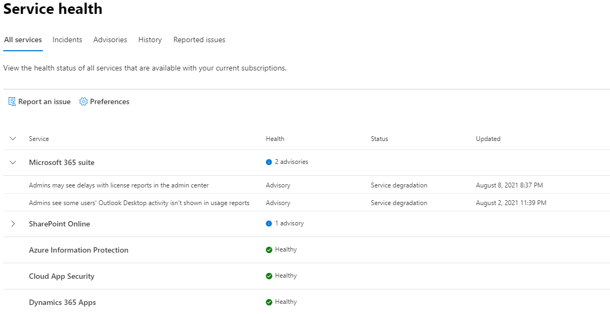

# Cómo comprobar el estado del servicio de Microsoft 365

Puede ver el estado de los servicios de Microsoft, incluidos Office en la web, Yammer, Microsoft Dynamics CRM y los servicios en la nube de administración de dispositivos móviles, en la página **estado del servicio** en el [Centro de administración de Microsoft 365](https://go.microsoft.com/fwlink/p/?linkid=2024339). Si experimenta algún problema con un servicio en la nube, antes de llamar al soporte técnico o de invertir tiempo intentando solucionarlo, puede comprobar el estado del servicio para determinar si se trata de un problema conocido que ya tenga una resolución en curso.

Si no puede iniciar sesión en el centro de administración, puede usar la [página de estado del servicio](https://status.office365.com) para comprobar si hay algún problema conocido que le impida iniciar sesión en el inquilino.  Regístrese y síganos en [@MSFT365status](https://twitter.com/MSFT365Status) en Twitter para ver información sobre determinados eventos.

## Cómo comprobar el estado del servicio

1. Vaya al Centro de administración de Microsoft 365 en [https://admin.microsoft.com](https://go.microsoft.com/fwlink/p/?linkid=2024339) e inicie sesión con una cuenta de administrador.

    > [!NOTE]
    > Los usuarios que tienen asignado el rol de administrador de servicios o administrador global pueden ver el estado del servicio. Para que los administradores de Exchange, SharePoint y Skype Empresarial puedan ver el estado del servicio, también se les debe asignar el rol Administrador de servicios. Para más información sobre los roles que pueden acceder al estado del servicio, consulte [Acerca de los roles de administrador](../admin/add-users/about-admin-roles.md?preserve-view=true&view=o365-worldwide#commonly-used-microsoft-365-admin-center-roles).

2. Para ver el estado del servicio, en el panel de navegación izquierdo del centro de administración, vaya a **Estado** > **Estado del servicio** o seleccione la tarjeta **Estado del servicio** en el **Panel principal**. En la tarjeta del panel, se indica si existe algún problema de servicio activo y se muestran vínculos a la página **Estado detallado** del servicio.

3. En la página de **Estado del servicio**, podrá ver el estado de mantenimiento de los servicios en la nube en formato de tabla.

   

La pestaña de **Todos los servicios** (vista predeterminada) muestra todos los servicios junto con los estados de mantenimiento y cualquier incidente o aviso activo. El icono y estado en la columna de **Estado** indica cómo está cada servicio.

Si existe un incidente o aviso activo de un servicio, los verá bajo el nombre del servicio en una tabla anidada. En esta vista es posible contraer la tabla anidada para ocultar los incidentes o avisos simplemente haciendo clic en el icono de contenido adicional situado a la izquierda del nombre del servicio.

Para utilizar el filtro de ver todos los incidentes activos, seleccione la pestaña **Incidentes** en la parte superior de la página. Si selecciona la pestaña de **Avisos** se mostrarán únicamente los avisos publicados.

La pestaña **Historial** muestra todos los incidentes y avisos que se han resuelto en los últimos siete o treinta días.

Si tiene un problema con algún servicio de Microsoft 365 y no lo encuentra en **Estado del servicio**, comuníquelo seleccionando **Notificar un problema** y rellenando el correspondiente formulario. Examinaremos datos e informes de otras organizaciones relacionados con su problema para ver qué tan extendido se encuentra y si se originó por nuestro servicio. Si así fuera, lo añadiremos como nuevo incidente o aviso en la página **Estado del servicio** donde podrá darle seguimiento.  La página de **Problemas notificados** le mostrará todos los problemas que el inquilino nos ha notificado desde el formulario y desde el estado.

Para personalizar la vista de los servicios que se muestran en el panel, seleccione **Preferencias** > **Vista personalizada** y borre las casillas de los servicios que desea filtrar fuera de la vista del panel Estado del servicio. Asegúrese de que la casilla está seleccionada para cada servicio que desea supervisar.

Si quiere recibir notificaciones por correo electrónico sobre nuevos incidentes que afecten a su inquilino y cambios de estado de un incidente activo, seleccione **Preferencias** > **Correo electrónico**, haga clic en **Recibir notificaciones de estado del servicio en el correo electrónico** y, a continuación, especifique:

- Hasta dos direcciones de correo electrónico.
- Si desea recibir notificaciones de incidentes o avisos
- Sobre qué servicios desea las notificaciones

También puede suscribirse a notificaciones por correo electrónico de eventos individuales y no de cada evento de un servicio. Para ello seleccione el incidente activo sobre el que quiere recibir notificaciones, vaya a **Administrar notificaciones para este problema** y especifique:

- Hasta dos direcciones de correo electrónico.

> [!NOTE]
> El límite es de dos direcciones de correo electrónico por cada administrador. Cada administrador puede establecer sus propias preferencias.

> [!TIP]
> También puede utilizar la [aplicación de administración de Microsoft 365](https://go.microsoft.com/fwlink/p/?linkid=627216) en su dispositivo móvil para ver el estado del servicio y mantenerse al día con las notificaciones de inserción.

### Ver detalles del estado del servicio publicado

En la vista de **Todos los servicios** seleccione el título del problema y podrá ver una página con información detallada del problema, incluidos los mensajes que iremos publicando mientras trabajamos en la solución.

En el resumen del aviso o del incidente, se proporciona la siguiente información:

- **TÍtulo**: resumen del problema.
- **ID**: identificador numérico del problema.
- **Servicio**: nombre del servicio afectado.
- **Última actualización**: última vez que se actualizó el mensaje de estado del servicio.
- **Hora estimada de inicio**: hora estimada en que se inició el problema.
- **Estado**: cómo afecta este problema al servicio.
- **Impacto en el usuario**: breve descripción del impacto que tiene el problema en el usuario final.
- **Actualizaciones**: publicamos mensajes con frecuencia para informarle del progreso que estamos haciendo para encontrar una solución.

### Traducción de los detalles del estado del servicio

Usamos la traducción automática para mostrar los mensajes en su idioma de preferencia de forma automática. Vaya a [Traducción de las publicaciones del Centro de mensajes](lang-service-health.md) para obtener más información sobre cómo establecer su idioma de preferencia.

### Definiciones

La mayoría de las veces, los servicios aparecerán como correctos sin especificar más información. Cuando un servicio experimenta un problema, éste se identifica como aviso o incidente y se muestra el estado actual.

> [!TIP]
> Los eventos de mantenimiento planeados se muestran en el estado del servicio. Puede realizar un seguimiento de los eventos de mantenimiento planeados manteniéndose al día con el **Centro de mensajes**. Filtre por los mensajes de la categoría Planear el cambio para descubrir cuándo sucederá el cambio, el efecto que tendrá y cómo debe prepararse para afrontarlo. Vea [Centro de mensajes de Microsoft 365](https://support.office.com/article/38fb3333-bfcc-4340-a37b-deda509c2093) para obtener más detalles.

### Incidentes y avisos

| Icono | Descripción |
|:-----|:-----|
||Si se muestra un aviso en un servicio, significa que somos conscientes de que existe un problema que está afectando a algunos usuarios, pero el servicio todavía está disponible. En los avisos, suele haber una solución alternativa para el problema y es posible que este se produzca de forma intermitente o que esté limitado a unas consecuencias para el usuario y a un ámbito específicos.    |
||Si, en un servicio, se muestra un incidente activo, significa que existe un problema crítico y que el servicio o una de las características principales del servicio no está disponible. Por ejemplo, es posible que los usuarios no puedan enviar ni recibir correo electrónico o que no puedan iniciar sesión. Los incidentes tendrán un impacto notable sobre los usuarios. Cuando haya un incidente en curso, ofreceremos actualizaciones en relación con la investigación, las acciones llevadas a cabo y la confirmación de la resolución en el panel Estado del servicio.    |

### Definiciones del estado

| Estado | Definición |
|:-----|:-----|
|**Investigando** | Somos conscientes de que existe un problema potencial y estamos recopilando más información sobre lo que sucede y su ámbito de impacto. |
|**Deterioro del servicio** | Hemos confirmado que existe un problema que puede afectar al uso de un servicio o una característica. Es posible que vea este estado si un servicio está funcionando más lento de lo normal, si hay interrupciones intermitentes o si una característica no funciona, por ejemplo. |
|**Interrupción del servicio** | Verá este estado si se determina que un problema afecta a posibilidad de los usuarios de obtener acceso al servicio. En este caso, el problema es importante y se puede reproducir de forma coherente. |
|**Restaurando el servicio** | Se ha identificado la causa del problema, sabemos qué acción correctiva debemos aplicar y estamos en proceso de restablecer el servicio a un estado correcto. |
|**Recuperación en proceso** | Este estado indica que se están llevando a cabo acciones correctivas para restablecer el servicio para la mayoría de los usuarios, pero que llevará algún tiempo llegar a todos los sistemas afectados. También es posible que vea este estado en caso de que hayamos aplicado una solución temporal para reducir el impacto a la espera de aplicar una permanente. |
|**Investigación suspendida** | Si nuestra investigación detallada sobre un problema potencial resulta en una solicitud de información adicional por parte de los clientes para permitirnos investigar de forma más exhaustiva, verá este estado. Si necesitamos su ayuda, le haremos saber qué datos y registros necesitamos. |
|**Servicio restaurado** | Hemos confirmado que una acción correctiva ha resuelto el problema subyacente y el servicio se ha restaurado al estado correcto. Para averiguar qué ha fallado, vea los detalles del problema. |
|**Falso positivo** | Después de una investigación detallada, hemos confirmado que el servicio se encuentra en buen estado y funciona correctamente. No se observó ningún impacto en el servicio o la causa del incidente se originó fuera del servicio. Los incidentes y avisos con este estado aparecen en la vista de historial hasta que expiran (después del período de tiempo indicado en la publicación final de ese evento). |
|**Publicación del informe posterior al incidente** | Hemos publicado un Informe posterior al incidente para un problema específico que incluye información de las causas principales y procedimientos a seguir para garantizar que no vuelva a reproducirse un problema similar. |

### Tipos de publicación de mensajes

| Tipo | Definición |
|:-----|:-----|
|**Actualización rápida** | Actualizaciones breves y frecuentes disponibles para todos los clientes para incidentes de alto impacto. |
|**Detalles adicionales** | Estas publicaciones adicionales proporcionan detalles técnicos y de resolución más completos para ofrecer una mayor visibilidad al tratamiento de incidentes. Disponible para inquilinos que cumplen con los mismos requisitos que se detallan en la [supervisión de Exchange Online](/microsoft-365/enterprise/microsoft-365-exchange-monitoring#requirements). |

### Historial

El estado del servicio le permite examinar su estado de mantenimiento actual y ver el historial de los avisos e incidentes de servicio que han afectado a su inquilino en los últimos 30 días. Para ver el estado anterior de todos los servicios, seleccione vista del **historial**.

Para obtener más información sobre nuestro compromiso con el tiempo de actividad, vea [Operaciones transparentes de Microsoft 365](/office365/servicedescriptions/office-365-platform-service-description/service-health-and-continuity).

## Temas relacionados

- [Informes de actividad del Centro de administración de Microsoft 365](https://support.office.com/article/0d6dfb17-8582-4172-a9a9-aed798150263)
- [Preferencias del centro de mensajes](../admin/manage/message-center.md?preserve-view=true&view=o365-worldwide#preferences)
- [Cómo comprobar el estado de las actualizaciones de Windows en el centro de administración](/windows/deployment/update/check-release-health)
