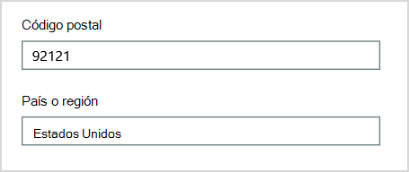

# <a name="why-you-need-to-use-powershell-for-microsoft-365"></a><span data-ttu-id="c6fdc-103">¿Por qué necesita usar PowerShell para Microsoft 365?</span><span class="sxs-lookup"><span data-stu-id="c6fdc-103">Why you need to use PowerShell for Microsoft 365</span></span>

<span data-ttu-id="c6fdc-104">*Este artículo afecta tanto a Office 365 Enterprise como a Microsoft 365 Enterprise*</span><span class="sxs-lookup"><span data-stu-id="c6fdc-104">*This article applies to both Microsoft 365 Enterprise and Office 365 Enterprise.*</span></span>

<span data-ttu-id="c6fdc-105">Con el Centro de administración de Microsoft 365, puede administrar sus cuentas de usuario y licencias de Microsoft 365.</span><span class="sxs-lookup"><span data-stu-id="c6fdc-105">With the Microsoft 365 admin center, you can manage your Microsoft 365 user accounts and licenses.</span></span> <span data-ttu-id="c6fdc-106">También puede administrar los servicios de Microsoft 365, como Exchange Online, Teams y SharePoint Online.</span><span class="sxs-lookup"><span data-stu-id="c6fdc-106">You can also manage your Microsoft 365 services, such as Exchange Online, Teams, and SharePoint Online.</span></span> <span data-ttu-id="c6fdc-107">Si en su lugar usa PowerShell para administrar estos servicios, puede y aprovechar el entorno de línea de comandos y lenguaje de scripting para la velocidad, automatización y capacidades adicionales.</span><span class="sxs-lookup"><span data-stu-id="c6fdc-107">If you instead use PowerShell to manage these services, you can and take advantage of the command-line and scripting language environment for speed, automation, and additional capabilities.</span></span>
  
<span data-ttu-id="c6fdc-108">En este artículo se muestra cómo usar PowerShell para administrar Microsoft 365 para:</span><span class="sxs-lookup"><span data-stu-id="c6fdc-108">This article shows how to use PowerShell to manage Microsoft 365 to:</span></span>
  
- <span data-ttu-id="c6fdc-109">Mostrar información adicional que no se puede ver en el Centro de administración de Microsoft 365</span><span class="sxs-lookup"><span data-stu-id="c6fdc-109">Reveal additional information that you can't see in the Microsoft 365 admin center</span></span>
    
- <span data-ttu-id="c6fdc-110">Configurar características y opciones solo es posible con PowerShell</span><span class="sxs-lookup"><span data-stu-id="c6fdc-110">Configure features and settings only possible with PowerShell</span></span>
    
- <span data-ttu-id="c6fdc-111">Realizar operaciones masivas</span><span class="sxs-lookup"><span data-stu-id="c6fdc-111">Do bulk operations</span></span>
    
- <span data-ttu-id="c6fdc-112">Filtrar datos</span><span class="sxs-lookup"><span data-stu-id="c6fdc-112">Filter data</span></span>
    
- <span data-ttu-id="c6fdc-113">Imprimir o guardar datos</span><span class="sxs-lookup"><span data-stu-id="c6fdc-113">Print or save data</span></span>
    
- <span data-ttu-id="c6fdc-114">Administrar en todos los servicios</span><span class="sxs-lookup"><span data-stu-id="c6fdc-114">Manage across services</span></span>
    
<span data-ttu-id="c6fdc-115">Tenga en cuenta que PowerShell para Microsoft 365 es un conjunto de módulos para Windows PowerShell, que es un entorno de línea de comandos para plataformas y servicios basados en Windows.</span><span class="sxs-lookup"><span data-stu-id="c6fdc-115">Keep in mind that PowerShell for Microsoft 365 is a set of modules for Windows PowerShell, which is a command-line environment for Windows-based services and platforms.</span></span> <span data-ttu-id="c6fdc-116">Este entorno crea un lenguaje de shell de comandos que se puede extender con módulos adicionales.</span><span class="sxs-lookup"><span data-stu-id="c6fdc-116">This environment creates a command-shell language that can be extended with additional modules.</span></span> <span data-ttu-id="c6fdc-117">Proporciona una forma de ejecutar comandos o scripts simples o complejos.</span><span class="sxs-lookup"><span data-stu-id="c6fdc-117">It provides a way to execute simple or complex commands or scripts.</span></span> <span data-ttu-id="c6fdc-118">Por ejemplo, después de instalar los módulos de PowerShell para Microsoft 365 y conectarse a su suscripción a Microsoft 365, puede ejecutar el siguiente comando para enumerar todos los buzones de usuario para Microsoft Exchange Online:</span><span class="sxs-lookup"><span data-stu-id="c6fdc-118">For example, after you install the PowerShell for Microsoft 365 modules and connect to your Microsoft 365 subscription, you can run the following command to list all the user mailboxes for Microsoft Exchange Online:</span></span>
  
```powershell
Get-Mailbox
```

<span data-ttu-id="c6fdc-119">También podrías obtener la lista de buzones mediante el Centro de administración de Microsoft 365, pero contar los elementos de todas las listas para todos los sitios de todas las aplicaciones web no es fácil.</span><span class="sxs-lookup"><span data-stu-id="c6fdc-119">You could also get the list of mailboxes by using the Microsoft 365 admin center but counting the items in all the lists for all the sites for all of your web apps isn't easy.</span></span>
  
<span data-ttu-id="c6fdc-120">PowerShell para Microsoft 365 está diseñado para ayudarle a administrar Microsoft 365, no para reemplazar el Centro de administración de Microsoft 365.</span><span class="sxs-lookup"><span data-stu-id="c6fdc-120">PowerShell for Microsoft 365 is designed to help you manage Microsoft 365, not to replace the Microsoft 365 admin center.</span></span> <span data-ttu-id="c6fdc-121">Los administradores deben poder usar PowerShell para Microsoft 365 porque hay algunos procedimientos de configuración que solo se pueden realizar a través de PowerShell para comandos de Microsoft 365.</span><span class="sxs-lookup"><span data-stu-id="c6fdc-121">Admins need to be able to use PowerShell for Microsoft 365 because there are some configuration procedures that can only be done through PowerShell for Microsoft 365 commands.</span></span> <span data-ttu-id="c6fdc-122">Para estos casos, debe saber cómo:</span><span class="sxs-lookup"><span data-stu-id="c6fdc-122">For these cases, you need to know how to:</span></span>
  
- <span data-ttu-id="c6fdc-123">Instale los módulos de PowerShell para Microsoft 365 (solo se realiza una vez para cada equipo de administrador).</span><span class="sxs-lookup"><span data-stu-id="c6fdc-123">Install the PowerShell for Microsoft 365 modules (done only one time for each administrator computer).</span></span>
    
- <span data-ttu-id="c6fdc-124">Conéctese a su suscripción de Microsoft 365 (una vez para cada sesión de PowerShell).</span><span class="sxs-lookup"><span data-stu-id="c6fdc-124">Connect to your Microsoft 365 subscription (one time for each PowerShell session).</span></span>
    
- <span data-ttu-id="c6fdc-125">Recopila la información necesaria para ejecutar los comandos de PowerShell necesarios para Microsoft 365.</span><span class="sxs-lookup"><span data-stu-id="c6fdc-125">Gather the information needed to run the required PowerShell for Microsoft 365 commands.</span></span>
    
- <span data-ttu-id="c6fdc-126">Ejecute PowerShell para comandos de Microsoft 365.</span><span class="sxs-lookup"><span data-stu-id="c6fdc-126">Run PowerShell for Microsoft 365 commands.</span></span>
    
<span data-ttu-id="c6fdc-127">Después de aprender estas habilidades básicas, no tiene que enumerar los usuarios de buzones mediante el **comando Get-Mailbox.**</span><span class="sxs-lookup"><span data-stu-id="c6fdc-127">After you learn these basic skills, you don't have to list your mailbox users by using the **Get-Mailbox** command.</span></span> <span data-ttu-id="c6fdc-128">Tampoco tiene que comprender cómo crear un comando nuevo como el comando citado anteriormente para contar todos los elementos de todas las listas para todos los sitios de todas las aplicaciones web.</span><span class="sxs-lookup"><span data-stu-id="c6fdc-128">You also don't have to understand how to create a new command like the command cited previously to count all the items in all the lists for all the sites for all of your web apps.</span></span> <span data-ttu-id="c6fdc-129">Microsoft y la comunidad de administradores pueden ayudarle con las tareas necesarias.</span><span class="sxs-lookup"><span data-stu-id="c6fdc-129">Microsoft and the community of administrators can help you with such tasks as needed.</span></span>
  
## <a name="powershell-for-microsoft-365-can-reveal-information-that-you-cant-see-with-the-microsoft-365-admin-center"></a><span data-ttu-id="c6fdc-130">PowerShell para Microsoft 365 puede revelar información que no puede ver con el Centro de administración de Microsoft 365</span><span class="sxs-lookup"><span data-stu-id="c6fdc-130">PowerShell for Microsoft 365 can reveal information that you can't see with the Microsoft 365 admin center</span></span>

<span data-ttu-id="c6fdc-131">El Centro de administración de Microsoft 365 muestra mucha información útil.</span><span class="sxs-lookup"><span data-stu-id="c6fdc-131">The Microsoft 365 admin center displays many useful information.</span></span> <span data-ttu-id="c6fdc-132">Pero no muestra toda la información posible que Microsoft 365 almacena sobre usuarios, licencias, buzones y sitios.</span><span class="sxs-lookup"><span data-stu-id="c6fdc-132">But it doesn't display all the possible information that Microsoft 365 stores about users, licenses, mailboxes, and sites.</span></span> <span data-ttu-id="c6fdc-133">Este es un ejemplo para *usuarios y grupos* en el Centro de administración de Microsoft 365:</span><span class="sxs-lookup"><span data-stu-id="c6fdc-133">Here's an example for *users and groups* in the Microsoft 365 admin center:</span></span>
  

  
<span data-ttu-id="c6fdc-135">Esta vista proporciona la información que necesita en muchos casos.</span><span class="sxs-lookup"><span data-stu-id="c6fdc-135">This view provides the information that you need in many cases.</span></span> <span data-ttu-id="c6fdc-136">En cambio, algunas veces necesitará más.</span><span class="sxs-lookup"><span data-stu-id="c6fdc-136">However, there are times when you need more.</span></span> <span data-ttu-id="c6fdc-137">Por ejemplo, las licencias de Microsoft 365 (y las características de Microsoft 365 disponibles para un usuario) dependen en parte de la ubicación geográfica del usuario.</span><span class="sxs-lookup"><span data-stu-id="c6fdc-137">For example, Microsoft 365 licensing (and the Microsoft 365 features available to a user) depends in part on the user's geographic location.</span></span> <span data-ttu-id="c6fdc-138">Es posible que las directivas y características que se pueden extender a un usuario que reside en Estados Unidos no sean las mismas que las que puede extender a un usuario en India o Bélgica.</span><span class="sxs-lookup"><span data-stu-id="c6fdc-138">The policies and features that you can extend to a user who lives in the United States might not be the same as those that you can extend to a user in India or Belgium.</span></span> <span data-ttu-id="c6fdc-139">Siga estos pasos en el Centro de administración de Microsoft 365 para determinar la ubicación geográfica de un usuario:</span><span class="sxs-lookup"><span data-stu-id="c6fdc-139">Follow these steps in the Microsoft 365 admin center to determine a user's geographic location:</span></span>
  
1. <span data-ttu-id="c6fdc-140">Haga doble clic en el **Nombre para mostrar** del usuario.</span><span class="sxs-lookup"><span data-stu-id="c6fdc-140">Double-click the user's **Display Name**.</span></span>
    
2. <span data-ttu-id="c6fdc-141">En el panel de presentación de propiedades de usuario, seleccione **detalles**.</span><span class="sxs-lookup"><span data-stu-id="c6fdc-141">In the user properties display pane, select **details**.</span></span>
    
3. <span data-ttu-id="c6fdc-142">En la presentación de detalles, seleccione **detalles adicionales**.</span><span class="sxs-lookup"><span data-stu-id="c6fdc-142">In the details display, select **additional details**.</span></span>
    
4. <span data-ttu-id="c6fdc-143">Desplácese hasta que encuentre el título **País o región:**</span><span class="sxs-lookup"><span data-stu-id="c6fdc-143">Scroll until you find the heading **Country or region**:</span></span>
    
     
  
5. <span data-ttu-id="c6fdc-145">Escriba el nombre para mostrar y la ubicación del usuario en una hoja de papel, o cópielo y péguelo en el Bloc de notas.</span><span class="sxs-lookup"><span data-stu-id="c6fdc-145">Write the user's display name and location on a piece of paper, or copy and paste it into Notepad.</span></span>
    
<span data-ttu-id="c6fdc-146">Debe repetir este procedimiento para cada usuario.</span><span class="sxs-lookup"><span data-stu-id="c6fdc-146">You must repeat this procedure for each user.</span></span> <span data-ttu-id="c6fdc-147">Si tiene muchos usuarios, este proceso puede ser tedioso.</span><span class="sxs-lookup"><span data-stu-id="c6fdc-147">If you have many users, this process can be tedious.</span></span> <span data-ttu-id="c6fdc-148">Con PowerShell para Microsoft 365, puede mostrar esta información para todos los usuarios mediante el siguiente comando:</span><span class="sxs-lookup"><span data-stu-id="c6fdc-148">With PowerShell for Microsoft 365, you can display this information for all of your users by using the following command:</span></span>
  
```powershell
Get-AzureADUser | Select DisplayName, UsageLocation
```


>[!Note]
><span data-ttu-id="c6fdc-149">PowerShell Core no admite el módulo de Microsoft Azure Active Directory para Windows PowerShell módulo y cmdlets que tienen *Msol* en su nombre.</span><span class="sxs-lookup"><span data-stu-id="c6fdc-149">PowerShell Core doesn't support the Microsoft Azure Active Directory Module for Windows PowerShell module and cmdlets that have *Msol* in their name.</span></span> <span data-ttu-id="c6fdc-150">Debe ejecutar estos cmdlets desde Windows PowerShell.</span><span class="sxs-lookup"><span data-stu-id="c6fdc-150">You have to run these cmdlets from Windows PowerShell.</span></span>
>

<span data-ttu-id="c6fdc-151">Este es un ejemplo de los resultados:</span><span class="sxs-lookup"><span data-stu-id="c6fdc-151">Here's an example of the results:</span></span>
  
```powershell
DisplayName                               UsageLocation
-----------                               -------------
Bonnie Kearney                            GB
Fabrice Canel                             BR
Brian Johnson (TAILSPIN)                  US
Anne Wallace                              US
Alex Darrow                               US
David Longmuir                            BR
```

<span data-ttu-id="c6fdc-152">La interpretación de este comando de PowerShell es: Obtener todos los usuarios de la suscripción actual de Microsoft 365 (**Get-AzureADUser**), pero solo mostrar el nombre y la ubicación de cada usuario (**Seleccione DisplayName, UsageLocation**).</span><span class="sxs-lookup"><span data-stu-id="c6fdc-152">The interpretation of this PowerShell command is: Get all of the users in the current Microsoft 365 subscription (**Get-AzureADUser**), but only display the name and location for each user (**Select DisplayName, UsageLocation**).</span></span>
  
<span data-ttu-id="c6fdc-153">Dado que PowerShell para Microsoft 365 admite un lenguaje de shell de comandos, puede manipular aún más la información obtenida por el comando **Get-AzureADUser.**</span><span class="sxs-lookup"><span data-stu-id="c6fdc-153">Because PowerShell for Microsoft 365 supports a command-shell language, you can further manipulate the information obtained by the **Get-AzureADUser** command.</span></span> <span data-ttu-id="c6fdc-154">Por ejemplo, tal vez quiera ordenar estos usuarios por su ubicación, agrupando todos los usuarios brasileños, todos los usuarios de Estados Unidos, y así sucesivamente.</span><span class="sxs-lookup"><span data-stu-id="c6fdc-154">For example, maybe you'd like to sort these users by their location, grouping all the Brazilian users together, all the United States users together, and so on.</span></span> <span data-ttu-id="c6fdc-155">Este es el comando:</span><span class="sxs-lookup"><span data-stu-id="c6fdc-155">Here's the command:</span></span>
  
```powershell
Get-AzureADUser | Select DisplayName, UsageLocation | Sort UsageLocation, DisplayName
```

<span data-ttu-id="c6fdc-156">Este es un ejemplo de los resultados:</span><span class="sxs-lookup"><span data-stu-id="c6fdc-156">Here's an example of the results:</span></span>
  
```powershell
DisplayName                                 UsageLocation
-----------                                 -------------
David Longmuir                              BR
Fabrice Canel                               BR
Bonnie Kearney                              GB
Alex Darrow                                 US
Anne Wallace                                US
Brian Johnson (TAILSPIN)                    US
```

<span data-ttu-id="c6fdc-157">La interpretación de este comando de PowerShell es: Obtener todos los usuarios de la suscripción actual de Microsoft 365, pero solo mostrar el nombre y la ubicación de cada usuario y ordenarlos primero por su ubicación y, a continuación, su nombre (**Sort UsageLocation, DisplayName**).</span><span class="sxs-lookup"><span data-stu-id="c6fdc-157">The interpretation of this PowerShell command is: Get all the users in the current Microsoft 365 subscription, but only display the name and location for each user and sort them first by their location and then their name (**Sort UsageLocation, DisplayName**).</span></span>
  
<span data-ttu-id="c6fdc-158">También puede usar filtrado adicional.</span><span class="sxs-lookup"><span data-stu-id="c6fdc-158">You can also use additional filtering.</span></span> <span data-ttu-id="c6fdc-159">Por ejemplo, si solo quiere ver la información sobre los usuarios que están en Brasil, use este comando:</span><span class="sxs-lookup"><span data-stu-id="c6fdc-159">For example, if you only want to see information about users based in Brazil, use this command:</span></span>
  
```powershell
Get-AzureADUser | Where {$_.UsageLocation -eq "BR"} | Select DisplayName, UsageLocation 
```

<span data-ttu-id="c6fdc-160">Este es un ejemplo de los resultados:</span><span class="sxs-lookup"><span data-stu-id="c6fdc-160">Here's an example of the results:</span></span>
  
```powershell
DisplayName                                           UsageLocation
-----------                                           -------------
David Longmuir                                        BR
Fabrice Canel                                         BR
```

<span data-ttu-id="c6fdc-161">La interpretación de este comando de PowerShell es: Obtener todos los usuarios de la suscripción actual de Microsoft 365 cuya ubicación es Brasil (**Donde {$ \_ . UsageLocation -eq "BR"}**) y, a continuación, muestra el nombre y la ubicación de cada usuario.</span><span class="sxs-lookup"><span data-stu-id="c6fdc-161">The interpretation of this PowerShell command is: Get all the users in the current Microsoft 365 subscription whose location is Brazil (**Where {$\_.UsageLocation -eq "BR"}**) and then display the name and location for each user.</span></span>
  
 <span data-ttu-id="c6fdc-162">**Una nota sobre dominios grandes**</span><span class="sxs-lookup"><span data-stu-id="c6fdc-162">**A note about large domains**</span></span>
  
<span data-ttu-id="c6fdc-163">Si tiene un dominio grande con decenas de miles de usuarios, probar algunos de los ejemplos que mostramos en este artículo podría llevar a la limitación.</span><span class="sxs-lookup"><span data-stu-id="c6fdc-163">If you have a large domain with tens of thousands of users, trying some of the examples we show in this article could lead to throttling.</span></span> <span data-ttu-id="c6fdc-164">En función de factores como la potencia informática y el ancho de banda de red disponible, es posible que esté intentando hacer demasiado a la vez.</span><span class="sxs-lookup"><span data-stu-id="c6fdc-164">Based on factors like computing power and available network bandwidth, you may be trying to do too much at one time.</span></span> <span data-ttu-id="c6fdc-165">Es posible que las organizaciones grandes quieran dividir algunas de estas operaciones de PowerShell en dos comandos.</span><span class="sxs-lookup"><span data-stu-id="c6fdc-165">Large organizations might want to split some of these PowerShell operations into two commands.</span></span>

<span data-ttu-id="c6fdc-166">Por ejemplo, el siguiente comando devuelve todas las cuentas de usuario y muestra el nombre y la ubicación de cada una:</span><span class="sxs-lookup"><span data-stu-id="c6fdc-166">For example, the following command returns all the user accounts and shows the name and location for each:</span></span>
  
```powershell
Get-AzureADUser | Select DisplayName, UsageLocation
```

<span data-ttu-id="c6fdc-167">Esto funciona muy bien en los dominios más pequeños.</span><span class="sxs-lookup"><span data-stu-id="c6fdc-167">That works great for smaller domains.</span></span> <span data-ttu-id="c6fdc-168">Pero en una organización grande, es posible que desee dividir esa operación en dos comandos: un comando para almacenar la información de la cuenta de usuario en una variable y otro para mostrar la información necesaria.</span><span class="sxs-lookup"><span data-stu-id="c6fdc-168">But in a large organization, you might want to split that operation into two commands: one command to store the user account information in a variable and another to display the needed information.</span></span> <span data-ttu-id="c6fdc-169">Aquí le mostramos un ejemplo:</span><span class="sxs-lookup"><span data-stu-id="c6fdc-169">Here's an example:</span></span>
  
```powershell
$x = Get-AzureADUser
$x | Select DisplayName, UsageLocation
```

<span data-ttu-id="c6fdc-170">La interpretación de este conjunto de comandos de PowerShell es:</span><span class="sxs-lookup"><span data-stu-id="c6fdc-170">The interpretation of this set of PowerShell commands is:</span></span>
1. <span data-ttu-id="c6fdc-171">Obtener todos los usuarios de la suscripción actual de Microsoft 365 y almacenar la información en una variable denominada $x (**$x = Get-AzureADUser**).</span><span class="sxs-lookup"><span data-stu-id="c6fdc-171">Get all the users in the current Microsoft 365 subscription and store the information in a variable named $x (**$x = Get-AzureADUser**).</span></span>
1.  <span data-ttu-id="c6fdc-172">Muestra el contenido de la variable *$x*, pero solo incluye el nombre y la ubicación de cada usuario (**$x | Seleccione DisplayName, UsageLocation**).</span><span class="sxs-lookup"><span data-stu-id="c6fdc-172">Display the contents of the variable *$x*, but only include the name and location for each user (**$x | Select DisplayName, UsageLocation**).</span></span>
  
## <a name="microsoft-365-has-features-that-you-can-only-configure-with-powershell-for-microsoft-365"></a><span data-ttu-id="c6fdc-173">Microsoft 365 tiene características que solo puede configurar con PowerShell para Microsoft 365</span><span class="sxs-lookup"><span data-stu-id="c6fdc-173">Microsoft 365 has features that you can only configure with PowerShell for Microsoft 365</span></span>

<span data-ttu-id="c6fdc-174">El Centro de administración de Microsoft 365 está diseñado para proporcionar acceso a tareas administrativas comunes y útiles que se aplican a la mayoría de los entornos.</span><span class="sxs-lookup"><span data-stu-id="c6fdc-174">The Microsoft 365 admin center is intended to provide access to common, useful administrative tasks that apply to most environments.</span></span> <span data-ttu-id="c6fdc-175">En otras palabras, el Centro de administración de Microsoft 365 se diseñó para que el administrador típico pueda llevar a cabo las tareas de administración más comunes.</span><span class="sxs-lookup"><span data-stu-id="c6fdc-175">In other words, the Microsoft 365 admin center was designed so that the typical administrator can carry out the most-common management tasks.</span></span> <span data-ttu-id="c6fdc-176">Pero hay algunas tareas que no se pueden realizar en el Centro de administración.</span><span class="sxs-lookup"><span data-stu-id="c6fdc-176">But there are some tasks that can't be done in the admin center.</span></span>
  
<span data-ttu-id="c6fdc-177">Por ejemplo, el Centro de administración de Skype Empresarial Online proporciona algunas opciones para crear invitaciones a reuniones personalizadas:</span><span class="sxs-lookup"><span data-stu-id="c6fdc-177">For example, the Skype for Business Online admin center provides a few options for creating custom meeting invitations:</span></span>
  

  
<span data-ttu-id="c6fdc-179">Con esta configuración, puede agregar un toque de personalización y profesionalidad a las invitaciones a reuniones.</span><span class="sxs-lookup"><span data-stu-id="c6fdc-179">With these settings, you can add a touch of personalization and professionalism to meeting invitations.</span></span> <span data-ttu-id="c6fdc-180">Pero hay más opciones para la configuración de reuniones que simplemente crear invitaciones a reuniones personalizadas.</span><span class="sxs-lookup"><span data-stu-id="c6fdc-180">But there's more to meeting-configuration settings than simply creating custom meeting invitations.</span></span> <span data-ttu-id="c6fdc-181">Por ejemplo, de forma predeterminada las reuniones permiten lo siguiente:</span><span class="sxs-lookup"><span data-stu-id="c6fdc-181">For example, by default, meetings allow:</span></span>
  
- <span data-ttu-id="c6fdc-182">A los usuarios anónimos obtener entrada automática a cada reunión.</span><span class="sxs-lookup"><span data-stu-id="c6fdc-182">Anonymous users to gain automatic entrance to each meeting.</span></span>
    
- <span data-ttu-id="c6fdc-183">A los asistentes grabar la reunión.</span><span class="sxs-lookup"><span data-stu-id="c6fdc-183">Attendees to record the meeting.</span></span>
    
- <span data-ttu-id="c6fdc-184">A todos los usuarios de la organización poder ser designados como moderadores cuando se unen a la reunión.</span><span class="sxs-lookup"><span data-stu-id="c6fdc-184">All users from your organization to be designated as presenters when they join the meeting.</span></span>
    
<span data-ttu-id="c6fdc-185">Esta configuración no está disponible en el Centro de administración de Skype Empresarial Online.</span><span class="sxs-lookup"><span data-stu-id="c6fdc-185">These settings aren't available from the Skype for Business Online admin center.</span></span> <span data-ttu-id="c6fdc-186">Puede controlarlos desde PowerShell para Microsoft 365.</span><span class="sxs-lookup"><span data-stu-id="c6fdc-186">You can control them from PowerShell for Microsoft 365.</span></span> <span data-ttu-id="c6fdc-187">Este es un comando que deshabilita estas tres opciones:</span><span class="sxs-lookup"><span data-stu-id="c6fdc-187">Here's a command that disables these three settings:</span></span>
  
```powershell
Set-CsMeetingConfiguration -AdmitAnonymousUsersByDefault $False -AllowConferenceRecording $False -DesignateAsPresenter "None"
```

> [!NOTE]
> <span data-ttu-id="c6fdc-188">Para ejecutar este comando, debe instalar el módulo [de PowerShell ](https://www.microsoft.com/download/details.aspx?id=39366)de Skype Empresarial Online .</span><span class="sxs-lookup"><span data-stu-id="c6fdc-188">To run this command, you must install the [Skype for Business Online PowerShell Module ](https://www.microsoft.com/download/details.aspx?id=39366).</span></span>
  
<span data-ttu-id="c6fdc-189">La interpretación de este comando de PowerShell es:</span><span class="sxs-lookup"><span data-stu-id="c6fdc-189">The interpretation of this PowerShell command is:</span></span>
 
1. <span data-ttu-id="c6fdc-190">En la configuración de las nuevas reuniones de Skype Empresarial Online (**Set-CsMeetingConfiguration**), deshabilita permitir que los usuarios anónimos obtengan acceso automático a las reuniones (**-AdmitAnonymousUsersByDefault $False**).</span><span class="sxs-lookup"><span data-stu-id="c6fdc-190">In the settings for new Skype for Business Online meetings (**Set-CsMeetingConfiguration**), disable allowing anonymous users to gain automatic entrance to meetings (**-AdmitAnonymousUsersByDefault $False**).</span></span>
2.  <span data-ttu-id="c6fdc-191">Deshabilitar la capacidad de los asistentes para grabar reuniones (**-AllowConferenceRecording $False**).</span><span class="sxs-lookup"><span data-stu-id="c6fdc-191">Disable the ability for attendees to record meetings (**-AllowConferenceRecording $False**).</span></span>
3. <span data-ttu-id="c6fdc-192">No designe a todos los usuarios de su organización como presentadores (**-DesignateAsPresenter "None"**).</span><span class="sxs-lookup"><span data-stu-id="c6fdc-192">Don't designate all users from your organization as presenters (**-DesignateAsPresenter "None"**).</span></span>
  
<span data-ttu-id="c6fdc-193">Para restaurar esta configuración predeterminada (habilitar las opciones), ejecute este comando:</span><span class="sxs-lookup"><span data-stu-id="c6fdc-193">To restore these default settings (enable the options), run this command:</span></span>
  
```powershell
Set-CsMeetingConfiguration -AdmitAnonymousUsersByDefault $True -AllowConferenceRecording $True -DesignateAsPresenter "Company"
```

<span data-ttu-id="c6fdc-194">También hay otros escenarios similares, por lo que los administradores deben saber cómo ejecutar comandos de PowerShell para Microsoft 365.</span><span class="sxs-lookup"><span data-stu-id="c6fdc-194">There are other similar scenarios as well, which is why administrators should know how to run PowerShell for Microsoft 365 commands.</span></span>
  
## <a name="powershell-for-microsoft-365-is-great-for-bulk-operations"></a><span data-ttu-id="c6fdc-195">PowerShell para Microsoft 365 es ideal para operaciones masivas</span><span class="sxs-lookup"><span data-stu-id="c6fdc-195">PowerShell for Microsoft 365 is great for bulk operations</span></span>

<span data-ttu-id="c6fdc-196">Las interfaces visuales como el Centro de administración de Microsoft 365 son más valiosas cuando se tiene que realizar una sola operación.</span><span class="sxs-lookup"><span data-stu-id="c6fdc-196">Visual interfaces like the Microsoft 365 admin center are most valuable when you have a single operation to do.</span></span> <span data-ttu-id="c6fdc-197">Por ejemplo, si necesita deshabilitar una cuenta de usuario, puede usar el Centro de administración para localizar y desactivar rápidamente una casilla.</span><span class="sxs-lookup"><span data-stu-id="c6fdc-197">For example, if you need to disable one user account, you can use the admin center to quickly locate and clear a checkbox.</span></span> <span data-ttu-id="c6fdc-198">Esto puede ser más fácil que realizar una operación similar en PowerShell.</span><span class="sxs-lookup"><span data-stu-id="c6fdc-198">This may be easier than performing a similar operation in PowerShell.</span></span>
  
<span data-ttu-id="c6fdc-199">Pero si tiene que cambiar muchas cosas o algunas cosas seleccionadas dentro de un gran conjunto de otras cosas, es posible que el Centro de administración de Microsoft 365 no sea la mejor herramienta.</span><span class="sxs-lookup"><span data-stu-id="c6fdc-199">But if you have to change many things or some selected things within a large set of other things, the Microsoft 365 admin center might not be the best tool.</span></span> <span data-ttu-id="c6fdc-200">Por ejemplo, diga que debe cambiar el prefijo en miles de números de teléfono o quitar el usuario específico *Ken Myer* de todos los sitios de SharePoint Online.</span><span class="sxs-lookup"><span data-stu-id="c6fdc-200">For example, say you have to change the prefix on thousands of phone numbers or remove the specific user *Ken Myer* from all your SharePoint Online sites.</span></span> <span data-ttu-id="c6fdc-201">¿Cómo lo haría en el Centro de administración de Microsoft 365?</span><span class="sxs-lookup"><span data-stu-id="c6fdc-201">How would you do that in the Microsoft 365 admin center?</span></span>
  
<span data-ttu-id="c6fdc-202">For the last example, say you have several hundred SharePoint Online sites, and you don't know which ones Ken Meyer is a member of.</span><span class="sxs-lookup"><span data-stu-id="c6fdc-202">For the last example, say you have several hundred SharePoint Online sites, and you don't know which ones Ken Meyer is a member of.</span></span> <span data-ttu-id="c6fdc-203">Tendría que empezar en el Centro de administración de Microsoft 365 y, a continuación, realizar este procedimiento para cada sitio:</span><span class="sxs-lookup"><span data-stu-id="c6fdc-203">You would have to start at the Microsoft 365 admin center and then perform this procedure for each site:</span></span>
  
1. <span data-ttu-id="c6fdc-204">Seleccione la **dirección URL** del sitio.</span><span class="sxs-lookup"><span data-stu-id="c6fdc-204">Select the **URL** of the site.</span></span>
    
2. <span data-ttu-id="c6fdc-205">En el **cuadro propiedades de la colección de** sitios, seleccione el vínculo Dirección **del** sitio web para abrir el sitio.</span><span class="sxs-lookup"><span data-stu-id="c6fdc-205">In the **site collection properties** box, select the **Web Site Address** link to open the site.</span></span>
    
3. <span data-ttu-id="c6fdc-206">En el sitio, seleccione **Compartir**.</span><span class="sxs-lookup"><span data-stu-id="c6fdc-206">On the site, select **Share**.</span></span>
    
4. <span data-ttu-id="c6fdc-207">En el **cuadro de** diálogo Compartir, seleccione el vínculo que muestra todos los usuarios que tienen permisos para el sitio:</span><span class="sxs-lookup"><span data-stu-id="c6fdc-207">In the **Share** dialog box, select the link that shows all the users who have permissions to the site:</span></span>
    
     
  
5. <span data-ttu-id="c6fdc-209">En el **cuadro de diálogo Compartido** con, seleccione **Avanzadas**.</span><span class="sxs-lookup"><span data-stu-id="c6fdc-209">In the **Shared With** dialog box, select **Advanced**.</span></span>
    
6. <span data-ttu-id="c6fdc-210">Desplácese hacia abajo en la lista de usuarios, busque y seleccione Ken Myer (suponiendo que tiene permisos para el sitio) y, a continuación, seleccione Quitar permisos **de usuario**.</span><span class="sxs-lookup"><span data-stu-id="c6fdc-210">Scroll down the list of users, find and select Ken Myer (assuming he has permissions to the site), and then select **Remove User Permissions**.</span></span>
    
<span data-ttu-id="c6fdc-211">Esto tardaría mucho *tiempo* en varios cientos de sitios.</span><span class="sxs-lookup"><span data-stu-id="c6fdc-211">This would take a *long* time for several hundred sites.</span></span>
  
<span data-ttu-id="c6fdc-212">La alternativa es ejecutar el siguiente comando en PowerShell para Microsoft 365 para quitar Ken Myer de todos los sitios:</span><span class="sxs-lookup"><span data-stu-id="c6fdc-212">The alternative is to run the following command in PowerShell for Microsoft 365 to remove Ken Myer from all your sites:</span></span>
  
```powershell
Get-SPOSite | ForEach {Remove-SPOUser -Site $_.Url -LoginName "kenmyer@litwareinc.com"}
```

> [!NOTE]
> <span data-ttu-id="c6fdc-213">Este comando requiere que instale el módulo [de PowerShell de SharePoint Online](/powershell/sharepoint/sharepoint-online/connect-sharepoint-online?view=sharepoint-ps).</span><span class="sxs-lookup"><span data-stu-id="c6fdc-213">This command requires that you install the [SharePoint Online PowerShell module](/powershell/sharepoint/sharepoint-online/connect-sharepoint-online?view=sharepoint-ps).</span></span> 
  
<span data-ttu-id="c6fdc-214">La interpretación de este comando de PowerShell es: Obtener todos los sitios de SharePoint en la suscripción actual de Microsoft 365 (**Get-SPOSite**) y para cada sitio quitar Ken Meyer de la lista de usuarios que pueden tener acceso a él (**ForEach {Remove-SPOUser -Site $ \_ . Url -LoginName "kenmyer \@ litwareinc.com"}**).</span><span class="sxs-lookup"><span data-stu-id="c6fdc-214">The interpretation of this PowerShell command is: Get all of the SharePoint sites in the current Microsoft 365 subscription (**Get-SPOSite**) and for each site remove Ken Meyer from the list of users who can access it (**ForEach {Remove-SPOUser -Site $\_.Url -LoginName "kenmyer\@litwareinc.com"}**).</span></span>
  
<span data-ttu-id="c6fdc-215">Le recomendamos a Microsoft 365 que quite a Ken Meyer de todos los sitios, incluidos aquellos a los que no tiene acceso.</span><span class="sxs-lookup"><span data-stu-id="c6fdc-215">We tell Microsoft 365 to remove Ken Meyer from every site, including those that he doesn't have access to.</span></span> <span data-ttu-id="c6fdc-216">Por lo tanto, los resultados mostrarán errores para los sitios a los que no tiene acceso.</span><span class="sxs-lookup"><span data-stu-id="c6fdc-216">So the results will show errors for those sites that he doesn't have access to.</span></span> <span data-ttu-id="c6fdc-217">Podemos usar una condición adicional en este comando para quitar Ken Meyer solo de los sitios que lo tienen en su lista de inicio de sesión.</span><span class="sxs-lookup"><span data-stu-id="c6fdc-217">We can use an additional condition on this command to remove Ken Meyer only from the sites that have him on their login list.</span></span> <span data-ttu-id="c6fdc-218">Pero los errores que se devuelven no causan ningún daño a los propios sitios.</span><span class="sxs-lookup"><span data-stu-id="c6fdc-218">But the errors that are returned cause no harm to the sites themselves.</span></span> <span data-ttu-id="c6fdc-219">Este comando puede tardar unos minutos en ejecutarse en cientos de sitios, en lugar de horas de trabajo en el Centro de administración de Microsoft 365.</span><span class="sxs-lookup"><span data-stu-id="c6fdc-219">This command might take a few minutes to run against hundreds of sites, rather than hours of working through the Microsoft 365 admin center.</span></span>
  
<span data-ttu-id="c6fdc-220">Este es otro ejemplo de operación masiva.</span><span class="sxs-lookup"><span data-stu-id="c6fdc-220">Here's another bulk operation example.</span></span> <span data-ttu-id="c6fdc-221">Use este comando para agregar *Bonnie Kearney*, un nuevo administrador de SharePoint, a todos los sitios de la organización:</span><span class="sxs-lookup"><span data-stu-id="c6fdc-221">Use this command to add *Bonnie Kearney*, a new SharePoint administrator, to all sites in the organization:</span></span>
  
```powershell
Get-SPOSite | ForEach {Add-SPOUser -Site $_.Url -LoginName "bkearney@litwareinc.com" -Group "Members"}
```

<span data-ttu-id="c6fdc-222">La interpretación de este comando de PowerShell es: Obtener todos los sitios de SharePoint en la suscripción actual de Microsoft 365 y para cada sitio permitir acceso a Bonnie Kearney agregando su nombre de inicio de sesión al grupo Miembros del sitio (**ForEach {Add-SPOUser -Site $ \_ . Url -LoginName "bkearney \@ litwareinc.com" -Group "Members"}**).</span><span class="sxs-lookup"><span data-stu-id="c6fdc-222">The interpretation of this PowerShell command is: Get all the SharePoint sites in the current Microsoft 365 subscription and for each site allow Bonnie Kearney access by adding her login name to the Members group of the site (**ForEach {Add-SPOUser -Site $\_.Url -LoginName "bkearney\@litwareinc.com" -Group "Members"}**).</span></span>
  
## <a name="powershell-for-microsoft-365-is-great-at-filtering-data"></a><span data-ttu-id="c6fdc-223">PowerShell para Microsoft 365 es excelente para filtrar datos</span><span class="sxs-lookup"><span data-stu-id="c6fdc-223">PowerShell for Microsoft 365 is great at filtering data</span></span>

<span data-ttu-id="c6fdc-224">El Centro de administración de Microsoft 365 proporciona varias formas de filtrar los datos para localizar fácilmente un subconjunto de información de destino.</span><span class="sxs-lookup"><span data-stu-id="c6fdc-224">The Microsoft 365 admin center provides several ways to filter your data to easily locate a targeted subset of information.</span></span> <span data-ttu-id="c6fdc-225">Por ejemplo, Exchange facilita el filtrado de prácticamente cualquier propiedad de un buzón de usuario.</span><span class="sxs-lookup"><span data-stu-id="c6fdc-225">For example, Exchange makes it easy to filter on practically any property of a user mailbox.</span></span> <span data-ttu-id="c6fdc-226">Por ejemplo, esta es la lista de buzones de todos los usuarios que viven en la ciudad de Bloomington:</span><span class="sxs-lookup"><span data-stu-id="c6fdc-226">For example, here's the list of mailboxes for all the users who live in the city of Bloomington:</span></span>
  

  
<span data-ttu-id="c6fdc-228">El Centro de administración de Exchange también le permite combinar criterios de filtro.</span><span class="sxs-lookup"><span data-stu-id="c6fdc-228">The Exchange Admin center also lets you combine filter criteria.</span></span> <span data-ttu-id="c6fdc-229">Por ejemplo, puede encontrar los buzones de todas las personas que viven en Bloomington y trabajan en el departamento de Finanzas.</span><span class="sxs-lookup"><span data-stu-id="c6fdc-229">For example, you can find the mailboxes for all the people who live in Bloomington and work in the Finance department.</span></span>
  
<span data-ttu-id="c6fdc-230">Pero hay limitaciones en lo que puede hacer en el Centro de administración de Exchange.</span><span class="sxs-lookup"><span data-stu-id="c6fdc-230">But there are limitations to what you can do in the Exchange Admin center.</span></span> <span data-ttu-id="c6fdc-231">Por ejemplo, no se podían encontrar fácilmente los buzones de las personas que viven en *Bloomington* o San Diego, ni los buzones de todas las personas que no viven en Bloomington.</span><span class="sxs-lookup"><span data-stu-id="c6fdc-231">For example, you couldn't as easily find the mailboxes of people who live in Bloomington *or* San Diego, or the mailboxes for all people who don't live in Bloomington.</span></span>
  
<span data-ttu-id="c6fdc-232">Puede usar el siguiente comando de PowerShell para Microsoft 365 para obtener una lista de buzones para todas las personas que viven en Bloomington o San Diego:</span><span class="sxs-lookup"><span data-stu-id="c6fdc-232">You can use the following PowerShell for Microsoft 365 command to get a list of mailboxes for all the people who live in Bloomington or San Diego:</span></span>
  
```powershell
Get-User | Where {$_.RecipientTypeDetails -eq "UserMailbox" -and ($_.City -eq "San Diego" -or $_.City -eq "Bloomington")} | Select DisplayName, City
```

<span data-ttu-id="c6fdc-233">Este es un ejemplo de los resultados:</span><span class="sxs-lookup"><span data-stu-id="c6fdc-233">Here's an example of the results:</span></span>
  
```powershell
DisplayName                              City
-----------                              ----
Alex Darrow                              San Diego
Bonnie Kearney                           San Diego
Julian Isla                              Bloomington
Rob Young                                Bloomington
```

<span data-ttu-id="c6fdc-234">La interpretación de este comando de PowerShell es: Obtener todos los usuarios de la suscripción actual de Microsoft 365 que tienen un buzón en la ciudad de San Diego o Bloomington (**Where {$ \_ . RecipientTypeDetails -eq "UserMailbox" -and ($ \_ . City -eq "San Diego" -or $ \_ . City -eq "Bloomington")}**) y, a continuación, muestra el nombre y la ciudad de cada uno (**Select DisplayName, City**).</span><span class="sxs-lookup"><span data-stu-id="c6fdc-234">The interpretation of this PowerShell command is: Get all the users in the current Microsoft 365 subscription who have a mailbox in the city of San Diego or Bloomington (**Where {$\_.RecipientTypeDetails -eq "UserMailbox" -and ($\_.City -eq "San Diego" -or $\_.City -eq "Bloomington")}**), and then display the name and city for each (**Select DisplayName, City**).</span></span>
  
<span data-ttu-id="c6fdc-235">Y este es el comando para enumerar todos los buzones para las personas que viven en cualquier lugar excepto Bloomington:</span><span class="sxs-lookup"><span data-stu-id="c6fdc-235">And here's the command to list all the mailboxes for people who live anywhere except Bloomington:</span></span>
  
```powershell
Get-User | Where {$_.RecipientTypeDetails -eq "UserMailbox" -and $_.City -ne "Bloomington"} | Select DisplayName, City
```

<span data-ttu-id="c6fdc-236">Este es un ejemplo de los resultados:</span><span class="sxs-lookup"><span data-stu-id="c6fdc-236">Here's an example of the results:</span></span>
  
```powershell
DisplayName                               City
-----------                               ----
MOD Administrator                         Redmond
Alex Darrow                               San Diego
Allie Bellew                              Bellevue
Anne Wallace                              Louisville
Aziz Hassouneh                            Cairo
Belinda Newman                            Charlotte
Bonnie Kearney                            San Diego
David Longmuir                            Waukesha
Denis Dehenne                             Birmingham
Garret Vargas                             Seattle
Garth Fort                                Tulsa
Janet Schorr                              Bellevue
```

<span data-ttu-id="c6fdc-237">La interpretación de este comando de PowerShell es: Obtener todos los usuarios de la suscripción actual de Microsoft 365 que tienen un buzón no ubicado en la ciudad de Bloomington (**Donde {$ \_ . RecipientTypeDetails -eq "UserMailbox" -and $ \_ . City -ne "Bloomington"}**) y, a continuación, muestra el nombre y la ciudad de cada uno.</span><span class="sxs-lookup"><span data-stu-id="c6fdc-237">The interpretation of this PowerShell command is: Get all the users in the current Microsoft 365 subscription who have a mailbox not located in the city of Bloomington (**Where {$\_.RecipientTypeDetails -eq "UserMailbox" -and $\_.City -ne "Bloomington"}**), and then display the name and city for each.</span></span>
  
### <a name="use-wildcards"></a><span data-ttu-id="c6fdc-238">Usar caracteres comodín</span><span class="sxs-lookup"><span data-stu-id="c6fdc-238">Use wildcards</span></span>

<span data-ttu-id="c6fdc-239">También puede usar caracteres comodín en los filtros de PowerShell para que coincidan con parte de un nombre.</span><span class="sxs-lookup"><span data-stu-id="c6fdc-239">You can also use wildcard characters in your PowerShell filters to match part of a name.</span></span> <span data-ttu-id="c6fdc-240">Por ejemplo, supongamos que está buscando una cuenta de usuario.</span><span class="sxs-lookup"><span data-stu-id="c6fdc-240">For example, suppose you're looking for a user account.</span></span> <span data-ttu-id="c6fdc-241">Todo lo que puede recordar es que el apellido del usuario era *Anderson* o tal vez *Henderson* o *Jorgenson*.</span><span class="sxs-lookup"><span data-stu-id="c6fdc-241">All you can remember is that the user's last name was *Anderson* or maybe *Henderson* or *Jorgenson*.</span></span>
  
<span data-ttu-id="c6fdc-242">Puede realizar un seguimiento de ese usuario en el Centro de administración de Microsoft 365 mediante la herramienta de búsqueda y realizar tres búsquedas diferentes:</span><span class="sxs-lookup"><span data-stu-id="c6fdc-242">You could track down that user in the Microsoft 365 admin center by using the search tool and carrying out three different searches:</span></span>
  
- <span data-ttu-id="c6fdc-243">Una para  *Anderson*</span><span class="sxs-lookup"><span data-stu-id="c6fdc-243">One for  *Anderson*</span></span> 
    
- <span data-ttu-id="c6fdc-244">Otra para  *Henderson*</span><span class="sxs-lookup"><span data-stu-id="c6fdc-244">One for  *Henderson*</span></span> 
    
- <span data-ttu-id="c6fdc-245">Y otra para  *Jorgenson*</span><span class="sxs-lookup"><span data-stu-id="c6fdc-245">One for  *Jorgenson*</span></span> 
    
<span data-ttu-id="c6fdc-246">Dado que los tres nombres terminan en "son", puede decir a PowerShell que muestre todos los usuarios cuyo nombre termina en "son".</span><span class="sxs-lookup"><span data-stu-id="c6fdc-246">Because all three of these names end in "son", you can tell PowerShell to display all the users whose name ends in "son".</span></span> <span data-ttu-id="c6fdc-247">Este es el comando:</span><span class="sxs-lookup"><span data-stu-id="c6fdc-247">Here's the command:</span></span>
  
```powershell
Get-User -Filter '{LastName -like "*son"}'
```

<span data-ttu-id="c6fdc-248">La interpretación de este comando de PowerShell es: Obtener todos los usuarios de la suscripción actual de Microsoft 365, pero usar un filtro que solo enumera los usuarios cuyos apellidos terminan en "son" (**-Filter '{LastName -like " \* son"}'**).</span><span class="sxs-lookup"><span data-stu-id="c6fdc-248">The interpretation of this PowerShell command is: Get all the users in the current Microsoft 365 subscription, but use a filter that only lists the users whose last names end in "son" (**-Filter '{LastName -like "\*son"}'**).</span></span> <span data-ttu-id="c6fdc-249">Significa \* cualquier conjunto de caracteres, que son letras en el apellido del usuario.</span><span class="sxs-lookup"><span data-stu-id="c6fdc-249">The \* stands for any set of characters, which are letters in the user's last name.</span></span>
  
## <a name="powershell-for-microsoft-365-makes-it-easy-to-print-or-save-data"></a><span data-ttu-id="c6fdc-250">PowerShell para Microsoft 365 facilita la impresión o el guardado de datos</span><span class="sxs-lookup"><span data-stu-id="c6fdc-250">PowerShell for Microsoft 365 makes it easy to print or save data</span></span>

<span data-ttu-id="c6fdc-251">El Centro de administración de Microsoft 365 le permite ver listas de datos.</span><span class="sxs-lookup"><span data-stu-id="c6fdc-251">The Microsoft 365 admin center lets you view lists of data.</span></span> <span data-ttu-id="c6fdc-252">Este es un ejemplo del Centro de administración de Skype Empresarial Online que muestra una lista de usuarios habilitados para Skype Empresarial Online:</span><span class="sxs-lookup"><span data-stu-id="c6fdc-252">Here's an example of the Skype for Business Online admin center displaying a list of users who have been enabled for Skype for Business Online:</span></span>
  

  
<span data-ttu-id="c6fdc-254">Para guardar esa información en un archivo, debe pegarla en un documento o hoja de cálculo de Microsoft Excel.</span><span class="sxs-lookup"><span data-stu-id="c6fdc-254">To save that information to a file, you must paste it into a document or Microsoft Excel worksheet.</span></span> <span data-ttu-id="c6fdc-255">Cualquiera de los dos casos puede requerir formato adicional.</span><span class="sxs-lookup"><span data-stu-id="c6fdc-255">Either case might require additional formatting.</span></span> <span data-ttu-id="c6fdc-256">Además, el Centro de administración de Microsoft 365 no proporciona una forma de imprimir directamente la lista mostrada.</span><span class="sxs-lookup"><span data-stu-id="c6fdc-256">Additionally, the Microsoft 365 admin center doesn't provide a way to directly print the displayed list.</span></span>
  
<span data-ttu-id="c6fdc-257">Afortunadamente, puede usar PowerShell no solo para mostrar la lista, sino para guardarla en un archivo que se puede importar fácilmente en Excel.</span><span class="sxs-lookup"><span data-stu-id="c6fdc-257">Fortunately, you can use PowerShell to not only display the list but to save it to a file that can be easily imported into Excel.</span></span> <span data-ttu-id="c6fdc-258">Este es un comando de ejemplo para guardar los datos de usuario de Skype Empresarial Online en un archivo de valores separados por comas (CSV), que luego se puede importar fácilmente como una tabla en una hoja de cálculo de Excel:</span><span class="sxs-lookup"><span data-stu-id="c6fdc-258">Here's an example command to save Skype for Business Online user data to a comma-separated values (CSV) file, which can then be easily imported as a table in an Excel worksheet:</span></span>
  
```powershell
Get-CsOnlineUser | Select DisplayName, UserPrincipalName, UsageLocation | Export-Csv -Path "C:\Logs\SfBUsers.csv" -NoTypeInformation
```

<span data-ttu-id="c6fdc-259">Este es un ejemplo de los resultados:</span><span class="sxs-lookup"><span data-stu-id="c6fdc-259">Here's an example of the results:</span></span>
  

  
<span data-ttu-id="c6fdc-261">La interpretación de este comando de PowerShell es: Obtener todos los usuarios de Skype Empresarial Online en la suscripción actual de Microsoft 365 (**Get-CsOnlineUser**); obtener solo el nombre de usuario, UPN y ubicación (**Seleccione DisplayName, UserPrincipalName, UsageLocation**); y, a continuación, guarde esa información en un archivo CSV denominado C: \\ Logs \\SfBUsers.csv (**Export-Csv -Path "C: \\ Logs \\SfBUsers.csv" -NoTypeInformation**).</span><span class="sxs-lookup"><span data-stu-id="c6fdc-261">The interpretation of this PowerShell command is: Get all the Skype for Business Online users in the current Microsoft 365 subscription (**Get-CsOnlineUser**); obtain only the user name, UPN, and location (**Select DisplayName, UserPrincipalName, UsageLocation**); and then save that information in a CSV file named C:\\Logs\\SfBUsers.csv (**Export-Csv -Path "C:\\Logs\\SfBUsers.csv" -NoTypeInformation**).</span></span>
  
<span data-ttu-id="c6fdc-262">También puede usar opciones para guardar esta lista como un archivo XML o una página HTML.</span><span class="sxs-lookup"><span data-stu-id="c6fdc-262">You can also use options to save this list as an XML file or an HTML page.</span></span> <span data-ttu-id="c6fdc-263">De hecho, con comandos de PowerShell adicionales, podría guardarlo directamente como un archivo de Excel, con cualquier formato personalizado que desee.</span><span class="sxs-lookup"><span data-stu-id="c6fdc-263">In fact, with additional PowerShell commands, you could save it directly as an Excel file, with any custom formatting you want.</span></span>
  
<span data-ttu-id="c6fdc-264">También puede enviar el resultado de un comando de PowerShell que muestra una lista directamente a la impresora predeterminada en Windows.</span><span class="sxs-lookup"><span data-stu-id="c6fdc-264">You can also send the output of a PowerShell command that displays a list directly to the default printer in Windows.</span></span> <span data-ttu-id="c6fdc-265">Este es un comando de ejemplo:</span><span class="sxs-lookup"><span data-stu-id="c6fdc-265">Here's an example command:</span></span>
  
```powershell
Get-CsOnlineUser | Select DisplayName, UserPrincipalName, UsageLocation | Out-Printer
```

<span data-ttu-id="c6fdc-266">Y este es el aspecto que tendrá el documento impreso:</span><span class="sxs-lookup"><span data-stu-id="c6fdc-266">Here's what your printed document will look like:</span></span>
  

  
<span data-ttu-id="c6fdc-268">La interpretación de este comando de PowerShell es: Obtener todos los usuarios de Skype Empresarial Online en la suscripción actual de Microsoft 365; obtener solo el nombre de usuario, UPN y ubicación; y, a continuación, envíe esa información a la impresora predeterminada de Windows (**Out-Printer**).</span><span class="sxs-lookup"><span data-stu-id="c6fdc-268">The interpretation of this PowerShell command is: Get all the Skype for Business Online users in the current Microsoft 365 subscription; obtain only the user name, UPN, and location; and then send that information to the default Windows printer (**Out-Printer**).</span></span>
  
<span data-ttu-id="c6fdc-269">El documento impreso tiene el mismo formato simple que la pantalla en la ventana de comandos de PowerShell.</span><span class="sxs-lookup"><span data-stu-id="c6fdc-269">The printed document has the same simple formatting as the display in the PowerShell command window.</span></span> <span data-ttu-id="c6fdc-270">Para obtener una copia impresa, simplemente agregue **| Out-Printer** al final del comando.</span><span class="sxs-lookup"><span data-stu-id="c6fdc-270">To get a hard copy, just add **| Out-Printer** to the end of the command.</span></span>
  
## <a name="powershell-for-microsoft-365-lets-you-manage-across-server-products"></a><span data-ttu-id="c6fdc-271">PowerShell para Microsoft 365 le permite administrar entre productos de servidor</span><span class="sxs-lookup"><span data-stu-id="c6fdc-271">PowerShell for Microsoft 365 lets you manage across server products</span></span>

<span data-ttu-id="c6fdc-272">Los componentes que hacen parte de Microsoft 365 están diseñados para funcionar juntos.</span><span class="sxs-lookup"><span data-stu-id="c6fdc-272">The components that make up Microsoft 365 are designed to work together.</span></span> <span data-ttu-id="c6fdc-273">Por ejemplo, supongamos que agrega un nuevo usuario a Microsoft 365 y especifica información como el departamento y el número de teléfono del usuario.</span><span class="sxs-lookup"><span data-stu-id="c6fdc-273">For example, suppose you add a new user to Microsoft 365, and you specify such information as the user's department and phone number.</span></span> <span data-ttu-id="c6fdc-274">Esa información estará disponible si accede a la información del usuario en cualquiera de los servicios de Microsoft 365: Skype Empresarial Online, Exchange o SharePoint.</span><span class="sxs-lookup"><span data-stu-id="c6fdc-274">That information will then be available if you access the user's information in any of the Microsoft 365 services: Skype for Business Online, Exchange, or SharePoint.</span></span>
  
<span data-ttu-id="c6fdc-275">Pero eso es para la información habitual que abarca el conjunto de productos.</span><span class="sxs-lookup"><span data-stu-id="c6fdc-275">But that's for common information that spans the suite of products.</span></span> <span data-ttu-id="c6fdc-276">La información específica del producto, como la información sobre el buzón de Exchange de un usuario, normalmente no está disponible en todo el conjunto de aplicaciones.</span><span class="sxs-lookup"><span data-stu-id="c6fdc-276">Product-specific information, such as information about a user's Exchange mailbox, isn't typically available across the suite.</span></span> <span data-ttu-id="c6fdc-277">Por ejemplo, la información sobre si el buzón de un usuario está habilitado o no solo está disponible en el Centro de administración de Exchange.</span><span class="sxs-lookup"><span data-stu-id="c6fdc-277">For example, information about whether a user's mailbox is enabled or not is available only in the Exchange admin center.</span></span>
  
<span data-ttu-id="c6fdc-278">Suponga que quiere crear un informe que muestre la información siguiente de todos los usuarios:</span><span class="sxs-lookup"><span data-stu-id="c6fdc-278">Suppose you'd like to make a report that shows the following information for all your users:</span></span>
  
- <span data-ttu-id="c6fdc-279">El nombre para mostrar del usuario</span><span class="sxs-lookup"><span data-stu-id="c6fdc-279">The user's display name</span></span>
    
- <span data-ttu-id="c6fdc-280">Si el usuario tiene licencia para Microsoft 365</span><span class="sxs-lookup"><span data-stu-id="c6fdc-280">Whether the user is licensed for Microsoft 365</span></span>
    
- <span data-ttu-id="c6fdc-281">Si el buzón de Exchange del usuario se ha habilitado</span><span class="sxs-lookup"><span data-stu-id="c6fdc-281">Whether the user's Exchange mailbox has been enabled</span></span>
    
- <span data-ttu-id="c6fdc-282">Si el usuario está habilitado en Skype Empresarial Online</span><span class="sxs-lookup"><span data-stu-id="c6fdc-282">Whether the user is enabled for Skype for Business Online</span></span>
    
<span data-ttu-id="c6fdc-283">No puede crear fácilmente un informe de este tipo en el Centro de administración de Microsoft 365.</span><span class="sxs-lookup"><span data-stu-id="c6fdc-283">You can't easily produce such a report in the Microsoft 365 admin center.</span></span> <span data-ttu-id="c6fdc-284">En su lugar, tendría que crear un documento independiente para almacenar la información, como una hoja de cálculo de Excel.</span><span class="sxs-lookup"><span data-stu-id="c6fdc-284">Instead, you would have to create a separate document to store the information, such as an Excel worksheet.</span></span> <span data-ttu-id="c6fdc-285">A continuación, obtenga todos los nombres de usuario y la información de licencias del Centro de administración de Microsoft 365, obtenga información del buzón del Centro de administración de Exchange, obtenga información de Skype Empresarial Online desde el Centro de administración de Skype Empresarial Online y, a continuación, combine esa información.</span><span class="sxs-lookup"><span data-stu-id="c6fdc-285">Then, get all the user names and licensing information from the Microsoft 365 admin center, get mailbox information from the Exchange Admin center, get Skype for Business Online information from the Skype for Business Online Admin center, and then combine that information.</span></span>
  
<span data-ttu-id="c6fdc-286">La alternativa es usar un script de PowerShell para compilar el informe por usted.</span><span class="sxs-lookup"><span data-stu-id="c6fdc-286">The alternative is to use a PowerShell script to compile the report for you.</span></span>
  
<span data-ttu-id="c6fdc-287">El siguiente script de ejemplo es más complicado que los comandos que ha visto hasta ahora en este artículo.</span><span class="sxs-lookup"><span data-stu-id="c6fdc-287">The following example script is more complicated than the commands you've seen so far in this article.</span></span> <span data-ttu-id="c6fdc-288">Sin embargo, muestra el potencial de usar PowerShell para crear vistas de información que son difíciles de obtener de lo contrario.</span><span class="sxs-lookup"><span data-stu-id="c6fdc-288">But, it shows the potential of using PowerShell to create information views that are difficult to get otherwise.</span></span> <span data-ttu-id="c6fdc-289">Este es el script para compilar y mostrar la lista que necesita:</span><span class="sxs-lookup"><span data-stu-id="c6fdc-289">Here's the script to compile and display the list you need:</span></span>
  
```powershell
$x = Get-AzureADUser

foreach ($i in $x)
    {
      $y = Get-Mailbox -Identity $i.UserPrincipalName
      $i | Add-Member -MemberType NoteProperty -Name IsMailboxEnabled -Value $y.IsMailboxEnabled

      $y = Get-CsOnlineUser -Identity $i.UserPrincipalName
      $i | Add-Member -MemberType NoteProperty -Name EnabledForSfB -Value $y.Enabled
    }

$x | Select DisplayName, IsLicensed, IsMailboxEnabled, EnabledforSfB
```

<span data-ttu-id="c6fdc-290">Este es un ejemplo de los resultados:</span><span class="sxs-lookup"><span data-stu-id="c6fdc-290">Here's an example of the results:</span></span>
  
```powershell
DisplayName             IsLicensed   IsMailboxEnabled   EnabledForSfB
-----------             ----------   ----------------   --------------
Bonnie Kearney          True         True               True
Fabrice Canel           True         True               True
Brian Johnson           False        True               False
Anne Wallace            True         True               True
Alex Darrow             True         True               True
David Longmuir          True         True               True
Katy Jordan             False        True               False
Molly Dempsey           False        True               False
```

<span data-ttu-id="c6fdc-291">La interpretación de este script de PowerShell es:</span><span class="sxs-lookup"><span data-stu-id="c6fdc-291">The interpretation of this PowerShell script is:</span></span>  

1. <span data-ttu-id="c6fdc-292">Obtener todos los usuarios de la suscripción actual de Microsoft 365 y almacenar la información en una variable denominada *$x* (**$x = Get-AzureADUser**).</span><span class="sxs-lookup"><span data-stu-id="c6fdc-292">Get all the users in the current Microsoft 365 subscription and store the information in a variable that's named *$x* (**$x = Get-AzureADUser**).</span></span>
1. <span data-ttu-id="c6fdc-293">Inicie un bucle que se ejecute en todos los usuarios de la variable $x (**foreach ($i en $x).**</span><span class="sxs-lookup"><span data-stu-id="c6fdc-293">Start a loop that runs over all the users in the variable $x (**foreach ($i in $x)**).</span></span>  
1. <span data-ttu-id="c6fdc-294">Defina una variable denominada *$y* y almacene la información del buzón del usuario en ella (**$y = Get-Mailbox -Identity $i.UserPrincipalName**).</span><span class="sxs-lookup"><span data-stu-id="c6fdc-294">Define a variable named *$y* and store the user's mailbox information in it (**$y = Get-Mailbox -Identity $i.UserPrincipalName**).</span></span>
1. <span data-ttu-id="c6fdc-295">Agregue una nueva propiedad a la información del usuario denominada *IsMailBoxEnabled*.</span><span class="sxs-lookup"><span data-stu-id="c6fdc-295">Add a new property to the user information that's named *IsMailBoxEnabled*.</span></span> <span data-ttu-id="c6fdc-296">Estadúdlo en el valor de la propiedad IsMailBoxEnabled del buzón del usuario (**$i | Add-Member -MemberType NoteProperty -Name IsMailboxEnabled -Value $y.IsMailboxEnabled**).</span><span class="sxs-lookup"><span data-stu-id="c6fdc-296">Set it to the value of the IsMailBoxEnabled property of the user's mailbox (**$i | Add-Member -MemberType NoteProperty -Name IsMailboxEnabled -Value $y.IsMailboxEnabled**).</span></span>
1. <span data-ttu-id="c6fdc-297">Defina una variable denominada *$y* y almacene la información de Skype Empresarial Online del usuario en ella (**$y = Get-CsOnlineUser -Identity $i.UserPrincipalName**).</span><span class="sxs-lookup"><span data-stu-id="c6fdc-297">Define a variable named *$y*, and store the user's Skype for Business Online information in it (**$y = Get-CsOnlineUser -Identity $i.UserPrincipalName**).</span></span>
1. <span data-ttu-id="c6fdc-298">Agregue una nueva propiedad a la información del usuario denominada *EnabledForSfB*.</span><span class="sxs-lookup"><span data-stu-id="c6fdc-298">Add a new property to the user information that's named *EnabledForSfB*.</span></span> <span data-ttu-id="c6fdc-299">Estabózcalo en el valor de la propiedad Enabled de la información de Skype Empresarial Online del usuario (**$i | Add-Member -MemberType NoteProperty -Name EnabledForSfB -Value $y.Enabled**).</span><span class="sxs-lookup"><span data-stu-id="c6fdc-299">Set it to the value of the Enabled property of the user's Skype for Business Online information (**$i | Add-Member -MemberType NoteProperty -Name EnabledForSfB -Value $y.Enabled**).</span></span>
1. <span data-ttu-id="c6fdc-300">Mostrar la lista de usuarios, pero incluir solo su nombre, si tienen licencia y las dos nuevas propiedades que indican si su buzón está habilitado y si están habilitados para Skype Empresarial Online (**$x | Seleccione DisplayName, IsLicensed, IsMailboxEnabled, EnabledforSfB**).</span><span class="sxs-lookup"><span data-stu-id="c6fdc-300">Display the list of users, but include only their name, whether they are licensed, and the two new properties that indicate whether their mailbox is enabled and whether they are enabled for Skype for Business Online (**$x | Select DisplayName, IsLicensed, IsMailboxEnabled, EnabledforSfB**).</span></span>
  
## <a name="see-also"></a><span data-ttu-id="c6fdc-301">Vea también</span><span class="sxs-lookup"><span data-stu-id="c6fdc-301">See also</span></span>

[<span data-ttu-id="c6fdc-302">Introducción a PowerShell para Microsoft 365</span><span class="sxs-lookup"><span data-stu-id="c6fdc-302">Get started with PowerShell for Microsoft 365</span></span>](getting-started-with-microsoft-365-powershell.md)
  
[<span data-ttu-id="c6fdc-303">Administrar cuentas de usuario, licencias y grupos de Microsoft 365 con PowerShell</span><span class="sxs-lookup"><span data-stu-id="c6fdc-303">Manage Microsoft 365 user accounts, licenses, and groups with PowerShell</span></span>](manage-user-accounts-and-licenses-with-microsoft-365-powershell.md)
  
[<span data-ttu-id="c6fdc-304">Usar Windows PowerShell para crear informes en Microsoft 365</span><span class="sxs-lookup"><span data-stu-id="c6fdc-304">Use Windows PowerShell to create reports in Microsoft 365</span></span>](use-windows-powershell-to-create-reports-in-microsoft-365.md)