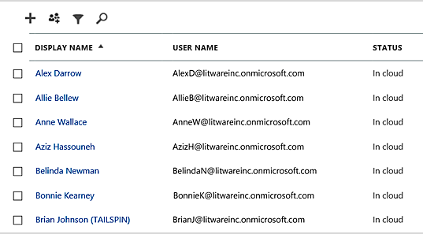

# <a name="why-you-need-to-use-powershell-for-microsoft-365"></a>¿Por qué necesita usar PowerShell para Microsoft 365?

*Este artículo afecta tanto a Office 365 Enterprise como a Microsoft 365 Enterprise*

Con el centro de administración de 365 de Microsoft, puede administrar sus licencias y cuentas de usuario de Microsoft 365. También puede administrar los servicios de Microsoft 365, como Exchange Online, Teams y SharePoint Online. Si, en su lugar, usa PowerShell para administrar estos servicios, puede aprovechar el entorno de la línea de comandos y del lenguaje de scripting para la velocidad, la automatización y las capacidades adicionales.
  
En este artículo se muestra cómo usar PowerShell para administrar Microsoft 365 para:
  
- Revelar información adicional que no puede ver en el centro de administración de 365 de Microsoft
    
- Configurar las características y la configuración solo posible con PowerShell
    
- Realizar operaciones masivas
    
- Filtrar datos
    
- Imprimir o guardar datos
    
- Administrar a través de servicios
    
Tenga en cuenta que PowerShell para Microsoft 365 es un conjunto de módulos para Windows PowerShell, que es un entorno de línea de comandos para plataformas y servicios basados en Windows. Este entorno crea un lenguaje de Shell de comandos que se puede extender con módulos adicionales. Proporciona una forma de ejecutar comandos o scripts sencillos o complejos. Por ejemplo, después de instalar los módulos de PowerShell para Microsoft 365 y conectarse a su suscripción a Microsoft 365, puede ejecutar el siguiente comando para enumerar todos los buzones de usuario para Microsoft Exchange Online:
  
```powershell
Get-Mailbox
```

También puede obtener la lista de buzones de correo mediante el centro de administración de Microsoft 365, pero no es fácil contar los elementos de todas las listas para todos los sitios de las aplicaciones Web.
  
PowerShell para Microsoft 365 está diseñado para ayudarle a administrar la 365 de Microsoft, no para reemplazar el centro de administración de Microsoft 365. Los administradores deben poder usar PowerShell para Microsoft 365 porque existen algunos procedimientos de configuración que solo se pueden realizar a través de PowerShell para los comandos de Microsoft 365. En estos casos, debe saber cómo:
  
- Instale los módulos de PowerShell para Microsoft 365 (solo se realiza una vez para cada equipo de administrador).
    
- Conéctese a su suscripción de Microsoft 365 (una vez por cada sesión de PowerShell).
    
- Recopilar la información necesaria para ejecutar los comandos de PowerShell necesarios para Microsoft 365.
    
- Ejecute PowerShell para los comandos de Microsoft 365.
    
Una vez que haya aprendido estas habilidades básicas, no es necesario que Enumere los usuarios de buzones de correo mediante el comando **Get-Mailbox** . Tampoco es necesario que comprenda cómo crear un nuevo comando como el comando mencionado anteriormente para contar todos los elementos de todas las listas para todos los sitios de las aplicaciones Web. Microsoft y la comunidad de administradores pueden ayudarle con tareas como sea necesario.
  
## <a name="powershell-for-microsoft-365-can-reveal-information-that-you-cant-see-with-the-microsoft-365-admin-center"></a>PowerShell para Microsoft 365 puede revelar información que no puede ver con el centro de administración de Microsoft 365

El centro de administración de 365 de Microsoft muestra una gran cantidad de información útil. Pero no muestra toda la información posible que Microsoft 365 almacena sobre los usuarios, las licencias, los buzones de correo y los sitios. A continuación, se muestra un ejemplo de *usuarios y grupos* en el centro de administración de Microsoft 365:
  

  
Esta vista proporciona la información que necesita en muchos casos. En cambio, algunas veces necesitará más. Por ejemplo, las licencias de Microsoft 365 (y las características de Microsoft 365 disponibles para un usuario) dependen en parte de la ubicación geográfica del usuario. Las directivas y características que puede ampliar a un usuario que vive en Estados Unidos podrían no ser las mismas que las que puede ampliar a un usuario en India o Bélgica. Siga estos pasos en el centro de administración de Microsoft 365 para determinar la ubicación geográfica de un usuario:
  
1. Haga doble clic en el **Nombre para mostrar** del usuario.
    
2. En el panel de visualización propiedades de usuario, seleccione **detalles**.
    
3. En la pantalla de detalles, seleccione **detalles adicionales**.
    
4. Desplácese hasta que encuentre el encabezado **país o región**:
    
     
  
5. Escriba el nombre para mostrar y la ubicación del usuario en una hoja de papel, o cópielo y péguelo en el Bloc de notas.
    
Debe repetir este procedimiento para cada usuario. Si tiene muchos usuarios, este proceso puede resultar tedioso. Con PowerShell para Microsoft 365, puede mostrar esta información para todos los usuarios con el siguiente comando:
  
```powershell
Get-AzureADUser | Select DisplayName, UsageLocation
```


>[!Note]
>PowerShell Core no es compatible con el módulo Microsoft Azure Active Directory para el módulo y los cmdlets de Windows PowerShell que tienen *msol* en su nombre. Debe ejecutar estos cmdlets de Windows PowerShell.
>

A continuación, se muestra un ejemplo de los resultados:
  
```powershell
DisplayName                               UsageLocation
-----------                               -------------
Bonnie Kearney                            GB
Fabrice Canel                             BR
Brian Johnson (TAILSPIN)                  US
Anne Wallace                              US
Alex Darrow                               US
David Longmuir                            BR
```

La interpretación de este comando de PowerShell es la siguiente: obtener todos los usuarios de la suscripción actual de Microsoft 365 (**Get-AzureADUser**), pero solo se muestra el nombre y la ubicación de cada usuario (**Seleccione DisplayName, UsageLocation**).
  
Como PowerShell para Microsoft 365 admite un lenguaje de Shell de comandos, puede seguir manipulando la información obtenida por el comando **Get-AzureADUser** . Por ejemplo, es posible que quiera ordenar estos usuarios por su ubicación, agrupando todos los usuarios de Brasil, todos los usuarios de Estados Unidos juntos, y así sucesivamente. Este es el comando:
  
```powershell
Get-AzureADUser | Select DisplayName, UsageLocation | Sort UsageLocation, DisplayName
```

A continuación, se muestra un ejemplo de los resultados:
  
```powershell
DisplayName                                 UsageLocation
-----------                                 -------------
David Longmuir                              BR
Fabrice Canel                               BR
Bonnie Kearney                              GB
Alex Darrow                                 US
Anne Wallace                                US
Brian Johnson (TAILSPIN)                    US
```

La interpretación de este comando de PowerShell es la siguiente: obtener todos los usuarios de la suscripción actual de Microsoft 365, pero solo mostrar el nombre y la ubicación de cada usuario y ordenarlos primero por su ubicación y, a continuación, su nombre (**Sort UsageLocation, DisplayName**).
  
También puede usar filtros adicionales. Por ejemplo, si solo quiere ver la información sobre los usuarios que están en Brasil, use este comando:
  
```powershell
Get-AzureADUser | Where {$_.UsageLocation -eq "BR"} | Select DisplayName, UsageLocation 
```

A continuación, se muestra un ejemplo de los resultados:
  
```powershell
DisplayName                                           UsageLocation
-----------                                           -------------
David Longmuir                                        BR
Fabrice Canel                                         BR
```

La interpretación de este comando de PowerShell es la siguiente: obtener todos los usuarios de la suscripción a Microsoft 365 actual cuya ubicación es Brasil (**donde {$ \_ . UsageLocation-EQ "BR"}**) y, a continuación, mostrar el nombre y la ubicación de cada usuario.
  
 **Una nota sobre dominios grandes**
  
Si tiene un dominio grande con decenas de miles de usuarios, pruebe algunos de los ejemplos que se muestran en este artículo podrían dar como límite la limitación. En función de factores como la potencia de procesamiento y el ancho de banda de red disponible, es posible que esté intentando realizar muchas tareas al mismo tiempo. Es posible que las organizaciones grandes deseen dividir algunas de estas operaciones de PowerShell en dos comandos.

Por ejemplo, el siguiente comando devuelve todas las cuentas de usuario y muestra el nombre y la ubicación de cada una de las siguientes opciones:
  
```powershell
Get-AzureADUser | Select DisplayName, UsageLocation
```

Esto funciona muy bien en los dominios más pequeños. Pero en una organización de gran tamaño, es posible que desee dividir esa operación en dos comandos: un comando para almacenar la información de la cuenta de usuario en una variable y otra para mostrar la información necesaria. Aquí le mostramos un ejemplo:
  
```powershell
$x = Get-AzureADUser
$x | Select DisplayName, UsageLocation
```

La interpretación de este conjunto de comandos de PowerShell es la siguiente:
1. Obtenga todos los usuarios de la suscripción actual de Microsoft 365 y almacene la información en una variable llamada $x (**$x = Get-AzureADUser**).
1.  Se muestra el contenido de la variable *$x*, pero solo se incluye el nombre y la ubicación de cada usuario (**$x | Seleccione DisplayName, UsageLocation**).
  
## <a name="microsoft-365-has-features-that-you-can-only-configure-with-powershell-for-microsoft-365"></a>Microsoft 365 tiene características que solo se pueden configurar con PowerShell para Microsoft 365

El centro de administración de 365 de Microsoft tiene como objetivo proporcionar acceso a tareas administrativas comunes y útiles que se aplican a la mayoría de los entornos. En otras palabras, el centro de administración de Microsoft 365 se diseñó para que el administrador normal pudiera llevar a cabo las tareas de administración más comunes. Pero hay algunas tareas que no se pueden realizar en el centro de administración.
  
Por ejemplo, el centro de administración de Skype empresarial online ofrece algunas opciones para crear invitaciones a reuniones personalizadas:
  

  
Con esta configuración, puede agregar un toque de personalización y profesionalidad a las invitaciones a reuniones. Pero hay más cosas a tener en la configuración de reunión que simplemente crear invitaciones a reuniones personalizadas. Por ejemplo, de forma predeterminada las reuniones permiten lo siguiente:
  
- A los usuarios anónimos obtener entrada automática a cada reunión.
    
- A los asistentes grabar la reunión.
    
- A todos los usuarios de la organización poder ser designados como moderadores cuando se unen a la reunión.
    
Esta configuración no está disponible en el centro de administración de Skype empresarial online. Puede controlarlos desde PowerShell para Microsoft 365. Este es un comando que deshabilita estas tres opciones:
  
```powershell
Set-CsMeetingConfiguration -AdmitAnonymousUsersByDefault $False -AllowConferenceRecording $False -DesignateAsPresenter "None"
```

> [!NOTE]
> Para ejecutar este comando, debe instalar el [módulo de PowerShell de Skype empresarial online ](https://www.microsoft.com/download/details.aspx?id=39366).
  
La interpretación de este comando de PowerShell es la siguiente:
 
1. En la configuración de las nuevas reuniones de Skype empresarial online (**set-CsMeetingConfiguration**), deshabilite la posibilidad de que los usuarios anónimos obtengan la entrada automática a las reuniones (**-AdmitAnonymousUsersByDefault $false**).
2.  Deshabilitar la posibilidad de que los asistentes graben reuniones (**-AllowConferenceRecording $false**).
3. No designe a todos los usuarios de su organización como moderadores (**-DesignateAsPresenter "none"**).
  
Para restaurar esta configuración predeterminada (habilitar las opciones), ejecute este comando:
  
```powershell
Set-CsMeetingConfiguration -AdmitAnonymousUsersByDefault $True -AllowConferenceRecording $True -DesignateAsPresenter "Company"
```

También existen otros escenarios similares, que son el motivo por el que los administradores deben saber cómo ejecutar PowerShell para los comandos de Microsoft 365.
  
## <a name="powershell-for-microsoft-365-is-great-for-bulk-operations"></a>PowerShell para Microsoft 365 es excelente para operaciones en masa

Las interfaces visuales como el centro de administración de Microsoft 365 son más útiles cuando se tiene una única operación que hacer. Por ejemplo, si necesita deshabilitar una cuenta de usuario, puede usar el centro de administración para buscar y desactivar rápidamente una casilla. Esto puede ser más fácil que realizar una operación similar en PowerShell.
  
Pero si tiene que cambiar muchas cosas o algunas cosas seleccionadas dentro de un conjunto amplio de otras cosas, es posible que el centro de administración de Microsoft 365 no sea la mejor herramienta. Por ejemplo, supongamos que tiene que cambiar el prefijo en miles de números de teléfono o quitar el usuario específico *Ken Myer* de todos sus sitios de SharePoint Online. ¿Cómo haría esto en el centro de administración de Microsoft 365?
  
En el último ejemplo, supongamos que tiene varios cientos de sitios de SharePoint Online y no sabe de cuáles Meyer es miembro. Tendría que empezar en el centro de administración de 365 de Microsoft y, a continuación, llevar a cabo este procedimiento para cada sitio:
  
1. Seleccione la **dirección URL** del sitio.
    
2. En el cuadro propiedades de la **colección de sitios** , seleccione el vínculo dirección del **sitio web** para abrir el sitio.
    
3. En el sitio, seleccione **compartir**.
    
4. En el cuadro de diálogo **compartir** , seleccione el vínculo que muestra todos los usuarios que tienen permisos en el sitio:
    
     
  
5. En el cuadro de diálogo **compartido con** , seleccione **avanzadas**.
    
6. Desplácese hacia abajo por la lista de usuarios, busque y seleccione Ken Myer (suponiendo que tiene permisos en el sitio) y, a continuación, seleccione **quitar permisos de usuario**.
    
Esto puede tardar *mucho* tiempo para varios cientos de sitios.
  
La alternativa es ejecutar el siguiente comando en PowerShell para Microsoft 365 para quitar a Ken Myer de todos los sitios:
  
```powershell
Get-SPOSite | ForEach {Remove-SPOUser -Site $_.Url -LoginName "kenmyer@litwareinc.com"}
```

> [!NOTE]
> Este comando requiere que instale el [módulo de PowerShell de SharePoint Online](https://docs.microsoft.com/powershell/sharepoint/sharepoint-online/connect-sharepoint-online?view=sharepoint-ps). 
  
La interpretación de este comando de PowerShell es la siguiente: obtener todos los sitios de SharePoint en la suscripción a Microsoft 365 actual (**Get-SPOSite**) y para cada sitio quitar Ken Meyer de la lista de usuarios que pueden acceder a él (**foreach {Remove-cónyuge-site $ \_ . URL-LoginName "kenmyer \@ litwareinc.com"}**).
  
Se le dice a Microsoft 365 que quite Ken Meyer de cada sitio, incluidos aquellos a los que no tiene acceso. Por lo tanto, los resultados mostrarán errores para los sitios a los que no tiene acceso. Se puede usar una condición adicional en este comando para quitar Ken Meyer solo de los sitios que le tienen en su lista de inicio de sesión. Pero los errores devueltos no causan ningún daño a los sitios. Este comando puede tardar unos minutos en ejecutarse en cientos de sitios, en lugar de horas de trabajo a través del centro de administración de Microsoft 365.
  
Este es otro ejemplo de operación masiva. Use este comando para agregar *Bonnie Kearney*, un nuevo administrador de SharePoint, a todos los sitios de la organización:
  
```powershell
Get-SPOSite | ForEach {Add-SPOUser -Site $_.Url -LoginName "bkearney@litwareinc.com" -Group "Members"}
```

La interpretación de este comando de PowerShell es la siguiente: obtener todos los sitios de SharePoint en la suscripción actual de Microsoft 365 y para cada sitio permitir el acceso a Bonnie Kearney agregando su nombre de inicio de sesión al grupo miembros del sitio (**foreach {Add-cónyuge-site $ \_ . URL-LoginName "bkearney \@ litwareinc.com"-Group "Members"}**).
  
## <a name="powershell-for-microsoft-365-is-great-at-filtering-data"></a>PowerShell para Microsoft 365 es excelente en el filtrado de datos

El centro de administración de 365 de Microsoft ofrece varias formas de filtrar los datos para encontrar fácilmente un subconjunto de información. Por ejemplo, Exchange facilita el filtrado de prácticamente cualquier propiedad de un buzón de usuario. Por ejemplo, esta es la lista de buzones de correo para todos los usuarios que viven en la ciudad de Bloomington:
  

  
El Centro de administración de Exchange también le permite combinar criterios de filtro. Por ejemplo, puede encontrar los buzones de correo de todas las personas que viven en Bloomington y trabajar en el Departamento de finanzas.
  
Pero hay limitaciones en lo que puede hacer en el centro de administración de Exchange. Por ejemplo, no podría encontrar tan fácilmente los buzones de las personas que viven en Bloomington *o* San Diego, o los buzones de correo de todas las personas que no viven en Bloomington.
  
Puede usar el siguiente comando de PowerShell para Microsoft 365 para obtener una lista de buzones de correo de todas las personas que viven en Bloomington o San Diego:
  
```powershell
Get-User | Where {$_.RecipientTypeDetails -eq "UserMailbox" -and ($_.City -eq "San Diego" -or $_.City -eq "Bloomington")} | Select DisplayName, City
```

A continuación, se muestra un ejemplo de los resultados:
  
```powershell
DisplayName                              City
-----------                              ----
Alex Darrow                              San Diego
Bonnie Kearney                           San Diego
Julian Isla                              Bloomington
Rob Young                                Bloomington
```

La interpretación de este comando de PowerShell es la siguiente: obtener todos los usuarios de la suscripción actual de Microsoft 365 que tienen un buzón de correo en la ciudad de San Diego o Bloomington (**donde {$ \_ . RecipientTypeDetails-EQ "UserMailbox"-y ($ \_ . City-EQ "San Diego"-o $ \_ . City-EQ "Bloomington")}**) y, a continuación, mostrar el nombre y la ciudad de cada (**Seleccione DisplayName, City**).
  
Y este es el comando para enumerar todos los buzones de correo de las personas que viven en cualquier lugar excepto Bloomington:
  
```powershell
Get-User | Where {$_.RecipientTypeDetails -eq "UserMailbox" -and $_.City -ne "Bloomington"} | Select DisplayName, City
```

A continuación, se muestra un ejemplo de los resultados:
  
```powershell
DisplayName                               City
-----------                               ----
MOD Administrator                         Redmond
Alex Darrow                               San Diego
Allie Bellew                              Bellevue
Anne Wallace                              Louisville
Aziz Hassouneh                            Cairo
Belinda Newman                            Charlotte
Bonnie Kearney                            San Diego
David Longmuir                            Waukesha
Denis Dehenne                             Birmingham
Garret Vargas                             Seattle
Garth Fort                                Tulsa
Janet Schorr                              Bellevue
```

La interpretación de este comando de PowerShell es la siguiente: obtener todos los usuarios de la suscripción de Microsoft 365 actual que tienen un buzón no ubicado en la ciudad de Bloomington (**donde {$ \_ . RecipientTypeDetails-EQ "UserMailbox"-y $ \_ . City-ne "Bloomington"}**) y, a continuación, mostrar el nombre y la ciudad de cada uno.
  
### <a name="use-wildcards"></a>Usar caracteres comodín

También puede usar caracteres comodín en los filtros de PowerShell para hacer coincidir parte de un nombre. Por ejemplo, supongamos que está buscando una cuenta de usuario. Todo lo que puede recordar es que el apellido del usuario fue *Anderson* o quizá *Henderson* o *Jorgenson*.
  
Puede realizar un seguimiento de ese usuario en el centro de administración de Microsoft 365 mediante la herramienta de búsqueda y llevar a cabo tres búsquedas diferentes:
  
- Una para  *Anderson* 
    
- Otra para  *Henderson* 
    
- Y otra para  *Jorgenson* 
    
Como todos los tres nombres terminan en "EZ", puede decirle a PowerShell que muestre todos los usuarios cuyo nombre termina en "hijo". Este es el comando:
  
```powershell
Get-User -Filter '{LastName -like "*son"}'
```

La interpretación de este comando de PowerShell es la siguiente: Obtenga todos los usuarios de la suscripción actual de Microsoft 365, pero use un filtro que solo Enumere los usuarios cuyos apellidos terminen en "hijo" (**-Filter ' {LastName-like " \* hijo"} '**). Las \* siglas de cualquier conjunto de caracteres, que son letras del apellido del usuario.
  
## <a name="powershell-for-microsoft-365-makes-it-easy-to-print-or-save-data"></a>PowerShell para Microsoft 365 simplifica la tarea de imprimir o guardar datos

El centro de administración de 365 de Microsoft permite ver las listas de datos. Este es un ejemplo del centro de administración de Skype empresarial online que muestra una lista de usuarios que se han habilitado para Skype empresarial online:
  

  
Para guardar la información en un archivo, debe pegarla en un documento o en una hoja de cálculo de Microsoft Excel. Cualquier caso puede requerir un formato adicional. Además, el centro de administración de Microsoft 365 no ofrece una forma de imprimir directamente la lista que se muestra.
  
Afortunadamente, puede usar PowerShell para no solo mostrar la lista, sino para guardarla en un archivo que se pueda importar fácilmente a Excel. Este es un comando de ejemplo para guardar los datos de usuario de Skype empresarial online en un archivo de valores separados por comas (CSV), que se puede importar fácilmente como una tabla en una hoja de cálculo de Excel:
  
```powershell
Get-CsOnlineUser | Select DisplayName, UserPrincipalName, UsageLocation | Export-Csv -Path "C:\Logs\SfBUsers.csv" -NoTypeInformation
```

A continuación, se muestra un ejemplo de los resultados:
  

  
La interpretación de este comando de PowerShell es la siguiente: obtener todos los usuarios de Skype empresarial online en la suscripción actual de Microsoft 365 (**Get-CsOnlineUser**); Obtenga solo el nombre de usuario, el UPN y la ubicación (**Seleccione DisplayName, UserPrincipalName, UsageLocation**); y, a continuación, guarde esa información en un archivo CSV denominado C: \\ logs \\SfBUsers.csv (**Export-CSV-path "C: \\ logs \\SfBUsers.csv"-NoTypeInformation**).
  
También puede usar las opciones para guardar esta lista como un archivo XML o una página HTML. De hecho, con comandos de PowerShell adicionales, puede guardarlos directamente como un archivo de Excel, con cualquier formato personalizado que desee.
  
También puede enviar el resultado de un comando de PowerShell que muestra una lista directamente en la impresora predeterminada de Windows. Este es un comando de ejemplo:
  
```powershell
Get-CsOnlineUser | Select DisplayName, UserPrincipalName, UsageLocation | Out-Printer
```

Y este es el aspecto que tendrá el documento impreso:
  

  
La interpretación de este comando de PowerShell es la siguiente: obtener todos los usuarios de Skype empresarial online en la suscripción actual de Microsoft 365; Obtenga solo el nombre de usuario, el UPN y la ubicación; y, a continuación, envíe esa información a la impresora predeterminada de Windows (**out-Printer**).
  
El documento impreso tiene el mismo formato sencillo que la visualización en la ventana de comandos de PowerShell. Para obtener una copia impresa, solo tiene que agregar **| Fuera** de la impresora al final del comando.
  
## <a name="powershell-for-microsoft-365-lets-you-manage-across-server-products"></a>PowerShell para Microsoft 365 le permite administrar los productos de servidor

Los componentes que forman Microsoft 365 están diseñados para trabajar juntos. Por ejemplo, supongamos que agrega un nuevo usuario a Microsoft 365 y especifica dicha información como el Departamento y el número de teléfono del usuario. La información estará disponible si obtiene acceso a la información del usuario en cualquiera de los servicios de Microsoft 365: Skype empresarial online, Exchange o SharePoint.
  
Pero eso es para la información habitual que abarca el conjunto de productos. La información específica del producto, como la información sobre el buzón de correo de Exchange de un usuario, no suele estar disponible en todo el conjunto de aplicaciones. Por ejemplo, la información acerca de si el buzón de un usuario está habilitado o no está disponible únicamente en el centro de administración de Exchange.
  
Suponga que quiere crear un informe que muestre la información siguiente de todos los usuarios:
  
- El nombre para mostrar del usuario
    
- Si el usuario tiene licencia para Microsoft 365
    
- Si el buzón de Exchange del usuario se ha habilitado
    
- Si el usuario está habilitado en Skype Empresarial Online
    
No puede crear fácilmente un informe de este tipo en el centro de administración de Microsoft 365. En su lugar, tendría que crear un documento independiente para almacenar la información, como una hoja de cálculo de Excel. A continuación, obtenga todos los nombres de usuario e información de licencia del centro de administración de Microsoft 365, obtenga información del buzón del centro de administración de Exchange, obtenga información de Skype empresarial online del centro de administración de Skype empresarial online y, a continuación, combine dicha información.
  
La alternativa es usar un script de PowerShell para compilar el informe por usted.
  
El siguiente script de ejemplo es más complicado que los comandos que ha visto hasta ahora en este artículo. Sin embargo, se muestra el potencial de usar PowerShell para crear vistas de información que son difíciles de obtener de otro modo. Este es el script para compilar y mostrar la lista que necesita:
  
```powershell
$x = Get-AzureADUser

foreach ($i in $x)
    {
      $y = Get-Mailbox -Identity $i.UserPrincipalName
      $i | Add-Member -MemberType NoteProperty -Name IsMailboxEnabled -Value $y.IsMailboxEnabled

      $y = Get-CsOnlineUser -Identity $i.UserPrincipalName
      $i | Add-Member -MemberType NoteProperty -Name EnabledForSfB -Value $y.Enabled
    }

$x | Select DisplayName, IsLicensed, IsMailboxEnabled, EnabledforSfB
```

A continuación, se muestra un ejemplo de los resultados:
  
```powershell
DisplayName             IsLicensed   IsMailboxEnabled   EnabledForSfB
-----------             ----------   ----------------   --------------
Bonnie Kearney          True         True               True
Fabrice Canel           True         True               True
Brian Johnson           False        True               False
Anne Wallace            True         True               True
Alex Darrow             True         True               True
David Longmuir          True         True               True
Katy Jordan             False        True               False
Molly Dempsey           False        True               False
```

La interpretación de este script de PowerShell es la siguiente:  

1. Obtenga todos los usuarios de la suscripción actual de Microsoft 365 y almacene la información en una variable que se denomine *$x* (**$x = Get-AzureADUser**).
1. Inicie un bucle que se ejecuta en todos los usuarios de la variable $x (**foreach ($i en $x)**).  
1. Defina una variable llamada *$y* y almacene en ella la información del buzón del usuario (**$y = Get-Mailbox-Identity $i. UserPrincipalName**).
1. Agregue una nueva propiedad a la información del usuario que se denomina *IsMailBoxEnabled*. Establézcalo en el valor de la propiedad IsMailBoxEnabled del buzón del usuario (**$i | Add-Member-MemberType NoteProperty-Name IsMailBoxEnabled-value $y. IsMailBoxEnabled**).
1. Defina una variable llamada *$y*y almacene la información de Skype empresarial online del usuario en ella (**$y = Get-CsOnlineUser-Identity $i. UserPrincipalName**).
1. Agregue una nueva propiedad a la información del usuario que se denomina *EnabledForSfB*. Establézcalo en el valor de la propiedad Enabled de la información de Skype empresarial online del usuario (**$i | Add-Member-MemberType NoteProperty-Name EnabledForSfB-value $y. Enabled**).
1. Mostrar la lista de usuarios, pero incluya únicamente su nombre, si tienen licencia y las dos nuevas propiedades que indican si su buzón está habilitado y si están habilitados para Skype empresarial online (**$x | Seleccione DisplayName, IsLicensed, IsMailboxEnabled, EnabledforSfB**).
  
## <a name="see-also"></a>Recursos adicionales

[Introducción a PowerShell para Microsoft 365](getting-started-with-microsoft-365-powershell.md)
  
[Administrar cuentas de usuario, licencias y grupos de Microsoft 365 con PowerShell](manage-user-accounts-and-licenses-with-microsoft-365-powershell.md)
  
[Usar Windows PowerShell para crear informes en Microsoft 365](use-windows-powershell-to-create-reports-in-microsoft-365.md)
