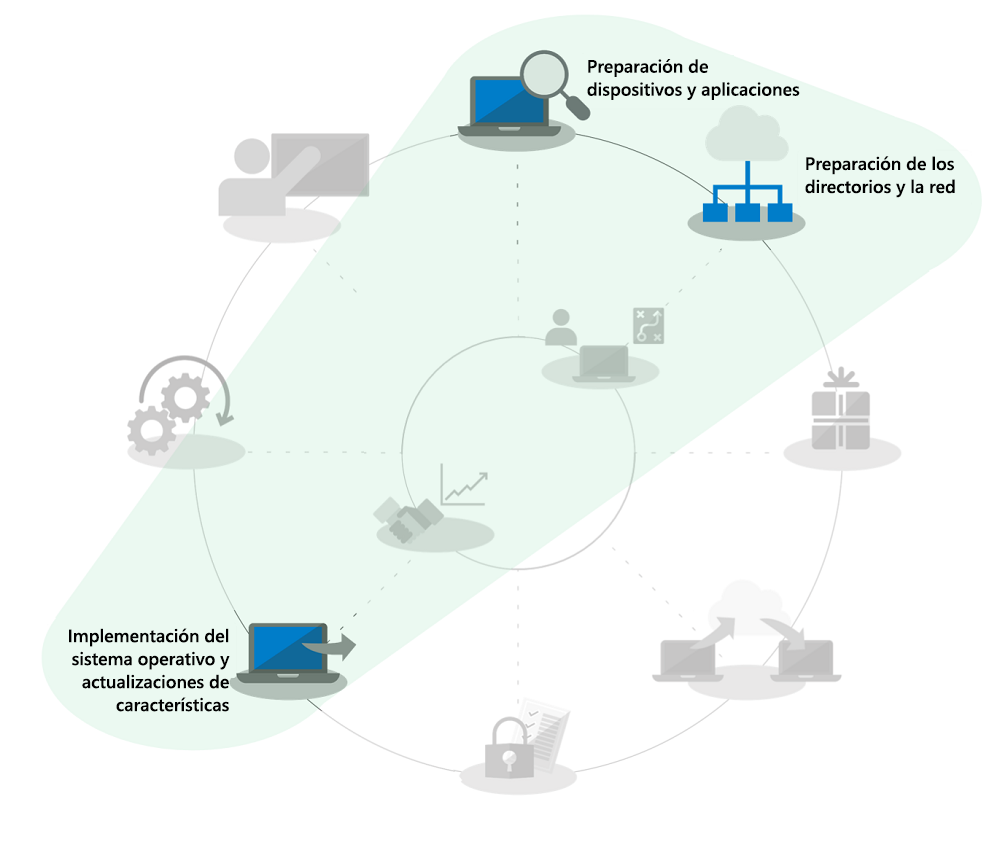
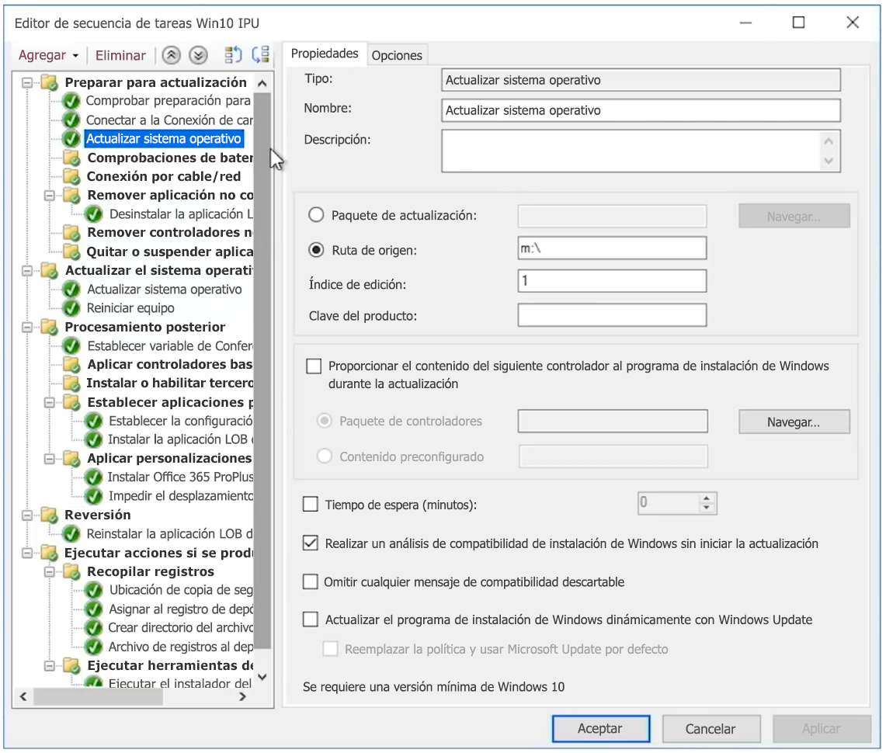

# Actualizaciones locales automatizadas de Windows 7 a Windows 10 para grandes empresasWindows 7 to Windows 10 automated in-place upgrades for large organizations

A partir del 14 de enero de 2020, ya no se proporcionarán actualizaciones de seguridad ni soporte técnico para equipos PC que ejecutan Windows 7.Starting January 14, 2020, security updates or support for PCs running Windows 7 will no longer be provided. A pocos meses de distancia para pasar de Windows 7 a Windows 10 y varias opciones para implementar, una de las preguntas más frecuentes en la comunidad de TI es la manera más rápida de pasar de Windows 7 a Windows 10.With just a months left to shift from Windows 7 to Windows 10 and multiple options to deploy, a common question in the IT community is, “What’s the fastest way to move from Windows 7 to Windows 10?” La respuesta es llevar a cabo actualizaciones locales para equipos existentes para puede reducir el enfoque en varios aspectos del proceso de implementación de escritorio.The short answer is to perform in-place upgrades for existing PCs and in doing that you can reduce focus on several aspects of the desktop deployment process.

Al usar las actualizaciones locales, se reduce considerablemente el ámbito de varios procesos de implementación de escritorio, especialmente:Using in-place upgrades, several desktop deployment processes get reduced dramatically in scope, especially:

  - **El empaquetado de aplicaciones** y reentrega de aplicaciones de línea de negocio necesarias: simplemente se realizan a partir del entorno de Windows 7.**Application packaging** and redelivery of required line-of-business apps – these are simply carried forward from the Windows 7 environment

  - **La migración de archivos** y la configuración de usuario básica: también se realizan a partir la instalación anterior cuando el mismo usuario conserva el dispositivo.**File migration** and basic user settings – these are also carried forward from the previous install when the same user retains the device

Las tareas atenuadas en el gráfico de la rueda del proceso de implementación anterior no son elementos que se pueden ignorar completamente, pero para ahorrar tiempo se presupone que llevará a cabo la configuración de seguridad y cambiará los procesos de actualización de software después de la implementación. Suponemos que la formación de usuarios para el componente de Windows se ha producido en gran medida en casa para los usuarios, ya que los equipos con Windows que se adquirieron de forma privada desde 2012, en la mayoría de los casos, no tenía Windows 7 precargado y desde el lanzamiento de Windows 10, en 2015, la mayoría de los sistemas domésticos de Windows 7 también se han actualizado a Windows 10.The grayed-out tasks in the deployment process wheel graphic above are not items that you can completely ignore, but to save time this assumes that you’ll bring forward your security configuration, change software update processes post-deployment, and we’ll assume that your user training for the Windows component has largely happened at home for your users, as privately purchased Windows computers since 2012 for most part have not had Windows 7 pre-loaded and since the release of Windows 10 in 2015, the majority of Windows 7 home systems have also been upgraded to Windows 10.

## Confiabilidad, elementos de protección y escala de la actualización localIn-place upgrade reliability, safeguards, and scale

Las actualizaciones locales a Windows 10 son un método confiable para mover un dispositivo existente que ejecuta Windows 7 o posterior a Windows 10, sin requerir la migración de archivos o la reinstalación de aplicaciones.In-place upgrades to Windows 10 are a reliable approach for moving an existing device running Windows 7 or newer to Windows 10, without requiring file migration or application reinstallation. Después de una actualización local, los archivos, las opciones de configuración y las aplicaciones disponibles del usuario son coherentes con la instalación de Windows 7 anterior.After an in-place upgrade, the user’s files, settings and available apps are consistent with their previous Windows 7 installation. Aunque es posible que quiera aprovechar esta oportunidad para limpiar aplicaciones o configuraciones existentes, en realidad a medida que nos acercamos a la fecha de fin de soporte de Windows 7 en enero de 2020, no queda mucho tiempo para buscar otras opciones.While you might want to take this opportunity to clean-up existing apps or settings, realistically as we get closer to the Windows 7 end of support date in January 2020, time is running out to pursue other options. Las actualizaciones también funcionan desde arquitecturas similares (de 32 bits a 32 bits o de 64 bits a 64 bits) y versiones similares de Windows (de Professional a Pro o de Enterprise a Enterprise).Upgrades also work when moving from like-to-like architectures (32-bit to 32-bit or 64-bit to 64-bit) and like-to-like editions of Windows (Professional to Pro or Enterprise to Enterprise).

De forma predeterminada, el proceso de actualización realiza una copia de seguridad de la instalación anterior de Windows como parte de la actualización, por lo que en caso de que se produzca un error de actualización o en caso de que una aplicación o un dispositivo no funcione correctamente después de la actualización, el equipo puede revertir a Windows 7.The upgrade process by default backs-up your previous Windows installation as part of upgrade, so that in the event of an upgrade failure or if a device or application doesn’t function properly post-upgrade, the computer can roll back to Windows 7. De forma predeterminada, los equipos actualizados tienen 10 días para que pueda revertir manualmente a Windows 7, si es necesario.Upgraded PCs by default have 10 days so you can manually initiate a roll back to Windows 7 if necessary.

Las actualizaciones locales se pueden automatizar con herramientas de implementación de sistema operativo, como [Microsoft Endpoint Configuration Manager](https://docs.microsoft.com/configmgr/osd/deploy-use/create-a-task-sequence-to-upgrade-an-operating-system) o [Microsoft Deployment Toolkit](https://docs.microsoft.com/windows/deployment/upgrade/upgrade-to-windows-10-with-the-microsoft-deployment-toolkit).In-place upgrades can be automated using operating system deployment tools like [Microsoft Endpoint Configuration Manager](https://docs.microsoft.com/configmgr/osd/deploy-use/create-a-task-sequence-to-upgrade-an-operating-system) or the [Microsoft Deployment Toolkit](https://docs.microsoft.com/windows/deployment/upgrade/upgrade-to-windows-10-with-the-microsoft-deployment-toolkit). En este artículo, se resaltan los métodos y las optimizaciones automatizadas, así como los vínculos a recursos relacionados para obtener ayuda adicional.This article highlights the automated approaches and optimizations along with links to related resources for additional help.

## Actualizar un número reducido de equiposUpgrading a small number of computers

Para un único equipo o un número reducido de equipos, el método manual para la actualización es generalmente la mejor opción en comparación con los métodos más automatizados.For a single computer or a handful of computers, the manual approach to upgrade is usually the best option compared to more automated approaches. Puede encontrar el software y las licencias necesarios en [Microsoft Store](https://go.microsoft.com/fwlink/p/?LinkId=808282), en otros proveedores de software o en el [Centro de servicios de licencias por volumen](https://www.microsoft.com/licensing/servicecenter/default.aspx), si tiene licencias por volumen.You can find the necessary software and licenses at the [Microsoft Store](https://go.microsoft.com/fwlink/p/?LinkId=808282), other software retailers, or at the [Volume Licensing Service Center](https://www.microsoft.com/licensing/servicecenter/default.aspx) if you have volume licensing. Para obtener instrucciones detalladas sobre cómo actualizar un único equipo a Windows 10, así como las opciones de restauración posteriores a la actualización, vea la [Guía paso a paso de la actualización manual de Windows 7 a Windows 10](https://docs.microsoft.com/microsoft-365/enterprise/windows-7-to-windows-10-upgrade).For detailed guidance to upgrade a single PC to Windows 10 as well as post-upgrade restore options, see the [Windows 7 to Windows 10 manual upgrade step-by-step guide](https://docs.microsoft.com/microsoft-365/enterprise/windows-7-to-windows-10-upgrade).

## Cómo actualizar muchos equiposHow to upgrade many computers

Si administra decenas o miles de equipos, la mejor opción es llevar a cabo actualizaciones locales con la automatización de la secuencia de tareas con Microsoft Endpoint Configuration Manager o Microsoft Deployment Toolkit.If you manage dozens or thousands of computers, then your best option is to perform in-place upgrades using task sequence automation with Microsoft Endpoint Configuration Manager or the Microsoft Deployment Toolkit. Aunque el proceso es muy confiable en la mayoría de los casos, en función del número de equipos que se actualizan, aún tiene sentido contar con las pruebas y controles necesarios para asegurar el éxito a escala.While the process is very reliable in most situations, depending on the number of PCs you are upgrading, it still makes sense to have the necessary testing and controls in place to ensure success at scale.

Esto quiere decir que puede omitir la preparación del directorio o las tareas asociadas con Azure Active Directory, Office, la entrega y empaquetado de aplicaciones de línea de negocio y la migración de los archivos de usuario, ya que estos aspectos se conservan como parte de la actualización y al menos se debe llevar adelante la seguridad.This means that you may skip directory readiness or tasks associated with Azure Active Directory, Office and line of business app delivery and packaging and user file migration since those aspects are retained as part of upgrade, and security should be at minimum carried forward. Todas estas áreas se pueden mejorar a lo largo del tiempo.These areas can all be enhanced over time.

La opción de implementación de actualización se cubre en [Actualizaciones de características e implementación del sistema operativo](https://www.aka.ms/mdd6) y, aunque puede crear fácilmente soluciones con scripts que ejecuten el programa de instalación de Windows 10 de manera automatizada con mínima o ninguna interacción de administrador, una secuencia de tareas le proporcionará un control más granular para:The upgrade deployment option is covered in [OS Deployment and Feature Updates](https://www.aka.ms/mdd6) and although you can easily build scripted solutions that will run Windows 10 setup in an automated way with minimal or no admin interaction, a task sequence will give you more granular control to:

  - Realizar comprobaciones previas a la implementación,Perform pre-deployment checks,

  - Administrar el estado de cifrado de unidad antes de la actualización,Manage drive encryption state pre-upgrade,

  - Desinstalar controladores y aplicaciones problemáticas conocidos antes de la actualización,Uninstall known problematic drivers and apps pre-upgrade,

  - Instalar controladores y aplicaciones adicionales después de la actualización,Install additional drivers and apps post-upgrade,

  - Administrar el estado de cifrado de unidad después de la actualización,Manage drive encryption state post-upgrade,

  - Restaurar un equipo a un estado anterior, donde se reinstalan las aplicaciones o los controladores desinstalados (en caso de que se produzca un error en la actualización),Restore a PC to a previous state – where uninstalled apps or drivers are reinstalled – in the event of a failed upgrade,

  - Además de todo lo que necesite configurar para que esté todo listoAlong with anything else you need to configure to achieve a business ready state

Las razones más comunes por las que las actualizaciones no se completan o no se pueden llevar a cabo son problemas relacionados con:The most common reasons upgrades may not complete or are not possible include challenges with:

  - Controladores de dispositivos obsoletosOutdated device drivers

  - Cifrado de disco de terceros3rd party disk encryption

  - Soluciones de código de bajo nivel, como antimalware, VPN o virtualizaciónLow level code solutions, such as anti-malware, VPN or virtualization

Las plantillas de [Secuencia de tareas para actualización](https://docs.microsoft.com/configmgr/osd/deploy-use/create-a-task-sequence-to-upgrade-an-operating-system) están integradas en la rama actual de Microsoft Endpoint Configuration Manager y han estado disponibles para varias versiones.[Upgrade task sequence](https://docs.microsoft.com/configmgr/osd/deploy-use/create-a-task-sequence-to-upgrade-an-operating-system) templates are built into Microsoft Endpoint Configuration Manager (current branch) and have been available for several releases. En las versiones más recientes se han producido mejoras tecnológicas considerables para Configuration Manager que hacen que el proceso sea aún más eficaz para determinar la preparación de la compatibilidad de dispositivos y de Office, reducir el tráfico de red y configurar nuevas opciones como la copia de seguridad de OneDrive.In recent releases, there have been significant technology enhancements to Configuration Manager that make the process even more efficient for determining device and Office compatibility readiness, reducing network traffic, and configuring new options such as OneDrive backup. Vea este [programa de Microsoft Mechanics](https://youtu.be/CYRnAmCD7ls) para obtener más información sobre las actualizaciones más recientes de la implementación de sistema operativo de Configuration Manager.Watch this [Microsoft Mechanics show](https://youtu.be/CYRnAmCD7ls) to learn more about recent updates to Configuration Manager OS deployment.

Si no usa Microsoft Endpoint Configuration Manager, puede usar Microsoft Deployment Toolkit para crear y ejecutar secuencias de tareas de implementación de actualización.If you do not use Microsoft Endpoint Configuration Manager, you can use the Microsoft Deployment Toolkit to build and execute upgrade deployment task sequences.

## Almacenar en caché previamente actualizaciones de secuencia de tareasPre-cache task sequence upgrades

La [opción de almacenar en caché previamente](https://docs.microsoft.com/configmgr/osd/deploy-use/create-a-task-sequence-to-upgrade-an-operating-system#configure-pre-cache-content) de la secuencia de tareas de implementación de Configuration Manager permite a los clientes descargar contenido de paquetes de actualización del sistema operativo relevante antes de que la secuencia de tareas actualice el mismo.The [pre-cache option](https://docs.microsoft.com/configmgr/osd/deploy-use/create-a-task-sequence-to-upgrade-an-operating-system#configure-pre-cache-content) for Configuration Manager deployment task sequence allows clients to download relevant OS upgrade package content before the task sequence upgrades the operating system. Anteriormente, al iniciar la secuencia de tareas se iniciaba la descarga del contenido del paquete.Previously, initiating the task sequence would initiate the download of package content. El contenido almacenado en caché previamente también ofrece la opción de que el cliente solo pueda descargar el paquete de actualización del sistema operativo disponible y descargar el resto del contenido al que se hace referencia en cuanto reciba la implementación.Pre-cache content also gives you the option for the client to only download the applicable OS upgrade package and all other referenced content as soon as it receives the deployment.

Almacenar en caché previamente secuencias de tareas combinadas con los exámenes de compatibilidadPre-cache task sequences combined with compatibility scans

Además de ahorrar tiempo para la descarga del paquete, puede almacenar en caché previamente el paquete de actualización y usar el programa de instalación de Windows para evaluar si la actualización local se realizará correctamente antes de ejecutar la actualización de Windows real.In addition to saving time for the package download, you can pre-cache the upgrade package and use Windows setup to assess whether the in-place upgrade will succeed prior to executing the actual Windows upgrade. La siguiente sintaxis de línea de comandos puede usarse para ejecutar de forma silenciosa un examen de compatibilidad y averiguar si el programa de instalación de Windows considera que el dispositivo está listo para la actualización.The following command line syntax can be used to silently execute a compatibility scan and find out whether or not Windows Setup assesses the device as ready for upgrade.

Luego, se enviarán los registros a la ruta de acceso del servidor definida y el programa de instalación de Windows no se mostrará al usuario y se cerrará sin la intervención del mismo.Logs will then be sent to your defined server path and Windows Setup will not show itself to the user and close without user interaction.

Los resultados de los registros en sí serán:The results of the logs themselves will be:

1.  Si el programa de instalación no encuentra problemas de compatibilidad y parece que el equipo cumple todos los requisitos, devolverá MOSETUP\_E\_COMPAT\_SCANONLY (0xC1900210)If Setup does not find any compatibility issue and the PC appears to meet all requirements, it will return MOSETUP\_E\_COMPAT\_SCANONLY (0xC1900210)

2.  Si el programa de instalación encuentra problemas de compatibilidad, como aplicaciones incompatibles, devolverá MOSETUP\_E\_COMPAT\_INSTALLREQ\_BLOCK (0xC1900208)If Setup finds actionable compatibility issues, like apps known incompatible, it will return MOSETUP\_E\_COMPAT\_INSTALLREQ\_BLOCK (0xC1900208)

3.  Si el programa de instalación encuentra que el equipo no es apto para Windows 10, devolverá MOSETUP\_E\_COMPAT\_SYSREQ\_BLOCK (0xC1900200)If Setup finds the PC is not eligible for Windows 10, it will return MOSETUP\_E\_COMPAT\_SYSREQ\_BLOCK (0xC1900200)

4.  Si el programa de instalación encuentra que el equipo no tiene suficiente espacio libre para la instalación, devolverá MOSETUP\_E\_INSTALLDISKSPACE\_BLOCK (0xC190020E)If Setup finds that PC does not have enough free space to install, it will return MOSETUP\_E\_INSTALLDISKSPACE\_BLOCK (0xC190020E)

Una vez que haya implementado las secuencias almacenadas en caché previamente con los exámenes de compatibilidad en un gran número de equipos de una colección, puede empezar a analizar los archivos de registro para la preparación del dispositivo.Once you’ve deployed pre-cache sequences with compatibility scans to a large number of PCs in a collection, you can begin to parse the log files for device readiness. Al usar las salidas enumeradas anteriormente, \#1 (0xC1900210) puede accionarse como "listo para implementar" y \#4 (0xC190020E) puede accionarse liberando espacio en el disco.Using the outputs listed above, \#1 (0xC1900210) can be actioned as “ready to deploy” and \#4 (0xC190020E) can be actioned by freeing up disk space. Aquí, deberá tener cuidado con el contenido que quiere eliminar, pero puede empezar con la Limpieza de actualizaciones de Windows, la Papelera de reciclaje y los Archivos temporales que, en muchos casos, le proporcionarán suficiente espacio para una correcta actualización.Here, you’ll want to be careful about what to delete, but Windows Update Cleanup, Recycle Bin, and Temporary Files are places to start and many cases will provide enough space for the upgrade to succeed. Puede ejecutar el examen de compatibilidad tan a menudo como sea necesario hasta que el equipo esté listo para la actualización local.Can you run the compat scan as often as needed until the PC is found ready for the in-place upgrade. Puede encontrar más información sobre las opciones de línea de comandos del programa de instalación de Windows en <https://aka.ms/setupswitches>You can find more information about Windows Setup command line options at <https://aka.ms/setupswitches>

## [Centro de implementación de escritorioDesktop Deployment Center](https://aka.ms/howtoshift)
