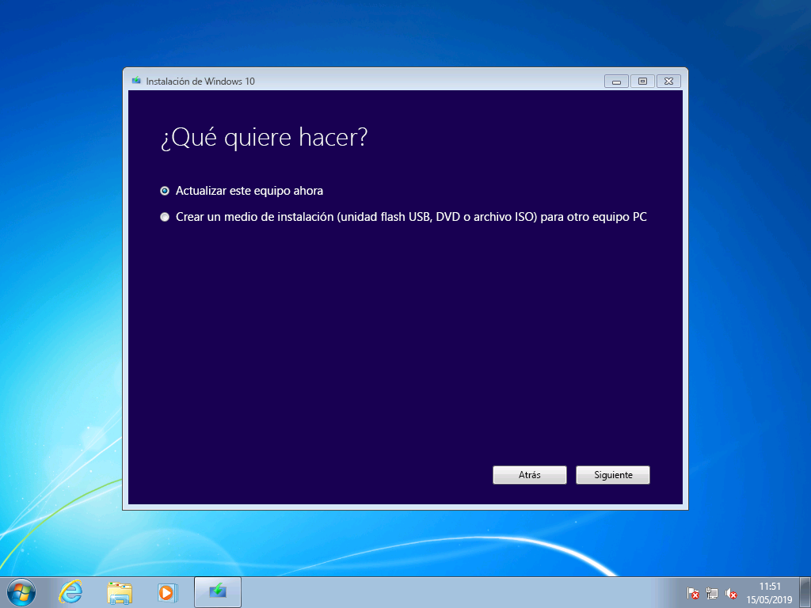
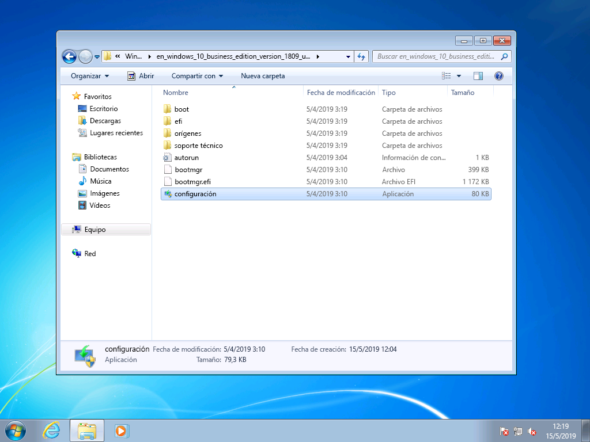
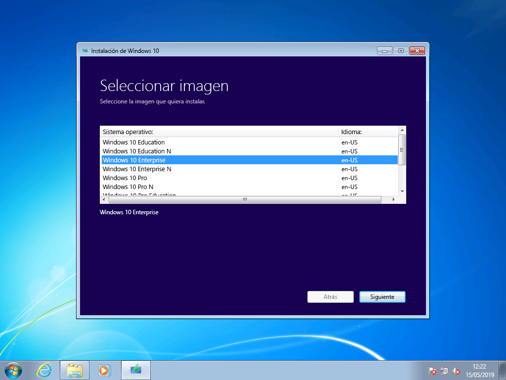
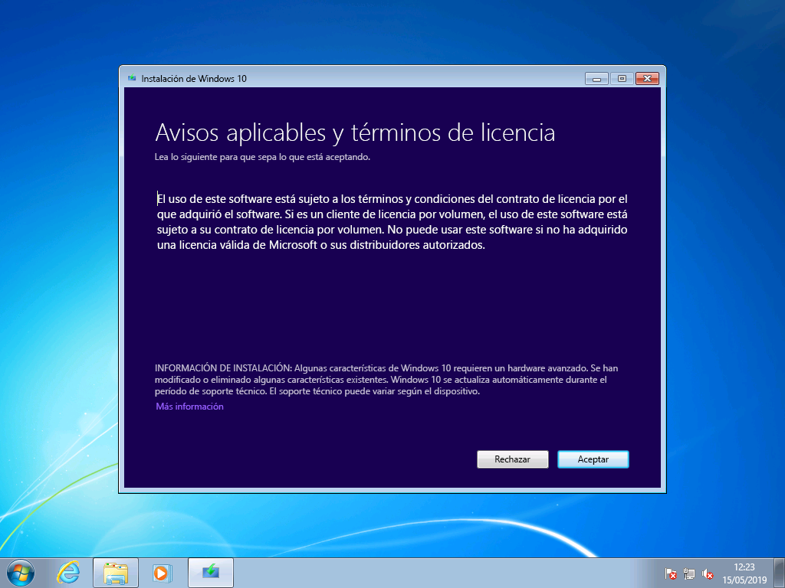
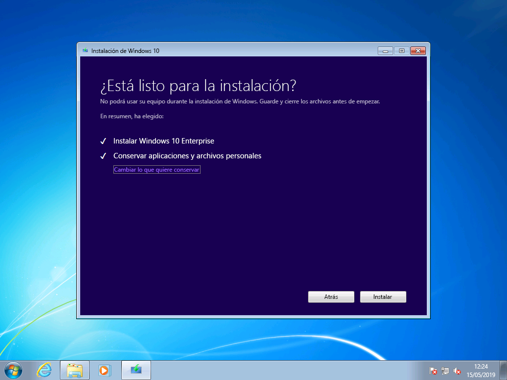
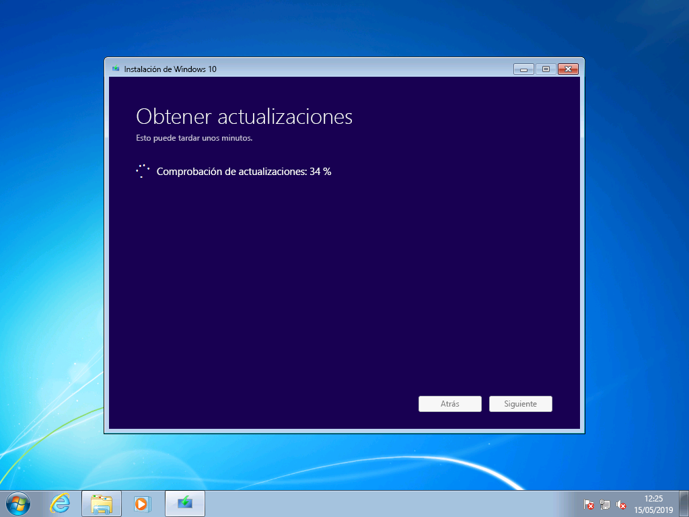
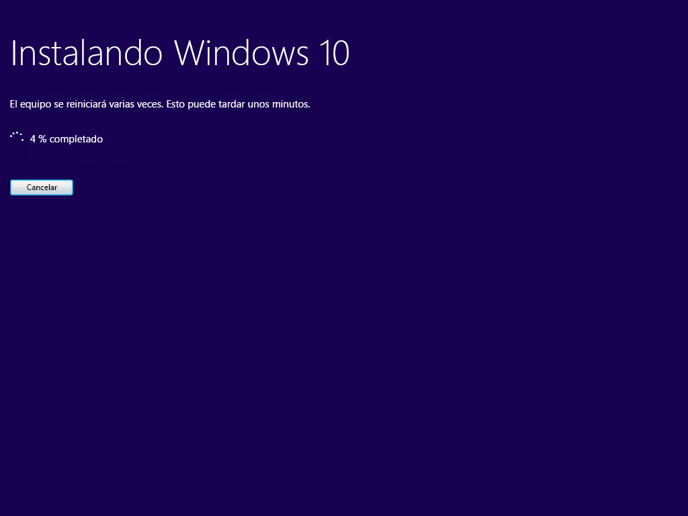
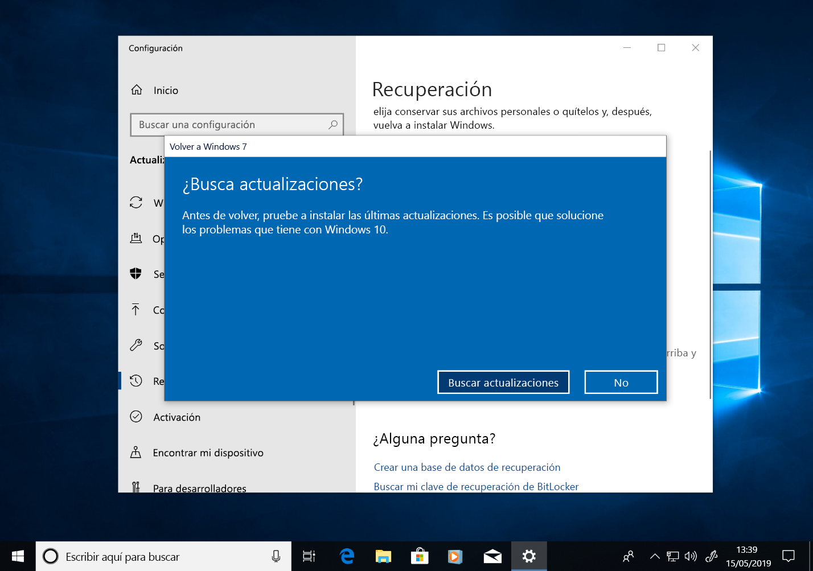
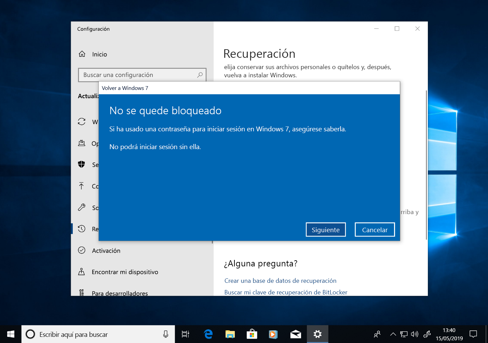
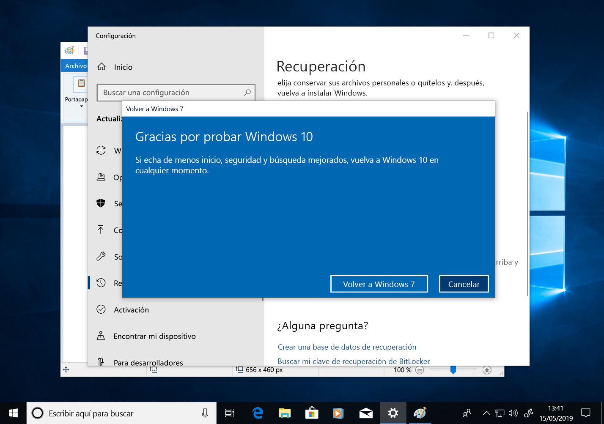

# Guía paso a paso de actualización manual de Windows 7 a Windows 10

Este artículo describe el proceso para actualizar de forma manual un equipo con Windows 7 Enterprise a Windows 10 Enterprise. Para otras ediciones de Windows 7, como Home y Professional, el proceso es muy similar, pero también tiene la opción de actualizar directamente con la herramienta de creación de medios. Las actualizaciones de cualquier edición de Windows 7 a Windows 10 necesitarán una clave de producto válida y solo se podrán actualizar al mismo tipo de edición o a una edición superior de Windows. A modo de ejemplo, Windows 7 Professional se puede actualizar a Windows 10 Pro, pero no se puede actualizar a Windows 10 Home. Windows 7 Ultimate se tendrá que actualizar a Windows 10 Pro.

## Actualizaciones de Windows 10 con la herramienta de creación multimedia o con archivos ISO

Puede actualizar a Windows 10 directamente con la [herramienta de creación multimedia](https://www.microsoft.com/software-download/windows10ISO) o utilizarla para descargar Windows 10 como archivo ISO. Tendrá que saber si su sistema operativo es 32 o 64 bits, el idioma predeterminado de su sistema y la edición de Windows 7 (por ejemplo, Home, Professional o Enterprise). En Windows 7, esta información se encuentra en Panel de control \> Sistema y seguridad \> Sistema. La herramienta de creación multimedia no es compatible con Windows 10 Enterprise para actualizaciones, creación de discos de instalación o descarga archivos ISO. Si actualiza desde Windows 7 Enterprise, necesitará Windows 10 Enterprise.

Al actualizar de Windows 7 Enterprise a Windows 10 Enterprise, debe descargar el archivo ISO correspondiente a su idioma y arquitectura (32 bits o 64 bits) desde el [Centro de servicios de licencias por volumen](https://www.microsoft.com/licensing/servicecenter/default.aspx).

Si tiene previsto realizar la actualización con un archivo ISO, tendrá que extraer los archivos del ISO en el sistema de archivos local o en una unidad extraíble, o simplemente grabar el archivo ISO en un DVD. Los archivos de instalación pueden extraerse en la propia ISO con un equipo con Windows 8 o posterior y guardar estos archivos en una memoria USB extraíble o usar una aplicación como [7zip](https://www.7-zip.org/) para extraer el contenido del archivo ISO en una carpeta de la unidad local en Windows 7.

Una vez que tenga disponibles los medios de instalación en Windows 7, puede iniciar la actualización ejecutando setup.exe como se muestra a continuación.

**Sugerencia importante: para una actualización local en la que quiera migrar sus aplicaciones y datos a Windows 10, tendrá que iniciar el proceso desde una sesión de Windows 7 en ejecución. Arrancar la instalación desde un DVD o memoria USB no le ofrece la opción de mantener sus aplicaciones y archivos, sino que realiza una instalación limpia de Windows 10.**

Durante la configuración de Windows 10, se le guiará por el proceso de instalación. La primera pantalla ofrece la opción de descargar actualizaciones, controladores y características opcionales. Le recomendamos hacerlo para garantizar el éxito de la actualización.

Cuando se hayan aplicado las actualizaciones, el programa de instalación de Windows 10 pasará a la siguiente fase, la selección de imagen. Aquí, tendrá que seleccionar su edición de Windows. En este caso, dado que el PC tiene Windows 7 Enterprise instalado, seleccionaría Windows 10 Enterprise.

En la siguiente pantalla de la configuración de Windows 10, se le mostrarán los términos de licencia y avisos aplicables. Cuando termine de leer y haya comprendido los avisos y los términos, haga clic en "Aceptar" para continuar o en "Rechazar" para cancelar.

Ahora, el programa de instalación de Windows 10 buscará actualizaciones adicionales.

Una vez finalizada, la instalación de Windows 10 estará lista y, de forma predeterminada, configurada para instalar Windows 10 y mantener sus archivos personales y aplicaciones instaladas. Esta opción es la recomendada. Al hacer clic en «Cambiar los elementos que se van a conservar», encontrará opciones adicionales. En caso contrario, haga clic en «Instalar».

Si selecciona "Cambiar los elementos que se van a conservar", se le mostrarán estas opciones:

«Conservar solo los archivos personales» no migrará las aplicaciones instaladas ni las configuraciones de Windows 7 a Windows 10. Simplemente migrará los archivos y las cuentas de usuario a Windows. Si elige esta opción, tendrá que reinstalar las aplicaciones más adelante. Use esta opción solo si está seguro de poder volver a instalar y configurar las aplicaciones que necesite después de instalar Windows. De lo contrario, deje la opción predeterminada: «Conserva los archivos personales y las aplicaciones».

Si selecciona «Nada», se eliminarán sus archivos, aplicaciones y configuraciones, y realizará una instalación limpia de Windows. Use solo esta opción si ha hecho una copia de seguridad de los datos que desea mantener y puede volver a instalar las aplicaciones que necesite.

Ahora, el programa de instalación de Windows 10 obtendrá las actualizaciones en función de lo que haya seleccionado en la pantalla anterior.

Ahora, se procederá a instalar Windows 10 durante varios minutos y, si eligió conservar sus archivos personales y aplicaciones, tendrá sus archivos y aplicaciones disponible en Windows 10.

## 

## Recuperación de Windows 10

Después de instalar Windows 10, la opción de Recuperación en Windows 10 le ofrece hasta 10 días para volver a Windows 7. Esto es útil si un dispositivo o una aplicación en el sistema no funciona correctamente y necesita volver a la instalación anterior de Windows 7. Después de 10 días, Windows 10 eliminará del disco duro los archivos de recuperación de Windows 7 y los archivos de la instalación anterior. Aunque Windows 7 se eliminará en este momento y ya no podrá volver a la instalación anterior de Windows 7, las aplicaciones y los archivos personales permanecerán en Windows 10.

Para iniciar el proceso vaya a Volver a Windows 7, desplácese hasta Configuración \> Actualización y Seguridad \> Recuperación. Bajo Volver a Windows 7, seleccione «Comenzar».

En este momento, Windows 10 le preguntará por qué quiere volver a Windows 7. Si es por algún motivo técnico, nos ayudaría que rellene este espacio para que otras personas puedan beneficiarse de su experiencia.

En muchos casos, su versión de Windows 10 ofrecerá actualizaciones que puedan resolver problemas técnicos. Se recomienda que compruebe si hay actualizaciones y que, si las hay y se instalan, a continuación compruebe si resuelven los problemas que sufría.

Si las actualizaciones no solucionan problemas y necesita revertir a la instalación anterior de Windows 7, puede que algunas aplicaciones deban reinstalarse (como cualquier aplicación que se haya instalado durante el tiempo en que se ejecute Windows 10), y algunas configuraciones pueden perderse. Es importante resaltar que los archivos y los documentos que haya guardado localmente mientras usa Windows 10 se conservarán y estarán disponibles para usted una vez que vuelva a Windows 7. 

Antes de empezar, asegúrese de tener listas una cuenta local o de dominio y una contraseña de la instalación anterior de Windows 7.

Desde aquí puede iniciar el proceso para volver a Windows 7. Tras unos minutos, el equipo se iniciará nuevamente en Windows 7 de la misma manera que antes de actualizar a Windows 10.

## Pasar a Windows 10 en un equipo nuevo

Otra opción recomendada es pasar a Windows 10 en un equipo nuevo. Si esta es su preferencia, puede transferir los archivos de su equipo antiguo con una copia de seguridad de [OneDrive](https://support.office.com/article/b5e918be-0fd4-4095-98da-bceed57f8e0c?ocid=MoveToWindows10), las [Copias de seguridad y restauración integradas en Windows](https://support.microsoft.com/help/4469209?ocid=MoveToWindows10), usando manualmente un [dispositivo de almacenamiento externo](https://support.microsoft.com/help/4465814/windows-7-move-files-off-pc-with-an-external-storage-device?ocid=MoveToWindows10) o con herramientas como PCmover Express de LapLink. Con cualquiera de estas opciones, tendrá que volver a instalar cualquier aplicación no incluida en Windows 10. Si desea informarse sobre las opciones para pasar de forma manual desde Windows 7 en un equipo existente a Windows 10 en un equipo nuevo, consulte [Migrar a un PC con Windows 10](https://support.microsoft.com/help/4229823?ocid=MoveToWindows10) en el soporte técnico de Windows.

## [Centro de implementación de escritorios](https://aka.ms/howtoshift)
