# Guía paso a paso de actualización manual de Windows 7 a Windows 10Windows 7 to Windows 10 manual upgrade step-by-step guide

Este artículo describe el proceso para actualizar de forma manual un equipo con Windows 7 Enterprise a Windows 10 Enterprise.This article describes the process to manually upgrade a Windows 7 Enterprise PC to Windows 10 Enterprise. Para otras ediciones de Windows 7, como Home y Professional, el proceso es muy similar, pero también tiene la opción de actualizar directamente con la herramienta de creación de medios.For other Windows 7 editions, such as Home and Professional, the process is very similar, but you also have the option to upgrade directly using the media creation tool. Las actualizaciones de cualquier edición de Windows 7 a Windows 10 necesitarán una clave de producto válida y solo se podrán actualizar al mismo tipo de edición o a una edición superior de Windows. A modo de ejemplo, Windows 7 Professional se puede actualizar a Windows 10 Pro, pero no se puede actualizar a Windows 10 Home.Upgrades for any edition of Windows 7 to Windows 10 will require a valid product key and matching or higher edition of Windows, for example Windows 7 Professional can upgrade to Windows 10 Pro, but cannot be upgraded to Windows 10 Home. Windows 7 Ultimate se tendrá que actualizar a Windows 10 Pro.Windows 7 Ultimate will need to be upgraded to Windows 10 Pro.

## Actualizaciones de Windows 10 con la herramienta de creación multimedia o con archivos ISOWindows 10 upgrades using the media creation tool or ISO files

Puede actualizar a Windows 10 directamente con la [herramienta de creación multimedia](https://www.microsoft.com/en-us/software-download/windows10ISO) o utilizarla para descargar Windows 10 como archivo ISO.You can upgrade to Windows 10 directly using the [media creation tool](https://www.microsoft.com/en-us/software-download/windows10ISO) or use the it to download Windows 10 as an ISO file. Tendrá que saber si su sistema operativo es 32 o 64 bits, el idioma predeterminado de su sistema y la edición de Windows 7 (por ejemplo, Home, Professional o Enterprise).You’ll need to note whether your current system is 32 or 64-bit, your system’s default language and edition of Windows 7 (e.g. Home, Professional, or Enterprise). En Windows 7, esta información se encuentra en Panel de control \> Sistema y seguridad \> Sistema.In Windows 7, this information is located in the Control Panel \> System and Security \> System. La herramienta de creación multimedia no es compatible con Windows 10 Enterprise para actualizaciones, creación de discos de instalación o descarga archivos ISO.The media creation tool does not support Windows 10 Enterprise for upgrades, creating installation media or downloading ISO files. Si actualiza desde Windows 7 Enterprise, necesitará Windows 10 Enterprise.Windows 10 Enterprise is required if you are upgrading from Windows 7 Enterprise.

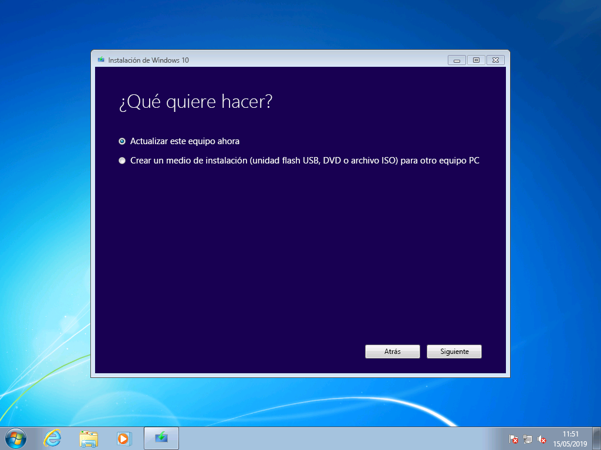

> Opciones de la herramienta de creación multimedia de Windows 10Windows 10 media creation tool options

Al actualizar de Windows 7 Enterprise a Windows 10 Enterprise, debe descargar el archivo ISO correspondiente a su idioma y arquitectura (32 bits o 64 bits) desde el Centro de servicios de licencias por volumen](https://www.microsoft.com/licensing/servicecenter/default.aspx).When upgrading from Windows 7 Enterprise to Windows 10 Enterprise, you’ll need to download the ISO file for your language and architecture (32-bit or 64-bit) from the [Volume Licensing Service Center](https://www.microsoft.com/licensing/servicecenter/default.aspx).

Si tiene previsto realizar la actualización con un archivo ISO, tendrá que extraer los archivos del ISO en el sistema de archivos local o en una unidad extraíble, o simplemente grabar el archivo ISO en un DVD.If you plan to perform the upgrade using an ISO file, you will need to extract the files within the ISO to either your local file system, to a removable drive, or you can burn the ISO file to a DVD. Los archivos de instalación pueden extraerse en la propia ISO con un equipo con Windows 8 o posterior y guardar estos archivos en una memoria USB extraíble o usar una aplicación como [7zip](https://www.7-zip.org/) para extraer el contenido del archivo ISO en una carpeta de la unidad local en Windows 7.You can extract the installation files within the ISO using a Windows 8 or newer PC and save these files to removable USB storage or use an application such as [7zip](https://www.7-zip.org/) to extract the contents of your ISO file to a folder on your local drive within Windows 7.

Una vez que tenga disponibles los medios de instalación en Windows 7, puede iniciar la actualización ejecutando setup.exe como se muestra a continuación.Once you have the install media available in Windows 7, you can initiate the upgrade by running setup.exe as shown below.

**Sugerencia importante: para una actualización local en la que quiera migrar sus aplicaciones y datos a Windows 10, tendrá que iniciar el proceso desde una sesión de Windows 7 en ejecución. Arrancar la instalación desde un DVD o memoria USB no le ofrece la opción de mantener sus aplicaciones y archivos, sino que realiza una instalación limpia de Windows 10.****Important tip: For an in-place upgrade where applications and your data are migrated to Window 10, you’ll need to initiate the process from within a running Windows 7 session. Booting to install media from a DVD or USB drive will not give you the option to keep your apps and files, instead it will perform a clean install of Windows 10.**

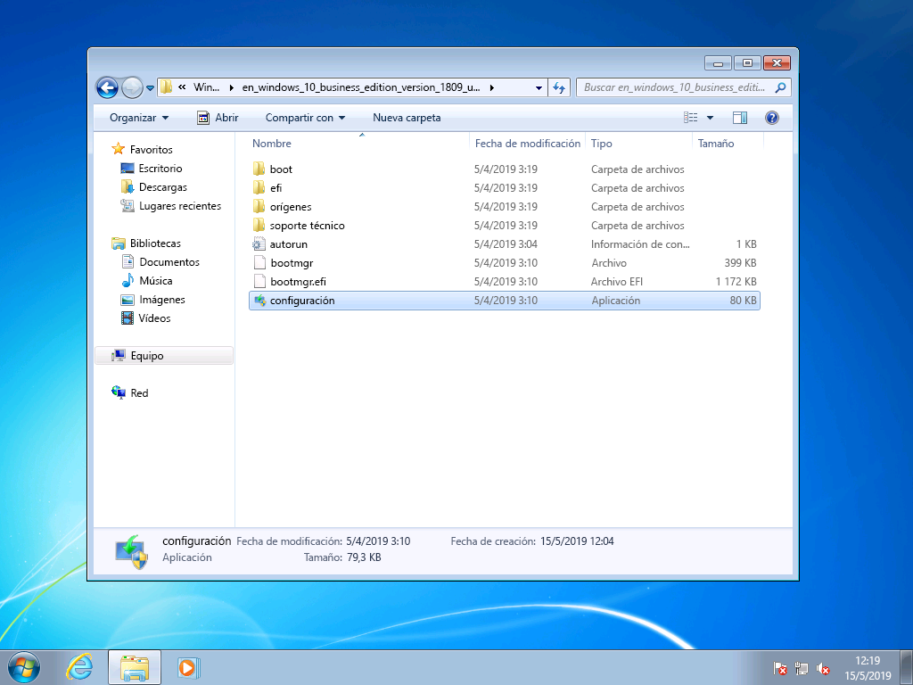

> Archivos extraídos de una ISO de Windows 10 Enterprise 32Extracted files from a Windows 10 Enterprise 32-bit ISO

Durante la configuración de Windows 10, se le guiará por el proceso de instalación. La primera pantalla ofrece la opción de descargar actualizaciones, controladores y características opcionales.Within Windows 10 Setup, you will be guided through the installation process and the first screen provides an option to download updates, drivers and optional features. Le recomendamos hacerlo para garantizar el éxito de la actualización.This is recommended to help ensure success with the upgrade

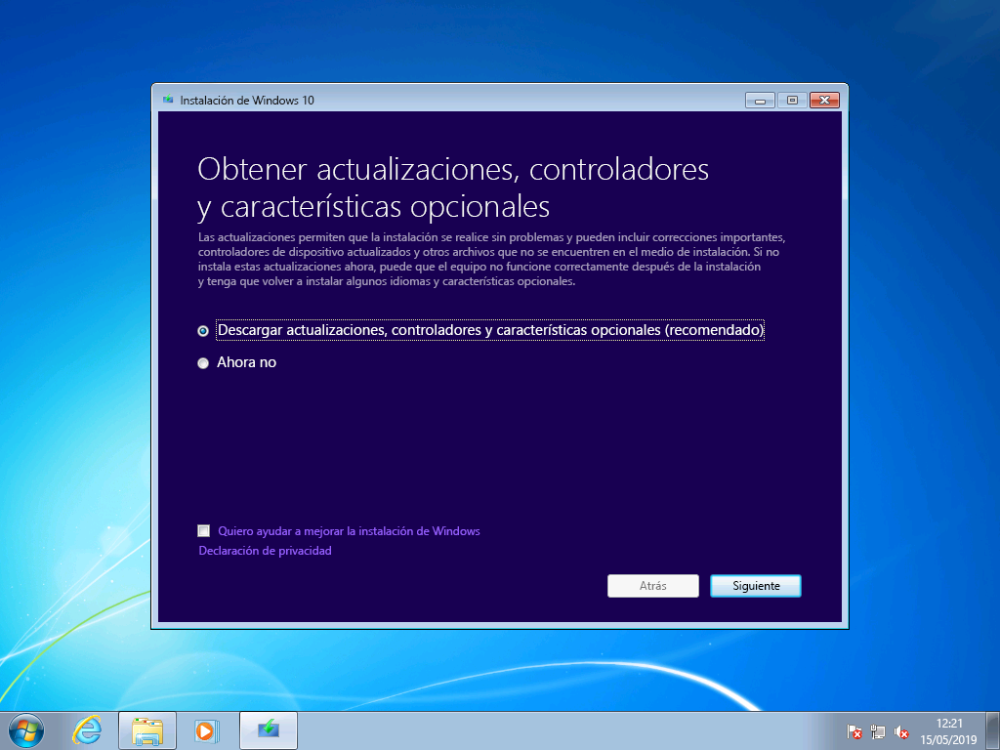

> Pantalla inicial de instalación de Windows 10Initial Windows 10 Setup screen

Cuando se hayan aplicado las actualizaciones, el programa de instalación de Windows 10 pasará a la siguiente fase, la selección de imagen.Once updates have been applied, Windows 10 Setup will move to the next phase, Select Image. Aquí, tendrá que seleccionar su edición de Windows.Here, you will need to select your edition of Windows. En este caso, dado que el PC tiene Windows 7 Enterprise instalado, seleccionaría Windows 10 Enterprise.In this case, since the PC has Windows 7 Enterprise installed, you would select Windows 10 Enterprise.

> Pantalla de selección de imagen de Windows 10 Enterprise de 32 bits.Windows 10 Enterprise 32-bit image selection screen

En la siguiente pantalla de la configuración de Windows 10, se le mostrarán los términos de licencia y avisos aplicables.In the next screen in Windows 10 Setup, you’re presented with applicable notices and license terms. Cuando termine de leer y haya comprendido los avisos y los términos, haga clic en "Aceptar" para continuar o en "Rechazar" para cancelar.Once you have read and understand the notices and terms, click “Accept” to continue or “Decline” to cancel.

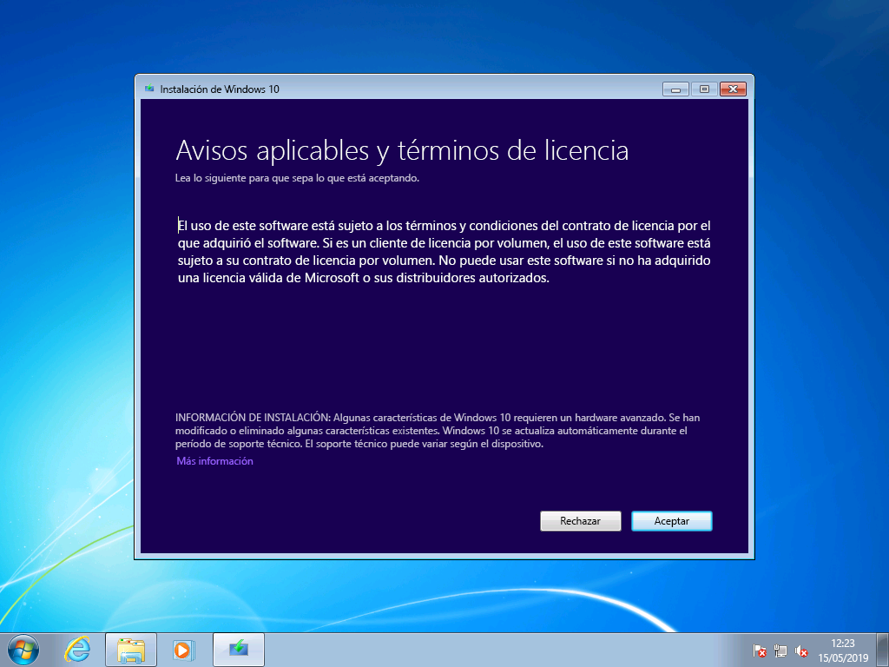

*Avisos aplicables y términos de licencia de Windows 10**Windows 10 Applicable notices and license terms*

Ahora, el programa de instalación de Windows 10 buscará actualizaciones adicionales.Now Windows 10 Setup will look for additional updates.

*El programa de instalación está obteniendo actualizaciones de Windows 10**Windows 10 Setup getting updates*

Cuando termine, el programa de instalación de Windows 10 estará listo para su instalación. De forma predeterminada, se configurará para instalar Windows 10 y conservar los archivos y las aplicaciones personales de la edición anterior de Windows.Once complete, Windows 10 Setup is ready to install and by default is configured to install Windows 10 and keep your personal files and apps installed. Esta opción es la recomendada.This is the recommended option. Al hacer clic en «Cambiar los elementos que se van a conservar», encontrará opciones adicionales.By clicking, “Change what to keep,” you’ll find additional options. En caso contrario, haga clic en «Instalar».Otherwise, click “Install.”

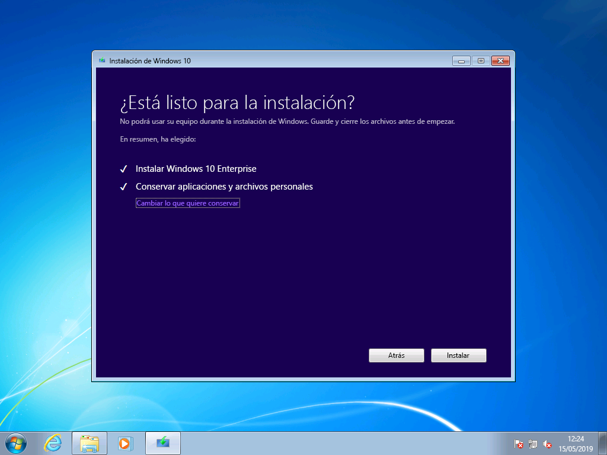

*Opción predeterminada de actualización de la configuración de Windows 10**Windows 10 Setup upgrade option default*

Si selecciona "Cambiar los elementos que se van a conservar", se le mostrarán estas opciones:If you select “Change what to keep”, you’ll be presented with these options:

«Conservar solo los archivos personales» no migrará las aplicaciones instaladas ni las configuraciones de Windows 7 a Windows 10.“Keep personal files only” will not move your installed apps or settings from Windows 7 to Windows 10. Simplemente migrará los archivos y las cuentas de usuario a Windows.Instead it will only move your files and user accounts to Windows. Si elige esta opción, tendrá que reinstalar las aplicaciones más adelante.Apps will need to be reinstalled later with this option. Use esta opción solo si está seguro de poder volver a instalar y configurar las aplicaciones que necesite después de instalar Windows. De lo contrario, deje la opción predeterminada: «Conserva los archivos personales y las aplicaciones».Only use this option if you are confident you can reinstall and configure the apps you will need after Windows is installed, otherwise stick with the default “Keep personal files and apps” option.

Si selecciona «Nada», se eliminarán sus archivos, aplicaciones y configuraciones, y realizará una instalación limpia de Windows.“Nothing” will delete your files, apps and settings and perform a clean install of Windows. Use solo esta opción si ha hecho una copia de seguridad de los datos que desea mantener y puede volver a instalar las aplicaciones que necesite.Use this option only if you have previously backed up the data you want to keep and you are able to reinstall your apps.

*Opciones de instalación de Windows 10**Windows 10 Setup installation options*

Ahora, el programa de instalación de Windows 10 obtendrá las actualizaciones en función de lo que haya seleccionado en la pantalla anterior.Now Windows 10 Setup will get updates again based on what you selected in the previous screen.

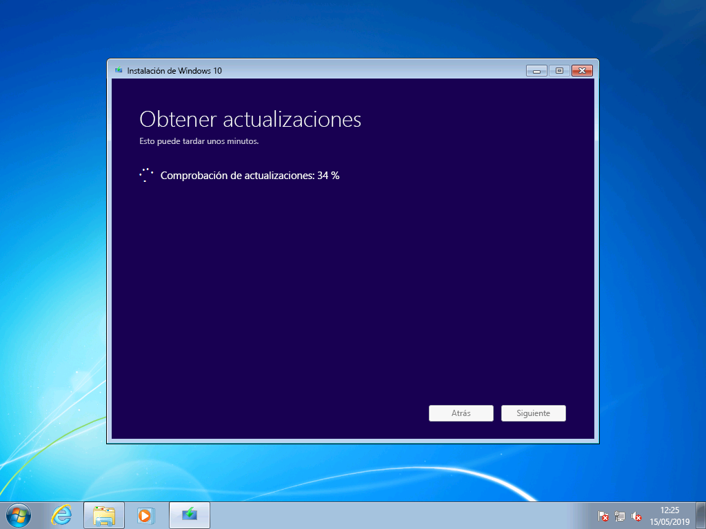

*El programa de instalación está obteniendo actualizaciones de Windows 10**Windows 10 Setup getting updates*

Ahora, se procederá a instalar Windows 10 durante varios minutos y, si eligió conservar sus archivos personales y aplicaciones, tendrá sus archivos y aplicaciones en las mismas ubicaciones que antes.Now Windows 10 will install for several minutes and if you chose to keep your personal files and apps, everything will be in the same file locations and your apps will now be available in Windows 10.

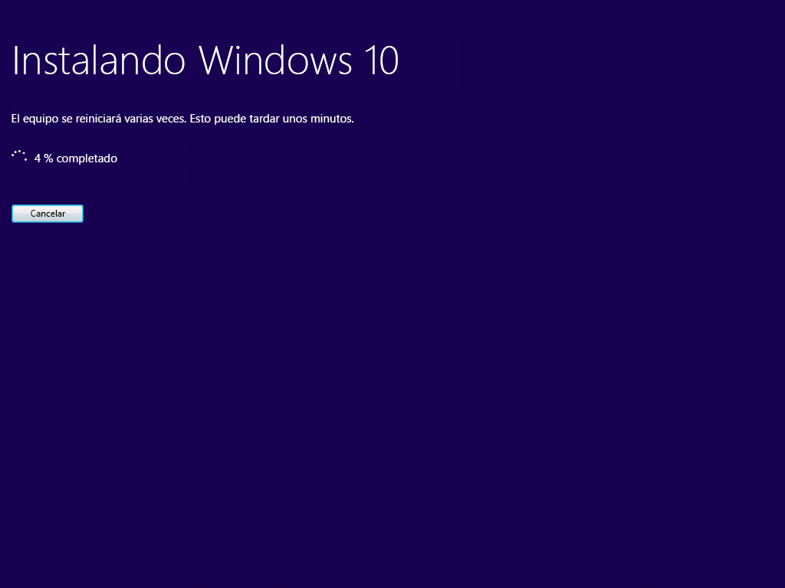

*Progreso de la instalación de Windows 10**Windows 10 installation progress*

## 

## Recuperación de Windows 10Recovery in Windows 10

Después de instalar Windows 10, la opción de Recuperación en Windows 10 le ofrece hasta 10 días para volver a Windows 7.After Windows 10 is installed, the Recovery option in Windows 10 gives you up to 10 days to go back to Windows 7. Esto es útil si un dispositivo o una aplicación en el sistema no funciona correctamente y necesita volver a la instalación anterior de Windows 7.This is useful if a device or app on your system does not function properly and you need to go back to your previous Windows 7 installation. Después de 10 días, Windows 10 eliminará del disco duro los archivos de recuperación de Windows 7 y los archivos de la instalación anterior.After 10 days, by default Windows 10 will free up the space consumed by your Windows 7 recovery files on your hard drive and delete files from the previous installation. Aunque Windows 7 se eliminará en este momento y ya no podrá volver a la instalación anterior de Windows 7, las aplicaciones y los archivos personales permanecerán en Windows 10.Although Windows 7 after this time is deleted and you won’t be able to revert Windows 7, your apps and personal files will remain in Windows 10.

Para iniciar el proceso vaya a Volver a Windows 7, desplácese hasta Configuración \> Actualización y Seguridad \> Recuperación.To start the Go back to Windows 7 process, navigate to Settings \> Update & Security \> Recovery. Bajo Volver a Windows 7, seleccione «Comenzar».Under Go back to Windows 7, select “Get started.”

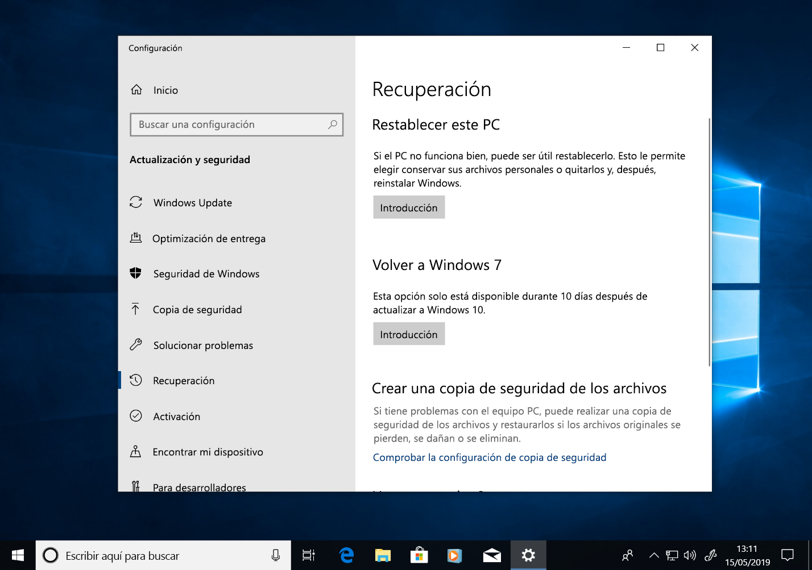

*Opciones de Recuperación de Windows 10**Windows 10 Recovery options*

En este momento, Windows 10 le preguntará por qué quiere volver a Windows 7.Now, Windows 10 will ask why you are going back. Si es por algún motivo técnico, nos ayudaría que rellene este espacio para que otras personas puedan beneficiarse de su experiencia.If there is a technical reason, this is useful to fill out in order to help drive resolution and ensure others can benefit from your experience.

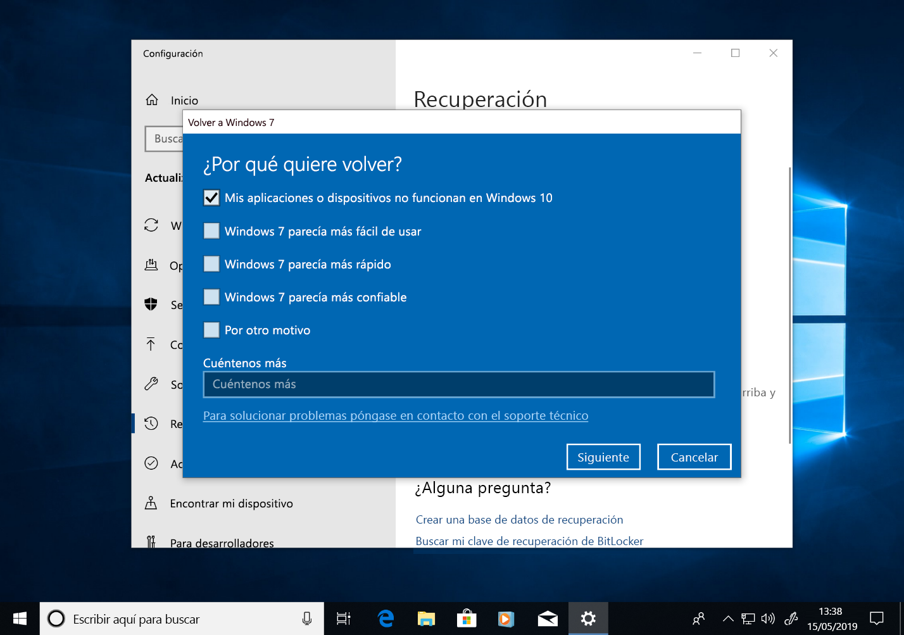

*Windows 10 le pregunta por qué quiere volver a Windows 7**Windows 10 asking why you are going back to Windows 7*

En muchos casos, su versión de Windows 10 ofrecerá actualizaciones que puedan resolver problemas técnicos.In many cases, your version of Windows 10 will have had updates issued, which may resolve technical issues. Se recomienda que compruebe si hay actualizaciones y que, si las hay y se instalan, a continuación compruebe si resuelven los problemas que sufría.It is encouraged that you check for updates and if found and installed, then check if that fixes the problems you have experienced.

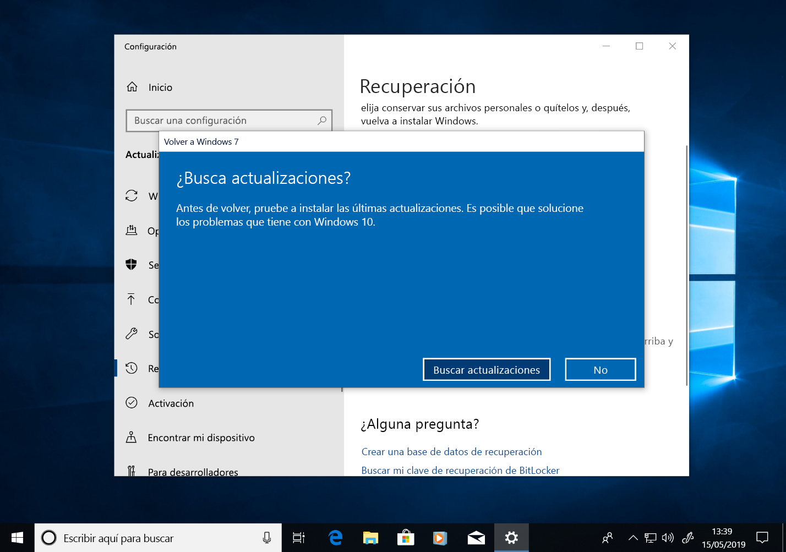

*Comprobación de actualizaciones de Recuperación de Windows 10**Windows 10 Recovery check for updates*

Si las actualizaciones no solucionan problemas y necesita revertir a la instalación anterior de Windows 7, puede que algunas aplicaciones deban reinstalarse (como cualquier aplicación que se haya instalado durante el tiempo en que se ejecute Windows 10), y algunas configuraciones pueden perderse.If the updates do not resolve issues and you do need to revert to your previous installation of Windows 7, there is a chance that some apps will need to be reinstalled – such as any app that installed during the time you were running Windows 10 – and some settings may be lost. Es importante resaltar que los archivos y los documentos que haya guardado localmente mientras usa Windows 10 se conservarán y estarán disponibles para usted una vez que vuelva a Windows 7.Importantly, files and docs you’ve saved locally while using Windows 10 will remain and be available for you once you’re back in Windows 7. 

*Recuperación de Windows 10: lo que debe conocer**Windows 10 Recovery: What you need to know*

Antes de empezar, asegúrese de tener listas una cuenta local o de dominio y una contraseña de la instalación anterior de Windows 7.Before you get started, make sure you have a local or domain account and password ready from the previous Windows 7 installation.

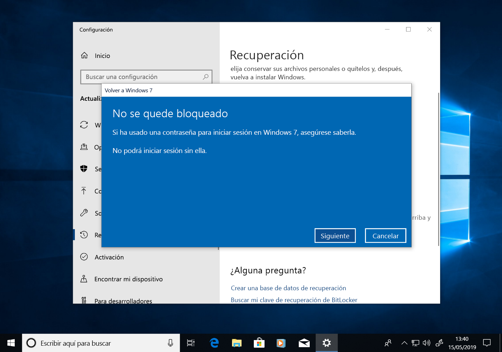

*Recuperación de Windows 10 que garantiza que tiene credenciales de inicio de sesión de la instalación anterior**Windows 10 Recovery ensuring you have logon credentials from the previous installation*

Desde aquí puede iniciar el proceso para volver a Windows 7.From here you can initiate the process to go back to Windows 7. Tras unos minutos, el equipo se iniciará nuevamente en Windows 7 de la misma manera que antes de actualizar a Windows 10.After a few minutes, your PC will boot back into Windows 7 with the same experience prior to upgrading to Windows 10.

*Pantalla final de Recuperación de Windows 10 antes de volver a Windows 7**Windows 10 Recovery final screen before going back to Windows 7*

## Pasar a Windows 10 en un equipo nuevoMoving to Windows 10 on a new PC

Otra opción recomendada es pasar a Windows 10 en un equipo nuevo.Another recommended option is to move to Windows 10 on a new PC. Si esta es su preferencia, puede transferir los archivos de su equipo antiguo con una copia de seguridad de [OneDrive, las Copias de seguridad y restauración integradas en Windows, usando manualmente un [dispositivo de almacenamiento externo](https://support.microsoft.com/es-ES/help/4465814/windows-7-move-files-off-pc-with-an-external-storage-device?ocid=MoveToWindows10) o con herramientas como PCmover Express de LapLink. If this is your preference, you can transfer your files from your old computer using [OneDrive](https://support.office.com/article/b5e918be-0fd4-4095-98da-bceed57f8e0c?ocid=MoveToWindows10) backup, [Backup and Restore built into Windows](https://support.microsoft.com/help/4469209?ocid=MoveToWindows10), manually using an [external storage device](https://support.microsoft.com/en-us/help/4465814/windows-7-move-files-off-pc-with-an-external-storage-device?ocid=MoveToWindows10), or tools like [Laplink’s PCmover Express](https://www.microsoft.com/en-us/windows/transfer-your-data). Con cualquiera de estas opciones, tendrá que volver a instalar cualquier aplicación no incluida en Windows 10.With any of these options, you will still need to re-install any required applications not included with Windows 10. Si desea informarse sobre las opciones para pasar de forma manual desde Windows 7 en un equipo existente a Windows 10 en un equipo nuevo, consulte [Migrar a un PC con Windows 10](https://support.microsoft.com/es-ES/help/4229823?ocid=MoveToWindows10) en el soporte técnico de Windows.To learn more about your options for manually moving from an existing PC running Windows 7 to a new PC with Windows 10, see [Moving to a Windows 10 PC](https://support.microsoft.com/en-us/help/4229823?ocid=MoveToWindows10) in Windows Support.

## [Centro de implementación de escritoriosDesktop Deployment Center](https://aka.ms/howtoshift)