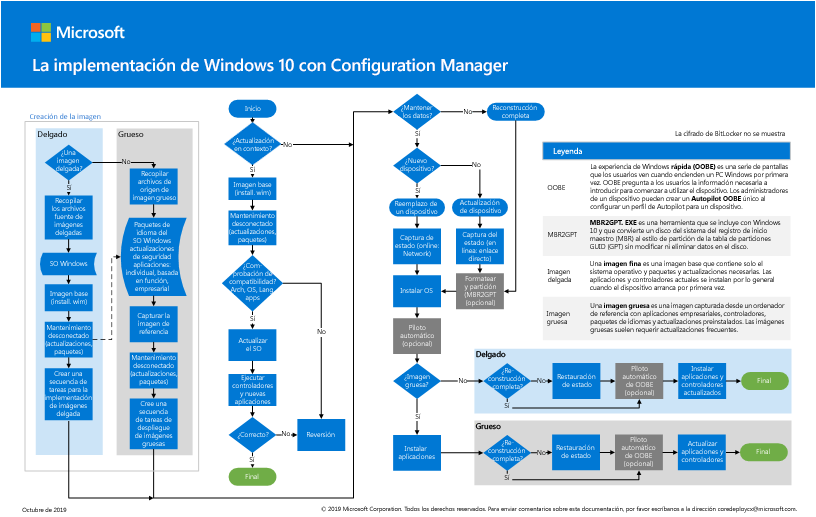

# Paso 2: implementar Windows 10 Enterprise para los dispositivos existentes como actualización localStep 2: Deploy Windows 10 Enterprise for existing devices as an in-place upgrade

*Este artículo se aplica a las versiones E3 y E5 de Microsoft 365 Enterprise**This article applies to both the E3 and E5 versions of Microsoft 365 Enterprise*

La ruta más sencilla para actualizar equipos que ejecutan Windows 7 o Windows 8,1 a Windows 10 es a través de una actualización inmediata.The simplest path to upgrade PCs currently running Windows 7 or Windows 8.1 to Windows 10 is through an in-place upgrade. Puede usar una secuencia de tareas del administrador de configuración (Administrador de configuración) para automatizar el proceso por completo.You can use a Configuration Manager (Configuration Manager) task sequence to completely automate the process. 

Si ya tiene equipos que ejecutan Windows 7 o Windows 8,1, le recomendamos esta ruta si su organización está implementando Windows 10.If you have existing computers running Windows 7 or Windows 8.1, we recommend this path if your organization is deploying Windows 10. Esto aprovecha el programa de instalación de Windows (Setup. exe) para realizar una actualización inmediata, que conserva automáticamente todos los datos, la configuración, las aplicaciones y los controladores de la versión del sistema operativo existente.This leverages the Windows installation program (Setup.exe) to perform an in-place upgrade, which automatically preserves all data, settings, applications, and drivers from the existing operating system version. Esto requiere menos esfuerzo de ti, ya que no es necesario disponer de una infraestructura de implementación compleja.This requires the least IT effort, because there is no need for any complex deployment infrastructure.

Siga estos pasos para configurar e implementar una imagen de Windows 10 Enterprise con Microsoft Endpoint Configuration Manager como una actualización local.Follow these steps to configure and deploy a Windows 10 Enterprise image using Microsoft Endpoint Configuration Manager as an in-place upgrade.

## El póster para la implementación de Windows 10 con Configuration Manager The Windows 10 deployment with Configuration Manager poster

El póster de Configuration Manager es una página en el modo horizontal (17x11).The Configuration Manager poster is one page in landscape mode (17x11). Haga clic en la imagen siguiente para ver un PDF en el explorador.Click the image below to view a PDF in your browser. 

También puede descargar este póster en [PDF](https://github.com/MicrosoftDocs/windows-itpro-docs/raw/public/windows/deployment/media/Windows10DeploymentConfigManager.pdf) o en formato de [Visio](https://github.com/MicrosoftDocs/windows-itpro-docs/raw/public/windows/deployment/media/Windows10DeploymentConfigManager.vsdx).You can also download this poster in [PDF](https://github.com/MicrosoftDocs/windows-itpro-docs/raw/public/windows/deployment/media/Windows10DeploymentConfigManager.pdf) or [Visio](https://github.com/MicrosoftDocs/windows-itpro-docs/raw/public/windows/deployment/media/Windows10DeploymentConfigManager.vsdx) format.

## Parte 1: comprobar la disponibilidad para actualizar WindowsPart 1: Verify readiness to upgrade Windows

En primer lugar, use la capacidad de actualización de Windows Analytics para proporcionar valiosas información y recomendaciones sobre los equipos, las aplicaciones y los controladores de su organización, sin costo adicional ni requisitos de infraestructura adicionales.First, use the Upgrade Readiness capability of Windows Analytics to provide powerful insights and recommendations about the computers, applications, and drivers in your organization, at no extra cost and without additional infrastructure requirements. Este nuevo servicio le guía a través de los proyectos de actualización de características y actualización mediante un flujo de trabajo basado en las prácticas recomendadas por Microsoft.This new service guides you through upgrade and feature update projects using a workflow based on Microsoft recommended practices. Los datos de inventario actualizados le permiten equilibrar el coste y el riesgo en los proyectos de actualización.Up-to-date inventory data allows you to balance cost and risk in your upgrade projects.

Consulte [administrar las actualizaciones de Windows con preparación de actualización](https://docs.microsoft.com/windows/deployment/upgrade/manage-windows-upgrades-with-upgrade-readiness) para obtener más información, introducción, uso y solución de problemas de preparación para la actualización.See [Manage Windows upgrades with Upgrade Readiness](https://docs.microsoft.com/windows/deployment/upgrade/manage-windows-upgrades-with-upgrade-readiness) to learn more, get started, use, and troubleshoot Upgrade Readiness.

A continuación, siga la guía para usar Configuration Manager (rama actual) para actualizar el sistema operativo Windows 7 o posterior a Windows 10.Next, follow the guide to use Configuration Manager (Current Branch) to upgrade Windows 7 or later operating system to Windows 10. Al igual que con cualquier implementación de alto riesgo, se recomienda realizar una copia de seguridad de los datos de usuario antes de continuar.As with any high-risk deployment, we recommend backing up user data before proceeding. OneDrive: el almacenamiento en la nube está listo para usarse para los usuarios con licencia de Microsoft 365 y puede usarse para almacenar sus archivos de forma segura.OneDrive cloud storage is ready to use for licensed Microsoft 365 users and can be used to securely store their files. Para obtener más información, consulte [Guía de inicio rápido de OneDrive](https://aka.ms/ODfBquickstartguide).For more info, see [OneDrive quick start guide](https://aka.ms/ODfBquickstartguide). Para obtener acceso a esta página, debe iniciar sesión como administrador de inquilino o administrador global en un inquilino de Office 365 o Microsoft 365.To access this page, you must sign in as a tenant admin or global admin in an Office 365 or Microsoft 365 tenant.

Para obtener una lista de las versiones de Configuration Manager y las versiones de cliente de Windows 10 correspondientes que son compatibles, consulte [compatibilidad con Windows 10 para el administrador de configuración](https://docs.microsoft.com/configmgr/core/plan-design/configs/support-for-windows-10).For a list of Configuration Manager versions and the corresponding Windows 10 client versions that are supported, see [Support for Windows 10 for Configuration Manager](https://docs.microsoft.com/configmgr/core/plan-design/configs/support-for-windows-10).

**Para comprobar la disponibilidad para actualizar Windows****To verify readiness to upgrade Windows**

Revise estos requisitos antes de iniciar la implementación de Windows 10:Review these requirements before starting your Windows 10 deployment:

- **Ediciones de Windows aptas para la actualización** : los dispositivos deben estar ejecutando ediciones de Windows 7 o Windows 8,1 que sean aptas para actualizar a Windows 10 Enterprise.**Windows editions eligible for upgrade** - Your devices must be running editions of Windows 7 or Windows 8.1 that are eligible for upgrade to Windows 10 Enterprise. Para obtener una lista de las ediciones compatibles, vea [rutas de actualización de Windows 10](https://aka.ms/win10upgradepaths).For a list of supported editions, see [Windows 10 upgrade paths](https://aka.ms/win10upgradepaths). 
- **Dispositivos compatibles** : la mayoría de los equipos compatibles con Windows 8,1 serán compatibles con Windows 10.**Supported devices** - Most computers that are compatible with Windows 8.1 will be compatible with Windows 10. Es posible que tengas que instalar controladores actualizados en Windows 10 para que los dispositivos funcionen correctamente.You may need to install updated drivers in Windows 10 for your devices to properly function. Consulta [Especificaciones de Windows 10](https://aka.ms/windows10specifications) para obtener más información.See [Windows 10 specifications](https://aka.ms/windows10specifications) for more info.
- **Preparación** de la implementación: Asegúrese de que tiene lo siguiente antes de comenzar a configurar la implementación:**Deployment preparation** - Make sure you have the following before you start configuring the deployment:
    - Medios de instalación de Windows 10: los medios de instalación deben encontrarse en una unidad independiente, con el ISO ya montado.Windows 10 installation media - The installation media must be located on a separate drive, with the ISO already mounted. Puede obtener el ISO de las [descargas para suscriptores de MSDN](https://aka.ms/msdn-subscriber-downloads) o del [centro de servicios de licencias por volumen](https://aka.ms/mvlsc).You can obtain the ISO from [MSDN Subscriber Downloads](https://aka.ms/msdn-subscriber-downloads) or from the [Volume Licensing Service Center](https://aka.ms/mvlsc).
    - Copias de seguridad de datos de usuario: aunque los datos de usuario se migrarán a la actualización, el procedimiento recomendado es configurar un escenario de copia de seguridad.Backups of user data - Although user data will be migrated in the upgrade, best practice is to configure a backup scenario. Por ejemplo, exporte todos los datos de usuario a una cuenta de OneDrive, una unidad flash USB con cifrado de BitLocker To Go o un servidor de archivos de red.For example, export all user data to a OneDrive account, BitLocker To Go-encrypted USB flash drive, or network file server. Para obtener más información, vea [copia de seguridad o transferencia de datos en Windows](https://aka.ms/backuptransferdatawindows).For more information, see [Back up or transfer data in Windows](https://aka.ms/backuptransferdatawindows).
- **Preparación del entorno** : usará una estructura de servidor de Configuration Manager existente para prepararse para la implementación del sistema operativo.**Environment preparation** - You will use an existing Configuration Manager server structure to prepare for operating system deployment. Además de la configuración básica, se deben realizar las siguientes configuraciones en el entorno de Configuration Manager:In addition to the base setup, the following configurations should be made in the Configuration Manager environment:
    1. [Extienda el esquema de Active](https://aka.ms/extendadschema) Directory y [cree un contenedor de administración del sistema](https://aka.ms/createsysmancontainer).[Extend the Active Directory Schema](https://aka.ms/extendadschema) and [create a System Management container](https://aka.ms/createsysmancontainer).
    2. Habilitar detección de bosques de Active Directory y detección de sistema de Active Directory.Enable Active Directory Forest Discovery and Active Directory System Discovery. Para obtener más información, vea [Configure Discovery Methods for Configuration Manager](https://aka.ms/configurediscoverymethods).For more info, see [Configure discovery methods for Configuration Manager](https://aka.ms/configurediscoverymethods).
    3. Cree límites de intervalo IP y grupo de límites para la asignación de contenido y sitios.Create IP range boundaries and boundary group for content and site assignment. Para obtener más información, consulte [definir límites de sitio y grupos de límites para el administrador de configuración](https://aka.ms/definesiteboundaries).For more info, see [Define site boundaries and boundary groups for Configuration Manager](https://aka.ms/definesiteboundaries).
    4. Agregar y configurar el rol de punto de servicios de informes de Configuration Manager.Add and configure the Configuration Manager reporting services point role. Para obtener más información, consulte [configuración de informes en Configuration Manager](https://aka.ms/configurereporting).For more info, see [Configuring Reporting in Configuration Manager](https://aka.ms/configurereporting).
    5. Cree una estructura de carpeta del sistema de archivos para los paquetes.Create a file system folder structure for packages.
    6. Cree una estructura de carpeta de la consola de Configuration Manager para los paquetes.Create a Configuration Manager console folder structure for packages.
    7. Instale las actualizaciones del administrador de configuración (rama actual) y los requisitos previos de Windows 10 adicionales.Install Configuration Manager (Current Branch) updates and any additional Windows 10 prerequisites.

## Parte 2: agregar una imagen del sistema operativo Windows 10 con Configuration ManagerPart 2: Add a Windows 10 OS image using Configuration Manager
Ahora deberá crear un paquete de actualización del sistema operativo que contenga los medios de instalación de Windows 10 completos.Now you'll need to create an operating system upgrade package that contains the full Windows 10 installation media. En los pasos siguientes, usará Configuration Manager para crear un paquete de actualización para Windows 10 Enterprise x64.In the following steps, you’ll use Configuration Manager to create an upgrade package for Windows 10 Enterprise x64.

**Para agregar una imagen del sistema operativo Windows 10 con Configuration Manager****To add a Windows 10 OS image using Configuration Manager**

1. Mediante la consola del administrador de configuración, en el área de trabajo de la **biblioteca de software** , haga clic con el botón secundario en el nodo **paquetes de actualización del sistema operativo** y seleccione **Agregar paquete de actualización del sistema operativo**.Using the Configuration Manager console, in the **Software Library** workspace, right-click the **Operating System Upgrade Packages** node, and then select **Add Operating System Upgrade Package**.
2. En la página **origen de datos** , especifique la ruta de acceso UNC al medio de Windows 10 Enterprise x64 y, a continuación, seleccione **siguiente**.On the **Data Source** page, specify the UNC path to the Windows 10 Enterprise x64 media, and then select **Next**.
3. En la página **General** , especifique la **actualización de Windows 10 Enterprise x64**y, a continuación, seleccione **siguiente**.On the **General** page, specify **Windows 10 Enterprise x64 Upgrade**, and then select **Next**. 
4. En la página de **Resumen** , seleccione **siguiente**y, a continuación, haga clic en **cerrar**.On the **Summary** page, select **Next**, and then select **Close**. 
5. Haga clic con el botón secundario en el paquete de **actualización de Windows 10 Enterprise x64** y, a continuación, seleccione **distribuir contenido**.Right-click the created **Windows 10 Enterprise x64 Update** package, and then select **Distribute Content**. 
6. Elija su punto de distribución.Choose your distribution point.

## Parte 3: configurar las opciones de implementaciónPart 3: Configure deployment settings
En este paso, configurará una secuencia de tareas de actualización que contiene la configuración para la actualización de Windows 10.In this step, you'll configure an upgrade task sequence that contains the settings for the Windows 10 upgrade. A continuación, identificará los dispositivos que se van a actualizar y, a continuación, implementará la secuencia de tareas en esos dispositivos.You'll then identify the devices to upgrade, and then deploy the task sequence to those devices.

### Creación de una secuencia de tareasCreate a task sequence
Para crear una secuencia de tareas de actualización, siga estos pasos:To create an upgrade task sequence, perform the following steps:
  
1. En la consola de Configuration Manager, en el área de trabajo **biblioteca de software** , expanda **sistemas operativos**.In the Configuration Manager console, in the **Software Library** workspace, expand **Operating Systems**. 
2. Haga clic con el botón secundario en el nodo **secuencias de tareas** y seleccione **crear secuencia de tareas**.Right-click the **Task Sequences** node, and then select **Create Task Sequence**.
3. En la página **crear una nueva secuencia de tareas** , seleccione **actualizar un sistema operativo desde el paquete de actualización**y, a continuación, seleccione **siguiente**.On the **Create a new task sequence** page, select **Upgrade an operating system from upgrade package**, and then select **Next**.
4. En la página **información de secuencia de tareas** , especifique la actualización de **Windows 10 Enterprise x64**y, a continuación, seleccione **siguiente**.On the **Task Sequence Information** page, specify **Windows 10 Enterprise x64 Upgrade**, and then select **Next**.
5. En la página **actualizar el sistema operativo Windows** , seleccione **examinar** y elija el **paquete de actualización del sistema operativo para la actualización de Windows 10 Enterprise x64**, seleccione **Aceptar**y, a continuación, seleccione **siguiente**.On the **Upgrade the Windows operating system** page, select **Browse** and choose the **Windows 10 Enterprise x64 Upgrade operating system upgrade package**, select **OK**, and then select **Next**.
6. Continúe con las restantes páginas del asistente y, a continuación, seleccione **cerrar**.Continue through the remaining wizard pages, and then select **Close**.

### Crear una colección de dispositivosCreate a device collection
Después de crear la secuencia de tareas de actualización, tendrá que crear una recopilación que contenga los dispositivos que va a actualizar.After you create the upgrade task sequence, you'll need to create a collection that contains the devices you will upgrade.

> [!NOTE]
> Use la siguiente configuración para probar la implementación en un único dispositivo.Use the following settings to test the deployment on a single device. Puede usar diferentes reglas de pertenencia para incluir grupos de dispositivos cuando esté listo.You can use different membership rules to include groups of devices when you are ready. Para obtener más información, vea [Cómo crear colecciones en Configuration Manager](https://docs.microsoft.com/configmgr/core/clients/manage/collections/create-collections).For more info, see [How to create collections in Configuration Manager](https://docs.microsoft.com/configmgr/core/clients/manage/collections/create-collections).

1. En la consola de Configuration Manager, en el área de trabajo de **activos y cumplimiento** , haga clic con el botón secundario en **colecciones de dispositivos**y seleccione **crear colección de dispositivos**.In the Configuration Manager console, in the **Assets and Compliance** workspace, right-click **Device Collections**, and then select **Create Device Collection**. 
2. En el Asistente para crear colección de dispositivos, en la página **General** , especifique la siguiente configuración y, a continuación, seleccione **siguiente**:In the Create Device Collection wizard, on the **General** page, enter the following settings and then select **Next**:
    - Nombre: actualización de Windows 10 Enterprise x64Name: Windows 10 Enterprise x64 Upgrade
    - Restricción de la colección: todos los sistemasLimiting Collection: All Systems
3. En la página **reglas de pertenencia** , seleccione **Agregar** > regla**directa** de regla para iniciar el Asistente para crear regla de pertenencia directa.On the **Membership Rules** page, select **Add Rule** > **Direct rule** to launch the Create Direct Membership Rule Wizard.
4. En la página **principal** del Asistente para crear regla de pertenencia directa, seleccione **siguiente**.On the **Welcome** page of the Create Direct Membership Rule Wizard, select **Next**.
5. En la página **buscar recursos** , escriba la siguiente configuración y reemplace el texto del **valor** de marcador de posición por el nombre del dispositivo que va a actualizar:On the **Search for Resources** page, enter the following settings, replacing the placeholder **Value** text with the name of the device you are upgrading: 
    - Clase de recursos: recurso del sistemaResource Class: System Resource
    - Nombre de atributo: nombreAttribute Name: Name
    - Valor: *PC0003*Value: *PC0003*
6. En la página **seleccionar recursos** , seleccione su dispositivo y, a **continuación**, seleccione siguiente.On the **Select Resources** page, select your device, and select **Next**.
7. Complete el Asistente para crear regla de pertenencia directa y el Asistente para crear colección de dispositivos.Complete the Create Direct Membership Rule wizard and the Create Device Collection Wizard.  
8. Revise la colección de actualizaciones de Windows 10 Enterprise x64.Review the Windows 10 Enterprise x64 Upgrade collection. No continúe hasta que vea los equipos que agregó en la colección.Do not continue until you see the machines you added in the collection.

### Crear una implementación de sistema operativoCreate an operating system deployment
Siga estos pasos para crear una implementación de la secuencia de tareas.Follow these steps to create a deployment for the task sequence.

1. En la consola de Configuration Manager, en el área de trabajo **biblioteca de software** , haga clic con el botón secundario en la secuencia de tareas que creó en un paso anterior y, después, seleccione **implementar**.In the Configuration Manager console, in the **Software Library** workspace, right-click the task sequence you created in a previous step, and then select **Deploy**.
2. En la página **General** , seleccione la colección de **actualizaciones de Windows 10 Enterprise x64** y, a continuación, seleccione **siguiente**.On the **General** page, select the **Windows 10 Enterprise x64 Upgrade** collection, and then select **Next**.
3. En la página **contenido** , seleccione **siguiente**.On the **Content** page, select **Next**.
4. En la página Configuración de la **implementación** , seleccione las siguientes opciones y, a continuación, seleccione **siguiente**:On the **Deployment Settings** page, select the following settings, and then select **Next**:

    > [!NOTE]
    > Para esta implementación de prueba, deberá establecer el propósito en **disponible**, lo que requiere la intervención del usuario para iniciar la implementación.For this test deployment, you'll set the purpose to **Available**, which requires user intervention to start the deployment. En un entorno de producción, es posible que quiera automatizar la implementación con el propósito necesario, que implica la configuración de opciones adicionales, como la programación cuando se ejecuta la implementación.In a production environment, you may wish to automate the deployment using the Required purpose, which involves configuring additional options such as scheduling when the deployment is run. 

    - Acción: instalarAction: Install
    - Propósito: disponiblePurpose: Available

5. En la página **programación** , acepte la configuración predeterminada y, a continuación, seleccione **siguiente**.On the **Scheduling** page, accept the default settings, and then select **Next**.
6. En la página **experiencia del usuario** , acepte la configuración predeterminada y, a continuación, seleccione **siguiente**.On the **User Experience** page, accept the default settings, and then select **Next**.
7. En la página **alertas** , acepte la configuración predeterminada y, a continuación, seleccione **siguiente**.On the **Alerts** page, accept the default settings, and then select **Next**.
8. En la página de **Resumen** , seleccione **siguiente**y, a continuación, haga clic en **cerrar**.On the **Summary** page, select **Next**, and then select **Close**.

## Parte 4: iniciar la secuencia de tareas de actualización de Windows 10Part 4: Start the Windows 10 upgrade task sequence
Siga estos pasos para iniciar la secuencia de tareas de actualización de Windows 10 en el dispositivo que va a actualizar.Follow these steps to start the Windows 10 Upgrade task sequence on the device that you are upgrading.
 
1. Inicie sesión en el equipo con Windows e inicie el **centro de software**.Log on to the Windows computer and start **Software Center**.
2. Seleccione la secuencia de tareas que ha creado en el paso anterior y, a continuación, seleccione **instalar**.Select the task sequence that you created in a previous step, and then select **Install**.
3. Cuando comienza la secuencia de tareas, automáticamente inicia el proceso de actualización en el lugar invocando el programa de instalación de Windows (Setup. exe) con los parámetros de línea de comandos necesarios para realizar una actualización automática, que conserva todos los datos, la configuración, las aplicaciones y factores.When the task sequence begins, it automatically initiates the in-place upgrade process by invoking the Windows setup program (Setup.exe) with the necessary command-line parameters to perform an automated upgrade, which preserves all data, settings, apps, and drivers.
4. Una vez completada correctamente la secuencia de tareas, el equipo se actualizará completamente a Windows 10.After the task sequence completes successfully, the computer will be fully upgraded to Windows 10.

Si experimenta problemas al usar Windows 10 en un entorno empresarial, puede consultar [las principales soluciones de soporte técnico de Microsoft para los problemas más comunes](https://docs.microsoft.com/windows/client-management/windows-10-support-solutions).If you experience issues when using Windows 10 in an enterprise environment, you can consult [top Microsoft Support solutions for the most common issues](https://docs.microsoft.com/windows/client-management/windows-10-support-solutions). Estos recursos incluyen artículos de Knowledge base, actualizaciones y artículos de bibliotecas.These resources include KB articles, updates, and library articles.

Durante la implementación de actualizaciones en toda la organización, use la capacidad de actualización de cumplimiento de Windows Analytics para proporcionar una vista holística del cumplimiento de la actualización del sistema operativo, el progreso de la implementación de la actualización y la solución de errores para los dispositivos Windows 10.During the rollout of updates across your organization, use the Update Compliance capability of Windows Analytics to provide a holistic view of OS update compliance, update deployment progress, and failure troubleshooting for Windows 10 devices. Este nuevo servicio usa datos de diagnóstico que incluyen el progreso de la instalación, la configuración de Windows Update y otra información para proporcionar este tipo de información sin costo adicional ni requisitos de infraestructura adicionales.This new service uses diagnostic data including installation progress, Windows Update configuration and other information to provide such insights, at no extra cost and without additional infrastructure requirements. Tanto si se usa con Windows Update para empresas como con otras herramientas de administración, puede tener la certeza de que los dispositivos se han actualizado correctamente.Whether it's used with Windows Update for Business or other management tools, you can be assured that your devices are properly updated.

Consulte [supervisar actualizaciones de Windows y antivirus de Windows Defender con el cumplimiento](https://docs.microsoft.com/windows/deployment/update/update-compliance-monitor) de la actualización para obtener más información, empezar a usar y usar el cumplimiento de actualizaciones.See [Monitor Windows Updates and Windows Defender Antivirus with Update Compliance](https://docs.microsoft.com/windows/deployment/update/update-compliance-monitor) to learn more, get started, and use Update Compliance.

Como control provisional, puede consultar los [criterios de salida](windows10-exit-criteria.md#crit-windows10-step2) correspondientes a este paso.As an interim checkpoint, you can see the [exit criteria](windows10-exit-criteria.md#crit-windows10-step2) corresponding to this step.

## Siguiente pasoNext step

|||
|:-------|:-----|
|| [Implementar Windows 10 Enterprise para dispositivos nuevos con Windows AutoPilotDeploy Windows 10 Enterprise for new devices with Windows Autopilot](windows10-deploy-autopilot.md) |
