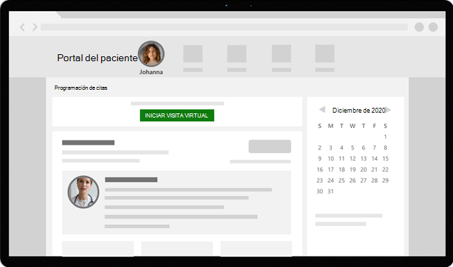

# Citas virtuales con Teams: integración en Epic EHR

El conector de la historia clínica electrónica (HCE) de Microsoft Teams hace que sea fácil para los médicos iniciar una cita virtual con el paciente o consultar con otro proveedor en Microsoft Teams directamente desde el sistema de HCE de Epic. Integrado en la nube de Microsoft 365, Teams hace posible una colaboración y una comunicación sencillas y seguras con herramientas de chat, vídeo, voz y atención sanitaria en un único centro que admite el cumplimiento de la HIPAA, la certificación HITECH, etc.

La plataforma de comunicación y colaboración de Teams facilita a los médicos el desorden de los sistemas fragmentados para que puedan centrarse en proporcionar la mejor atención posible. Con el conector EHR de Teams, puede:

- Iniciar citas virtuales de Teams desde el sistema de HCE de Epic con un flujo de trabajo clínico integrado.
- Permitir que los pacientes se unan a citas virtuales de Teams desde el portal de pacientes o a través de SMS.
- Admitir otros escenarios, como varios participantes, consultas en grupo y servicios de intérprete.
- Volver a escribir metadatos en el sistema HCE sobre las citas virtuales de Teams para registrar cuando los asistentes se conecten, desconecten y habiliten la auditoría automática y el mantenimiento de registros.
- Vea informes de datos de consumo e información personalizable de calidad de llamadas para citas conectadas a EHR.

Este artículo describe cómo instalar y configurar el conector HCE de Teams para integrarlo con la plataforma Epic en su organización de atención sanitaria. También proporciona información general sobre la experiencia de citas virtuales de Teams desde el sistema de HCE de Epic.

## Antes de empezar

Antes de empezar, hay algunas cosas que hacer para prepararse para la integración.

### Familiarizarse con el proceso de integración

Revise la siguiente información para comprender el proceso de integración general.

:::image type="content" source="media/ehr-connector-epic-flow.png" alt-text="Imagen que resume los pasos del proceso de integración general.":::

| &nbsp; |Solicitar acceso a la aplicación|Habilitación de la aplicación|Configuración del conector|Configuración de Epic|Pruebas|
|--------|---------|---------|---------|---------|---------|
| **Duración** | Aproximadamente de 12 a 24 horas| Aproximadamente 24 horas | Aproximadamente de 1 a 3 días | Aproximadamente de 1 a 3 días | &nbsp; |
| **Action**| Solicita [acceso a la aplicación de Teams](#request-access-to-the-teams-app).  | Creamos un certificado de clave pública y privada y los cargamos en Epic. | Completa los pasos de configuración en el portal de configuración del conector HCE.  | Trabaja con su especialista técnico de Epic para configurar registros FDI en Epic.| Completa las pruebas en el entorno de prueba. |
| **Resultado**| Autorizamos a su organización a realizar pruebas. | Epic sincroniza el certificado de clave pública. | Recibe registros FDI para la configuración de Epic. | Configuración completada. Listo para probar. | Validación completa de flujos y decisión de pasar a producción. |

### Solicitar acceso a la aplicación de Teams

Tendrá que solicitar acceso a la aplicación de Teams.

1. Solicite descargar la aplicación de Teams en el [Marketplace de Epic App Orchard](https://apporchard.epic.com/Gallery?id=16793). Al hacerlo, se desencadena una solicitud de Epic al equipo del conector HCE de Microsoft.
1. Después de realizar la solicitud, envíe un correo electrónico a [TeamsForHealthcare@service.microsoft.com](mailto:teamsforhealthcare@service.microsoft.com) con el nombre de la organización, el identificador del espacio empresarial y la dirección de correo electrónico de su contacto técnico de Epic.
1. El equipo del conector HCE de Microsoft responderá a su correo electrónico con la confirmación de habilitación.

### Revise la guía de integración de teleasistencia sanitaria de Epic-Microsoft Teams

Revise la [integración de teleasistencia sanitaria de Epic-Microsoft Teams](https://galaxy.epic.com/Search/GetFile?Url=1!68!100!100100357) con su especialista técnico de Epic. Asegúrese de que se cumplen todos los requisitos previos.

## Requisitos previos

- Una suscripción activa a Microsoft Cloud for Healthcare o una suscripción a la oferta independiente del conector HCE de Microsoft Teams (solo se aplica al realizar pruebas en un entorno de HCE de producción).
- Versión de Epic de noviembre de 2018 o posterior.
- Los usuarios tienen un Microsoft 365 adecuado o una licencia de Office 365 que incluye reuniones de Teams.
- Teams se adopta y usa en su organización de atención sanitaria.
- Los sistemas cumplen todos los [requisitos de software y explorador](/microsoftteams/hardware-requirements-for-the-teams-app) para Teams.

> [!IMPORTANT]
> Asegúrese de completar los pasos previos a la integración y de que se cumplen todos los requisitos previos antes de continuar con la integración.

Los pasos de integración los realizan las siguientes personas de la organización:

- **Administrador global de Microsoft 365**: la persona principal responsable de la integración. El administrador configura el conector, habilita los SMS (si es necesario) y agrega al analista de clientes de Epic que aprobará la configuración.
- **Analista de clientes de Epic**: una persona de su organización que tiene credenciales de inicio de sesión en Epic. Aprueba las opciones de configuración especificadas por el administrador y proporcionan los registros de configuración a Epic.

El administrador de Microsoft 365 y el analista de clientes de Epic pueden ser la misma persona.

## Configuración del conector HCE de Teams

Para la configuración del conector, debe realizar las siguientes acciones:

- [Inicio del portal de configuración del conector EHR](#launch-the-ehr-connector-configuration-portal)
- [Escribir información de configuración](#enter-configuration-information)
- [Habilitar notificaciones SMS (opcional)](#enable-sms-notifications-optional)
- [Aprobar o ver la configuración](#approve-or-view-the-configuration)
- [Revisar y finalizar la configuración](#review-and-finish-the-configuration)

### Inicio del portal de configuración del conector EHR

Para empezar, el administrador de Microsoft 365 inicia el [Portal de configuración del conector HCE](https://ehrconnector.teams.microsoft.com) e inicia sesión con sus credenciales de Microsoft 365.

El administrador de Microsoft 365 puede configurar una sola organización o varias organizaciones para probar la integración. Configure la dirección URL de prueba y producción en el portal de configuración. Asegúrese de probar la integración desde el entorno de prueba de Epic antes de pasar a producción.

> [!NOTE]
> El administrador de Microsoft 365 y el analista de clientes de Epic deben completar los pasos de integración en el portal de configuración. Para obtener los pasos de configuración de Epic, póngase en contacto con el especialista técnico de Epic asignado a su organización.

### Escribir información de configuración

A continuación, para configurar la integración, el administrador de Microsoft 365 debe hacer lo siguiente:

1. Agrega una dirección URL base de Recursos Rápidos de Interoperabilidad en Salud (FHIR) del especialista técnico de Epic y especifica el entorno. Configure tantas URLs base de FHIR como sea necesario, según las necesidades de su organización y los entornos que desee probar.

    - La dirección URL base de FHIR es una dirección estática que corresponde al punto de conexión de la API de FHIR del servidor. Un ejemplo de URL es `https://lamnahealthcare.com/fhir/auth/connect-ocurprd-oauth/api/FHDST`.

    - Puede configurar la integración para entornos de prueba y producción. Para la configuración inicial, le recomendamos que configure el conector desde un entorno de prueba antes de pasar a producción.

1. Agrega el nombre de usuario del analista de clientes de Epic que aprobará la configuración en un paso posterior.

    :::image type="content" source="media/ehr-connector-epic-configure.png" alt-text="Recorte de pantalla de la página Configuración, que muestra el aprobador que se está agregando." lightbox="media/ehr-connector-epic-configure.png":::

### Habilitar notificaciones sms (opcional)

> [!NOTE]
> Actualmente, las notificaciones por SMS solo están disponibles en los Estados Unidos. Estamos trabajando para que esta característica esté disponible en otras regiones en futuras versiones de Teams y actualizaremos este artículo cuando esté disponible.

Complete este paso si su organización quiere que Microsoft administre las notificaciones por SMS para los pacientes. Al habilitar las notificaciones por SMS, los pacientes recibirán mensajes de confirmación y recordatorio para las citas programadas.

Para habilitar las notificaciones por SMS, el administrador de Microsoft 365 hace lo siguiente:

1. En la página notificaciones de SMS, seleccione ambas casillas de consentimiento para:

    - Permitir que Microsoft envíe notificaciones por SMS a los pacientes en nombre de su organización.
    - Confirme que se asegurará de que los asistentes hayan dado su consentimiento para enviar y recibir mensajes SMS.
    
    :::image type="content" source="media/ehr-connector-epic-sms-notifications.png" alt-text="Recorte de pantalla de la página de notificaciones por SMS, en la que se muestran las casillas de consentimiento y la opción para generar un número de teléfono." lightbox="media/ehr-connector-epic-sms-notifications.png":::

1. En **Su número de teléfono**, seleccione **Generar un nuevo número de teléfono** para generar un número de teléfono para su organización. Al hacerlo, se inicia el proceso para solicitar y generar un nuevo número de teléfono. Este proceso puede tardar hasta 2 minutos en completarse.

    Una vez generado el número de teléfono, se muestra en la pantalla. Este número se usará para enviar confirmaciones por SMS y recordatorios a los pacientes. El número se ha aprovisionado, pero aún no está vinculado a la dirección URL base de FHIR. Lo podrá hacer en el paso siguiente.

    :::image type="content" source="media/ehr-connector-epic-phone-number.png" alt-text="Recorte de pantalla que muestra un ejemplo del número de teléfono generado." lightbox="media/ehr-connector-epic-phone-number.png":::

    Elija **Listo** y a continuación seleccione **Siguiente**.

1. Para vincular el número de teléfono a una dirección URL base de FHIR, en **Número de teléfono** en la sección **Configuración de SMS**, seleccione el número. Haga esto para cada dirección URL base de FHIR para la que quiera habilitar las notificaciones SMS.

    :::image type="content" source="media/ehr-connector-epic-link-phone-number.png" alt-text="Recorte de pantalla que muestra cómo vincular un número de teléfono a una dirección URL base de FHIR." lightbox="media/ehr-connector-epic-link-phone-number.png":::

    Si es la primera vez que configura el conector, verá la dirección URL base de FHIR que se escribió en el paso anterior. El mismo número de teléfono se puede vincular a varias direcciones URL base de FHIR, lo que significa que los pacientes recibirán notificaciones por SMS del mismo número de teléfono para diferentes organizaciones o departamentos.

1. Seleccione **Configuración de SMS** junto a cada dirección URL base de FHIR para configurar los tipos de notificaciones de SMS que se enviarán a los pacientes.

    :::image type="content" source="media/ehr-connector-epic-sms-setup.png" alt-text="Recorte de pantalla que muestra la configuración de SMS." lightbox="media/ehr-connector-epic-sms-setup.png":::

    - **SMS de confirmación**: las notificaciones se envían a los pacientes cuando se programa, actualiza o cancela una cita en el sistema HCE.
    - **SMS de recordatorio**: las notificaciones se envían a los pacientes según el intervalo de tiempo que especifique y la hora programada de la cita.

    Seleccione **Guardar**.

1. Seleccione **Cargar certificado** para cargar un certificado de clave pública. Debe cargar un certificado .cer con codificación Base 64 (solo clave pública) para cada entorno.

    Se requiere un certificado de clave pública para recibir información de citas para enviar notificaciones por SMS. El certificado es necesario para comprobar que la información entrante procede de un origen válido.

    Cuando se usa el conector para enviar recordatorios por SMS, Epic envía el número de teléfono del paciente en una carga HL7v2 cuando se crean citas en Epic. Estos números se almacenan para cada cita en la geografía de la organización y se conservan hasta que tiene lugar la cita. Para obtener más información sobre cómo configurar mensajes HL7v2, consulte la [Guía de integración de teleasistencia sanitaria de Epic-Microsoft Teams](https://galaxy.epic.com/Search/GetFile?Url=1!68!100!100100357).

    Elija **Siguiente**.

> [!NOTE]
> En cualquier momento, el administrador de Microsoft 365 puede actualizar cualquiera de las opciones de configuración de SMS. Tenga en cuenta que cambiar la configuración puede dar lugar a una detención del servicio SMS. Para obtener más información sobre cómo ver informes de SMS, consulte [Informe de citas virtuales del conector HCE de Teams](ehr-connector-report.md).

### Aprobar o ver la configuración

El analista de clientes de Epic de su organización que se agregó como aprobador inicia el [Portal de configuración del conector de HCE](https://ehrconnector.teams.microsoft.com) e inicia sesión con sus credenciales de Microsoft 365. Tras una validación correcta, se le pedirá al aprobador que inicie sesión con sus credenciales de Epic para validar la organización de Epic.

> [!Note]
> Si el administrador de Microsoft 365 y el analista de clientes de Epic son la misma persona, deberá iniciar sesión en Epic para validar el acceso. El inicio de sesión en Epic solo se usa para validar la URL base de FHIR. Microsoft no almacenará credenciales ni tendrá acceso a datos de HCE con este inicio de sesión.

:::image type="content" source="media/ehr-connector-epic-login-approve.png" alt-text="Recorte de pantalla de la página Aprobar o Ver configuración, en la que se muestra la opción Iniciar sesión y Aprobar." lightbox="media/ehr-connector-epic-login-approve.png":::

Una vez que se haya iniciado sesión en Epic correctamente, el analista de clientes de Epic **debe** aprobar la configuración. Si la configuración no es correcta, el administrador de Microsoft 365 puede iniciar sesión en el portal de configuración y cambiar la configuración.

:::image type="content" source="media/ehr-connector-epic-approve.png" alt-text="Recorte de pantalla de la página Aprobar o Ver configuración, en la que se muestra la opción Aprobar." lightbox="media/ehr-connector-epic-approve.png":::

### Revisar y finalizar la configuración

Cuando el administrador de Epic apruebe la información de configuración, se le presentarán registros de integración para el inicio de los proveedores y los pacientes. Los registros de integración incluyen:

- Registros de pacientes y proveedores
- Registro de SMS directo
- Registro de configuración de SMS
- Registro de configuración de prueba de dispositivo

El token de contexto para la prueba de dispositivo se puede encontrar en el registro de integración del paciente. El analista de clientes de Epic debe proporcionar estos registros a Epic para completar la configuración de citas virtuales en Epic. Para obtener más información, consulte la [Guía de integración de teleasistencia sanitaria de Epic-Microsoft Teams](https://galaxy.epic.com/Search/GetFile?Url=1!68!100!100100357).

> [!Note]  
> El analista de clientes de Epic o Microsoft 365 puede iniciar sesión en cualquier momento en el portal de configuración para ver los registros de integración y modificar la configuración de la organización, si es necesario.

:::image type="content" source="media/ehr-connector-epic-finish.png" alt-text="Recorte de pantalla de la página Revisar y Finalizar, en la que se muestra la información de integración." lightbox="media/ehr-connector-epic-finish.png":::

> [!Note]
> El analista de clientes de Epic debe completar el proceso de aprobación de cada dirección URL base de FHIR configurada por el administrador de Microsoft 365.

## Iniciar citas virtuales de Teams

Después de completar los pasos del conector HCE y la configuración de Epic, su organización está lista para admitir citas por vídeo con Teams.

### Requisitos previos de citas virtuales

- Los sistemas deben cumplir todos los requisitos de [software y explorador](/microsoftteams/hardware-requirements-for-the-teams-app) para Teams.

- Ha completado la configuración de integración entre la organización Epic y la organización Microsoft 365.

### Experiencia del proveedor

Los proveedores de atención sanitaria de su organización pueden unirse a citas con Teams desde sus aplicaciones de proveedor de Epic (Hyperspace, Haiku, Canto). El botón **Iniciar consulta virtual** está incorporado en el flujo del proveedor.

  

Características principales de la experiencia del proveedor:

- Los proveedores pueden unirse a citas mediante exploradores compatibles o la aplicación Teams.

- Los proveedores deben llevar a cabo el inicio de sesión único con su cuenta de Microsoft 365 al unirse a una cita por primera vez.

- Después del inicio de sesión único, el proveedor se dirige directamente a la cita virtual en Teams. (El proveedor debe haber iniciado sesión en Teams).

- Los proveedores pueden ver actualizaciones en tiempo real de los participantes que se conectan y desconectan para una cita determinada. Los proveedores pueden ver cuando el paciente está conectado a una cita.

> [!NOTE]
> El proveedor de atención sanitaria debe descargar, copiar y anotar toda la información especificada en el chat de la reunión necesaria para fines de retención o continuidad de los registros médicos. El chat no constituye un registro médico legal ni un conjunto de registros designado. Los mensajes del chat se almacenan en función de la configuración creada por el administrador de Microsoft Teams.

### Experiencia del paciente

El conector admite que los pacientes se unan a citas a través de un vínculo en el mensaje de texto SMS, la web MyChart y un dispositivo móvil. En el momento de la cita, los pacientes pueden iniciar la cita desde MyChart con el botón **Iniciar consulta virtual** o pulsando el vínculo en el mensaje de texto SMS.

  

Características principales de la experiencia del paciente:

- Los pacientes pueden unirse a citas desde [exploradores web modernos en equipos de escritorio y móviles sin tener que instalar la aplicación Teams](browser-join.md).
- Los pacientes pueden probar el hardware y la conexión del dispositivo antes de unirse a una cita.

    :::image type="content" source="media/ehr-admin-epic-device-test.png" alt-text="Imágenes de un dispositivo móvil, en las que se muestran las funcionalidades de prueba del dispositivo." lightbox="media/ehr-admin-epic-device-test.png":::
  
    Funcionalidades de prueba del dispositivo:

  - Los pacientes pueden probar el altavoz, el micrófono, la cámara y la conexión.
  - Los pacientes pueden completar una llamada de prueba para validar completamente su configuración.
  - Los resultados de la prueba del dispositivo se pueden devolver al sistema HCE.

- Los pacientes pueden unirse a citas con un solo clic y no se requiere ninguna otra cuenta o inicio de sesión.

- No es necesario que los pacientes creen una cuenta de Microsoft ni que inicien sesión para iniciar una cita.

- Los pacientes se colocan en una sala de espera hasta que el proveedor se une y los admite.

- Los pacientes pueden probar el vídeo y el micrófono en la sala de espera antes de unirse a la cita.

> [!Note]
> Epic, MyChart, Haiku y Canto son marcas comerciales de Epic Systems Corporation.

## Obtener información sobre el uso de citas virtuales

El [ Informe de uso de visitas virtuales](virtual-visits-usage-report.md) en el centro de administración de Microsoft Teams proporciona a los administradores información general sobre la actividad de citas virtuales de Teams en su organización. El informe muestra análisis detallados de citas virtuales, incluidas las reuniones integradas en EHR de Teams realizadas desde el sistema EHR.

Puede consultar métricas clave como el tiempo de espera en la sala de espera y la duración de las citas. Use esta información para conocer las tendencias de uso y así poder optimizar las citas virtuales para obtener mejores resultados empresariales.

### Privacidad y ubicación de los datos

La integración de Teams en sistemas HCE optimiza la cantidad de datos que se usan y almacenan durante los flujos de integración y citas virtuales. La solución sigue los principios generales de privacidad y administración de datos de Teams, y las directrices estipuladas en Privacidad de Teams.

El conector HCE de Teams no almacena ni transfiere ningún dato personal identificable ni ningún registro de salud de pacientes o proveedores sanitarios del sistema EHR. El único dato que almacena el conector de HCE es la identificación única del usuario de HCE, que se usa durante la configuración de la reunión de Teams.

El identificador único del usuario de EHR se almacena en una de las tres regiones geográficas descritas en [Donde se almacenan los datos de sus clientes de Microsoft 365](/microsoft-365/enterprise/o365-data-locations). Todos los chats, grabaciones y otros datos compartidos en Teams por los participantes de la reunión se almacenan según las directivas de almacenamiento existentes. Para obtener más información sobre la ubicación de los datos en Teams, consulte [Localización de datos en Teams](/microsoftteams/location-of-data-in-teams).

## Artículos relacionados

- [Informe de uso de consultas virtuales de Teams](virtual-visits-usage-report.md)
- [Informe de citas virtuales del conector HCE de Teams](ehr-connector-report.md)
- [Introducción a Teams para organizaciones sanitarias](teams-in-hc.md)
