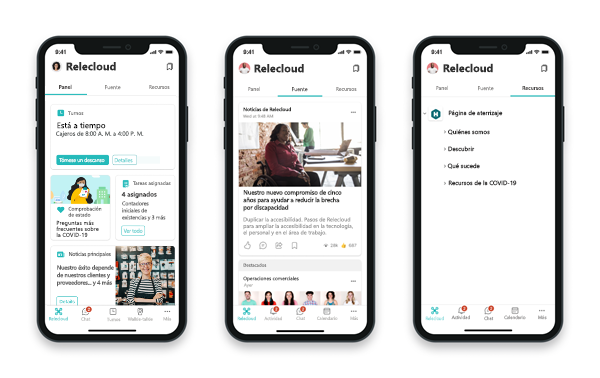

# Interactúe con su personal de primera línea y céntrese en el bienestar

Fomente la sensación de pertenencia entre su equipo de primera línea ayudándoles a interactuar con toda la organización.

Las encuestas como el [Informe de pulsos del índice de tendencias de trabajo](https://www.microsoft.com/worklab/work-trend-index) muestran que gran parte del personal de primera línea:

- Desea que se haga un mayor esfuerzo para dar apoyo a su salud mental
- Dice que la dirigencia no da prioridad a la creación de cultura
- Cree que el estrés laboral seguirá siendo el mismo o aumentará en el próximo año

Puede ayudar a su equipo de primera línea a superar estos desafíos y sentirse respaldado en su organización mediante [Conexiones Viva](#connect-frontline-workers-to-your-broader-organization-with-viva-connections), [Yammer](#create-communities-with-yammer), [Elogiar](#boost-morale-with-praise), [SharePoint y Microsoft Stream](#support-engagement-with-sharepoint-and-microsoft-stream).

## Conectar al personal de primera línea con su organización más amplia con Conexiones Viva

> [!VIDEO https://www.microsoft.com/videoplayer/embed/RE4Vpnn]

<!--  This seems more like an IW image than a frontline one. Swapping out for the video. -->

[Conexiones Viva](/viva/connections/viva-connections-overview) incorpora la potencia de SharePoint a Microsoft Teams, para que el personal de primera línea pueda acceder fácilmente a todo lo que necesita sobre la marcha. Use la aplicación de Conexiones Viva para Microsoft Teams para:

- Conectar al personal de primera línea y crear oportunidades para interactuar, comunicarse y colaborar
- Facilitar al personal de primera línea el acceso a noticias y anuncios importantes
- Capacitar al personal de primera línea en torno a una misión y un objetivo en común
- Crear una sensación de pertenencia y proporcionar herramientas que ayuden a fomentar el bienestar

### Aumentar el compromiso con las comunicaciones

Conexiones Viva consta de tres componentes principales que se pueden configurar y personalizar de diferentes maneras para resaltar herramientas y recursos: el panel, la fuente y los recursos, que se muestran a continuación.

|Componente |Descripción |Capacidades |
|:---------|:-----------|:------------|
|Panel |El Panel es el conjunto de herramientas digital de su empleado y permite el acceso rápido a tareas populares. |Dé prioridad a las tarjetas que ayudan al personal de primera línea a realizar tareas populares, como registrar el ingreso y la salida, o ver las tareas asignadas. Las tarjetas se pueden destinar a distintos roles y regiones. |
|Fuente |La Fuente agrega contenido de Yammer, noticias de SharePoint y Stream para mostrar una secuencia de noticias personalizada. |El contenido de la Fuente se agrega automáticamente en función de los sitios y las comunidades de Yammer que sigue el usuario. El contenido se puede priorizar para mostrarse de forma más destacada en la fuente. Use la segmentación de audiencia para mostrar contenido a audiencias específicas. |
|Recursos |La superficie de Recursos muestra vínculos a portales populares de SharePoint y otro contenido. |Los recursos se heredan de la navegación global en SharePoint. Se muestran vínculos a portales populares de SharePoint, como recursos de aprendizaje y ventajas de RR. HH. Los portales modernos de SharePoint se mostrarán en Teams para proporcionar la mejor experiencia de visualización posible. |

Hay varias maneras de usar Conexiones Viva para comunicarse con los empleados. Conexiones Viva incluye una [Fuente donde se agregan y muestran noticias, contenido de Yammer y vídeos](/viva/connections/viva-connections-overview#viva-connections-feed) en una vista personalizada basada en los sitios y comunidades que sigue el espectador. El [Panel](/viva/connections/create-dashboard) también se puede usar para resaltar determinadas tarjetas que se vinculan a fuentes de noticias importantes.

A medida que prioriza y alinea los escenarios que se admitirán, tenga en cuenta cómo y dónde deben ubicarse determinadas herramientas y recursos. [Obtenga más información sobre las diferencias entre las aplicaciones de escritorio y móviles](/viva/connections/viva-connections-overview#viva-connections-mobile-and-desktop-experiences).

#### Capacitar a los trabajadores para compartir comentarios

La creación de canales para que el personal de primera línea comparta comentarios ayuda a estos equipos a sentirse comprometidos y a notar que sus voces importan. Además, obtener comentarios de estos equipos puede proporcionar información sobre cómo su organización puede mejorar los procesos.

- **En el Panel**: use una [tarjeta de vínculo web](/viva/connections/create-dashboard#add-a-web-link-card) para facilitar la vinculación a canales de comentarios como [Microsoft Forms](https://support.microsoft.com/office/create-a-form-with-microsoft-forms-4ffb64cc-7d5d-402f-b82e-b1d49418fd9d) y [comunidades de Yammer](https://support.microsoft.com/office/join-and-create-a-community-in-yammer-56aaf591-1fbc-4160-ba26-0c4723c23fd6). También puede [integrar soluciones de terceros en el Panel](https://cloudpartners.transform.microsoft.com/resources/viva-app-integration).

    > [!NOTE]
    > La creación de formularios requiere una licencia F3 o Enterprise. Los trabajadores con licencias F1 pueden rellenar formularios, pero deberán ser creados por alguien con una licencia F3 o Enterprise. [Obtenga más información sobre los tipos de licencia](flw-licensing-options.md) o [ Consulte la tabla detallada de comparación de licencias](https://go.microsoft.com/fwlink/?linkid=2139145).

- **En la Fuente**: de manera estratégica [incluya una publicación de noticias de SharePoint](https://support.microsoft.com/office/create-and-share-news-on-your-sharepoint-sites-495f8f1a-3bef-4045-b33a-55e5abe7aed7#:~:text=In%20SharePoint%20Online%2C%20you%20can%20add%20news%20posts,instructions%20Create%20the%20news%20post%20.%20See%20More) dirigida al personal de primera línea para resaltar diferentes formas de recopilar comentarios y que explique cómo los comentarios pueden mejorar la experiencia del personal de primera línea.
- **En Recursos**: incluya vínculos a herramientas de comentarios para que el personal de primera línea sepa a dónde ir para proporcionar comentarios.

### Promover la salud y el bienestar

El personal de primera línea necesita un soporte adicional a la hora de administrar su salud y bienestar. No solo sus trabajos son acelerados, sino que también pueden ser exigentes desde el punto de vista físico y emocional.

- **En el Panel**: incluya revisiones de salud diarias, avisos de bienestar y [otras soluciones de terceros que mantienen a las personas conectadas y productivas](https://cloudpartners.transform.microsoft.com/resources/viva-app-integration).
- **En la Fuente**: use [publicaciones de noticias de SharePoint](https://support.microsoft.com/office/create-and-share-news-on-your-sharepoint-sites-495f8f1a-3bef-4045-b33a-55e5abe7aed7#:~:text=In%20SharePoint%20Online%2C%20you%20can%20add%20news%20posts,instructions%20Create%20the%20news%20post%20.%20See%20More) y [Vínculos de noticias de vídeo](/viva/connections/video-news-links) para destacar los recursos de salud y bienestar. Puedes usar la segmentación de audiencia para asegurarte de que las publicaciones lleguen a las personas más relevantes.
- **En Recursos**: incluya vínculos a los recursos de salud y bienestar para que los trabajadores puedan acceder a ellos en cualquier momento.

### Creación de un ecosistema digital de apoyo

Capacitar al personal de primera línea con la tecnología adecuada facilita su trabajo y ayuda a su organización a adaptarse rápidamente a las condiciones de trabajo cambiantes. Use Conexiones Viva para crear un ecosistema digital y una experiencia del empleado cuidada.

- **En el Panel**: use [Plantillas de tarjetas adaptables](/adaptive-cards/templating/), el [Diseñador de tarjetas](/viva/connections/create-dashboard#design-your-own-card-with-a-quick-view) e [integraciones de terceros](https://cloudpartners.transform.microsoft.com/resources/viva-app-integration) para crear tarjetas personalizadas y vistas rápidas que ayuden a los trabajadores a acceder a la información y completar tareas diarias como:
    - Búsqueda o garantía de espacios de estacionamiento
    - Acceso a la información de pago y beneficios
    - Solicitud de nuevos uniformes y suministros
- **En la Fuente**: las [publicaciones de noticias de SharePoint](https://support.microsoft.com/office/create-and-share-news-on-your-sharepoint-sites-495f8f1a-3bef-4045-b33a-55e5abe7aed7#:~:text=In%20SharePoint%20Online%2C%20you%20can%20add%20news%20posts,instructions%20Create%20the%20news%20post%20.%20See%20More) y los [Vínculos a noticias de vídeo](/viva/connections/video-news-links) permiten digitalizar los anuncios de la organización. Las publicaciones de noticias se resaltan en todo el ecosistema de Microsoft 365, se pueden traducir a diferentes idiomas y se pueden encontrar fácilmente cuando los empleados buscan contenido.
- **En Recursos**: incluya vínculos a las herramientas que los equipos usan para administrar el trabajo, como las [aplicaciones de Teams](flw-team-collaboration.md#apps-in-teams).

### Introducción a la planeación, la creación y el lanzamiento de Conexiones Viva

Revise las funcionalidades de Conexiones Viva, los requisitos técnicos y las opciones de personalización. A continuación, trabaje con las partes interesadas (como los representantes de RR. HH. y los propietarios de procesos y operaciones) que puedan representar con precisión las necesidades del personal de primera línea. Realice un inventario de las necesidades de prioridad más alta y alinéelas con las capacidades de Conexiones Viva para crear una experiencia personalizada en Teams. [Introducción a la planeación, la creación y el lanzamiento de Conexiones Viva para su organización](/viva/connections/plan-viva-connections).

## Crear comunidades con Yammer

Yammer es una red social interna que ofrece a los miembros de su organización oportunidades de conectarse entre sí. Puede crear comunidades en las que los miembros de su organización puedan publicar mensajes y comunicarse. Tener una variedad de comunidades que abarcan equipos de primera línea y que no son de primera línea ayuda a los empleados en el terreno a conectarse entre sí y con la organización más amplia. Las comunidades se pueden basar en:

- Ubicación
- Roles, como cajeros o personal de enfermería
- Intereses, como actividades al aire libre o cultura pop
- Grupos de identidad
- Y más

### Hospedaje de eventos en directo

Los miembros de su equipo directivo o de administración pueden hospedar eventos en directo en Yammer, donde los empleados pueden interactuar y formular preguntas en tiempo real a través del chat. Los equipos de comunicaciones y administración pueden usar eventos en directo para compartir anuncios, hospedar eventos motivacionales y mucho más.

> [!NOTE]
> Solo los usuarios con una licencia E3 o E5 pueden hospedar eventos en directo, pero los usuarios con licencias F pueden unirse a ellos. [Obtenga más información sobre quién puede hospedar y unirse a eventos en directo en Yammer](/yammer/manage-yammer-groups/yammer-live-events).

[Obtenga más información sobre Yammer](https://support.microsoft.com/office/what-is-yammer-1b0f3b3e-89ee-4b66-aac5-30def12f287c).

## Aumentar la motivación con Elogiar

La aplicación Elogiar en Microsoft Teams permite que los administradores y empleados se feliciten entre sí y compartan agradecimientos mediante el envío de distintivos en el chat y los canales de Teams. Elogiar ayuda a los empleados a sentirse reconocidos por sus logros, como alcanzar objetivos de ventas o hacer un esfuerzo adicional para ayudar a los clientes.

[Obtenga información sobre cómo administrar Elogiar en su organización](/microsoftteams/manage-praise-app?bc=/microsoft-365/frontline/breadcrumb/toc.json&toc=/microsoft-365/frontline/toc.json).

## Apoyar la interacción con SharePoint y Microsoft Stream

Una de las mayores dificultades para el personal de primera línea es sentirse incluidos en la organización más amplia. Mediante la grabación de reuniones importantes en SharePoint y el hospedaje de vídeos en Microsoft Stream.

### Grabar reuniones de Teams y almacenarlas en SharePoint

Si su organización ya usa Microsoft Teams, es posible que haya grabado algunas de sus reuniones para que los miembros del equipo puedan ponerse al día con las reuniones que se han perdido. La grabación de reuniones también puede beneficiar a su equipo de primera línea haciendo que se sienta incluido en la organización. Algunas formas de usar las reuniones grabadas para ayudar a los equipos de primera línea son:

- Concederles acceso previo a anuncios, como lanzamientos de productos y nuevas directivas.
- Ayudarles a comprender los objetivos empresariales más amplios de su organización.
- Familiarizarlos con el equipo directivo que impulsa las decisiones que les afectan.

[Obtenga información sobre cómo grabar reuniones de Teams y almacenarlas en SharePoint](https://support.microsoft.com/office/record-a-meeting-in-teams-34dfbe7f-b07d-4a27-b4c6-de62f1348c24).

Una vez que se graba y guarda una reunión en SharePoint, el equipo de comunicaciones corporativas puede [agregar una tarjeta en Conexiones Viva](/viva/connections/create-dashboard#create-a-dashboard-and-add-cards) para que sea fácilmente accesible para el equipo de primera línea.

### Hospedar eventos en directo y compartir contenido de vídeo en Microsoft Stream

Microsoft Stream es la propia plataforma de streaming de vídeo de su organización. Con Stream, cualquier usuario de su organización puede grabar y cargar vídeos para compartirlos. Entre las formas de usar Stream para interactuar con el personal de primera línea se incluyen las siguientes:

- Compartir anuncios, como lanzamientos de productos y nuevas directivas, para que el equipo de primera línea no sea el último en saberlo.
- Los miembros del equipo directivo pueden presentarse y analizar sus objetivos para que el equipo de primera línea entienda quién impulsa las decisiones y por qué.
- Los equipos de primera línea de diferentes ubicaciones pueden crear vídeos en los que se presentan y muestran su ubicación para que los trabajadores de diferentes lugares puedan sentirse conectados.

> [!NOTE]
> Solo los usuarios con una licencia Enterprise pueden hospedar eventos o publicar para transmitir. Los usuarios con licencias F pueden unirse a eventos y ver vídeos.

[Obtenga más información sobre Microsoft Stream](https://support.microsoft.com/office/explore-stream-87a7d1e2-ef0e-44c6-88dc-74b23266cfc0).

El equipo de comunicaciones corporativas puede asegurarse de que todos los usuarios tengan acceso fácil a los vídeos de transmisión mediante [la adición de una tarjeta en Conexiones Viva](/viva/connections/create-dashboard#create-a-dashboard-and-add-cards).
