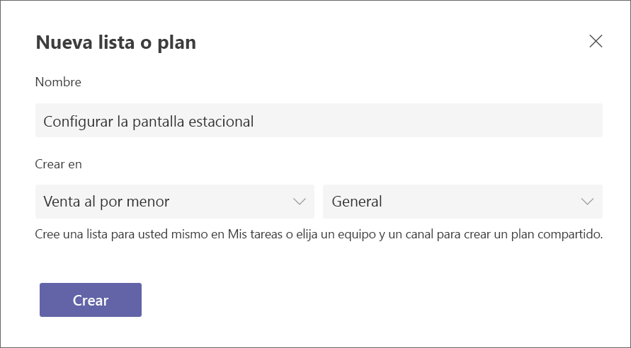
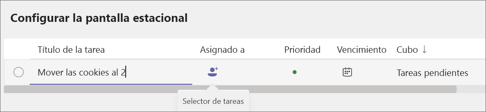
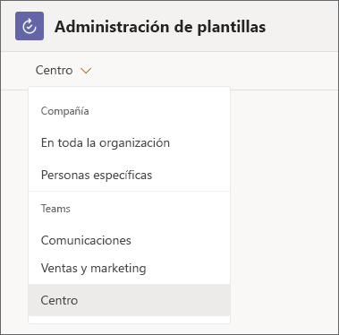
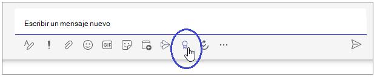

# Administradores : inicie a su equipo con Microsoft 365 para trabajadores de primera línea

Microsoft 365 para trabajadores de primera línea incluye una variedad de funcionalidades para ayudar a que su equipo dé lo mejor de sí mismo. Estos son algunos puntos que puede aplicar de inmediato para que su equipo trabaje en conjunto:

|Ruta de acceso   |Descripción   |Aplicaciones de Teams que necesitará |
|----------|-----------|-----------|
|[Habilite una comunicación rápida](#enable-quick-communication) |Ayude a su equipo de primera línea a permanecer en contacto. |Chats y Walkie Talkie |
|[Administre los horarios, el tiempo y la asistencia de primera línea](#manage-frontline-schedules-time-and-attendance) |Configure un horario que pueda administrar en Teams. |Turnos |
|[Administre elementos de trabajo](#manage-work-items) |Use Teams y las aplicaciones de Microsoft 365 para asignar y hacer un seguimiento de los elementos de trabajo. |Tareas, listas, aprobaciones y actualizaciones |
|[Fomente las conexiones y refuerce la moral](#foster-connections-and-boost-morale-with-praise) |Envíe elogios a los miembros de su equipo para que se sientan apreciados. |Elogios |

Las aplicaciones que admiten estas funcionalidades se incluyen en Teams y la mayoría están listas para su uso inmediato Algunas tendrá que agregarlas a su equipo o configurarlas antes de poder usarlas. Además, la mayoría de estas aplicaciones están ancladas de forma predeterminada, lo que significa que los miembros del equipo de primera línea las verán de forma predeterminada en la barra de aplicaciones, que es la barra en la parte inferior de los clientes móviles de Teams (iOS y Android) y en el lado del cliente de escritorio de Teams. Siempre puede agregar aplicaciones que no estén ancladas en función de sus necesidades. [Obtenga información sobre cómo agregar aplicaciones en Teams](https://support.microsoft.com/office/add-an-app-to-microsoft-teams-b2217706-f7ed-4e64-8e96-c413afd02f77).

Este artículo le ayudará a obtener Teams para trabajadores de primera línea, configurar un equipo y, a continuación, configurar las características y aplicaciones que necesita para que su equipo pueda usar estas funcionalidades.

## Obtener Teams para trabajadores de primera línea

En primer lugar, deberá [iniciar la experiencia de prueba de primera línea](https://support.microsoft.com/office/learn-more-about-the-frontline-trial-in-microsoft-teams-73a429fc-f211-4360-8329-704bc102ba98) desde la aplicación Tareas en Microsoft Teams. Si ya tiene Microsoft 365 para trabajadores de primera línea, puede omitir este paso y seguir leyendo el resto de este artículo para aprender a sacar el máximo partido de sus licencias.

> [!NOTE]
> La prueba de primera línea se basa en la licencia de Microsoft 365 F3.

## Habilitar una comunicación rápida

Use las herramientas de comunicación integradas en Microsoft Teams para permitir que los trabajadores de primera línea se mantengan en contacto. No es necesario realizar ninguna configuración adicional para las aplicaciones de comunicación ni usarlas en su equipo. Siempre verá los iconos de Teams, Chats y Actividad al abrir Teams, ya sea en el escritorio o móvil, mientras que Walkie Talkie solo está disponible en dispositivos móviles.

### Teams

Usted y sus trabajadores de primera línea pueden crear equipos para ayudar a grupos específicos a mantenerse en contacto. Por ejemplo, puede crear un equipo de cajeros para que todos sus cajeros puedan comunicarse entre sí y compartir información. Si hay un cambio de directiva que solo se aplica a los cajeros, puede publicarlo en el equipo de cajeros para que llegue a las personas que necesitan verlo. [Obtenga información sobre cómo crear un equipo en Teams](https://support.microsoft.com/office/set-up-groups-and-teams-a79afa20-aa01-44a3-b33d-5eaa72f6404f).

### Chats

El chat de Teams permite a los miembros de su personal de primera línea comunicarse sin problemas sin tener que usar sus aplicaciones de mensajería personales. [obtenga más información sobre Chats](https://support.microsoft.com/office/first-things-to-know-about-chats-88ed0a06-6b59-43a3-8cf7-40c01f2f92f2).

### Actividad

Puede @mencionar a un miembro del equipo para llamar su atención sobre una conversación. @menciones enviar una notificación a los usuarios, por lo que verán el mensaje en Actividad incluso si lo pierden en el chat.

### Walkie-talkie

Walkie Talkie permite a los trabajadores mantener conversaciones en tiempo real con los trabajadores en cualquier ubicación sin salir de su estación. Por ejemplo, si un empleado está ayudando a un cliente y necesita ayuda, puede usar Walkie Talkie para ponerse en contacto con un experto o administrador sin tener que alejarse del cliente.

Walkie Talkie se admite en dispositivos Android con Google Mobile Services (GMS) y dispositivos iOS.

## Gestionar los horarios, el tiempo y la asistencia de primera línea

Puede usar la aplicación Turnos para crear y administrar horarios. Con Turnos, los empleados pueden solicitar tiempo libre, ofrecerse como voluntarios para los turnos abiertos y solicitar el intercambio de turnos con sus compañeros de trabajo. También puede usar Turnos para compartir los horarios, de modo que sea fácil para todos los miembros de su equipo saber cuándo van a trabajar. Los empleados pueden usar Turnos para fichar a la entrada y a la salida. Para crear un horario en Turnos:

1. Entre en la aplicación y seleccione **Crear un nuevo horario**.
2. A continuación, seleccione **Agregar grupo** para organizar el horario según el tipo de trabajo o la ubicación. Puede tener varios grupos en un horario Por ejemplo, una organización sanitaria podría tener un grupo para recepcionistas y otro para enfermeras.
3. Seleccione los puntos suspensivos (**…**) y, a continuación, **cambie el nombre** para asignar un nombre al grupo.
4. Para crear un turno para un miembro del equipo, seleccione su fila y, a continuación, seleccione **Más opciones > agregar turno**.

Vea [este vídeo](https://support.microsoft.com/office/create-a-shifts-schedule-2b94ca38-36db-4a1c-8fee-f8f0fec9a984) para obtener más información sobre cómo crear horarios en turnos.

Si su organización ya está usando un sistema de administración de personal para la planificación, su equipo de TI puede integrarlo con Teams para extraer todos sus horarios en Turnos. Ahora mismo Shifts puede integrarse con los sistemas de administración de personal Blue Yonder y Reflexis. [ Obtenga más información sobre cómo conectar el sistema de administración de personal](shifts-connectors.md).

## Administrar elementos de trabajo

Puede usar las aplicaciones Tareas, Listas, Aprobaciones y Actualizaciones para administrar y realizar un seguimiento de los elementos de trabajo. Puede elegir usar solo una aplicación o usar varias de ellas en función de sus necesidades. Cualquier persona puede crear y asignar tareas a sí mismo y a los miembros del equipo.

### Tareas

Tareas funciona con Planner y le permite crear y asignar elementos de trabajo para su equipo. Para crear y asignar una tarea en Tareas:

1. Abra la aplicación Tareas.
2. Seleccione **+ Nueva lista o plan** para crear una lista de tareas para su equipo.
3. Asigne un nombre al plan. En **Crear en**, elija el equipo y el canal al que desea que se aplique el plan de tareas. Luego, seleccione **Crear**.

    

4. Para crear una tarea, asígnele un nombre. A continuación, asígnelo a un miembro del equipo en el que haya creado el plan. También puede elegir una fecha de vencimiento.

    

5. Una vez que haya creado y asignado la tarea, ésta aparecerá en la aplicación Tareas para los miembros del equipo. Si no asigna la tarea a una persona específica, seguirá apareciendo para el equipo.

Tareas funciona con Planner. Vea [esta lista de reproducción](https://support.microsoft.com/office/organize-your-team-s-tasks-in-microsoft-planner-c931a8a8-0cbb-4410-b66e-ae13233135fb) para obtener más información sobre cómo puede usar Planner y Tareas juntos.

### Aprobaciones

Las aprobaciones permiten a su equipo enviar solicitudes de aprobación desde Teams. Por ejemplo, si uno de los miembros del equipo quiere ofrecer un descuento en un pedido grande, puede enviar una solicitud de aprobación para obtener permiso.

Puede crear plantillas para el equipo de primera línea que les permita presentar solicitudes de aprobación simplificadas.

1. En el centro de aprobaciones, seleccione **Crear o administrar plantillas**.
2. En el menú, seleccione el equipo al que desea aplicar la plantilla.

    

3. Seleccione **Nueva plantilla** y, a continuación, elija una plantilla existente en el almacén de plantillas o cree una desde cero para satisfacer sus necesidades.
4. Elija a quién quiere que se aplique la plantilla. Elija **Todo el equipo** para que esta plantilla se aplique a todos los miembros del equipo que seleccionó en el paso 2.
5. Seleccione el equipo de la lista.
6. Rellene la configuración básica, el diseño del formulario y la configuración del flujo de trabajo. A continuación, seleccione **Vista previa**.
7. Si la plantilla le parece adecuada, elija **Publicar**.
8. Los miembros del equipo ahora podrán enviar solicitudes de aprobación desde la plantilla que ha creado.

[Obtenga más información sobre cómo crear plantillas para su equipo en Aprobaciones](https://support.microsoft.com/office/discover-templates-in-approvals-c33ecf9f-b745-4287-b104-ac69469745e0).

### Listas

La aplicación Listas le ayuda a realizar un seguimiento de la información y a organizar el trabajo. Usted y su equipo pueden crear listas de inventario, solicitudes de clientes, necesidades de suministro y mucho más.

Para crear una lista a partir de una plantilla, elija **+Nueva lista** en la aplicación Listas. [Obtenga información sobre qué plantillas están disponibles](https://support.microsoft.com/office/list-templates-in-microsoft-365-62f0e4cf-d55d-4f89-906f-4a34e036ded1).

Si tiene una hoja de cálculo en la que colabora con su equipo, puede convertirla en una lista.

1. En la aplicación Listas, seleccione **+Nueva lista**.
2. Elija **Desde Excel** y cargue la hoja de cálculo que desea convertir en una lista.
3. Confirme que los tipos de columna son correctos y ajústelos si es necesario. Después, seleccione **Siguiente**.
4. Asigne a la lista un nombre, un color, un icono y una ubicación. Después, haga clic en **Crear**.

> [!NOTE]
> La aplicación Listas no está anclada de forma predeterminada, pero puede [agregarla desde la tienda de aplicaciones de Teams](https://support.microsoft.com/office/add-an-app-to-microsoft-teams-b2217706-f7ed-4e64-8e96-c413afd02f77).

### Actualizaciones

Las actualizaciones le permiten crear, enviar y revisar actualizaciones. Se pueden ver fácilmente las actualizaciones, los controles y los informes de los empleados en un solo lugar para asegurarse de que el equipo está en camino hacia el éxito, tanto si se trata de procesos recurrentes que se producen de forma regular como de actualizaciones en el momento que pueden ser necesarias en cualquier momento.

Puede asignar actualizaciones a los miembros del equipo. Los miembros del equipo también pueden enviar actualizaciones sin que se les asigne.

1. En la aplicación Actualizaciones, seleccione **Crear y administrar plantillas**.
2. Elija una plantilla popular o elija **Ver más** para ver todas las opciones de plantillas. Puede elegir una plantilla o empezar desde cero.
3. Rellene la configuración básica y el diseño del formulario.
4. En la configuración del flujo de trabajo, elija quién quiere que envíe esta actualización, que la vea, y las horas y fechas de vencimiento de la misma.
5. Los remitentes que asignó podrán ahora ver y enviar la actualización requerida.

> [!NOTE]
> La aplicación Actualizaciones no está anclada de forma predeterminada, pero puede [agregarla desde la tienda de aplicaciones de Teams](https://support.microsoft.com/office/add-an-app-to-microsoft-teams-b2217706-f7ed-4e64-8e96-c413afd02f77).

## Fomente las conexiones y refuerce la moral con Elogio

La aplicación Elogio en Teams le ayuda a mostrar agradecimiento a los miembros de su equipo. Puedes enviar distintivos a los miembros del equipo para reconocer sus logros y los miembros del equipo pueden enviarse distintivos entre sí. También puede enviar distintivos en una conversación de canal para reconocer a un grupo de personas. Elogio usa distintivos predefinidos que destacan calidades positivas, como **Jugador del equipo** e **Increíble**.

1. Abra un chat o canal de Teams. Debajo del espacio donde escribe un mensaje, elija el icono Elogio o seleccione los puntos suspensivos (**...**) para encontrarlo.
    
2. Seleccione un distintivo en el menú desplegable **Distintivo**.
3. Agregue el nombre de las personas a las que quiere elogiar y una descripción opcional.
4. Seleccione **Vista previa** para comprobarlo y, a continuación, seleccione **Enviar**.

## Compartir vídeos de aprendizaje con los usuarios

Ayude a su equipo a sentirse cómodo y seguro con sus capacidades de Microsoft 365 con estos recursos de aprendizaje. Cada uno de estos artículos y vídeos solo tarda unos minutos en completarse.

[Introducción a Microsoft Teams](https://support.microsoft.com/office/get-started-with-microsoft-teams-b98d533f-118e-4bae-bf44-3df2470c2b12)

[Introducción a Walkie Talkie](https://support.microsoft.com/office/get-started-with-teams-walkie-talkie-25bdc3d5-bbb2-41b7-89bf-650fae0c8e0c)

[Introducción a Turnos](https://support.microsoft.com/office/what-is-shifts-f8efe6e4-ddb3-4d23-b81b-bb812296b821)

Turnos también incluye una característica de reloj de registro de entrada y salida. [Obtenga información sobre cómo registrar el reloj de entrada y salida con Turnos](https://support.microsoft.com/office/clock-in-and-out-with-shifts-ae7b676c-7666-46c7-9f68-85ff54acec8b)

[Introducción a Tareas](https://support.microsoft.com/office/use-the-tasks-app-in-teams-e32639f3-2e07-4b62-9a8c-fd706c12c070)

[Más información sobre aprobaciones](https://support.microsoft.com/office/what-is-approvals-a9a01c95-e0bf-4d20-9ada-f7be3fc283d3)

[Más información sobre las listas](https://support.microsoft.com/office/create-a-list-from-the-lists-app-b5e0b7f8-136f-425f-a108-699586f8e8bd)

[Más información sobre la experiencia móvil de Actualizaciones](https://support.microsoft.com/office/get-started-in-updates-c03a079e-e660-42dc-817b-ca4cfd602e5a#ID0EBF=Mobile)

[Más información sobre cómo enviar elogios](https://support.microsoft.com/office/send-praise-to-people-50f26b47-565f-40fe-8642-5ca2a5ed261e)