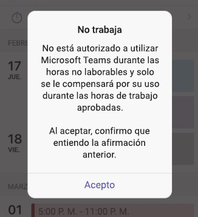

# <a name="manage-shift-based-access-for-frontline-workers-in-teams"></a>Administrar el acceso basado en turnos para los trabajadores de primera línea en Teams

> [!IMPORTANT]
> Esta característica ha quedado en desuso.

## <a name="overview"></a>Información general

La presencia en Microsoft Teams indica la disponibilidad y el estado actuales de un usuario a otros usuarios. La presencia de trabajadores de primera línea suele ser menos predecible que el resto del personal, ya que su horario laboral no suele ser el mismo cada día. Como administrador, puede configurar Teams para mostrar un conjunto de estados de presencia basado en turnos para que los trabajadores de primera línea de su organización indiquen cuándo están dentro y fuera del turno.

Estos estados de presencia basados en turnos&mdash; **De turno**,  **Fuera de turno**,  **Ocupado**&mdash; son independientes del [conjunto predeterminado de estados de presencia](/microsoftteams/presence-admins) en Teams. Con estos dos conjuntos de estados de presencia, puede configurar diferentes experiencias para los usuarios de su organización en función de su rol.

Con el acceso basado en turnos, puede administrar el acceso a Teams cuando los trabajadores de primera línea están fuera del turno. Por ejemplo, puede establecer Teams para que muestre un mensaje que los trabajadores de primera línea deben confirmar antes de poder usar Teams cuando no están en un turno programado.  

## <a name="scenario"></a>Escenario

Este es un ejemplo de cómo su organización puede administrar el acceso basado en turnos.

Tiene trabajadores de primera línea en su organización a los que solo se les debe pagar por las horas que trabajan en un turno que su administrador programó y aprobó. No se les debe pagar por el tiempo dedicado a trabajar fuera de un turno programado, lo que incluye el uso de la aplicación Teams. Configura un mensaje personalizado que dice "Su tiempo en Teams cuando está fuera del turno no contará para las horas que pagar", que se muestra cuando los trabajadores de primera línea intentan acceder a Teams cuando están fuera del turno. Si deciden usar Teams, hacen clic en **Acepto** con la comprensión de que no se les pagará por este tiempo.

También tiene trabajadores de la información en su organización que son asalariados y que no trabajan en turnos. Configure los trabajadores de la información para que usen los estados de presencia predeterminados en Teams al tiempo que proporciona a los trabajadores de primera línea presencia basada en turnos.

## <a name="shift-based-presence-states"></a>Estados de presencia basados en turnos

Estos son los estados de presencia basados en turnos.

|Aplicación configurada |Usuario configurado  |Más información  |
|---------|---------|---------|
| En un turno     |         |Se establece automáticamente al principio de un turno         |
| Fuera de turno     |         |Se establece automáticamente al final de un turno         |
| Ocupado      |  Ocupado         |Se establece automáticamente. También se puede establecer manualmente cuando el trabajo de primera línea está de turno.|

## <a name="off-shift-access-to-teams"></a>Acceso por turnos a Teams

Esta característica le permite administrar el acceso a Teams cuando los trabajadores de primera línea están fuera del turno. Puede establecer Teams para que muestre un mensaje a los trabajadores de primera línea si acceden a Teams cuando están fuera del turno. Los trabajadores de primera línea deben hacer clic en **Acepto** para confirmar el mensaje antes de poder usar Teams.

Puede usar el mensaje predeterminado, elegir entre un conjunto de mensajes predefinidos o personalizar el mensaje para mostrar el texto que desee. Este es el mensaje predeterminado:



También puede establecer la frecuencia cuando se muestra el mensaje y establecer un período de gracia entre el momento en que se inicia el primer turno o finaliza el último turno y cuando el acceso a Teams está restringido.

## <a name="manage-shift-based-access"></a>Administración del acceso basado en turnos

Como administrador, usa directivas para controlar la presencia basada en turnos para los trabajadores de primera línea de la organización. Estas directivas se administran mediante los siguientes cmdlets de PowerShell:

- [New-CsTeamsShiftsPolicy](/powershell/module/teams/new-csteamsshiftspolicy)
- [Get-CsTeamsShiftsPolicy](/powershell/module/teams/get-csteamsshiftspolicy)
- [Set-CsTeamsShiftsPolicy](/powershell/module/teams/set-csteamsshiftspolicy)
- [Grant-CsTeamsShiftsPolicy](/powershell/module/teams/grant-csteamsshiftspolicy)
- [Remove-CsTeamsShiftsPolicy](/powershell/module/teams/remove-csteamsshiftspolicy)

Use el cmdlet New-CsTeamsShiftsPolicy para crear una  nueva directiva, establecer la configuración de directiva que desee y, a continuación, use el cmdlet Grant-CsTeamsShiftsPolicy para asignar la directiva a los usuarios.

Por ejemplo: Para obtener información detallada sobre cada parámetro y configuración de directiva, incluida la lista de mensajes predefinidos fuera del turno entre los que puede elegir, consulte [New-CsTeamsShiftsPolicy](/powershell/module/teams/new-csteamsshiftspolicy).

### <a name="example-1"></a>Ejemplo 1

En este ejemplo, creamos una nueva directiva denominada Off Shift Teams Access Default Message (Mensaje predeterminado de acceso de Teams fuera de turno). En esta directiva, la presencia basada en turnos está activada y el mensaje predeterminado se muestra cada vez que un usuario al que se asigna esta directiva accede a Teams cuando está fuera de turno. El usuario puede usar Teams cuando esté fuera del turno si acepta el mensaje y el período de gracia entre el inicio del primer turno o el último turno finaliza y cuando el acceso está restringido y es de 10 minutos.  

```powershell
New-CsTeamsShiftsPolicy -Identity "Off Shift Teams Access Default Message" -EnableShiftPresence $true -ShiftNoticeFrequency always -ShiftNoticeMessageType DefaultMessage -AccessType UnrestrictedAccess_TeamsApp -AccessGracePeriodMinutes 10
```

> [!NOTE]
> Use el parámetro **ShiftNoticeMessageType** para establecer el mensaje que desea mostrar. Para ver una lista de los mensajes predefinidos entre los que puede elegir para este parámetro, consulte [New-CsTeamsShiftsPolicy](/powershell/module/teams/new-csteamsshiftspolicy).

### <a name="example-2"></a>Ejemplo 2 

En este ejemplo, creamos una nueva directiva denominada Off Shift Teams Access Custom Message (Mensaje personalizado de acceso de Teams fuera de turno). En esta directiva, la presencia basada en turnos está activada y se muestra un mensaje personalizado cada vez que un usuario al que se asigna esta directiva accede a Teams cuando está fuera de turno. El usuario puede usar Teams cuando está fuera del turno si acepta el mensaje, y el período de gracia entre el inicio del primer turno o el último turno finaliza y cuando el acceso está restringido y es de 15 minutos.  

```powershell
New-CsTeamsShiftsPolicy -Identity "Off Shift Teams Access Custom Message" -EnableShiftPresence $true -ShiftNoticeFrequency always -ShiftNoticeMessageType CustomMessage -ShiftNoticeMessageCustom "Your time on Teams when on off shift won't count toward payable hours" -AccessType UnrestrictedAccess_TeamsApp -AccessGracePeriodMinutes 15
```

> [!NOTE]
> Use el parámetro **ShiftNoticeMessageType** para establecer el mensaje que desea mostrar. Para obtener más información, consulte [New-CsTeamsShiftsPolicy](/powershell/module/teams/new-csteamsshiftspolicy).

### <a name="example-3"></a>Ejemplo 3

En este ejemplo, creamos una nueva directiva denominada Mensaje 1 de acceso de Teams fuera de turno. En esta directiva, la presencia basada en turnos está activada y se muestra el siguiente mensaje predefinido cada vez que un usuario al que se le asigna esta directiva accede a Teams cuando está fuera del turno.

  "Su empleador no autoriza ni aprueba el uso de su red, aplicaciones, sistemas o herramientas por parte de empleados no exentos o por horas durante sus horas no laborables. Al aceptar, usted reconoce que su uso de Teams mientras está fuera del turno no está autorizado y que no se le compensará". 

El usuario puede usar Teams cuando está fuera del turno si acepta el mensaje y el período de gracia entre el inicio del primer turno o el último turno finaliza y cuando el acceso está restringido y es de 3 minutos.  

```powershell
New-CsTeamsShiftsPolicy -Identity "Off Shift Teams Access Message1" -EnableShiftPresence $true -ShiftNoticeFrequency always -ShiftNoticeMessageType Message1 -AccessType  UnrestrictedAccess_TeamsApp -AccessGracePeriodMinutes 3
```

> [!NOTE]
> Use el parámetro **ShiftNoticeMessageType** para establecer el mensaje que desea mostrar. Para ver una lista de los mensajes predefinidos entre los que puede elegir para este parámetro, consulte [New-CsTeamsShiftsPolicy](/powershell/module/teams/new-csteamsshiftspolicy).

### <a name="example-4"></a>Ejemplo 4

En este ejemplo, asignamos una directiva denominada Mensaje personalizado de acceso a Teams fuera del turno a un usuario llamado remy@contoso.com.

```powershell
Grant-CsTeamsShiftsPolicy -Identity remy@contoso.com -PolicyName "Off Shift Teams Access Custom Message"
```

## <a name="related-articles"></a>Artículos relacionados

- [Administrar la aplicación Turnos para su organización en Teams](/microsoftteams/expand-teams-across-your-org/shifts/manage-the-shifts-app-for-your-organization-in-teams?bc=/microsoft-365/frontline/breadcrumb/toc.json&toc=/microsoft-365/frontline/toc.json)
- [Descripción de PowerShell para Teams](/microsoftteams/teams-powershell-overview)