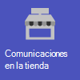
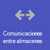
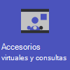
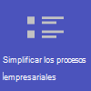
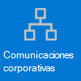

# Introducción a Microsoft 365 para organizaciones minoristas

Los entornos minoristas, con sus programaciones rotativas y el personal sobre la marcha, tienen necesidades muy diferentes a las de otras organizaciones. Para obtener la mayor ventaja para su organización comercial, primero elija qué escenarios Microsoft 365 y Microsoft Teams pueden ayudarle en sus operaciones empresariales diarias y, a continuación, asegúrese de preparar el entorno de Teams con los aspectos básicos, los equipos y las aplicaciones adecuados para admitir esos escenarios.

1. [Elija los escenarios](#choose-your-scenarios) que desea implementar para su empresa.
:::image type="content" source="media/retail-teams-scenarios.png" alt-text="Diagrama que muestra los escenarios de Teams para el comercio minorista." lightbox="media/retail-teams-scenarios.png":::
2. [Configuración de Microsoft 365](flw-setup-microsoft-365.md): configure los elementos principales de Microsoft 365, Microsoft Teams y cualquier otro servicio que necesite.
3. [Configurar servicios y aplicaciones](#configure-services-and-apps): usar plantillas de equipo para configurar los equipos que se necesitan rápidamente, incluidos los canales y las aplicaciones que la empresa necesita. Agregue otras aplicaciones de Microsoft según sea necesario para admitir sus escenarios.
:::image type="content" source="media/retail-teams-apps.png" alt-text="Diagrama que muestra equipos, plantillas de equipo y aplicaciones que se pueden incluir." lightbox="media/retail-teams-apps.png":::

## Elegir los escenarios

Microsoft 365 y Microsoft Teams ofrecen varias funcionalidades que pueden ayudar a las organizaciones minoristas con sus operaciones diarias y transformación digital. Se recomiendan los siguientes escenarios para organizaciones minoristas:

     

> [!NOTE]
> Estos escenarios también forman parte de Microsoft Cloud for Retail. Puede hacer más con estos escenarios cuando también use otras funcionalidades de Microsoft Cloud for Retail, como Microsoft Dynamics 365. Obtenga más información sobre el uso de esta solución, que reúne las funcionalidades de Azure, Dynamics 365 y Microsoft 365 en [Microsoft Cloud for Retail](/industry/retail).

### Descarga de un póster con información general sobre escenarios

Use el siguiente póster para empezar a imaginar lo que su organización puede hacer con Microsoft 365 for frontline workers.

| Elemento | Descripción |
|:-----|:-----|
|   [PDF](https://go.microsoft.com/fwlink/?linkid=2206476) \| [Visio](https://go.microsoft.com/fwlink/?linkid=2206271)   Actualizado en septiembre de 2022   |Este póster proporciona información general sobre los escenarios que puede implementar para los empleados de primera línea en una configuración comercial.|

### Introducción al vídeo

Vea el siguiente vídeo para ver cómo puede ayudar a los asociados de la tienda a conectarse y colaborar:

> [!VIDEO https://www.microsoft.com/videoplayer/embed/RWRJVw]

Vea el siguiente vídeo para ver cómo puede simplificar los procesos empresariales en entornos comerciales:

> [!VIDEO https://www.microsoft.com/videoplayer/embed/RWRzfc]

### Comunicación y colaboración en el almacén.

Reúna a los asociados y la administración en el almacén para colaborar y simplificar las operaciones con las aplicaciones de Teams y Teams.

**Aplicaciones clave:** Turnos, Walkie Talkie, Tareas, Aprobaciones, Chat, Elogios, Listas, Archivos, Actualizaciones

**Servicios adicionales:** Outlook, Conexiones Viva, SharePoint, Power Platform y Power Apps

Más información: [Colaboración en equipo de primera línea](flw-team-collaboration.md)

### Comunicación y colaboración entre almacenes

Los miembros del personal pueden comunicarse y colaborar en varios almacenes de una región o con la sede central mediante las mismas herramientas y aplicaciones que usa en el almacén.

**Aplicaciones clave:** Turnos, Walkie Talkie, Tareas, Aprobaciones, Chat, Elogios, Listas, Archivos, Actualizaciones

**Servicios adicionales:** Outlook, Conexiones Viva, Yammer, SharePoint, Power Platform y Power Apps

Más información: [Colaboración en equipo de primera línea](flw-team-collaboration.md)

### Accesorios y consultas virtuales

La aplicación Bookings en Microsoft Teams proporciona a las organizaciones una forma sencilla de programar y administrar citas virtuales para asociados y clientes. Úsela para programar citas virtuales, como experiencias virtuales de compra.

**Características y aplicaciones clave:** reuniones, Bookings

Más información: [citas virtuales con Microsoft Teams y la aplicación Bookings](bookings-virtual-visits.md)

### Simplificar procesos empresariales

Puede usar aplicaciones de Teams, Power Apps y Power BI para simplificar los procesos empresariales. Por ejemplo, puede:

- Establecer y mantener programaciones para sus empleados con Turnos.
- Realizar paseos e inventarios del almacén con Power Apps.
- Realizar un seguimiento de los indicadores clave de rendimiento (KPI) con informes de Power BI.

**Aplicaciones clave:** Turnos, Tareas, Listas, Aprobaciones

**Servicios adicionales:** Power Platform con Power Apps y Power BI

Más información: [Simplificar los procesos empresariales](simplify-business-processes.md)

### Comunicaciones corporativas

La participación de los empleados contribuye de forma significativa a la satisfacción, la fidelidad y la productividad del lugar de trabajo en cualquier organización. Obtenga información sobre cómo mantener a todos informados y comprometidos con SharePoint, Teams, Yammer, Stream y Conexiones Viva.

**Servicios adicionales:** Conexiones Viva, SharePoint, Stream, Yammer

Más información: [Comunicaciones corporativas con trabajadores de primera línea](flw-corp-comms.md)

### Incorporación de nuevos empleados

Haga que la incorporación de nuevos empleados sea una gran experiencia fomentando un entorno de trabajo híbrido todo en uno donde los nuevos empleados puedan encontrar recursos importantes, reunirse con personas de su organización y prepararse para tener éxito en su nuevo rol.

**Aplicaciones clave:** Listas, reuniones en directo

**Servicios adicionales:** Viva Learning, SharePoint, Yammer

Más información: [Incorporar nuevos empleados](flw-onboarding-training.md)

> [!NOTE]
> Para todas estas funcionalidades, los usuarios deben tener una licencia adecuada. Microsoft 365 para los trabajadores de primera línea F1 y F3 o Office 365 F3, Office 365 A3, A5, E3 y E5, así como Microsoft 365 Empresa Estándar, Business Premium, A3, A5, E3 y E5 son todos compatibles. Para obtener más información sobre las licencias de Teams en general, consulte [Administrar el acceso del usuario a Teams](/microsoftteams//user-access). Consulte [Opciones de licencias para personal de primera línea](flw-licensing-options.md) para obtener más información sobre el uso de Microsoft 365 para los trabajadores de primera línea en combinación con otras licencias.

## Configurar servicios y aplicaciones

:::image type="content" source="media/retail-teams-apps.png" alt-text="Diagrama de equipos, plantillas de equipo y aplicaciones que se pueden incluir.":::

### Aplicaciones y servicios para el comercio minorista

Asegúrese de que sus trabajadores pueden comunicarse, colaborar y ofrecer un excelente servicio al cliente con aplicaciones como Turnos, Walkie-talkie, Tareas, Listas, Elogiar y muchas más. Puede determinar qué aplicaciones están disponibles para los usuarios si las habilita en el centro de administración de Teams o incluyéndolas en una plantilla de equipo. Más información sobre [administrar aplicaciones de Teams](/microsoftteams/manage-apps).

En el caso de entornos comerciales, las siguientes aplicaciones y servicios pueden ayudarle a transformar los procesos empresariales y a apoyar la comunicación:

| Aplicaciones y servicios de Teams | Descripción | Administrar | Ayuda |
| ----- | ----- | ----- | ----- |
| Aprobaciones | Las aprobaciones se pueden integrar en el chat para que se pueda cerrar la sesión fácilmente. | [Administrar aprobaciones](/microsoftteams/approval-admin?bc=/microsoft-365/frontline/breadcrumb/toc.json&toc=/microsoft-365/frontline/toc.json) | [Usar Aprobaciones](https://support.microsoft.com/office/what-is-approvals-a9a01c95-e0bf-4d20-9ada-f7be3fc283d3) |
| Chat | Habilite conversaciones rápidas e inserciones entre el personal con herramientas de comunicaciones seguras de nivel empresarial, en lugar de aplicaciones de nivel de consumidor o SMS. | [Chat, equipos, canales y aplicaciones en Microsoft Teams](/microsoftteams/deploy-chat-teams-channels-microsoft-teams-landing-page) | [Chatear en Teams](https://support.microsoft.com/office/start-and-pin-chats-a864b052-5e4b-4ccf-b046-2e26f40e21b5?wt.mc_id=otc_microsoft_teams) |
| Documentos | Comparta procedimientos operativos estándar, directivas de almacenamiento, planes y mucho más. | [Integración de Teams y SharePoint](/sharepoint/teams-connected-sites) | [Compartir archivos](https://support.microsoft.com/office/upload-and-share-files-57b669db-678e-424e-b0a0-15d19215cb12) |
| Elogios | Reconozca a sus compañeros de trabajo por su excelente trabajo en equipo con la aplicación Elogio. | [Administrar la aplicación Elogiar](/microsoftteams/manage-praise-app?bc=/microsoft-365/frontline/breadcrumb/toc.json&toc=/microsoft-365/frontline/toc.json) | [Enviar elogios a las personas](https://support.microsoft.com/office/send-praise-to-people-50f26b47-565f-40fe-8642-5ca2a5ed261e) |
| Dispositivos RealWear | Comunicación manos libres con dispositivos. | [Microsoft Teams para RealWear](/microsoftteams/flw-realwear?bc=/microsoft-365/frontline/breadcrumb/toc.json&toc=/microsoft-365/frontline/toc.json) | [Usar Microsoft Teams para RealWear](https://support.microsoft.com/office/using-microsoft-teams-for-realwear-af20d232-d18c-476f-8031-843a4edccd5f) |
| Turnos | Administre las programaciones y los registros de entrada y salida con Turnos. | [Administrar la aplicación Turnos para su organización en Teams](/microsoftteams/expand-teams-across-your-org/shifts/manage-the-shifts-app-for-your-organization-in-teams?bc=/microsoft-365/frontline/breadcrumb/toc.json&toc=/microsoft-365/frontline/toc.json) | [Usar Turnos](https://support.microsoft.com/office/what-is-shifts-f8efe6e4-ddb3-4d23-b81b-bb812296b821) |
| Tareas | Ayude a los empleados a saber en qué deben centrarse cuando no están con los clientes asignándoles tareas. Las operaciones pueden usar [la publicación de tareas](/microsoftteams/manage-tasks-app?bc=/microsoft-365/frontline/breadcrumb/toc.json&toc=/microsoft-365/frontline/toc.json#task-publishing) para enviar tareas a ubicaciones y realizar un seguimiento del progreso en esas ubicaciones. | [Administrar la aplicación Tareas](/microsoftteams/manage-tasks-app?bc=/microsoft-365/frontline/breadcrumb/toc.json&toc=/microsoft-365/frontline/toc.json) | [Usar Tasks](https://support.microsoft.com/office/use-the-tasks-app-in-teams-e32639f3-2e07-4b62-9a8c-fd706c12c070) |
| Actualizaciones | Compruebe las prioridades periódicas o puntuales, como la limpieza diaria. Los administradores pueden crear plantillas para que los empleados las rellenen y las envíen. | [Administrar la aplicación Actualizaciones](/microsoftteams/manage-updates-app?bc=/microsoft-365/frontline/breadcrumb/toc.json&toc=/microsoft-365/frontline/toc.json). | [Uso de Actualizaciones](https://support.microsoft.com/office/get-started-in-updates-c03a079e-e660-42dc-817b-ca4cfd602e5a) |
| Walkie-talkie | Presione para mantener una comunicación rápida que no esté restringida por la geografía, como las radios estándar de dos vías.| [Administrar la aplicación Walkie-talkie](/microsoftteams/walkie-talkie?bc=/microsoft-365/frontline/breadcrumb/toc.json&toc=/microsoft-365/frontline/toc.json) | [Usar Walkie-talkie](https://support.microsoft.com/office/get-started-with-teams-walkie-talkie-25bdc3d5-bbb2-41b7-89bf-650fae0c8e0c) |

| Más aplicaciones y servicios de Microsoft | Descripción | Administrar | Ayuda |
| ----- | ----- | ----- | ----- |
| Bookings | Habilitar las consultas y los accesorios virtuales. | [Citas virtuales con Microsoft Teams y la aplicación Bookings](bookings-virtual-visits.md) | [Usar Bookings](https://support.microsoft.com/en-us/office/what-is-bookings-42d4e852-8e99-4d8f-9b70-d7fc93973cb5) |
| Power Apps y Power Platform | Integre procesos empresariales y habilite actualizaciones rápidas de datos, como inventario de almacén, números de ventas, informes de incidentes y mucho más. | [integración de Teams con Microsoft Power Platform](/microsoftteams/platform/samples/teams-low-code-solutions) y [Administrar aplicaciones de Microsoft Power Platform en el Centro de administración de Microsoft Teams](/microsoftteams/manage-power-platform-apps) | -  |
| SharePoint | Al crear un nuevo equipo, se crea un nuevo sitio de SharePoint y se conecta al equipo. Muchos de los escenarios anteriores se basan en características de SharePoint ya insertadas en Teams, como compartir documentos para la colaboración en equipo. | [Integración de Teams y SharePoint](/sharepoint/teams-connected-sites) | [Agregar una página, lista o biblioteca de documentos de SharePoint como una pestaña en Teams](https://support.microsoft.com/office/add-a-sharepoint-page-list-or-document-library-as-a-tab-in-teams-131edef1-455f-4c67-a8ce-efa2ebf25f0b)|
| Viva Connections | Conexiones Viva crea un centro en Teams en el que los asociados comerciales pueden ver una fuente de noticias personalizada de su organización y un panel personalizado con los recursos que necesitan. | [Información general sobre Conexiones Microsoft Viva](/sharepoint/viva-connections-overview) | [Conexiones Viva en Microsoft Teams](https://support.microsoft.com/office/your-intranet-is-now-in-microsoft-teams-8b4e7f76-f305-49a9-b6d2-09378476f95b) |
| Viva Learning | Proporcionar aprendizaje cuando sea necesario, directamente en el flujo de su trabajo. | [Administrar Aprendizaje Viva](/microsoft-365/learning/) | [Usar Aprendizaje Viva](https://support.microsoft.com/office/viva-learning-preview-01bfed12-c327-41e0-a68f-7fa527dcc98a) |
| Yammer | Conectar su organización y permitir la comunicación entre departamentos y regiones con Yammer. | [Administrar Yammer](/yammer) | [Usar Yammer](https://support.microsoft.com/office/what-is-yammer-1b0f3b3e-89ee-4b66-aac5-30def12f287c) |

### Plantillas comerciales para equipos

Cree equipos que incluyan un conjunto predefinido de opciones de configuración, canales, pestañas y aplicaciones preinstaladas para la comunicación y la colaboración dentro de un almacén individual, con una región o entre la sede central y su personal dondequiera que estén.

- La plantilla **Organiza un almacén** incluye canales para General, Cambio de turno, Preparación del almacén y Aprendizaje, e incluye las aplicaciones Aprobaciones, Tareas y Wiki.
- La plantilla **Retail for Managers** incluye canales para General, Operaciones y Aprendizaje, e incluye una pestaña de Wiki.

También puede[ crear una plantilla personalizada ](/microsoftteams/create-a-team-template)para incluir las aplicaciones que necesita su almacén. Más información: [Introducción a las plantillas comerciales para equipos](/microsoftteams/get-started-with-retail-teams-templates?bc=/microsoft-365/frontline/breadcrumb/toc.json&toc=/microsoft-365/frontline/toc.json)

## Prepárese para implementar sus escenarios: identificación de roles y responsabilidades para escenarios

Ahora que sabe qué escenarios quiere implementar y qué necesita para admitirlos, puede reunir a su equipo para que pueda planear, implementar y supervisar cómo funcionan en su organización. Por ejemplo, es posible que se necesiten los siguientes roles para realizar estos escenarios en su organización:

| Imagen | Rol | Responsabilidades | Departamento |
| ---- | ---- | ----- | ----- |
| | Administrador de TI | Trabaje con el personal de operaciones y administración de comercio para definir escenarios y cómo funcionarán para la organización.   Configure las opciones en el Centro de administración de Teams, como directivas y plantillas, y habilite las aplicaciones.   Configure los valores de la aplicación (como la configuración global de Turnos) para la organización.   Agregar y licenciar usuarios.  | Departamento de TI |
|| Personal de Operaciones | Trabaje con los Administradores para definir escenarios y determinar qué configuraciones, directivas, plantillas y aplicaciones son necesarias para Teams.   Cree equipos regionales o de división a partir de plantillas.   Configure tareas, listas y flujos de aprobación para la coordinación entre los almacenes de una región o entre los almacenes y las oficinas centrales.   Configurar el marco de aprendizaje para el personal. | Operaciones centrales |
| | Administrador del almacén | Trabaje con Administradores y personal de Operaciones para definir escenarios.   Crear equipos para el almacén a partir de plantillas.   Configure canales y aplicaciones para los equipos, según sea necesario. Por ejemplo: un canal para entregas de turnos.   Configure los horarios de la tienda en Turnos.   Configure tareas, listas, actualizaciones y flujos de aprobación específicos de la tienda.   Configurar tareas de aprendizaje para el personal. | Administración del almacén |

Para obtener más información sobre cómo implementar y adoptar correctamente Teams, vea [Adoptar Microsoft Teams](/microsoftteams/adopt-microsoft-teams-landing-page).
