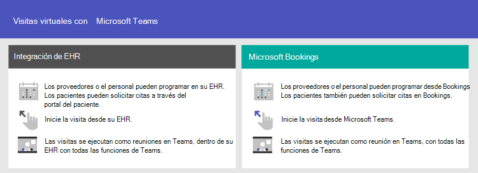
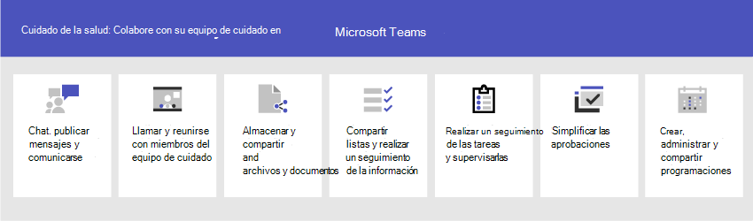

# Introducción a Microsoft 365 para organizaciones sanitarias

Microsoft 365 y Microsoft Teams ofrecen una serie de características de telemedicina útiles para hospitales y otras organizaciones sanitarias. Las características de Teams se están desarrollando para ayudar a los hospitales con:

- Citas virtuales e integración de registros electrónicos de atención sanitaria (EHR)
- Paquetes de directivas de Teams
- Mensajería segura
- Plantillas de Teams
- Colaboración y coordinación de atención médica

> [!NOTE]
> Esta funcionalidad también forma parte de Microsoft Cloud for Healthcare. Obtenga más información sobre esta solución, que aúna capacidades de Azure, Dynamics 365 y Microsoft 365 en la [Microsoft Cloud for Healthcare](/industry/healthcare).

Vea el siguiente vídeo para obtener más información sobre el uso de la colección de atención sanitaria para mejorar la colaboración del equipo de salud en Teams.

> [!VIDEO https://www.microsoft.com/videoplayer/embed/RE4Hqan]

Para obtener la mayor ventaja para su organización sanitaria, primero elija qué escenarios Microsoft 365 y Microsoft Teams pueden ayudarle en sus actividades diarias y, a continuación, asegúrese de preparar el entorno de Teams con los aspectos básicos, los equipos y las aplicaciones adecuados para admitir esos escenarios.

1. [Elija los escenarios](#scenarios-for-healthcare) que desea implementar.
2. [Configuración de Microsoft 365](flw-setup-microsoft-365.md): configure los elementos principales de Microsoft 365, Microsoft Teams y cualquier otro servicio que necesite.
3. [Configurar servicios y aplicaciones](flw-setup-microsoft-365.md#step-5-configure-apps-for-your-scenario): use plantillas de equipo para configurar los equipos que necesita rápidamente, incluidos los canales y las aplicaciones que necesita para su empresa. Agregue otras aplicaciones de Microsoft según sea necesario para admitir sus escenarios.

## Escenarios para el cuidado de la salud

Los siguientes escenarios están disponibles para las organizaciones del cuidado de la salud:

| Escenario | Descripción | Requirements |
| -------- | -------- | -------- |
| [Citas virtuales con integración de Electronic Healthcare Record (EHR)](#virtual-appointments-and-electronic-healthcare-record-ehr-integration) | Programar, administrar y llevar a cabo citas virtuales con pacientes. Este escenario conecta Teams y la plataforma Cerner o Epic para admitir citas virtuales. | Una suscripción activa para Microsoft en la nube para la atención sanitaria o una suscripción a la oferta independiente del conector EHR de Microsoft Teams.   Los usuarios tienen un Microsoft 365 adecuado o una licencia de Office 365 que incluye reuniones de Teams.   Las organizaciones deben tener la versión de Cerner de noviembre de 2018 o posterior o la versión épica de noviembre de 2018 o posterior.  Detalles de los requisitos de [Cerner EHR](ehr-admin-cerner.md#before-you-begin) y [Epic EHR](ehr-admin-epic.md#before-you-begin) |
| [Citas virtuales con Microsoft Bookings y la aplicación Bookings](#virtual-appointments-and-electronic-healthcare-record-ehr-integration) | Programar, administrar y llevar a cabo citas virtuales con pacientes. Este escenario se basa en Microsoft Bookings para admitir citas virtuales. | Microsoft Bookings debe estar activado para la organización.   Todos los usuarios de la aplicación de Bookings y todo el personal que participe en las reuniones debe tener una licencia que admita la programación de reuniones de Teams.  [Detalles de los requisitos de Bookings](/microsoftteams/bookings-app-admin#prerequisites-to-use-the-bookings-app-in-teams?bc=/microsoft-365/frontline/breadcrumb/toc.json&toc=/microsoft-365/frontline/toc.json)|
| [Colaboración y coordinación de atención médica](#care-coordination-and-collaboration) | El personal de medicina clínica y el personal general pueden colaborar internamente en los horarios, documentos, tareas, etc.| Los usuarios deben tener una licencia adecuada*. |

*Se admiten Office 365 A3, A5, E3, E5, F1, F3, Microsoft 365 A3, A5, E3 y E5, Business Standard. Para obtener más información sobre las licencias de Teams en general, consulte [Administrar el acceso del usuario a Teams](/microsoftteams/user-access).

También puede elegir entre otros [escenarios](flw-choose-scenarios.md) para Microsoft 365 para trabajadores de primera línea, como [comunicaciones corporativas](flw-corp-comms.md) o [bienestar y compromiso](flw-wellbeing-engagement.md).

Además, aproveche estas características que ayudan a Microsoft Teams a trabajar para su organización sanitaria:

| Característica | Descripción | Requirements |
| -------- | -------- | -------- |
| [Paquetes de directivas de Microsoft Teams](#teams-policy-packages)| Asegúrese de que los dispositivos del personal clínico, del personal de información y de las salas de pacientes tengan el acceso adecuado a la función de Teams.| Los usuarios deben tener una licencia adecuada*. |
| [Mensajería segura](#secure-messaging) | Obtenga atención más rápida de los mensajes urgentes y tenga la seguridad de que los mensajes se reciben y se leen. | Los usuarios deben tener una licencia adecuada*.  |
| [Plantillas de Teams](#teams-templates-for-healthcare-organizations) | Cree equipos que incluyan una plantilla predefinida de configuración, canales y aplicaciones preinstaladas para la comunicación y colaboración en una planta, sala o departamento, o entre varias plantas, salas o departamentos en un hospital. | Los usuarios deben tener una licencia adecuada*.  |

## Citas virtuales e integración de registros electrónicos de atención sanitaria (EHR)

Use la plataforma de reuniones completa de Teams para programar, administrar y llevar a cabo citas virtuales con pacientes.

- Si su organización ya usa registros de mantenimiento electrónicos o EHR, puede integrar Teams para una experiencia más fluida. El conector de la historia clínica electrónica (HCE) de Microsoft Teams hace que sea fácil para los médicos lanzar una cita virtual con el paciente o consultar con otro proveedor en Microsoft Teams directamente desde el sistema CERNER EHR. Para obtener más información, consulte [Citas virtuales con Teams: integración en Cerner EHR](ehr-admin-cerner.md) y [Citas virtuales con Teams: integración en Epic EHR](ehr-admin-epic.md).
- Si no usa una EHR admitida, puede usar Microsoft Bookings y la aplicación de Bookings en Teams. Para más información, consulte [Citas virtuales con Teams y la aplicación Bookings](bookings-virtual-visits.md).

## Paquetes de directivas de Teams

Aplique paquetes de directivas de Teams para definir lo que los diferentes roles pueden hacer en Teams. Por ejemplo, especifique directivas para:

- Personal sanitario, como personal titulado de enfermería, personal encargado de enfermería, personal médico y trabajadores sociales, para que tengan acceso completo al chat, llamadas, administración de turnos y reuniones.
- Personal de la información en su organización del cuidado de la salud, como personal de TI, personal de informática, personal de finanzas y responsables del cumplimiento normativo, para que tengan acceso completo al chat, llamadas y reuniones.
- Salas de pacientes, para control la configuración de los dispositivos en salas de pacientes.

Para más información, consulte [Paquetes de directivas de Teams para sanidad](/microsoftteams/policy-packages-healthcare?bc=/microsoft-365/frontline/breadcrumb/toc.json&toc=/microsoft-365/frontline/toc.json).

## Mensajería segura

La mensajería segura admite la colaboración dentro de los equipos de salud, incluidas varias características nuevas:

- El remitente de un mensaje puede establecer prioridad especial para su mensaje, de modo que el destinatario reciban notificaciones repetidamente hasta que lea el mensaje.
- El remitente de un mensaje puede solicitar una confirmación de lectura, para recibir una notificación cuando el destinatario lea el mensaje.

Combinadas, estas características ofrecen una atención más rápida de los mensajes urgentes y la seguridad de que los mensajes se reciben y se leen. Se pueden crear por paciente nuevos equipos de salud que usen estas características. Estas características se basan en directivas y se pueden asignar a individuos o al equipos enteros.

Para más información, consulte [Introducción a las directivas de mensajería segura para las organizaciones sanitarias](messaging-policies-hc.md).

Otro aspecto relacionado con la mensajería segura es la posibilidad de que otros espacios empresariales sean federados por organizaciones sanitarias, lo que permite una mejor comunicación entre espacios empresariales. (Consulte [Administración de reuniones externas y chat en Microsoft Teams](/microsoftteams/manage-external-access)).

## Plantillas de Teams para organizaciones sanitarias

Teams incluye plantillas diseñadas específicamente para organizaciones sanitarias, lo que facilita la creación de equipos para que el personal se comunique y colabore en la atención a los pacientes o en las necesidades operativas. Para más información, consulte [Uso de plantillas de equipo sanitario](/microsoftteams/expand-teams-across-your-org/healthcare/healthcare-templates-admin-console?bc=/microsoft-365/frontline/breadcrumb/toc.json&toc=/microsoft-365/frontline/toc.json).

## Colaboración y coordinación de atención médica

Reúna a su equipo de salud para coordinar la atención y colaborar con Teams.

Teams permite a médicos, médicos, enfermeras y otro personal colaborar de forma eficaz con las características de colaboración incluidas en Teams, como:

- Configurar equipos y canales para sus equipos sanitarios y personal de la información. Usar canales con pestañas para estructurar el trabajo, con la ayuda adicional que proporcionan pestañas en las que el personal puede anclar fuentes de información.
- Pueden chatear, publicar mensajes y comunicarse. Su equipo puede comunicarse constantemente sobre diferentes pacientes que necesitan atención.
- Pueden realizar llamadas y reunirse con miembros del equipo sanitario. Configure reuniones individuales o utilice las reuniones de canal para administrar reuniones diarias, con la tecnología de las características de Teams de audio, vídeo, pantalla compartida, grabación y transcripción.
- Almacenar y compartir archivos y documentos. Su equipo sanitario forma parte de un único equipo virtualizado que trabaja y colabora en documentos de Office.

Además, su equipo puede usar aplicaciones en Teams para:

- Compartir listas y hacer un seguimiento de la información con la aplicación Listas
- Hacer un seguimiento de tareas y monitorearlas con la aplicación Tasks
- Simplificar aprobaciones con la aplicación Aprobaciones
- Crear, administrar y compartir horarios con la aplicación Turnos

### Compartir listas y hacer un seguimiento de la información con la aplicación Listas

La aplicación Lists en Microsoft Teams ayuda a los equipos a realizar un seguimiento de la información y a organizar el trabajo. La aplicación viene preinstalada para todos los usuarios de Teams y en una pestaña en todos los equipos y canales. Se pueden crear listas desde cero, desde plantillas predefinidas o mediante la importación de datos de Excel.

Loa equipos sanitarios pueden usar la plantilla de Pacientes para empezar. Pueden crear listas para hacer un seguimiento de las necesidades y estado de los pacientes. Se pueden importar datos existentes sobre pacientes en hojas de cálculo de Excel para crear una lista en Teams. Estas listas se pueden usar para escenarios como guardias y supervisión de pacientes para coordinar el cuidado de la salud.

Por ejemplo, un miembro del personal encargado de enfermería puede crear una lista de pacientes en un equipo que incluya a todos los miembros del equipo sanitario. Durante las guardias, el equipo sanitario tiene acceso a Teams en sus dispositivos móviles y puede actualizar la información de los pacientes de la lista. Todos los miembros del equipo pueden ver la lista para sincronizarse. En las sesiones de guardia en las que el equipo sanitario se reúne para evaluar métricas clave de salud para asegurarse de que un paciente vaya por buen camino para recibir el alta, pueden compartir esta información mediante Teams en una pantalla grande de visualización. los miembros del equipo sanitario que no se encuentren en el lugar de la reunión se pueden unir a distancia.

Aquí tiene una lista de muestra para guardias de pacientes.

:::image type="content" source="media/lists-patients-example.png" alt-text="Captura de pantalla de la lista de ejemplo para las rondas de pacientes.":::

Para más información, consulte [Administrar la aplicación Listas para su organización en Teams](/microsoftteams/manage-lists-app?bc=/microsoft-365/frontline/breadcrumb/toc.json&toc=/microsoft-365/frontline/toc.json).

### Hacer un seguimiento de tareas y monitorearlas con la aplicación Tasks

Use [Tasks](https://support.microsoft.com/office/use-the-tasks-app-in-teams-e32639f3-2e07-4b62-9a8c-fd706c12c070) en Teams para hacer un seguimiento elementos pendientes para todo el equipo sanitario. Su equipo sanitario puede crear, asignar y programar tareas, categorizar tareas y actualizar estados en cualquier momento, desde cualquier dispositivo que tenga Teams. Los administradores y profesionales de TI también pueden publicar tareas en equipos específicos para su organización. Por ejemplo, podría publicar un conjunto de tareas para los nuevos protocolos de seguridad o un nuevo paso de ingreso para su uso en un hospital.

Para más información, consulte [Administrar la aplicación Tasks para su organización en Microsoft Teams](/microsoftteams/manage-tasks-app?bc=/microsoft-365/frontline/breadcrumb/toc.json&toc=/microsoft-365/frontline/toc.json)

### Simplificar aprobaciones con la aplicación Aprobaciones

Use [Aprobaciones](https://support.microsoft.com/office/what-is-approvals-a9a01c95-e0bf-4d20-9ada-f7be3fc283d3) para simplificar todas sus solicitudes y procesos con su equipo. Cree, administre y comparta aprobaciones directamente desde su centro para el trabajo en equipo. Inicie un flujo de aprobación desde el mismo sitio desde el que envía un chat, en una conversación de canal o desde la propia lista de Aprobaciones. Solo tiene que seleccionar el tipo de aprobación, agregar detalles, adjuntar archivos y elegir aprobadores. Una vez enviado, los aprobadores reciben una notificación y pueden revisar y responder a la solicitud.

Puede permitir la aplicación Aprobaciones para su organización y agregarla a sus equipos. Para obtener más información, consulte [Gestión de la aplicación Aprobaciones](/microsoftteams/approval-admin?bc=/microsoft-365/frontline/breadcrumb/toc.json&toc=/microsoft-365/frontline/toc.json).

### Crear, administrar y compartir horarios con la aplicación Turnos y la integración de personal de primera línea

Teams se integra con la aplicación Turnos y Personal de primera línea, que se pueden usar para coordinar las características de turnos del personal y mucho más. Por ejemplo, en Turnos, los gerentes de enfermería pueden configurar y coordinar los horarios de su personal, y el personal de enfermería puede consultar horarios y cambiar turnos.

Para más información, consulte [Administrar la aplicación Turnos para su organización en Microsoft Teams](/microsoftteams/expand-teams-across-your-org/shifts/manage-the-shifts-app-for-your-organization-in-teams?bc=/microsoft-365/frontline/breadcrumb/toc.json&toc=/microsoft-365/frontline/toc.json).

## Ayude a su personal médico y de la información a empezar a usar Teams

Hay muchos recursos disponibles para ayudar a todos los usuarios en su organización a familiarizarse con Teams:

- Visite el [centro de adopción de Teams](https://adoption.microsoft.com/microsoft-teams/) para obtener consejos sobre la implementación de Teams si está iniciando la experiencia de su organización con Teams, o para expandir Teams a más ámbitos de su organización.
- Considere configurar [formas de aprendizaje](https://adoption.microsoft.com/microsoft-365-learning-pathways/) personalizado para que los usuarios aprendan solamente a hacer sus tareas.
- Obtenga ayuda y formación para los usuarios sobre cómo realizar tareas básicas en Teams en el [sitio de soporte técnico de Teams](https://support.microsoft.com/teams), incluyendo [vídeos formativos rápidos](https://support.microsoft.com/office/microsoft-teams-video-training-4f108e54-240b-4351-8084-b1089f0d21d7). Asimismo, el sitio incluye ayuda y aprendizaje para las aplicaciones de Teams, incluidas [Listas](https://support.microsoft.com/office/get-started-with-lists-in-teams-c971e46b-b36c-491b-9c35-efeddd0297db), [Tasks](https://support.microsoft.com/office/use-the-tasks-app-in-teams-e32639f3-2e07-4b62-9a8c-fd706c12c070), [Aprobaciones](https://support.microsoft.com/office/what-is-approvals-a9a01c95-e0bf-4d20-9ada-f7be3fc283d3), [Bookings](https://support.microsoft.com/office/what-is-bookings-42d4e852-8e99-4d8f-9b70-d7fc93973cb5) y [Turnos](https://support.microsoft.com/office/what-is-shifts-f8efe6e4-ddb3-4d23-b81b-bb812296b821).
