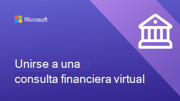
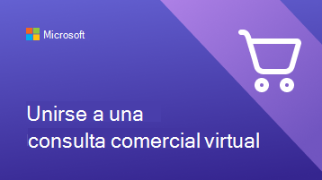
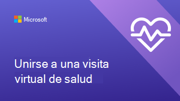
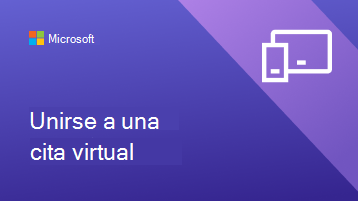

# Ayuda a tus clientes y clientes a usar citas virtuales programadas con Bookings

Ahora que su organización ha empezado a usar Microsoft Teams y la aplicación Bookings para crear citas virtuales, deberá asegurarse de que sus clientes comprendan cómo reservar estas citas y unirse a ellas.

Vea este vídeo para obtener información general rápida de lo que pueden hacer las citas virtuales por su organización.

> [!VIDEO https://www.microsoft.com/videoplayer/embed/RE4TQop]

## ¿Qué incluye este kit de herramientas?

Este kit de herramientas está diseñado para ayudarle a asistir a sus clientes y consumidores a unirse correctamente a una cita virtual. Puede personalizar los recursos que proporcionamos e incluir vínculos a ellos en sus comunicaciones sobre citas virtuales. Este kit de herramientas incluye:

[Instrucciones para su sitio web](#guidance-for-your-website):   Preguntas más frecuentes sobre citas virtuales que puede personalizar y hospedar en su sitio web. Asegúrese de agregar sus propios vínculos y cualquier información adicional que los clientes necesiten conocer sobre sus directivas.

[Recursos para su equipo](#resources-for-your-team):   Artículos y vídeos para ayudar a su equipo a sentirse más cómodo llevando a cabo las citas virtuales.

[Recursos para los clientes](#resources-for-your-clients):  
Un vínculo al contenido de soporte técnico de Microsoft, que incluye un vídeo sobre cómo unirse a una cita virtual. 
Infografías que puede personalizar para su organización.

## Instrucciones para su sitio web

Permita que sus clientes sepan qué esperar con las citas virtuales respondiendo a preguntas comunes. Todo lo que tiene que hacer es editar esta sección de preguntas y respuestas, de modo que responda a las directivas de citas virtuales. Luego, deberá pegarla en su sitio web.

### Conceptos básicos sobre las citas virtuales

**¿Qué es una cita virtual?**

Una cita virtual es una cita en línea realizada a través de Microsoft Teams. En esta, conversará uno a uno con uno de nuestros miembros del personal, como lo haría en el caso de una visita en persona.

**¿En qué se diferencian las citas virtuales de las visitas en persona?**

Informe a sus clientes sobre si hay diferencias en los servicios que proporciona de forma virtual y en persona. También puede describir las diferencias de las tarifas entre las citas virtuales y en persona.

**¿Cómo funciona una cita virtual?**

Cuando se una a esta desde el vínculo que aparece en la confirmación por correo electrónico, entrará a una sala de espera virtual. Una vez que un miembro del personal se una a la llamada, entrará en una sala virtual con este, en la que se llevará a cabo la visita uno a uno.

**¿Cómo funciona el pago de las citas virtuales?**

Informe a sus clientes sobre si acepta diferentes tipos de pago para las citas virtuales.

### Reservar una cita

**¿Cómo reservo una cita?**

Vínculo a la página de reservas de su organización. Informe a sus clientes sobre si hay formas alternativas de realizar citas virtuales, como por teléfono, por correo electrónico o a través de redes sociales.

**¿Con quién puedo reservar una cita?**

Asegúrese de que los clientes puedan mantener relaciones con sus proveedores preferidos al compartir qué miembros del personal, si los hubiera, están trabajando exclusivamente de forma virtual o en persona.

**¿Cómo puedo cancelar o volver a programar una cita virtual?**

Puede crear un vínculo a la directiva de cancelación y reprogramación de su organización aquí, o bien describir las diferencias entre las directivas de las citas virtuales y en persona.

### Tecnología

**¿Qué equipo técnico necesito para una cita virtual?**

Los clientes pueden unirse a una cita virtual desde cualquier explorador web o a través de la aplicación de Microsoft Teams. Escriba aquí si su organización tiene especificaciones adicionales, como una cámara web o micrófono de alta calidad. Si su organización de atención sanitaria tiene HCE integrado en los equipos, los pacientes pueden unirse a las visitas desde el portal de la organización.

**¿Cómo me uno a una cita virtual?**

Puede vincular a sus clientes aquí Unirse a una cita de Bookings como asistente (microsoft.com) para mostrarles un vídeo detallado y un proceso paso a paso de cómo unirse a una cita.

## Recursos para su equipo

Saque el máximo partido de las citas virtuales asegurándose de que los miembros del personal sepan cómo realizarlas. Puede compartir estos artículos y vídeos con los miembros del equipo para ayudarles a comprender mejor las citas virtuales.

- [Obtenga información sobre cómo usar la aplicación Bookings en Teams](https://support.microsoft.com/office/what-is-bookings-42d4e852-8e99-4d8f-9b70-d7fc93973cb5).
- [Obtenga información sobre cómo unirse a una cita de Bookings](https://support.microsoft.com/office/join-a-bookings-appointment-attendees-3deb7bde-3ea3-4b41-8a06-741ad0db9fc0).
- [Dirigir una cita](bookings-virtual-visits.md#conduct-an-appointment).
- [Ver un vídeo sobre citas virtuales](#help-your-clients-and-customers-use-virtual-appointments-scheduled-with-bookings).
- [Ver un vídeo sobre cómo administrar la cola en citas virtuales](https://go.microsoft.com/fwlink/?linkid=2202615).
- [Ver un vídeo sobre las características de la sala de espera en las citas virtuales](https://go.microsoft.com/fwlink/?linkid=2202614).

## Recursos para los clientes

Puede crear un vínculo a este artículo para mostrar a los clientes cómo unirse a citas virtuales:  
[Obtenga información sobre cómo unirse a una cita virtual](https://support.microsoft.com/office/join-a-bookings-appointment-as-an-attendee-95cea12d-2220-421f-a663-6efb20913c7f)

Descargue y [personalice](#customize-your-infographic) una de estas infografías para que aparezca en su sitio web. Estas ofrecen a los clientes una forma rápida y visualmente atractiva de comprender cómo funcionan las citas virtuales con su organización.

| Gráfico                | Descripción y vínculos              |
| :------------------- | -------------------: |
|| Infografía personalizable para la organización de servicios financieros   [Descargar como PDF](https://go.microsoft.com/fwlink/?linkid=2214189)   [Descargar como PowerPoint](https://go.microsoft.com/fwlink/?linkid=2214285)
|| Infografía personalizable para su organización minorista   [Descargar como PDF](https://go.microsoft.com/fwlink/?linkid=2214355)   [Descargar como PowerPoint](https://go.microsoft.com/fwlink/?linkid=2214283) |
|| Infografía personalizable para su organización de atención sanitaria   [Descargar como PDF](https://go.microsoft.com/fwlink/?linkid=2214356)   [Descargar como PowerPoint](https://go.microsoft.com/fwlink/?linkid=2214357) |
|| Infografía personalizable no específica de un sector determinado   [Descargar como PDF](https://go.microsoft.com/fwlink/?linkid=2214284)   [Descargar como PowerPoint](https://go.microsoft.com/fwlink/?linkid=2214282) |

### Personalizar la infografía

1. Elija una de las infografías predefinidas en función de las necesidades de su organización:
    1. Salud
    2. Servicios financieros
    3. Venta minorista
    4. Cualquier sector

2. Personalice la infografía en PowerPoint.
    1. Use los colores y las fuentes preferidas de su organización.
    2. Agregue el logotipo o las imágenes de marca de su organización.
    3. Vínculo a páginas de su sitio web, como la página de reservas, la información de facturación o la página principal.
    4. Agregue cualquier información adicional que sus clientes necesiten saber antes de unirse a una cita virtual.

3. Exporte la infografía personalizada como PDF.
