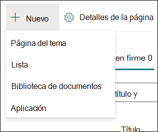

# Crear un nuevo tema (versión preliminar)

> [!Note] 
> El contenido de este artículo es para Project Cortex Private Preview. [Obtenga más información acerca del Project Cortex](https://aka.ms/projectcortex).

En Experiencias de tema, puede crear un nuevo tema si no se ha detectado uno a través de la indización o si la tecnología de IA no encontró suficiente evidencia para establecerlo como un tema.

## Requisitos

Para crear un nuevo tema, debe:
- Tener una licencia de Experiencias de tema.
- Tener permisos para [**quién puede crear o editar temas.**](https://docs.microsoft.com/microsoft-365/knowledge/topic-experiences-user-permissions) Los administradores de conocimientos pueden conceder a los usuarios este permiso en la configuración de permisos del tema de Knowledge Network. 

> [!Note] 
> Los usuarios que tienen permiso para administrar temas en el Centro de temas (administradores de conocimientos) ya tienen permisos para crear y editar temas.

## Para crear un tema nuevo:

1. En la página Centro de temas, **seleccione Nuevo** y, a continuación, seleccione Página **de tema.** Si no puede ver la opción **Nuevo** en el Centro de temas, es posible que no tenga los permisos necesarios.

    

2. En la página de tema nuevo, puede rellenar la información de la nueva plantilla de tema:

    - En la **sección Nombre de este** tema, escriba el nombre del nuevo tema.
    
    - En la **sección Nombres alternativos,** escriba nombres o acrónimos que también se usan para hacer referencia al tema.
    
    - En la **sección Descripción** breve, escriba una o dos oraciones del tema. Este texto se usará para la tarjeta de tema asociada.
    
    - En la **sección** Personas, escriba los nombres de los expertos en la materia para el tema. Las personas que agregue manualmente al tema se mostrarán en la página del tema como **personas ancladas.**
    
    - En la **sección Archivos**  y páginas, seleccione Agregar y, a continuación, en la página siguiente, puede seleccionar archivos de OneDrive o páginas de SharePoint Online asociados.
    
    - En la **sección** Sitios, seleccione **Agregar**. En el  **panel** Sitios que se muestra, seleccione los sitios asociados al tema.

    
    
3. Si necesita agregar otros componentes a la página, como texto, imágenes, elementos web, vínculos, etc., seleccione el icono del lienzo en medio de la página para buscarlos y agregarlos.

    

4. Cuando haya terminado, seleccione **Publicar para** publicar la página del tema. Las páginas de temas publicadas se mostrarán en la **pestaña** Páginas.

Después de publicar el artículo, el nombre del tema, el nombre alternativo, la descripción y las personas ancladas se mostrarán a todos los usuarios con licencia que ven el artículo. Los archivos, las páginas y los sitios solo aparecerán en la página del tema si el visor tiene permisos de Office 365 para el elemento. 

La nueva página de tema está hecha de elementos web que son conscientes *de la red de conocimiento.* Esto significa que a medida que AI recopila más información sobre el tema, la información de estos elementos web se actualizará con sugerencias para que la página sea más útil para los usuarios.

## Consulte también

  

