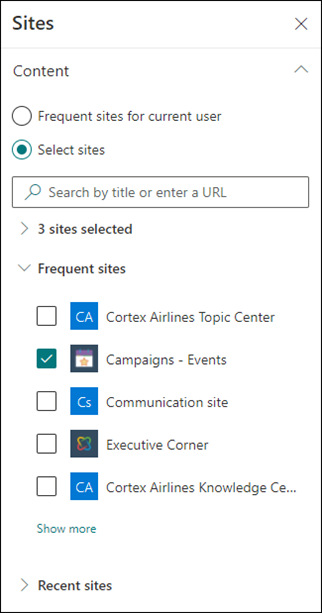

# Cree un equipo nuevo 

En Temas de Viva, puede crear un nuevo tema si uno no se detecta a través de la indización o si la tecnología de inteligencia artificial no encontró suficiente evidencia para establecerlo como un tema.

> [!Note] 
> Aunque la información de un tema recopilado por AI está recortada en [seguridad,](topic-experiences-security-trimming.md)tenga en cuenta que la descripción del tema y la información de personas de un tema creado manualmente es visible para todos los usuarios que tienen permisos para ver el tema. 

## Requisitos

Para crear un nuevo tema, debe:
- Tener una licencia de Viva Topics.
- Tener permisos para [**quién puede crear o editar temas**](./topic-experiences-user-permissions.md). Los administradores de conocimientos pueden conceder a los usuarios este permiso en la configuración de permisos del tema Temas de Viva. 

> [!Note] 
> Los usuarios que tienen permiso para administrar temas en el centro de temas (administradores de conocimientos) ya tienen permisos para crear y editar temas.

## Para crear un tema

Puede crear un tema nuevo desde dos ubicaciones:

- Página principal del centro de  temas: cualquier usuario con licencia con el permiso Quién puede crear o <b></b> editar temas (colaboradores) puede crear un nuevo tema desde el centro de temas seleccionando el menú Nuevo y <b>seleccionaNdo</b>página Tema .  

       

- Página Administrar temas: cualquier  usuario con licencia que tenga permiso Quién puede administrar temas (administradores de conocimientos) puede crear un nuevo tema desde la página Administrar temas en el Centro de temas seleccionando Página Nuevo <b>tema</b>.  

       

### Para crear un tema nuevo:

1. Seleccione la opción para crear una nueva página de temas en la cinta de opciones de la página Administrar temas.

2.   En la **sección Nombre de este tema,** escriba el nombre del nuevo tema.

       

3. En la <b>sección Nombres alternativos,</b> escriba cualquier otro nombre al que se pueda hacer referencia al tema. 

       
4. En la <b>sección</b> Descripción, escriba un par de oraciones que describan el tema. 

     

4. En la <b>sección Personas</b> ancladas, puede "anclar" a una persona para que muestre que tiene una conexión con el tema (por ejemplo, un propietario de un recurso conectado). Comience escribiendo su nombre o dirección de correo electrónico en el cuadro Agregar un nuevo usuario y, <b>a</b> continuación, seleccione el usuario que desea agregar de los resultados de la búsqueda. También puede "desanclarlos" seleccionando el icono Quitar <b>de la</b> lista en la tarjeta de usuario. También puede arrastrar a la persona para cambiar el orden en que aparece la lista de personas.
 
     

5. En la <b>sección Archivos anclados y</b> páginas, puede agregar o "anclar" un archivo o página de sitio de SharePoint que esté asociado al tema.

    
 
    Para agregar un nuevo archivo, seleccione <b>Agregar</b>, seleccione el sitio de SharePoint de los sitios Frecuentes o Seguidos y, a continuación, seleccione el archivo de la biblioteca de documentos del sitio.

    También puede usar la opción <b>De un vínculo</b> para agregar un archivo o página proporcionando la dirección URL. 

    > [!Note] 
    > Los archivos y las páginas que agregue deben encontrarse en el mismo inquilino de Microsoft 365. Si desea agregar un vínculo a un recurso externo en el tema, puede agregarlo a través del icono de lienzo en el paso 8.

6.  La <b>sección Sitios relacionados</b> muestra los sitios que tienen información sobre el tema. 

     

    Puede agregar un sitio relacionado <b></b> seleccionando Agregar y, a continuación, buscando el sitio o seleccionándolo en la lista de sitios frecuentes o recientes. 
    
     

7. La <b>sección Temas relacionados</b> muestra las conexiones que existen entre los temas. Puede agregar una conexión a otro tema seleccionando el botón Conectarse a un tema relacionado y, <b>a</b> continuación, escribiendo el nombre del tema relacionado y seleccionándose en los resultados de la búsqueda. 

      

    A continuación, puede proporcionar una descripción de cómo están relacionados los temas y seleccionar <b>Actualizar</b>. 

     

   El tema relacionado que agregó se mostrará como un tema conectado.

     

   Para quitar un tema relacionado, seleccione el tema que desea quitar y, a continuación, seleccione el <b>icono Quitar</b> tema. 
 
      

   A continuación, <b>seleccione Quitar</b>. 

     
     
 

8. También puedes agregar elementos estáticos a la página (como texto, imágenes o vínculos) seleccionando el icono del lienzo, que puedes encontrar debajo de la breve descripción. Si lo selecciona, se abrirá el cuadro de herramientas de SharePoint desde el que puede elegir el elemento que desea agregar a la página.

     

9. Seleccione **Publicar** para guardar los cambios. 

Después de publicar la página, el nombre del tema, el nombre alternativo, la descripción y las personas ancladas se mostrarán a todos los usuarios con licencia que ven el tema. Los archivos, páginas y sitios específicos solo aparecerán en la página del tema si el visor tiene permisos de Office 365 para el elemento. 

## Consulte también

