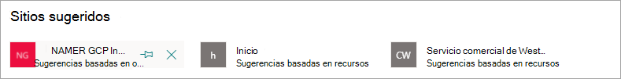

# Editar un tema existente en Temas de Microsoft VivaEdit an existing topic in Microsoft Viva Topics 

 

> [!VIDEO https://www.microsoft.com/videoplayer/embed/RE4LA4n]  

 

En Temas de Viva, puede editar un tema existente.In Viva Topics, you can edit an existing topic. Es posible que deba hacerlo si desea corregir o agregar información adicional a una página de tema existente.You might need to do this if you want to correct or add additional information to an existing topic page. 

> [!Note] 
> Aunque la información de un tema recopilado por AI está recortada en [seguridad,](topic-experiences-security-trimming.md)la descripción del tema y la información de personas que agrega manualmente al editar un tema existente son visibles para todos los usuarios que tienen permisos para ver temas.While information in a topic that is gathered by AI is [security trimmed](topic-experiences-security-trimming.md), the topic description and people information that you manually add when editing an existing topic is visible to all users who have permissions to view topics. 

## RequisitosRequirements

Para editar un tema existente, debe:To edit an existing topic, you need to:
- Tener una licencia de Temas Microsoft Viva.Have a Viva Topics license.
- Tener permisos para [crear o editar temas](./topic-experiences-user-permissions.md).Have permissions to [create or edit topics](./topic-experiences-user-permissions.md). Los administradores del conocimientos pueden conceder a los usuarios este permiso en la configuración de permisos del tema de Temas Viva.Knowledge admins can give users this permission in the Viva Topics topic permissions settings. 

> [!Note] 
> Los usuarios que tienen permiso para administrar temas en el centro de temas (administradores de conocimientos) ya tienen permisos para crear y editar temas.Users who have permission to manage topics in the topic center (knowledge managers) already have permissions to create and edit topics.

## Cómo editar una página de temaHow to edit a topic page

Los usuarios que tienen el *permiso Quién* crear o editar temas pueden editar un tema abriendo la  página del tema desde un resaltado de tema y, a continuación, seleccionando el botón Editar en la parte superior derecha de la página del tema.Users who have the *Who can create or edit topics* permission can edit a topic by opening the topic page from a topic highlight, and then selecting the **Edit** button on the top right of the topic page. La página de temas también se puede abrir desde la página principal del centro de temas, donde puede encontrar todos los temas a los que tiene una conexión.The topic page can also be opened from the topic center home page where you can find all the topics that you have a connection to.

      

Los administradores de conocimientos también pueden editar temas directamente desde **la** página Administrar temas seleccionando el tema y, a continuación, **seleccionando Editar** en la barra de herramientas.Knowledge managers can also edit topics directly from the **Manage topics** page by selecting the topic, and then selecting **Edit** in the toolbar.

   

### Para editar una página de temaTo edit a topic page

1. En la página del tema, seleccione **Editar**.On the topic page, select **Edit**. Esto le permite realizar cambios según sea necesario en la página de tema.This lets you make changes as needed to the topic page.

     

2. En la **sección Nombres alternativos,** escriba cualquier otro nombre al que se pueda hacer referencia al tema.In the **Alternate names** section, type any other names that the topic might be referred to. 

    

3. En la sección **Descripción**, escriba un par de frases que describan el tema.In the **Description** section, type a couple of sentences that describes the topic. O bien, si hay una descripción existente, actualícela si es necesario.Or if a description already exists, update it if needed.

     

4. En la sección **Personas ancladas**, puede "anclar" a un usuario para mostrarle que tiene una conexión con el tema (por ejemplo, el propietario de un recurso conectado).In the **Pinned people** section, you can "pin" a person to show them as having a connection the topic (for example, an owner of a connected resource). Comience escribiendo su nombre o dirección de correo electrónico en el cuadro Agregar un nuevo usuario y, **a** continuación, seleccione el usuario que desea agregar de los resultados de la búsqueda.Begin by typing their name or email address in the **Add a new user** box, and then selecting the user you want to add from the search results. También puede "desanclarlos" seleccionando el icono Quitar **de la** lista en la tarjeta de usuario.You can also "unpin" them by selecting the **Remove from list** icon on the user card.
 
     

    En la sección **Personas sugeridas** se muestran los usuarios que la IA cree que podrían estar conectadas al tema por su conexión con los recursos relacionados con el tema.The **Suggested people** section shows users that AI thinks might be connected to the topic from their connection to resources about the topic. Puede cambiar su estado de Sugeridos a Anclados seleccionando el icono del ancla en la tarjeta de usuario.You can change their status from Suggested to Pinned by selecting the pin icon on the user card.

   

5. En la sección de **Archivos y páginas anclados**, agregue o "ancle" un archivo o página de sitio de SharePoint asociada con el tema.In the **Pinned files and pages** section, you can add or "pin" a file or SharePoint site page that is associated to the topic.

   
 
    Para agregar un nuevo archivo, seleccione **Agregar**, seleccione el sitio SharePoint de los sitios Frecuentes o Seguidos y, a continuación, seleccione el archivo de la biblioteca de documentos del sitio.To add a new file, select **Add**, select the SharePoint site from your Frequent or Followed sites, and then select the file from the site's document library.

    También puede usar la opción **Desde un vínculo** para agregar un archivo o una página proporcionando la dirección URL.You can also use the **From a link** option to add a file or page by providing the URL. 

   > [!Note] 
   > Los archivos y las páginas que agregue deben encontrarse en el mismo Microsoft 365 inquilino.Files and pages that you add must be located within the same Microsoft 365 tenant. Si desea agregar un vínculo a un recurso externo en el tema, puede agregarlo a través del icono del lienzo en el paso 9.If you want to add a link to an external resource in the topic, you can add it through the canvas icon in step 9.

6. La **sección Archivos y páginas** sugeridos muestra los archivos y páginas que AI sugiere que se asocie al tema.The **Suggested files and pages** section shows files and pages that AI suggests to be associated to the topic.

   

    Puede cambiar un archivo o una página sugeridos a un archivo o página anclado seleccionando el icono de anclado.You can change a suggested file or page to a pinned file or page by selecting the pinned icon.

7.  En la **sección Sitios anclados,** puede agregar o "anclar" un sitio asociado al tema.In the **Pinned sites** section, you can add or “pin” a site that is associated to the topic. 

    

    Para agregar un nuevo sitio, seleccione **Agregar** y, a continuación, busque el sitio o selecciónelo en la lista de sitios frecuentes o recientes.To add a new site, select **Add** and then either search for the site, or select it from your list of Frequent or Recent sites.
    
    

8. La **sección Sitios sugeridos** muestra los sitios que AI sugiere que se asocie al tema.The **Suggested sites** section shows the sites that AI suggests to be associated to the topic. 

     

    Puede cambiar un sitio sugerido a un sitio anclado seleccionando el icono anclado.You can change a suggested site to a pinned site by selecting the pinned icon.

<!---

7.  The <b>Related sites</b> section shows sites that have information about the topic. 

     

    You can add a related site by selecting <b>Add</b> and then either searching for the site, or selecting it from your list of Frequent or Recent sites. 
    
     

8. The <b>Related topics</b> section shows connections that exists between topics. You can add a connection to a different topic by selecting the <b>Connect to a related topic</b> button, and then typing the name of the related topic, and selecting it from the search results. 

      

    You can then give a description of how the topics are related, and select <b>Update</b>. 

     

   The related topic you added will display as a connected topic.

     

   To remove a related topic, select the topic you want to remove, then select the <b>Remove topic</b> icon. 
 
      

   Then select <b>Remove</b>. 

     

--->

9. También puede agregar elementos estáticos a la página, como texto, imágenes o vínculos, seleccionando el icono de lienzo, el cual se encuentra debajo de la descripción breve.You can also add static items to the page — such as text, images, or links - by selecting the canvas icon, which you can find below the short description. Si lo selecciona, se abrirá SharePoint cuadro de herramientas desde el que puede elegir el elemento que desea agregar a la página.Selecting it will open the SharePoint toolbox from which you can choose the item you want to add to the page.

   

10. Seleccione **Publicar** o **Volver a publicar** para guardar los cambios.Select **Publish** or **Republish** to save your changes. **Volver a** publicar será la opción disponible si el tema se ha publicado anteriormente.**Republish** will be your available option if the topic has been published previously.

