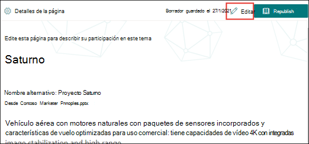

# Editar un tema existente 

 

> [!VIDEO https://www.microsoft.com/videoplayer/embed/RE4LA4n]  

 

En Temas de Viva, puede editar un tema existente. Es posible que deba hacerlo si desea corregir o agregar información adicional a una página de tema existente. 

> [!Note] 
> Aunque la información de un tema recopilado por AI está recortada en [seguridad,](topic-experiences-security-trimming.md)tenga en cuenta que la descripción del tema y la información de personas que agrega manualmente al editar un tema existente es visible para todos los usuarios que tienen permisos para ver temas. 

## Requirements

Para editar un tema existente, debe:
- Tener una licencia de Viva Topics.
- Tener permisos para [**quién puede crear o editar temas**](./topic-experiences-user-permissions.md). Los administradores de conocimientos pueden conceder a los usuarios este permiso en la configuración de permisos del tema Temas de Viva. 

> [!Note] 
> Los usuarios que tienen permiso para administrar temas en el Centro de temas (administradores de conocimientos) ya tienen permisos para crear y editar temas.

## Cómo editar una página de tema

Los usuarios  que tienen el permiso Quién puede crear o editar temas pueden editar un <b></b> tema abriendo la página del tema desde un resaltado de tema y, a continuación, seleccionando el botón Editar en la parte superior derecha de la página del tema. La página de temas también se puede abrir desde la página principal del centro de temas, donde puede encontrar todos los temas a los que tiene una conexión.

      

Los administradores de conocimientos también pueden editar temas directamente desde la página Administrar temas seleccionando el tema y, a continuación, <b>seleccionando Editar</b> en la barra de herramientas.

      

### Para editar una página de tema

1. En la página del tema, seleccione **Editar**. Esto le permite realizar cambios según sea necesario en la página del tema.

       

2. En la <b>sección Nombres alternativos,</b> escriba cualquier otro nombre al que se pueda hacer referencia al tema. 

       
3. En la <b>sección Descripción,</b> escriba un par de oraciones que describan el tema. O bien, si ya existe una descripción, actualícla si es necesario.

     

4. En la <b>sección Personas ancladas,</b> puede "anclar" a una persona para mostrarla como un experto en el tema. Comience escribiendo su nombre o dirección de correo electrónico en el cuadro Agregar un nuevo usuario y, <b>a</b> continuación, seleccione el usuario que desea agregar de los resultados de la búsqueda. También puede "desanclarlos" seleccionando el icono Quitar <b>de la</b> lista en la tarjeta de usuario.
 
     

    La <b>sección Personas sugeridas</b> muestra a los usuarios que AI piensa que podrían ser expertos en el tema desde su conexión a los recursos sobre el tema. Puede cambiar su estado de Sugerido a Anclado seleccionando el icono de patilla en la tarjeta de usuario.

    

5. En la <b>sección Archivos anclados y</b> páginas, puede agregar o "anclar" un archivo o página de sitio de SharePoint que esté asociado al tema.

    
 
    Para agregar un nuevo archivo, seleccione <b>Agregar</b>, seleccione el sitio de SharePoint de los sitios Frecuentes o Seguidos y, a continuación, seleccione el archivo de la biblioteca de documentos del sitio.

    También puede usar la opción <b>De un vínculo</b> para agregar un archivo o página proporcionando la dirección URL. 

   > [!Note] 
   > Los archivos y las páginas que agregue deben encontrarse en el mismo inquilino de Microsoft 365. Si desea agregar un vínculo a un recurso externo en el tema, puede agregarlo a través del icono del lienzo en el paso 9.

6. La <b>sección Archivos y páginas</b> sugeridos muestra los archivos y páginas que AI sugiere que se asocie al tema.

    

    Puede cambiar un archivo o página sugeridos a un archivo o página anclados seleccionando el icono anclado.

7.  La <b>sección Sitios relacionados</b> muestra los sitios que tienen información sobre el tema. 

     

    Puede agregar un sitio relacionado <b></b> seleccionando Agregar y, a continuación, buscando el sitio o seleccionándolo en la lista de sitios frecuentes o recientes. 
    
     

8. La <b>sección Temas relacionados</b> muestra las conexiones que existen entre los temas. Puede agregar una conexión a otro tema seleccionando el botón Conectarse a un tema relacionado y, <b>a</b> continuación, escribiendo el nombre del tema relacionado y seleccionándose en los resultados de la búsqueda. 

      

    A continuación, puede proporcionar una descripción de cómo están relacionados los temas y seleccionar <b>Actualizar</b>. 

     

   El tema relacionado que agregó se mostrará como un tema conectado.

     

   Para quitar un tema relacionado, seleccione el tema que desea quitar y, a continuación, seleccione el <b>icono Quitar</b> tema. 
 
      

   A continuación, <b>seleccione Quitar</b>. 

     

9. También puede agregar elementos estáticos a la página (como texto, imágenes o vínculos) seleccionando el icono del lienzo, que puede encontrar debajo de la breve descripción. Si lo selecciona, se abrirá el cuadro de herramientas de SharePoint desde el que puede elegir el elemento que desea agregar a la página.

     

10. Seleccione **Publicar** o **Volver a publicar** para guardar los cambios. **Volver a** publicar será la opción disponible si el tema se ha publicado anteriormente.

## Consulte también

