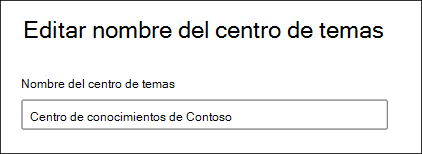

# Administración de la red de administración de conocimientos (vista previa)Manage your knowledge management network (Preview)

> [!Note] 
> El contenido de este artículo es para la versión preliminar privada de Project Cortex.The content in this article is for Project Cortex Private Preview. [Obtenga más información sobre Project Cortex](https://aka.ms/projectcortex).[Find out more about Project Cortex](https://aka.ms/projectcortex).

Después de [configurar la administración de conocimiento](set-up-knowledge-network.md), en cualquier momento, un administrador puede realizar ajustes en los valores de configuración a través del centro de administración 365 de Microsoft.After you [set up knowledge management](set-up-knowledge-network.md), at any time afterwards an admin can make adjustments to your configuration settings through the Microsoft 365 admin center.

Por ejemplo, es posible que deba ajustar la configuración para cualquiera de las siguientes opciones:For example, you may need to adjust your settings for any of the following:
- Agregar nuevos orígenes de SharePoint a los temas de mío.Add new SharePoint sources to mine topics.
- Cambiar los usuarios que tendrán acceso a los temas.Change which users will have access to topics.
- Cambiar los usuarios que tienen permisos para realizar tareas en el centro de temas.Change which users have permissions to do tasks on the topic center.
- Cambiar el nombre del centro de temasChange the name of your topic center

## RequirementsRequirements 
Debe tener permisos de administrador global o de administrador de SharePoint para poder obtener acceso al centro de administración de 365 de Microsoft y administrar las tareas de conocimiento de la organización.You must have Global Admin or SharePoint admin permissions to be able to access the Microsoft 365 admin center and manage Organizational knowledge tasks.

## Para obtener acceso a la configuración de administración de conocimiento:To access knowledge management settings:

1. En el centro de administración de Microsoft 365, seleccione **instalación**y, a continuación, ver la sección de conocimientos de la **organización** .In the Microsoft 365 admin center, select **Setup**, and then view the **Organizational Knowledge** section.
2. En la sección conocimientos de la **organización** , haga clic en **conectar personas con el conocimiento**.In the **Organizational Knowledge** section, click **Connect people to knowledge**. 

      

3. En la página **conectar personas a los conocimientos** , seleccione **administrar** para abrir el panel Configuración de la red de **conocimientos** .On the **Connect people to knowledge** page, select **Manage** to open the **Knowledge network settings** pane. 

      

## Cambiar el modo en que la red de conocimiento puede encontrar temasChange how the knowledge network can find topics

Seleccione la pestaña **detección de temas** si desea actualizar las opciones para los orígenes de temas de SharePoint.Select the **Topic discovery** tab if you want to update your choices for  for SharePoint topic sources. Esta opción le permite seleccionar los sitios de SharePoint de su inquilino que se rastrearán y expondrán para temas.This setting let you select the SharePoint sites in your tenant that will be crawled and mined for topics.

1. En la pestaña **detección de temas** , en **seleccionar orígenes de temas de SharePoint**, seleccione **Editar**.On the **Topic discovery** tab, under **Select SharePoint topic sources**, select **Edit**.
2. En la página **seleccionar orígenes de temas de SharePoint** , seleccione los sitios de SharePoint que se rastrearán como orígenes para los temas durante la detección.On the **Select SharePoint topic sources** page, select which SharePoint sites will be crawled as sources for your topics during discovery. Esto incluye:This includes: 
    a.a. **Todos los sitios**: todos los sitios de SharePoint de su espacio empresarial.**All sites**: All SharePoint sites in your tenant. Esto captura los sitios actuales y futuros.This captures current and future sites. 
    b.b. **Todos, excepto los sitios seleccionados**: escriba los nombres de los sitios que desea excluir.**All, except selected sites**: Type the names of the sites you want to exclude.  También puede cargar una lista de sitios que desea excluir de la detección.You can also upload a list of sites you want to opt out from discovery. Los sitios que se creen en el futuro se incluirán como orígenes para la detección de temas.Sites created in the future will be included as sources for topic discovery.  
    c.c. **Solo sitios seleccionados**: escriba los nombres de los sitios que desea incluir.**Only selected sites**: Type the names of the sites you want to include. También puede cargar una lista de sitios.You can also upload a list of sites. Los sitios que se creen en el futuro no se incluirán como orígenes para la detección de temas.Sites created in the future will not be included as sources for topic discovery.  

      
   
    Si tiene un número de sitios que desea excluir (si selecciona **todos, excepto los sitios seleccionados**) o incluir (si seleccionó **solo sitios seleccionados**), puede elegir cargar un archivo CSV con los nombres de sitio y las direcciones URL.If you have a number of sites that you want to exclude (if you select **All, except selected sites**) or include (if you selected **Only selected sites**), you can choose to upload a CSV file with the site names and URLs. Puede descargar la **plantilla del sitio download. csv** si desea usar el archivo de plantilla CSV.You can select **Download site template .csv** if you want to use the CSV template file.

3. Seleccione **Guardar**.Select **Save**.

##  Cambiar quién puede ver los temas de la organizaciónChange who can see topics in your organization

Seleccione la pestaña **detección de temas** si desea actualizar quién en su organización puede ver temas descubiertos en los resultados de la búsqueda y cuándo los temas están resaltados en contenido, como las páginas de SharePoint.Select the **Topic discovery** tab if you want to update who in your organization can see discovered topics in search results and when topics are highlighted in content like SharePoint pages.

1. En la pestaña **detección de temas** , en **quién puede ver los temas de la red de conocimiento**, seleccione **Editar**.On the **Topic discovery** tab, under **Who can see topics in the knowledge network**, select **Edit**.
2. En la página **quién puede ver los temas en la red de conocimiento** , elija quién tendrá acceso a los detalles del tema, como temas resaltados, tarjetas de temas, respuestas de temas en la búsqueda y páginas de temas.On the **Who can see topics in the knowledge network** page, you choose who will have access to topic details, such as highlighted topics, topic cards, topic answers in search, and topic pages. Puede seleccionar:You can select: 
    a.a. **Todos en su organización****Everyone in your organization** 
    b.b. **Solo personas seleccionadas o grupos de seguridad****Only selected people or security groups** 
    c.c. **No hay nadie****No one** 

       
3. Seleccione **Guardar**.Select **Save**.  
 
> [!Note] 
> Aunque esta configuración le permite seleccionar cualquier usuario de su organización, solo los usuarios que tengan licencias de administración de conocimiento podrán ver los temas.While this setting allows you to select any user in your organization, only users who have knowledge management licenses assigned to them will be able to view topics.

## Cambiar quién tiene permisos para realizar tareas en el centro de temasChange who has permissions to do tasks on the topic center

Seleccione la pestaña **permisos de temas** si desea actualizar quién tiene permisos para hacer lo siguiente en la página centro de temas:Select the **Topic permissions** tab if you want to update who has permissions to do the following in the topic center page:

- Qué usuarios pueden crear y editar temas: crear temas nuevos que no se encontraron durante la detección o editar los detalles de la página del tema existente.Which users can create and edit topics: Create new topics that were not found during discovery or edit existing topic page details.
- Qué usuarios pueden administrar temas: confirmar o rechazar temas descubiertos.Which users can manage topics: Confirm or reject discovered topics.

Para actualizar quién tiene permisos para crear y editar temas:To update who has permissions to create and edit topics:

1. En la ficha **permisos de tema** , en **quién puede crear y editar temas**, seleccione **Editar**.On the **Topic permissions** tab, under **Who can create and edit topics**, select **Edit**. 
2. En la página **quién puede crear y editar temas** , puede seleccionar:On the **Who can create and edit topics** page, you can select: 
    a.a. **Todos en su organización****Everyone in your organization** 
    b.b. **Solo personas seleccionadas o grupos de seguridad****Only selected people or security groups** 

       

3. Seleccione **Guardar**.Select **Save**. 

Para actualizar quién tiene permisos para administrar temas:To update who has permissions to manage topics:

1. En la ficha **permisos de tema** , en **¿quién puede administrar temas**?, seleccione **Editar**.On the **Topic permissions** tab, under **Who can manage topics**, select **Edit**. 
2. En la página **quién puede administrar temas** , puede seleccionar:On the **Who can manage topics** page, you can select: 
    a.a. **Todos en su organización****Everyone in your organization** 
    b.b. **Personas o grupos de seguridad seleccionados****Selected people or security groups** 

       

3. Seleccione **Guardar**.Select **Save**. 

##  Actualizar el nombre del centro de temasUpdate your topic center name

Seleccione la pestaña **centro de temas** si desea actualizar el nombre del centro de temas.Select the **Topic center** tab if you want to update the name of your topic center. 

1. En la pestaña **centro de temas** , en nombre del centro de **temas**, seleccione **Editar**.On the **Topic center** tab, under **Topic center name**, select **Edit**.
2. En la página **Editar nombre del centro de temas** , en el cuadro Nombre del centro de **temas** , escriba el nuevo nombre del centro de temas.On the **Edit topic center name** page, in the **Topic center name** box, type the new name for your topic center.
3. Seleccione **Guardar**.Select **Save**

       

## Consulte tambiénSee also

  

