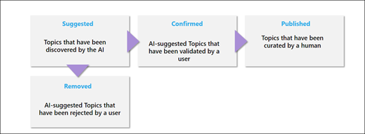
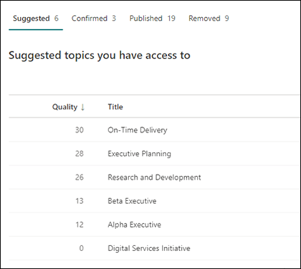
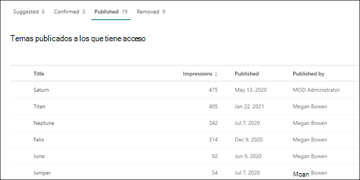

# Administrar temas en el Centro de temasManage topics in the Topic center 

 

> [!VIDEO https://www.microsoft.com/videoplayer/embed/RE4LxDx]  

 

En el Centro de temas de Viva, un administrador de conocimientos puede ver la página Administrar temas para revisar los temas que se han identificado en ubicaciones de origen de SharePoint según lo especificado por su administrador de conocimientos. In the Viva Topics Topic center, a knowledge manager can view the **Manage topics** page to review topics that have been identified in SharePoint source locations as specified by your knowledge admin.  

      

Los administradores de conocimientos ayudan a guiar los temas detectados durante el ciclo de vida de los temas en los que se incluyen:Knowledge managers help to guide discovered topics through the topic lifecycle in which topics are:

- Sugerido: Un tema ha sido identificado por la inteligencia artificial y tiene suficientes recursos, conexiones y propiedades compatibles.Suggested: A topic has been identified by AI and has enough supporting resources, connections, and properties.
- Confirmado: se valida un tema sugerido por AI.Confirmed: A topic that has been suggested by AI is validated. La validación se realiza mediante la confirmación de un administrador de conocimientos.Validation is done by confirmation from a knowledge manager. Además, se puede confirmar un tema si al menos dos usuarios dan comentarios positivos a través de la pregunta de comentarios en la tarjeta del tema.Additionally, a topic can be confirmed if at least two users give positive feedback through the feedback question on the topic card.
- Publicado: un tema confirmado que se ha seleccionado: se han realizado ediciones manuales para mejorar su calidad.Published: A confirmed topic that has been curated: manual edits have been made to improve its quality.
- Eliminado: un administrador de conocimientos rechaza un tema y ya no será visible para los espectadores.Removed: A topic is rejected by a knowledge manager and will no longer be visible to viewers. El tema puede estar en cualquier estado cuando se quita (sugerido, confirmado o publicado).The topic can be in any state when it is removed (suggested, confirmed or published). Cuando se quita un tema publicado, la página con los detalles seleccionados deberá eliminarse manualmente a través de la biblioteca de páginas del centro de temas.When a published topic is removed, the page with the curated details will need to be deleted manually through the Pages Library of the topic center.

      

> [!Note] 
> En la página Administrar temas, cada administrador de conocimientos solo podrá ver los temas en los que tengan acceso a los archivos y páginas del tema.In the Manage Topics page, each knowledge manager will only be able to see topics where they have access to the files and pages of the topic. Esto se reflejará en los temas que se enumeran en las pestañas Sugerido, Confirmado, Eliminado y Publicado.This will be reflected in the topics that are listed under the Suggested, Confirmed, Removed, and Published tabs. Sin embargo, los recuentos de temas muestran los recuentos totales de la organización.The topic counts, however, show the total counts in the organization.

## RequirementsRequirements

Para administrar temas en el Centro de temas, debe:To manage topics in the Topic center, you need to:
- Tener una licencia de Temas de Viva.Have a Viva Topics license.

- Tener el [**permiso Quién puede administrar temas.**](https://docs.microsoft.com/microsoft-365/knowledge/topic-experiences-user-permissions)Have the [**Who can manage topics**](https://docs.microsoft.com/microsoft-365/knowledge/topic-experiences-user-permissions) permission. Los administradores de conocimientos pueden conceder a los usuarios este permiso en la configuración de permisos del tema Temas de Viva.Knowledge admins can give users this permission in the Viva Topics topic permissions settings. 

No podrá ver la página Administrar temas en el Centro de temas a menos que tenga el permiso **Quién puede administrar temas.**You will not be able to view the Manage Topics page in the Topic Center unless you have the **Who can manage topics** permission.

En el centro de temas, un administrador de conocimientos puede revisar los temas que se han identificado en las ubicaciones de origen de SharePoint que especificó y puede confirmarlos o rechazarlos.In the topic center, a knowledge manager can review topics that have been identified in the SharePoint source locations you specified, and can either confirm or reject them. Un administrador de conocimientos también puede crear y publicar nuevas páginas de temas si no se encontró una en la detección de temas o editar las existentes si es necesario actualizarlas.A knowledge manager can also create and publish new topic pages if one was not found in topic discovery, or edit existing ones if they need to be updated.

## Revisar los temas sugeridosReview suggested topics

En la página Administrar temas del Centro de temas, los temas que se detectaron en las ubicaciones de origen de SharePoint especificadas aparecerán en la **pestaña Sugerencias.** Si es necesario, un administrador de conocimientos puede revisar los temas no confirmados y elegir confirmarlos o rechazarlos.On the Topic center Manage Topics page, topics that were discovered in your specified SharePoint source locations will be listed in the **Suggested** tab. If needed, a knowledge manager can review unconfirmed topics and choose to confirm or reject them.

      

Para revisar un tema sugerido:To review a suggested topic:

1. En la **página Administrar temas,** seleccione la **pestaña Sugerencias** y seleccione el tema para abrir la página del tema.On the **Manage topics** page, select the **Suggested** tab, select the topic to open the topic page. 

2. En la página del tema, revise la página del tema y seleccione **Editar** si necesita realizar cambios en la página.On the topic page, review the topic page, and select **Edit** if you need to make any changes to the page. La publicación de cualquier modificación moverá este tema a **la pestaña** Publicados.Publishing any edits will move this topic to the **Published** tab.

3. Después de revisar el tema, vuelva a la página Administrar temas.After reviewing the topic, go back to the Manage topics page. Para el tema seleccionado, puede:For the selected topic, you can:

   - Seleccione la marca de verificación para confirmar el tema.Select the check mark to confirm the topic.
    
   - Seleccione la **x** si desea rechazar el tema.Select the **x** if you want to reject the topic.

    Los temas confirmados se quitarán de la **lista Sugeridos** y ahora se mostrarán en la **lista Confirmados.**Confirmed topics will be removed from the **Suggested** list and will now display in the **Confirmed** list.

    Los temas rechazados se quitarán de la **lista Sugeridos** y ahora se mostrarán en la **pestaña** Quitado.Rejected topics will be removed from the **Suggested** list and will now display in the **Removed** tab.

     

### Puntuación de calidadQuality score

Cada tema que aparece en la página Temas sugeridos tiene asignada una <b>puntuación</b> de calidad.Each topic that appears in your Suggested Topics page has a <b>Quality</b> score assigned to it. La puntuación de calidad es un reflejo de la cantidad de información que el usuario promedio verá para la información sobre el tema, teniendo en cuenta que cada usuario puede ver más o menos información debido a los permisos que puede o no tener en la información de un tema.The Quality score is a reflection of the amount of information that the average user will see for the information on the topic, keeping in mind that each user may see more or less information because of the permissions they may or may not have on the information in a topic. 

La puntuación de calidad puede ayudar a proporcionar información sobre los temas con más información y puede ser útil para encontrar temas que pueden necesitar modificarse manualmente.The Quality score can help give insight to the topics with the most information and can be useful for finding topics that may need to be manually edited.  Por ejemplo, un tema con una puntuación de calidad inferior puede ser el resultado de que algunos usuarios no tengan permisos de SharePoint para archivos o sitios pertinentes que AI ha incluido en el tema.For example, a topic with a lower quality score may be the result of some users not having SharePoint permissions to pertinent files or sites that AI has included in the topic. A continuación, un colaborador podría editar el tema para incluir la información (cuando corresponda), que podrá ver a todos los usuarios que puedan ver el tema.A contributor could then edit the topic to include the information (when appropriate), which will then be viewable to all users who can view the topic.

La puntuación de calidad podría oscilar entre 1 y 100.The Quality score could range from 1 to 100. Un tema recién detectado tendrá una puntuación de calidad de 0 hasta que dos o más usuarios lo han visto.A newly discovered topic will have a quality score of 0 until two or more users have viewed it. La puntuación de calidad de cada usuario se determina por una serie de factores, como la cantidad de contenido que se muestra para el usuario específico, que se controla los permisos del usuario, ya que cada página de tema tiene el recorte de seguridad para el contenido generado por IA.Each users quality score is determined by a number of factors, such as the amount of content displayed for the specific user, which is controlled the user's permissions as each topic page has security trimming in place for AI-generated content. La puntuación de calidad que se muestra en la pestaña Temas sugeridos es un promedio de la puntuación individual de cada usuario.The Quality score shown on the Suggested topics tab is an average of each users individual score.

### ImpresionesImpressions

La <b>columna Impresiones</b> muestra el número de veces que se ha mostrado un tema a los usuarios finales.The <b>Impressions</b> column displays the number of times a topic has been shown to end users. Esto incluye vistas a través de tarjetas de tema en la búsqueda, a través de resaltados de temas y a través de las vistas del centro de temas.This includes views through topic cards in search, through topic highlights, and through Topic center views. No refleja el clic en estos temas, pero se ha mostrado el tema.It does not reflect the click-through on these topics, but that the topic has been displayed. La columna Impresiones se mostrará para los temas de las pestañas Sugerido, Confirmado, Publicado y Quitado en la página Administrar temas.The Impressions column will show for topics in the Suggested, Confirmed, Published, and Removed tabs in the Manage Topics page.

## Temas confirmadosConfirmed topics

En la página Administrar temas, los temas que se detectaron en las ubicaciones de origen de SharePoint especificadas y que un administrador de  conocimientos confirmó o que confirmaron dos o más personas a través del mecanismo de comentarios de la tarjeta aparecerán en la pestaña Confirmado. Si es necesario, un usuario con permisos para administrar temas puede revisar los temas confirmados y elegir rechazarlos.On the Manage topics page, topics that were discovered in your specified SharePoint source locations and have been confirmed by a knowledge manager or "crowd-sourced" confirmed by two or more people through the card feedback mechanism will be listed in the **Confirmed** tab. If needed, a user with permissions to manage topics can review confirmed topics and choose to reject them.

Para revisar un tema confirmado:To review a confirmed topic:

1. En la **pestaña Confirmado,** seleccione el tema para abrir la página del tema.On the **Confirmed** tab, select the topic to open the topic page. 

2. En la página del tema, revise la página del tema y seleccione **Editar** si necesita realizar cambios en la página.On the topic page, review the topic page, and select **Edit** if you need to make any changes to the page.

Tenga en cuenta que aún puede optar por rechazar un tema confirmado.Note that you can still chose to reject a confirmed topic.  Para ello, vaya al tema seleccionado en la lista Confirmados y seleccione la **x** si desea rechazar el tema.To do this, go to the selected topic in the Confirmed list, and select the **x** if you want to reject the topic.

## Temas publicadosPublished topics
Los temas publicados se han editado para que siempre aparezca información específica para los usuarios que encuentren la página.Published topics have been edited so that specific information will always appear to whoever encounters the page. Aquí también se enumeran los temas creados manualmente.Manually created topics are listed here as well.

      

