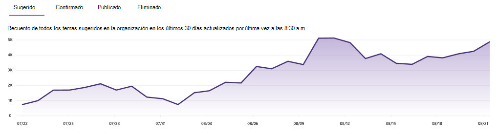

# Administrar temas en el centro de temas en Temas de Microsoft VivaManage topics in the topic center in Microsoft Viva Topics

 

> [!VIDEO https://www.microsoft.com/videoplayer/embed/RE4LxDx]  

 

En el Centro de temas de Viva  Topics, un administrador de conocimientos puede ver la página Administrar temas para revisar los temas que se han identificado en las ubicaciones de origen según lo especificado por el administrador de conocimientos.In the Viva Topics topic center, a knowledge manager can view the **Manage topics** page to review topics that have been identified in the source locations as specified by your knowledge admin.  

     

## Fases del temaTopic stages

Los administradores de conocimientos ayudan a guiar los temas detectados a través de las distintas fases del ciclo de vida del tema: **Sugerido** **,** **Confirmado**, Publicado y **Eliminado.**Knowledge managers help to guide discovered topics through the various topic lifecycle stages: **Suggested**, **Confirmed**, **Published**, and **Removed**.

    

- **Sugerido**: se ha identificado un tema en AI y tiene suficientes recursos compatibles, conexiones y propiedades.**Suggested**: A topic has been identified by AI and has enough supporting resources, connections, and properties. (Se marcan como **un tema sugerido** en la interfaz de usuario).(These are marked as a **Suggested Topic** in the UI.)

- **Confirmado:** un tema que ha sido detectado por AI y que se ha validado.**Confirmed**: A topic that has been discovered by AI and has been validated. La validación del tema se produce cuando:Topic validation occurs when either:

   - Un administrador de conocimientos confirma un tema.A knowledge manager confirms a topic. Un administrador de [conocimientos confirma un tema en](manage-topics.md#confirmed-topics) la página Administrar **temas.**A knowledge manager [confirms a topic](manage-topics.md#confirmed-topics) on the **Manage topics** page.

   - Varios usuarios confirman un tema.Multiple users confirm a topic. Debe haber una red de dos votos positivos recibidos de usuarios que votaron mediante el mecanismo de comentarios en la tarjeta de tema.There must be a net of two positive votes received from users who voted using the feedback mechanism on the topic card. Por ejemplo, si un usuario votó positivo y un usuario votó negativo para un tema en particular, aún necesitará dos votos positivos más para confirmar el tema.For example, if one user voted positive and one user voted negative for a particular topic, you would still need two more positive votes for the topic to be confirmed.
 
- **Publicado:** tema que se ha seleccionado.**Published**: A topic that has been curated. Se han realizado modificaciones manuales para mejorar su calidad o ha sido creada por un usuario.Manual edits have been made to improve its quality, or it has been created by a user.

- **Eliminado:** un tema que se ha rechazado y que ya no será visible para los visores.**Removed**: A topic that has been rejected and will no longer be visible to viewers. Un tema se puede quitar en cualquier estado (sugerido, confirmado o publicado).A topic can be removed in any state (suggested, confirmed, or published). La eliminación del tema se produce cuando:Topic removal occurs when either:

   - Un administrador de conocimientos quita un tema.A knowledge manager removes a topic. Un administrador de conocimientos quita un tema de la **página Administrar temas.**A knowledge manager removes a topic on the **Manage topics** page.

   - Varios usuarios emitirán votos negativos mediante el mecanismo de comentarios en la tarjeta de tema.Multiple users cast negative votes using the feedback mechanism on the topic card. Para que se quite un tema, debe haber una red de dos votos negativos recibidos de los usuarios.For a topic to be removed, there must be a net of two negative votes received from users. Por ejemplo, si un usuario votó negativo y un usuario votó positivo para un tema en particular, aún necesitará dos votos negativos más para que se elimine el tema.For example, if one user voted negative and one user voted positive for a particular topic, you would still need two more negative votes for the topic to be removed.

  Cuando se quita un tema publicado, la página con los detalles seleccionados tendrá que eliminarse manualmente a través de la Biblioteca de páginas del centro de temas.When a published topic is removed, the page with the curated details will need to be deleted manually through the Pages Library of the topic center.

> [!Note] 
> En la página Administrar **temas,** cada administrador de conocimientos solo podrá ver temas en los que tengan acceso a los archivos y páginas subyacentes conectados al tema.On the **Manage topics** page, each knowledge manager will only be able to see topics where they have access to the underlying files and pages connected to the topic. Este recorte de permisos se reflejará en la lista de temas que aparecen en las pestañas **Sugerido,** **Confirmado,** Publicado **y** Eliminado.This permission trimming will be reflected in the list of topics that appear in the **Suggested**, **Confirmed**, **Published**, and **Removed** tabs. Sin embargo, los recuentos de temas muestran los recuentos totales de la organización independientemente de los permisos.The topic counts, however, show the total counts in the organization regardless of permissions.

## RequisitosRequirements

Para administrar temas en el centro de temas, debe:To manage topics in the topic center, you need to:
- Tener una licencia de Temas Microsoft Viva.Have a Viva Topics license.

- Tenga el [**Quién puede administrar permisos de temas.**](./topic-experiences-user-permissions.md)Have the [**Who can manage topics**](./topic-experiences-user-permissions.md) permission. Los Administradores de conocimientos pueden conceder a los usuarios este permiso en la configuración de permisos del tema de Temas Viva.Knowledge admins can give users this permission in the Viva Topics topic permissions settings. 

No podrá ver la  página Administrar temas en el centro de temas a menos que tenga el permiso **Quién administrar temas.**You will not be able to view the **Manage topics** page in the topic center unless you have the **Who can manage topics** permission.

En el centro de temas, un administrador de conocimientos puede revisar los temas que se han identificado en las ubicaciones de origen especificadas y puede confirmarlos o quitarlos.In the topic center, a knowledge manager can review topics that have been identified in the source locations you specified, and can either confirm or remove them. Un administrador de conocimientos también puede crear y publicar nuevas páginas de temas si no se encontró una en la detección de temas o editar las existentes si es necesario actualizarlas.A knowledge manager can also create and publish new topic pages if one was not found in topic discovery, or edit existing ones if they need to be updated.

## Revisar temas sugeridosReview suggested topics

En la **página Administrar temas,** los temas que se detectaron en las ubicaciones SharePoint de origen especificadas se mostrarán en la **pestaña Sugerencias.** Si es necesario, un administrador de conocimientos puede revisar temas no confirmados y elegir confirmarlos o quitarlos.On the **Manage topics** page, topics that were discovered in your specified SharePoint source locations will be listed on the **Suggested** tab. If needed, a knowledge manager can review unconfirmed topics and choose to confirm or remove them.

    

Para revisar un tema sugerido:To review a suggested topic:

1. En la **página Administrar temas,** seleccione la **pestaña Sugerencia** y, a continuación, seleccione el tema para abrir la página del tema.On the **Manage topics** page, select the **Suggested** tab, and then select the topic to open the topic page.

2. En la página del tema, revise la página del tema y **seleccione Editar** si necesita realizar cambios en la página.On the topic page, review the topic page, and select **Edit** if you need to make any changes to the page. La publicación de cualquier modificación moverá este tema a la **pestaña Publicado.**Publishing any edits will move this topic to the **Published** tab.

3. Después de revisar el tema, vuelva a la **página Administrar temas.**After reviewing the topic, go back to the **Manage topics** page. Para el tema seleccionado, puede:For the selected topic, you can:

   - Seleccionar la marca de verificación para confirmar el tema.Select the check mark to confirm the topic.
    
   - Seleccione la **x** si desea quitar el tema.Select the **x** if you want to remove the topic.

    Los temas confirmados se quitarán de la **lista Sugeridos** y ahora se mostrarán en la **lista** Confirmados.Confirmed topics will be removed from the **Suggested** list and will now display in the **Confirmed** list.

    Los temas eliminados se quitarán de la **lista Sugeridos** y ahora se mostrarán en la **pestaña** Eliminado.Removed topics will be removed from the **Suggested** list and will now display in the **Removed** tab.

### Puntuación de calidadQuality score

Cada tema que aparece en la **página Temas** sugeridos tiene asignada una puntuación de calidad.Each topic that appears on the **Suggested** topics page has a quality score assigned to it. La puntuación de calidad es un reflejo de la cantidad de información que el usuario promedio verá para la información sobre el tema, teniendo en cuenta que cada usuario puede ver más o menos información debido a los permisos que podrían o no tener en la información de un tema.The quality score is a reflection of the amount of information that the average user will see for the information on the topic, keeping in mind that each user might see more or less information because of the permissions they might or might not have on the information in a topic. 

La puntuación de calidad puede ayudar a proporcionar información sobre los temas con más información y puede ser útil para encontrar temas que pueden necesitar editarse manualmente.The quality score can help give insight to the topics with the most information and can be useful for finding topics that may need to be manually edited. Por ejemplo, un tema con una puntuación de calidad inferior puede ser el resultado de que algunos usuarios no tengan permisos SharePoint los archivos o sitios pertinentes que AI ha incluido en el tema.For example, a topic with a lower quality score might be the result of some users not having SharePoint permissions to pertinent files or sites that AI has included in the topic. A continuación, un colaborador podría editar el tema para incluir la información (cuando sea necesaria), lo que estará visible para todos los usuarios que puedan verlo.A contributor could then edit the topic to include the information (when appropriate), which will then be viewable to all users who can view the topic.

### ImpresionesImpressions

La **columna Impresiones** muestra el número de veces que se ha mostrado un tema a los usuarios finales.The **Impressions** column displays the number of times a topic has been shown to end users. Esto incluye vistas a través de las tarjetas de respuesta del tema en la búsqueda y a través de los aspectos destacados del tema.This includes views through topic answer cards in search and through topic highlights. No refleja el clic en estos temas, sino que se ha mostrado el tema.It does not reflect the click-through on these topics, but that the topic has been displayed. La **columna Impresiones se** mostrará para los temas de  las pestañas **Sugeridos,**  **Confirmados,** Publicados y Eliminados de la página Administrar **temas.**The **Impressions** column will show for topics in the **Suggested**, **Confirmed**, **Published**, and **Removed** tabs on the **Manage topics** page.

## Temas confirmadosConfirmed topics

En  la página Administrar temas, los temas detectados en las ubicaciones de origen de SharePoint especificadas y confirmados por un administrador de conocimientos o "crowdsourced" confirmados por una  red de dos o más personas (equilibrando los votos negativos del usuario con los votos positivos de los usuarios) a través del mecanismo de comentarios de tarjeta se mostrarán en la pestaña Confirmado. Si es necesario, un usuario con permisos para administrar temas puede revisar los temas confirmados y elegir rechazarlos.On the **Manage topics** page, topics that were discovered in your specified SharePoint source locations and have been confirmed by a knowledge manager or "crowdsourced" confirmed by a net two or more people (balancing negative user votes against positive user votes) through the card feedback mechanism will be listed in the **Confirmed** tab. If needed, a user with permissions to manage topics can review confirmed topics and choose to reject them.

Para revisar un tema confirmado:To review a confirmed topic:

1. En la pestaña **Confirmado**, seleccione el tema para abrir la página de tema.On the **Confirmed** tab, select the topic to open the topic page.

2. En la página del tema, revise la página del tema y **seleccione Editar** si necesita realizar cambios en la página.On the topic page, review the topic page, and select **Edit** if you need to make any changes to the page.

Tenga en cuenta que todavía puede optar por rechazar un tema confirmado.Note that you can still choose to reject a confirmed topic. Para ello, vaya al tema seleccionado en la **pestaña** Confirmado y seleccione **la x** si desea rechazar el tema.To do this, go to the selected topic on the **Confirmed** tab, and select the **x** if you want to reject the topic.

## Temas publicadosPublished topics

Los temas publicados se han editado para que la información específica siempre aparezca a quien encuentre la página.Published topics have been edited so that specific information will always appear to whoever encounters the page. Aquí también se muestran los temas creados manualmente.Manually created topics are listed here as well.

   

## Panel de recuento de temasTopic count dashboard

Este gráfico de la vista panel le permite ver el número de temas en el Centro de temas de Viva Topics.This chart in the dashboard view lets you see the number of topics in your Viva Topics topic center. El gráfico muestra los recuentos de temas por fase de ciclo de vida del tema y también muestra cómo los recuentos de temas han tenido tendencia con el tiempo.The chart shows the topic counts per topic lifecycle stage and also shows how topic counts have trended over time. Los administradores de conocimientos pueden supervisar visualmente la velocidad a la que AI detecta nuevos temas y la velocidad a la que el administrador de conocimientos o las acciones del usuario confirman o publican los temas.Knowledge managers can visually monitor the rate at which new topics are being discovered by AI and the rate at which topics are getting confirmed or published by the knowledge manager or user actions.

Los administradores de conocimientos pueden ver un número  diferente de temas representados en la lista de temas de la página Administrar temas de los que se ven en el panel.Knowledge managers might see a different count of topics represented in the list of topics on the **Manage topics** page than they see in the dashboard. Esto se debe a que es posible que un administrador de conocimientos no tenga acceso a todos los temas.This is because a knowledge manager might not have access to all topics. El recuento que se muestra en la vista de panel se toma antes de aplicar el recorte de permisos.The count presented in the dashboard view is taken before applying permission-trimming. 

   
