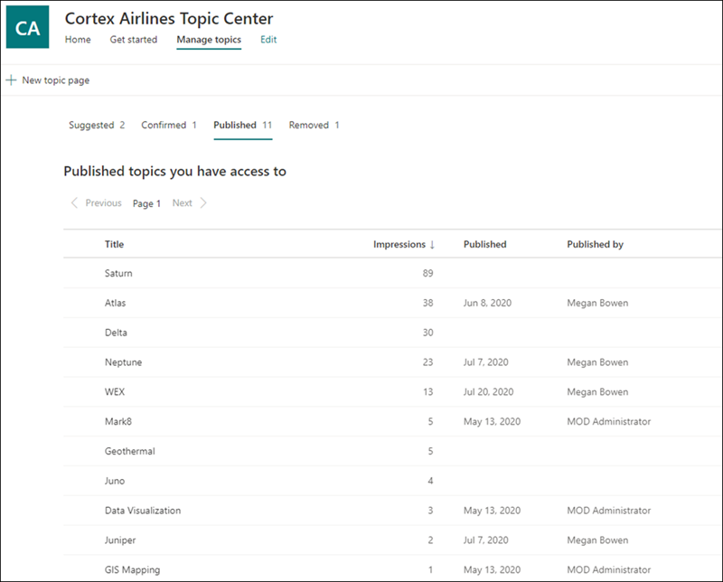

# Administrar temas en el Centro de temas (versión preliminar)

> [!Note] 
> El contenido de este artículo es para Project Cortex Private Preview. [Obtenga más información acerca del Project Cortex](https://aka.ms/projectcortex).

 

> [!VIDEO https://www.microsoft.com/videoplayer/embed/RE4LxDx]  

 

En el Centro de temas,  un administrador de conocimientos puede ver la página Administrar temas para revisar los temas que se han identificado en ubicaciones de origen de SharePoint según lo especificado por su administrador de conocimientos.  

      

Los administradores de conocimientos ayudan a guiar los temas detectados durante el ciclo de vida de los temas en los que se incluyen los siguientes temas:

- Sugerido: Un tema ha sido identificado por la inteligencia artificial y tiene suficientes recursos, conexiones y propiedades compatibles para cumplir el umbral del tema.
- Confirmado: se valida un tema sugerido por AI. La validación se realiza mediante la confirmación de un administrador de conocimientos. Además, se puede confirmar un tema si al menos dos usuarios dan comentarios positivos a través de comentarios sobre el tema que el tema es válido.
- Eliminado: un administrador de conocimientos rechaza un tema y ya no será visible para los espectadores. El tema puede estar en cualquier estado cuando se quita (sugerido o confirmado). 
- Publicado: un tema confirmado que se ha actualizado manualmente.

      

## Requisitos

Para administrar temas en el Centro de temas, debe:
- Tener una licencia de Experiencias de tema.
- Tener permisos para quién [**puede administrar temas.**](https://docs.microsoft.com/microsoft-365/knowledge/topic-experiences-user-permissions) Los administradores de conocimientos pueden conceder a los usuarios este permiso en la configuración de permisos del tema de Knowledge Network. 

No podrá ver la página Administrar temas en el Centro de temas a menos que tenga el permiso **Quién puede administrar temas.**

En el centro de temas, un administrador de conocimientos puede revisar los temas que se han identificado en las ubicaciones de origen de SharePoint que especificó y puede confirmarlos o rechazarlos. Un administrador de conocimientos también puede crear y publicar nuevas páginas de temas si no se encontró una en la detección de temas o editar las existentes si es necesario actualizarlas.

## Revisar los temas sugeridos

En la página Administrar temas del Centro de temas, los temas que se detectaron en las ubicaciones de origen de SharePoint especificadas aparecerán en la **pestaña Sugerencias.** Un administrador de conocimientos puede revisar los temas no confirmados y elegir confirmarlos o rechazarlos.

Para revisar un tema sugerido:

1. En la **página Administrar temas,** seleccione la **pestaña Sugerencias** y seleccione el tema para abrir la página del tema. 

2. En la página del tema, revise la página del tema y seleccione **Editar** si necesita realizar cambios en la página.

3. Después de revisar el tema, vuelva a la página Administrar temas. Para el tema seleccionado, puede:

   - Seleccione la marca de verificación para confirmar el tema.
    
   - Seleccione la **x** si desea rechazar el tema.

    Los temas confirmados se quitarán de la **lista Sugeridos** y ahora se mostrarán en la **lista Confirmados.**

    Los temas rechazados se quitarán de la **lista Sugeridos** y ahora se mostrarán en la **pestaña** Quitado.

     

## Temas confirmados

En la página Administrar temas, los temas que se detectaron en las ubicaciones de origen de SharePoint especificadas y que un administrador de  conocimientos confirmó o que confirmaron dos o más personas a través del mecanismo de comentarios de la tarjeta aparecerán en la pestaña Confirmado. Si es necesario, un usuario con permisos para administrar temas puede revisar los temas confirmados y elegir rechazarlos.

Para revisar un tema confirmado:

1. En la **pestaña Confirmado,** seleccione el tema para abrir la página del tema. 

2. En la página del tema, revise la página del tema y seleccione **Editar** si necesita realizar cambios en la página.

Tenga en cuenta que aún puede optar por rechazar un tema confirmado.  Para ello, vaya al tema seleccionado en la lista Confirmados y seleccione la **x** si desea rechazar el tema.

## Temas publicados
Los temas publicados se han editado para que siempre aparezca información específica para los usuarios que encuentren la página. Los temas creados manualmente se enumeran aquí.

