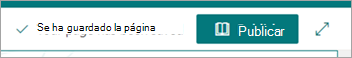

# Guardar un tema como borrador en Temas Microsoft Viva

Puede guardar como borrador un nuevo tema o un tema revisado en el que esté trabajando, pero aún no está listo para publicarlo.

## Guardar un nuevo tema como borrador

1. En el centro de temas, seleccione **Página de**  >  **nuevo tema**.
 
   

2. Al editar el nuevo tema, se guarda automáticamente un borrador.
  
   

3. Cuando haya terminado con las ediciones actuales, pero no esté listo para publicar, seleccione **Guardar como borrador** para guardar los cambios. La audiencia no verá las ediciones en la página hasta que la publique. Solo las personas con permisos de edición para temas podrán ver el borrador. 

   

4. Seleccione **Publicar** para guardar los cambios. Después de publicar la página, el nombre del tema, la descripción del nombre alternativo y las personas ancladas se mostrarán a los usuarios que pueden ver el tema. Los archivos, páginas y sitios específicos solo aparecerán en la página del tema, si el visor tiene permisos para el tema.
 
## Guardar un tema revisado como borrador

1. Abra una página de tema para editarla.

2. Al editar la página del tema, se guarda automáticamente un borrador.
  
   

3. Cuando haya terminado con las ediciones actuales, pero  no esté listo para publicar, seleccione Guardar como borrador para guardar los cambios y cerrar el modo de edición.

   

4. Cuando esté listo para que los usuarios vean los cambios, verá un botón **Publicar** o Volver a **publicar.** 

    - **Publish** está disponible cuando el tema solo tiene contenido detectado por IA y está editando por primera vez. Al publicar, las ediciones realizadas en el nombre del tema, el nombre alternativo, la descripción o las personas ancladas se mostrarán a los usuarios que pueden ver el tema. Archivos específicos, páginas, sitios, nombres alternativos detectados por AI y personas seguirán siendo visibles solo para los usuarios que tienen permisos para esos recursos.

    - **Volver a** publicar significa que está editando un tema publicado anteriormente.
 
## Ciclo de vida de una página borrador
 
1. Al guardar un tema como borrador y cerrar la página, el tema se comprueba como una versión secundaria y se convierte en un borrador "compartido". Esto significa que cualquier persona con permisos de edición (o propietarios de sitios) ahora puede ver el borrador y editarlo.

2. Los borradores se guardan automáticamente al editar.

3.  Cualquier persona con permisos de edición (o propietarios de sitios) se llevará directamente al borrador guardado cuando abra la página de tema que está en un estado de borrador. Se mostrará un mensaje para decirle que se trata de una página de borrador y cuándo se guardó el último borrador.
  
    

4.  Después de cerrar el modo de edición, puede volver a los borradores volviendo a la página del tema:
    - Para los usuarios:
         - En la **sección Temas confirmados** sobre el elemento web de temas
         - Al buscar el tema y abrirlo desde la respuesta del tema

    - Para administradores de conocimientos:
         - Desde la **página Administrar temas**
         - En la biblioteca páginas de sitios
         - Desde un vínculo directo a la página de temas
 
## Ediciones de una persona a la vez

Dos personas no pueden editar la misma página al mismo tiempo, independientemente de si es un borrador o no. Si una persona tiene una página abierta para su edición y otra intenta editar la página, se muestra al usuario un mensaje que indica que otra persona está editando la página.
  
   
 
Puede pedir a la persona que tiene la página abierta para su edición que "libere" la página guardando y cerrando, descartando cambios o publicando. Sin embargo, si la página no tiene actividad durante 5 minutos, la sesión de edición pasará automáticamente el tiempo de espera y la página se "desbloqueará", a menos que alguien cierre el explorador en 5 minutos.

