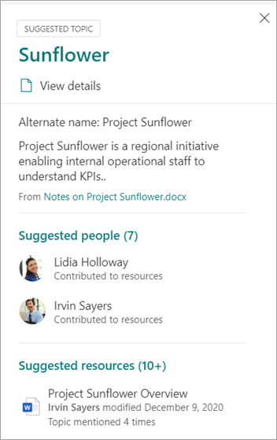

# Administrar temas a escala en Temas de Microsoft Viva

Al indizar los SharePoint web o toda la organización para Temas de Viva, se pueden generar muchos temas. Cuando esto sucede y ve miles  de temas sugeridos en la página Administrar temas, puede resultar difícil saber por dónde empezar. En este artículo se describe cómo Viva Topics le ayuda a optimizar los temas e información que se muestran a los usuarios que buscan información, incluso en organizaciones grandes con un gran número de temas.

En primer lugar, un aviso de las [cuatro etapas de los temas:](manage-topics.md#topic-stages)

- **Sugerido**: se ha identificado un tema en AI y tiene suficientes recursos compatibles, conexiones y propiedades. (Se marcan como **un tema sugerido** en la interfaz de usuario).

- **Confirmado**: se valida un tema sugerido por AI. Un administrador de conocimientos debe confirmar la validación del tema. Para que un tema se confirme, debe haber una red de dos votos positivos recibidos de usuarios que votaron mediante el mecanismo de comentarios en la tarjeta del tema. Por ejemplo, si un usuario votó positivo y un usuario votó negativo para un tema en particular, aún necesitará dos votos positivos más para confirmar el tema.
 
- **Publicado:** un tema confirmado que se ha seleccionado: se han realizado ediciones manuales para mejorar su calidad.

- **Eliminado:** un administrador de conocimientos rechaza un tema y ya no será visible para los visores. Un tema se puede quitar en cualquier estado (sugerido, confirmado o publicado). Para que se quite un tema, debe haber una red de dos votos negativos recibidos de los usuarios que votaron con los mecanismos de comentarios en la tarjeta del tema. Por ejemplo, si un usuario votó negativo y un usuario votó positivo para un tema en particular, aún necesitará dos votos negativos más para que se elimine el tema. Cuando se quita un tema publicado, la página con los detalles seleccionados tendrá que eliminarse manualmente a través de la Biblioteca de páginas del centro de temas.

## Rol de administrador de conocimientos 

Al configurar Temas de Viva, agregará un grupo de usuarios a los que se les conceden permisos para ver la **experiencia** Administrar temas en el centro de temas. Solo aparecerá para estos usuarios que tienen el rol de curación principal para los temas. Tendrán acceso a datos sobre los temas y podrán ver listas de todos los temas a los que tienen acceso para revisar y cura.

Los empleados de este rol deben tener amplios permisos para ver una amplia variedad de temas. O bien, si los permisos están segmentados, es posible que desee seleccionar un grupo de usuarios que representen distintas áreas de la empresa y puedan seleccionar sus propias áreas.

Al revisar por primera vez los temas del centro de temas, los temas sugeridos son puramente definidos por IA. Es posible que los administradores de conocimientos quieran revisar cada uno de ellos antes de implementar Temas de Viva en una amplia comunidad de usuarios. Cuando se trabaja a escala, este enfoque rara vez es práctico debido a los miles de temas.

El enfoque recomendado es encontrar un equilibrio de los temas más pertinentes o importantes para el conjunto inicial de usuarios y centrarse en la curación de esos temas antes de la implementación de Viva Topics. Comience a recopilar comentarios de los usuarios y permitir la aglomeración de usuarios para determinar los patrones de uso y contribución de los usuarios para informar de las estrategias sugeridas en este artículo.

Es importante reconocer que el sistema identificará y mostrará a todos los usuarios temas publicados sugeridos por la IA y seleccionados por el usuario. Sin embargo, esto no significa que todos los temas sugeridos se mostrarán a todos los usuarios finales. La configuración de seguridad en su lugar mostrará solo los temas a los que cada empleado puede tener acceso en función de los permisos que se establecen en el propio contenido.

Como administrador de conocimientos con  permisos para ver la página Administrar temas, es posible que vea un número mucho mayor de temas enumerados debido a sus propios permisos elevados, según su rol en la organización y el nivel de acceso. También tendrá acceso a vistas que le permiten ver temas enumerados en una única ubicación en lugar de tener acceso a ellos mediante resaltados o búsqueda.

Además, es probable que la mayoría de los usuarios vean un porcentaje menor de temas y un conjunto más grande de temas que se verán con mucha menos frecuencia debido a los permisos. Como resultado, es bueno centrar primero las tareas de curación en los temas que son más importantes para su organización y que son los más probables que se vean de forma más amplia.

En este artículo se tratan algunas estrategias de curación. Estas estrategias pueden significar que los temas menos frecuentes o menos comunes podrían no ser totalmente seleccionados por los administradores de conocimientos. Sin embargo, estos temas sugeridos siguen siendo útiles y pueden proporcionar información o un puntero a una persona, lo que puede ahorrar a un empleado horas de búsqueda de un punto de partida. Permitir actualizaciones de crowdsourced a los temas es beneficioso y proporciona más contenido y cobertura para los temas menos comunes.

En este artículo se proporcionan algunas instrucciones y procedimientos recomendados para abordar la administración y la curación de temas.

## Descripción de temas sugeridos

Cuando AI detecta temas, se marcan como un tema  **sugerido,** tanto en la página Administrar temas como en las tarjetas de temas que se presentan a los usuarios. Los temas que no se hayan marcado como eliminados se mostrarán a los usuarios, esto incluye temas confirmados, publicados y sugeridos. Los temas de los tres estados están disponibles para los usuarios finales.

Dentro de una tarjeta de tema o página, usamos varias indicaciones para mostrar cómo la IA ha generado la información. El sistema usa una variedad de evidencias para agregar los recursos, principalmente a través del propio contenido.

- Las etiquetas muestran que se sugiere un tema y que fue descubierto por Viva Topics.  

   

- La información de la tarjeta indica de dónde procede una definición especificando su origen.

- Las personas sugeridas se derivan agregando personas que han escrito o editado documentos con evidencia del tema. Si una persona escribe un documento que tiene un nombre de tema en el título y ese documento tiene muchas vistas, es posible que solo necesite un documento para establecer la persona como relacionada. Sin embargo, en muchos casos, más evidencia es mejor y las personas que aparecen en la lista han trabajado en varios documentos.  

   

- Para los archivos y páginas que se muestran, el sistema identifica cuántas veces se ha mencionado el tema en el documento, pero el tema también debe mencionarse en un contexto específico que identifique la referencia al tema de tipo específico (como proyecto o equipo). Esto es lo que cuenta como evidencia para la IA. El sistema también considera la aparición de un nombre de tema en los títulos de documentos, tipos de documentos y otras características de análisis (como vistas).

   

   

   

Estos atributos muestran que AI ha agregado el contenido y cómo la IA ha tomado esa determinación.

### Comunicación

Al comunicarse con los usuarios sobre Temas de Viva, es importante aclarar la diferencia entre los temas y el contenido sugeridos por la IA y sus equivalentes seleccionados.

Como lector, debe ver los temas sugeridos con un ojo más crítico. No deben ser percibidos como fuentes autoritarias de la verdad organizativa. En su lugar, son una herramienta de búsqueda de manera para obtener acceso a los conocimientos tácitos que se presentan a través del contenido al que tiene acceso. La IA ha descubierto el tema y tiene suficiente evidencia para mostrarlo, pero su valor no ha sido confirmado por una persona.

### Controles de crowdsourced

Los temas sugeridos se pueden mejorar mediante la curación de la página y los comentarios de crowdsourced sobre el tema.

Cuando los usuarios interactúan con un tema sugerido, es posible que se les haga una pregunta sencilla en la interfaz de usuario. Por ejemplo: *¿este tema era relevante para la página?* *¿Esta persona es relevante para el tema?* *¿Esta definición era precisa?* Al usar los comentarios para estas preguntas, la precisión de los temas puede aumentar sin necesidad de que una persona con nombre pueda seleccionar la página.

La página principal de un centro de temas es otra ubicación donde se recopilan comentarios sobre temas sugeridos. En el centro de temas, un usuario puede ver los temas a los que se ha asociado y tiene la opción de confirmar esta asociación o quitarla.

   

Cuando permita una amplia aglomeración de temas, debe tener en cuenta los siguientes factores:

-   Los usuarios verán la **opción Editar** en las páginas de temas y podrán editar las páginas en la misma experiencia que otras páginas SharePoint modernas.

-   Algunos elementos web **de** temas sugeridos no se pueden quitar. El nombre del tema, los nombres alternativos, la definición, las personas sugeridas y los recursos sugeridos no se pueden quitar.

-   Puede llevar algún tiempo que un tema sugerido o confirmado que se haya publicado se traslade a la **lista** Publicado de la **página Administrar temas.**

    -   El tiempo estimado para que un tema aparezca en la búsqueda, los resaltados, los hashtags o las anotaciones es de 2 horas.

    -   El tiempo estimado para que un tema aparezca en **la** lista Publicado en la página **Temas** administrados no es superior a 24 horas en la mayoría de los casos. Debería verlos en 2 horas, pero como hay una sincronización completa cada 24 horas, la espera no debe ser superior a 24 horas.

-   Es posible que un usuario deje un tema publicado en un estado de desprotejo o edición. Un administrador de conocimientos puede verlos en la Biblioteca de páginas del centro de temas y puede descartar los cambios del usuario para volver a publicar el tema o ponerse en contacto con ese usuario para solicitar que compruebe el tema.

### La visibilidad del tema y el contenido se basan en los permisos de un usuario

Cuando revise la lista de temas sugeridos como administrador de conocimientos, tenga en cuenta que el contenido de un tema sugerido se basará dinámicamente en permisos. Es posible que el contenido sugerido y las personas que se muestran a usted no sean los mismos que los que se presentan a cualquier usuario u otro administrador de conocimientos.

En función de los permisos para ver el contenido asociado a un tema, cada usuario puede ver un conjunto diferente de recursos sugeridos, personas, nombres alternativos y definición.

## Priorizar los temas para la curación

Puede usar las siguientes estrategias para identificar temas que probablemente sean destacados y, por lo tanto, sean buenos candidatos para la curación. 

### Taxonomías

El uso de taxonomías existentes puede proporcionar una lista de temas que probablemente sean importantes para los usuarios. Por ejemplo, estos podrían ser:

-   Productos y servicios que proporciona su organización

-   Teams en la organización

-   Proyectos de alto perfil

Este enfoque también podría adoptarse en un nivel departamental o funcional, con expertos en la materia que comprendan esa área de su organización. El objetivo no es que revisen una selección o todos los temas. En su lugar, aportan su propia experiencia de dominio para guiar la curación selectiva.

### Búsqueda

Los términos de búsqueda comunes a menudo se detectan como temas. Al usar los [informes de consulta principales de Microsoft Search,](/sharepoint/view-search-usage-reports)puede identificar los términos de búsqueda más frecuentes de su organización. Si se han detectado temas para estos términos, son buenos candidatos para la curación. Estos temas se pueden presentar como tarjetas de respuesta en Microsoft Search.

Si actualmente usa [marcadores](/microsoftsearch/manage-bookmarks)de Microsoft Search, considere cuál de estos se puede reemplazar por un tema. Una tarjeta de respuesta de marcador contiene un título, una descripción y una dirección URL. En algunas circunstancias, una tarjeta de tema puede ser más útil para un usuario y una tarjeta de tema también muestra recursos y personas.

En la experiencia de búsqueda del usuario, cuando un usuario busca un término como *viajes,* los resultados de la búsqueda se muestran en el siguiente orden de prioridad en Microsoft Search:

1.  Temas publicados o confirmados

2.  Marcadores

3.  Temas sugeridos

### Impresiones y puntuación de calidad

El [recuento de impresiones](manage-topics.md#impressions) y la [puntuación de calidad](manage-topics.md#quality-score) son métricas importantes para comprender el comportamiento de un tema. El valor de estas métricas será limitado cuando solo los administradores de conocimientos o los equipos de TI tengan acceso a los temas. Exponer temas a un grupo piloto de usuarios generará datos más representativos para estas medidas.

Es probable que los temas con un número alto de impresiones interactúen con más frecuencia. La puntuación de calidad de estos temas dará una idea de lo ricos que son esos temas. Los temas con un alto recuento de impresiones y una puntuación de baja calidad son buenos objetivos para la curación.

### Términos clave de la arquitectura de información de sitios de organización más grandes

Los sitios de portal más grandes de la organización podrían haber invertido tiempo en organizar su arquitectura de información y la navegación de su sitio alrededor de áreas de temas clave para sus unidades de negocio, líneas de productos, proyectos principales, entre otros. Revisar estos términos e identificar y seleccionar temas para estos términos puede ayudar a los usuarios que buscan información sobre estas áreas.

### Aprovechar bases de conocimiento internas o sitios wiki

Si su organización ha invertido en bases de conocimiento o sitios wiki, estos pueden proporcionar una lista de temas que usar para sus esfuerzos de curación iniciales. Si son especialmente grandes, seleccione los temas más vistos o editados como punto de partida.

## Consulte también

[Administrar temas en el Centro de temas](manage-topics.md)

[Información general del centro de temas](topic-center-overview.md)
