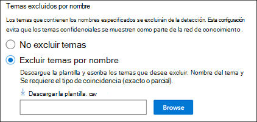
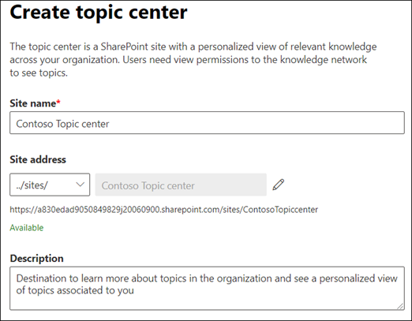

# Configuración de la administración de conocimiento (versión preliminar)Set up Knowledge Management (Preview)

> [!Note] 
> El contenido de este artículo es para la versión preliminar privada de Project Cortex.The content in this article is for Project Cortex Private Preview. [Obtenga más información acerca del Project Cortex](https://aka.ms/projectcortex).[Find out more about Project Cortex](https://aka.ms/projectcortex).

Puede usar el centro de administración de Microsoft 365 para instalar y configurar la [Administración del conocimiento](knowledge-management-overview.md).You can use the Microsoft 365 admin center to set up and configure [Knowledge Management](knowledge-management-overview.md). 

> [!Important]
> Es importante planear la mejor forma de configurar y configurar la administración del conocimiento en su entorno.It is important to plan the best way to set up and configure Knowledge Management in your environment. Por ejemplo, tendrá que tener en cuenta lo siguiente:For example, you will need to make considerations about the following:
- Los sitios de SharePoint que desea analizar para los temas.Which SharePoint sites you want to analyze for topics.
- Los usuarios a los que desea que los temas sean visibles.Which users you want to make topics visible to.
- Los usuarios a los que desea conceder permisos para administrar temas en el centro de temas.Which users you want to give permissions to manage topics in the topic center.
- Los usuarios a los que desea conceder permisos para crear o editar temas en el centro de temas.Which users you want to give permissions to create or edit topics in the topic center.
- El nombre que desea dar al centro de temas.What name you want to give your topic center.

> [!Note]
> Puede que le resulte útil crear grupos de seguridad para asignar a los usuarios los permisos necesarios para ver temas, administrar temas y crear y editar temas.You may find it useful to create security groups to assign your users the permissions needed to view topics, manage topic, and create and edit topics.

Un administrador también puede [realizar cambios en la configuración seleccionada en cualquier momento después](topic-experiences-discovery.md) de la instalación mediante la configuración de administración de conocimiento en el centro de administración de Microsoft 365.An admin can also [make changes to your selected settings anytime after setup](topic-experiences-discovery.md) through the Knowledge Management settings in the Microsoft 365 admin center.

## RequirementsRequirements 
Debe tener permisos de administrador global o de administrador de SharePoint para poder obtener acceso al centro de administración de 365 de Microsoft y configurar las tareas de conocimiento de la organización.You must have Global Admin or SharePoint admin permissions to be able to access the Microsoft 365 admin center and set up Organizational knowledge tasks.

## Configurar la red de conocimientosSet up your knowledge network

La configuración de la red de conocimientos le guiará a través de lo siguiente:Setting up your knowledge network walks you through the following:

- Detección de temas: selección de los temas y orígenes del tema que se deben excluir de la detección.Topic discovery: Selecting topic sources and topics to  exclude from discovery.
- Visibilidad del tema: seleccionar quién puede ver los temas como puntos destacados, en las páginas de búsqueda y de temas.Topic visibility: Selecting who can view topics as highlights, in search and topic pages.
- Topic Permissions: seleccionar quién puede crear, editar y administrar temas.Topic permissions: Selecting who can create, edit, and manage topics.
- Centro de temas: cree su centro de temas.Topic center: Create your topic center.
- Revisión: Compruebe y aplique la configuración.Review: Check and apply your settings.

Para configurar la red de conocimientos:To set up your knowledge network:

1. En el centro de administración de Microsoft 365 (admin.microsoft.com), seleccione **instalación** y, a continuación, ver la sección de conocimientos de la **organización** .In the Microsoft 365 admin center (admin.microsoft.com), select **Setup** , and then view the **Organizational Knowledge** section.
2. En la sección conocimientos de la **organización** , haga clic en **conectar personas con el conocimiento**.In the **Organizational Knowledge** section, click **Connect people to knowledge**. 

      

3. En la página **conectar personas a los conocimientos** , **haga clic en introducción para** guiarlo en el proceso de configuración.On the **Connect people to knowledge** page, click **Get started** to walk you through the setup process. 

      

4. En la página **elegir el modo en que la red de conocimiento puede buscar temas** , se configurará la detección de temas.On the **Choose how the knowledge network can find topics** page, you will configure topic discovery. En la sección **seleccionar orígenes de temas de SharePoint** , seleccione los sitios de SharePoint que se rastrearán como orígenes para los temas durante la detección.In the **Select SharePoint topic sources** section, select which SharePoint sites will be crawled as sources for your topics during discovery. Esto incluye:This includes: 
    a.a. **Todos los sitios** : todos los sitios de SharePoint de su espacio empresarial.**All sites** : All SharePoint sites in your tenant. Esto captura los sitios actuales y futuros.This captures current and future sites. 
    b.b. **Todos, excepto los sitios seleccionados** : escriba los nombres de los sitios que desea excluir.**All, except selected sites** : Type the names of the sites you want to exclude.  También puede cargar una lista de sitios que desea excluir de la detección.You can also upload a list of sites that you want to opt out from discovery. Los sitios creados en el futuro se incluirán como orígenes para la detección de temas.Sites created in future will be included as sources for topic discovery.  
    c.c. **Solo sitios seleccionados** : escriba los nombres de los sitios que desea incluir.**Only selected sites** : Type the names of the sites you want to include. También puede cargar una lista de sitios.You can also upload a list of sites. Los sitios que se creen en el futuro no se incluirán como orígenes para la detección de temas.Sites created in the future will not be included as sources for topic discovery.  

      
   
5. En la sección **excluir temas por nombre** , puede elegir incluir los nombres de los temas que no desea que se incluyan en los resultados detectados.In the **Exclude topics by name** section, you can choose to includes names of topics you don't want to be in the discovered results. Use esta opción para evitar que se incluyan temas confidenciales como parte de la red de conocimiento.Use this setting to prevent sensitive topics from being included as part of the knowledge network. Las opciones son:Your options include: 
    a.a. **No excluir temas****Don't exclude any topics**  
    b.b. **Excluir temas por nombre** : Si tiene temas que no desea que se muestren a los usuarios como parte de la red de conocimiento.**Exclude topics by name** :  If you have topics you don’t want shown to users as part of the knowledge network. 

      

    #### Cómo excluir temas por nombreHow to exclude topics by name    

    Si necesita excluir temas, después de seleccionar **excluir temas por nombre** , seleccione **descargar la plantilla. csv**.If you need to exclude topics, after selecting **Exclude topics by name** , select **Download the .csv template**. Use el Excel. Plantilla CSV para incluir una lista de temas que desea excluir de los resultados de la detección.Use the Excel .CSV template to include a list of topics that you want to exclude from your discovery results.

      

    En la plantilla CSV, escriba la siguiente información sobre los temas que desea excluir:In the CSV template, enter the following information about the topics you want to exclude:

    - **Name** : escriba el nombre del tema que desea excluir.**Name** : Type the name of the topic you want to exclude. Puede realizar esto de dos maneras:There are two ways to do this: 
        - Coincidencia exacta: puede incluir el acrónimo o el nombre exacto (por ejemplo, *contoso* o *ATL* ).Exact match: You can include the exact name or acronym (for example, *Contoso* or *ATL* ). 
        - Coincidencia parcial: puede excluir todos los temas que contengan una palabra específica.Partial match: You can exclude all topics that have a specific word in it.  Por ejemplo, *arco* excluirá todos los temas que contengan la palabra *Arc* , como *círculo arco* , *soldadura de arco de plasma* o arco de *formación*. Tenga en cuenta que no se excluirán los temas en los que se incluya el texto como parte de una palabra, como la *arquitectura*.For example, *arc* will exclude all topics with the word *arc* in it, such as *Arc circle* , *Plasma arc welding* , or *Training arc*. Note that it will not exclude topics in which the text is included as part of a word, such as *Architecture*. 
    - **Expansión (opcional)** : Si desea excluir un acrónimo, escriba las palabras que representa el acrónimo.**Expansion (optional)** : If you want to exclude an acronym, type the words the acronym stands for. 
    - **MatchType-Exact/Partial** : escriba si el nombre que ha escrito es un tipo de coincidencia *exacta* o *parcial* .**MatchType-Exact/Partial** : Type whether the name you entered was an *exact* or *partial* match type. 

    Una vez que haya completado y guardado el archivo de plantilla CSV, seleccione **examinar** para localizarlo y selecciónelo.After you've completed and saved your CSV template file, select **Browse** to locate and select it.
    
    Seleccione **Siguiente**.Select **Next**. 

6. En la página **quién puede ver los temas y dónde pueden verlos** , configurará la visibilidad de los temas.On the **Who can see topics and where they can see them** page, you will configure topic visibility. En los **temas quién puede ver en la red de conocimiento** , elija quién tendrá acceso a los detalles del tema, como temas resaltados, tarjetas de temas, respuestas de temas en la búsqueda y páginas de temas.In the **Who can see topics in the knowledge network** setting, you choose who will have access to topic details, such as highlighted topics, topic cards, topic answers in search, and topic pages. Puede seleccionar:You can select: 
    a.a. **Todos en su organización****Everyone in your organization** 
    b.b. **Solo personas seleccionadas o grupos de seguridad****Only selected people or security groups** 
    c.c. **No hay nadie****No one** 

       

 > [!Note] 
 > Aunque esta configuración le permite seleccionar cualquier usuario de su organización, solo los usuarios que tengan licencias de administración de conocimiento podrán ver los temas.While this setting allows you to select any user in your organization, only users who have knowledge management licenses assigned to them will be able to view topics. 

7. En la página **permisos para la administración de temas** , elija quién podrá crear, editar o administrar temas.In the **Permissions for topic management** page, you choose who will be able to create, edit, or manage topics. En la sección **quién puede crear y editar temas** , puede seleccionar:In the **Who can create and edit topics** section, you can select: 
    a.a. **Todos en su organización****Everyone in your organization** 
    b.b. **Solo personas seleccionadas o grupos de seguridad****Only selected people or security groups** 
8. En la sección **quién puede administrar temas** , puede seleccionar:In the **Who can manage topics** section, you can select: 
    a.a. **Todos en su organización****Everyone in your organization** 
    b.b. **Personas o grupos de seguridad seleccionados****Selected people or security groups** 

      

    Seleccione **Siguiente**.Select **Next**. 
9. En la página **crear centro de temas** , puede crear el sitio del centro de temas en el que se pueden ver las páginas de temas y administrar los temas.On the **Create Topic  Center** page, you can create your topic center site in which topic pages can be viewed and topics can be managed.  En el cuadro **nombre del centro de temas** , escriba un nombre para el centro de temas.In the **Topic center name** box, type a name for your Topic center. Opcionalmente, puede escribir una breve descripción en el cuadro **Descripción del sitio** .You can optionally type a short description in the **Site description** box.  

Seleccione **Siguiente**.Select **Next**. 

      

10. En la página **Revisar y finalizar** , puede mirar el ajuste seleccionado y elegir hacer cambios.On the **Review and finish** page, you can look at your selected setting and choose to make changes. Si está de acuerdo con las selecciones, seleccione **Activar**.If you are satisfied with your selections, select **Activate**.

       

11. Se mostrará la página de **información de red activada** , confirmando que el sistema empezará a analizar los sitios seleccionados para ver los temas y crear el sitio del centro de conocimiento.The **Knowledge network activated** page will display, confirming that the system will now start analyzing your selected sites for topics and creating the Knowledge Center site. Seleccione **Listo**.Select **Done**. 

       

12. Se le devolverá a la página **conectar personas a la información** .You'll be returned to your **Connect people to knowledge** page. Desde esta página, puede seleccionar **administrar** para realizar cambios en las opciones de configuración.From this page, you can select **Manage** to make any changes to your configuration settings. 

         

> [!Note]
> Después de la instalación, un administrador puede [realizar cambios en la configuración de administración de conocimiento](topic-experiences-discovery.md) que haya seleccionado en cualquier momento volviendo a esta p? gina.After setup, an admin can [make changes to your selected knowledge management settings](topic-experiences-discovery.md) any time by returning to this page.

## Consulte tambiénSee also

  

