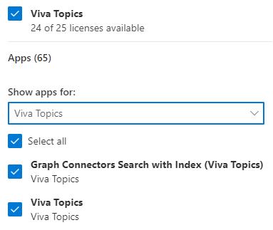

# Configurar experiencias de tema en Microsoft 365Set up topic experiences in Microsoft 365

Puede usar el centro de administración de Microsoft 365 para instalar y configurar las experiencias de los [temas](topic-experiences-overview.md).You can use the Microsoft 365 admin center to set up and configure [topic experiences](topic-experiences-overview.md). 

Es importante planear la mejor forma de configurar y configurar temas en el entorno.It is important to plan the best way to set up and configure topics in your environment. Asegúrese de leer las [experiencias del tema del plan](plan-topic-experiences.md) antes de comenzar con los procedimientos de este artículo.Be sure to read [Plan topic experiences](plan-topic-experiences.md) before you begin the procedures in this article.

Debe ser administrador global o administrador de SharePoint para tener acceso al centro de administración de Microsoft 365 y configurar las experiencias de los temas.You must be a global administrator or SharePoint administrator to access the Microsoft 365 admin center and set up topic experiences.

## Configurar experiencias de temaSet up topic experiences

Para configurar experiencias de tema en Microsoft 365To set up topic experiences in Microsoft 365

1. En el [centro de administración de Microsoft 365](https://admin.microsoft.com), seleccione **instalación** y, a continuación, ver la sección **archivos y contenido** .In the [Microsoft 365 admin center](https://admin.microsoft.com), select **Setup**, and then view the **Files and content** section.
2. En la sección **archivos y contenido** , haga clic en **conectar personas con el conocimiento**.In the **Files and content** section, click **Connect people to knowledge**.

     

3. En la página **conectar personas a los conocimientos** , **haga clic en introducción para** guiarlo en el proceso de configuración.On the **Connect people to knowledge** page, click **Get started** to walk you through the setup process.

     

4. En la página **elegir el modo en que la red de conocimiento puede buscar temas** , se configurará la detección de temas.On the **Choose how the knowledge network can find topics** page, you will configure topic discovery. En la sección **seleccionar orígenes de temas de SharePoint** , seleccione los sitios de SharePoint que se rastrearán como orígenes para los temas durante la detección.In the **Select SharePoint topic sources** section, select which SharePoint sites will be crawled as sources for your topics during discovery. Elija entre:Choose from:
    - **Todos los sitios**: todos los sitios de SharePoint de la organización.**All sites**: All SharePoint sites in your organization. Esto incluye los sitios actuales y futuros.This includes current and future sites.
    - **Todos, excepto los sitios seleccionados**: escriba los nombres de los sitios que desea excluir.**All, except selected sites**: Type the names of the sites you want to exclude.  También puede cargar una lista de sitios que desea excluir de la detección.You can also upload a list of sites that you want to opt out from discovery. Los sitios creados en el futuro se incluirán como orígenes para la detección de temas.Sites created in future will be included as sources for topic discovery. 
    - **Solo sitios seleccionados**: escriba los nombres de los sitios que desea incluir.**Only selected sites**: Type the names of the sites you want to include. También puede cargar una lista de sitios.You can also upload a list of sites. Los sitios que se creen en el futuro no se incluirán como orígenes para la detección de temas.Sites created in the future will not be included as sources for topic discovery.
    - **Sin sitios**: no incluye ningún sitio de SharePoint.**No sites**: Do not include any SharePoint sites.

     
   
5. En la sección **excluir temas por nombre** , puede Agregar nombres de temas que desea excluir del descubrimiento de temas.In the **Exclude topics by name** section, you can add names of topics you want to exclude from topic discovery. Use esta configuración para evitar que la información confidencial se incluya como temas.Use this setting to prevent sensitive information from being included as topics. Las opciones son:The options are:
    - **No excluir temas****Don't exclude any topics** 
    - **Excluir temas por nombre****Exclude topics by name**

     

    (Los administradores de conocimiento también pueden excluir temas del centro de temas después de la detección).(Knowledge managers can also exclude topics in the topic center after discovery.)

    #### Cómo excluir temas por nombreHow to exclude topics by name    

    Si necesita excluir temas, después de seleccionar **excluir temas por nombre**, seleccione Descargar la plantilla. csv y actualizarla con la lista de temas que desea excluir de los resultados de la detección.If you need to exclude topics, after selecting **Exclude topics by name**, select download the .csv template and update it with the list of topics that you want to exclude from your discovery results.

     

    En la plantilla CSV, escriba la siguiente información sobre los temas que desea excluir:In the CSV template, enter the following information about the topics you want to exclude:

    - **Name**: escriba el nombre del tema que desea excluir.**Name**: Type the name of the topic you want to exclude. Puede realizar esto de dos maneras:There are two ways to do this:
        - Coincidencia exacta: puede incluir el acrónimo o el nombre exacto (por ejemplo, *contoso* o *ATL*).Exact match: You can include the exact name or acronym (for example, *Contoso* or *ATL*).
        - Coincidencia parcial: puede excluir todos los temas que contengan una palabra específica.Partial match: You can exclude all topics that have a specific word in it.  Por ejemplo, *arco* excluirá todos los temas que contengan la palabra *Arc* , como *círculo arco*, *soldadura de arco de plasma* o arco de *formación*. Tenga en cuenta que no se excluirán los temas en los que se incluya el texto como parte de una palabra, como la *arquitectura*.For example, *arc* will exclude all topics with the word *arc* in it, such as *Arc circle*, *Plasma arc welding*, or *Training arc*. Note that it will not exclude topics in which the text is included as part of a word, such as *Architecture*.
    - **Significa (opcional)**: Si desea excluir un acrónimo, escriba las palabras que representa el acrónimo.**Stands for (optional)**: If you want to exclude an acronym, type the words the acronym stands for.
    - **MatchType-Exact/Partial**: escriba si el nombre que ha escrito es un tipo de coincidencia *exacta* o *parcial* .**MatchType-Exact/Partial**: Type whether the name you entered was an *exact* or *partial* match type.

    Después de completar y guardar el archivo. csv, seleccione **examinar** para buscarlo y seleccionarlo.After you've completed and saved your .csv file, select **Browse** to locate and select it.
    
    Seleccione **Siguiente**.Select **Next**.

6. En la página **quién puede ver los temas y dónde puede** verlos, configurará la visibilidad de los temas.On the **Who can see topics and where can they see them** page, you will configure topic visibility. En los **temas quién puede ver en la red de conocimiento** , elija quién tendrá acceso a los detalles del tema, como temas resaltados, tarjetas de temas, respuestas de temas en la búsqueda y páginas de temas.In the **Who can see topics in the knowledge network** setting, you choose who will have access to topic details, such as highlighted topics, topic cards, topic answers in search, and topic pages. Puede seleccionar:You can select:
    - **Todos los usuarios de mi organización****Everyone in my organization**
    - **Solo personas seleccionadas o grupos de seguridad****Only selected people or security groups**
    - **No hay nadie****No one**

      

 > [!Note] 
 > Aunque esta configuración le permite seleccionar cualquier usuario de su organización, solo los usuarios que tengan licencias de temas que tengan asignada una licencia podrán ver los temas.While this setting allows you to select any user in your organization, only users who have Topic Experiences licenses assigned to them will be able to view topics.

7. En la página **permisos para la administración de temas** , elija quién podrá crear, editar o administrar temas.In the **Permissions for topic management** page, you choose who will be able to create, edit, or manage topics. En la sección **quién puede crear y editar temas** , puede seleccionar:In the **Who can create and edit topics** section, you can select:
    - **Todos los usuarios de mi organización****Everyone in my organization**
    - **Solo personas seleccionadas o grupos de seguridad****Only selected people or security groups**
    - **No hay nadie****No one**

     

8. En la sección **quién puede administrar temas** , puede seleccionar:In the **Who can manage topics** section, you can select:
    - **Todos los usuarios de mi organización****Everyone in my organization**
    - **Solo personas seleccionadas o grupos de seguridad****Only selected people or security groups**

     

    Seleccione **Siguiente**.Select **Next**.

9. En la página **crear centro de temas** , puede crear el sitio del centro de temas en el que se pueden ver las páginas de temas y administrar los temas.On the **Create topic center** page, you can create your topic center site in which topic pages can be viewed and topics can be managed. En el cuadro **nombre del sitio** , escriba un nombre para el centro de temas.In the **Site name** box, type a name for your Topic center. Opcionalmente, puede escribir una descripción breve en el cuadro **Descripción** .You can optionally type a short description in the **Description** box. 

Seleccione **Siguiente**.Select **Next**.

     

10. En la página **Revisar y finalizar**, puede mirar el ajuste seleccionado y elegir hacer cambios.On the **Review and finish** page, you can look at your selected setting and choose to make changes. Si está de acuerdo con las selecciones, seleccione **Activar**.If you are satisfied with your selections, select **Activate**.

11. Se mostrará la página de **información de red activada** , confirmando que el sistema empezará a analizar los sitios seleccionados para ver los temas y crear el sitio del centro de conocimiento.The **Knowledge network activated** page will display, confirming that the system will now start analyzing your selected sites for topics and creating the Knowledge Center site. Seleccione **Listo**.Select **Done**.

12. Se le devolverá a la página **conectar personas a la información** .You'll be returned to your **Connect people to knowledge** page. Desde esta página, puede seleccionar **administrar** para realizar cambios en las opciones de configuración.From this page, you can select **Manage** to make any changes to your configuration settings. 

        

## Asignar licenciasAssign licenses

Una vez que haya configurado las experiencias de los temas, debe asignar licencias para los usuarios que vayan a usar las experiencias de los temas.Once you have configured topic experiences, you must assign licenses for the users who will be using topic experiences. Solo los usuarios con una licencia pueden ver información sobre temas como las sugerencias, las tarjetas de temas, las páginas de temas y el centro de temas.Only users with a license can see information on topics including highlights, topic cards, topic pages and the topic center. 

Para asignar licencias:To assign licenses:

1. En el Centro de administración de Microsoft 365, en **Usuarios**, haga clic en **Usuarios activos**.In the Microsoft 365 admin center, under **Users**, click **Active users**.

2. Seleccione los usuarios a los que desea conceder licencias y haga clic en **Administrar licencias de productos**.Select the users that you want to license, and click **Manage product licenses**.

3. Seleccione **Asignar más**.Select **Assign more**.

4. En **licencias**, seleccione **experiencias del tema**.Under **Licenses**, select **Topic Experiences**.

5. En **aplicaciones**, asegúrese de que la **búsqueda de conectores de gráficos con** experiencias de índice y **tema** estén seleccionadas.Under **Apps**, make sure **Graph Connectors Search with Index** and **Topic Experiences** are both selected.

    > [!div class="mx-imgBorder"]
    > 

6. Haga clic en **Guardar cambios**.Click **Save changes**.

## Administrar experiencias de temasManage topic experiences

Una vez que haya configurado las experiencias de los temas, puede cambiar la configuración que eligió durante la instalación en el [centro de administración de Microsoft 365](https://admin.microsoft.com/AdminPortal#/featureexplorer/csi/KnowledgeManagement).Once you have set up topic experiences, you can change the settings that you chose during setup in the [Microsoft 365 admin center](https://admin.microsoft.com/AdminPortal#/featureexplorer/csi/KnowledgeManagement). Consulte las siguientes referencias:See the following references:

- [Administrar la detección de temas en Microsoft 365Manage topic discovery in Microsoft 365](topic-experiences-discovery.md)
- [Administrar la visibilidad de los temas en Microsoft 365Manage topic visibility in Microsoft 365](topic-experiences-knowledge-rules.md)
- [Administrar los permisos de temas en Microsoft 365Manage topic permissions in Microsoft 365](topic-experiences-user-permissions.md)
- [Cambiar el nombre del centro de temas en Microsoft 365Change the name of the topic center in Microsoft 365](topic-experiences-administration.md)

## Vea tambiénSee also

[Información general sobre las experiencias de temasTopic Experiences Overview](topic-experiences-overview.md)
