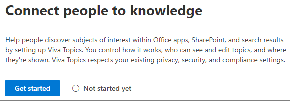
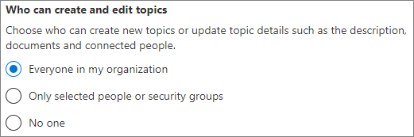

# Configurar temas de Microsoft Viva

Puede usar el Centro de administración de Microsoft 365 para configurar y configurar [temas.](topic-experiences-overview.md) 

Es importante planear la mejor manera de configurar y configurar temas en su entorno. Asegúrese de leer [Plan for Microsoft Viva Topics](plan-topic-experiences.md) antes de comenzar los procedimientos de este artículo.

Debe estar suscrito a [Temas Viva](https://www.microsoft.com/microsoft-viva/topics) y ser administrador global o administrador de SharePoint para acceder al Centro de administración de Microsoft 365 y configurar Temas.

## Vídeo de demostración

En este vídeo se muestra el proceso para configurar temas en Microsoft 365.

 

> [!VIDEO https://www.microsoft.com/videoplayer/embed/RE4Li0E]  

 

## Configurar Temas

Para configurar temas

1. En el [Centro de administración de Microsoft 365,](https://admin.microsoft.com)seleccione **Configuración** y, a continuación, vea la sección **Archivos y** contenido.
2. En la **sección Archivos y** contenido, haga clic en Conectar personas al **conocimiento.**

     

3. En la página **Conectar a personas con conocimientos,** haga clic **en** Introducción para que le guía por el proceso de configuración.

     

4. En la **página Elegir cómo pueden encontrar temas Temas Viva,** configurará la detección de temas. En la sección Seleccionar orígenes de temas **de SharePoint,** seleccione los sitios de SharePoint que se rastrearán como orígenes de los temas durante la detección. Elija entre:
    - **Todos los sitios:** todos los sitios de SharePoint de la organización. Esto incluye los sitios actuales y futuros.
    - **Todos, excepto los sitios seleccionados:** escriba los nombres de los sitios que desea excluir.  También puede cargar una lista de sitios que desea que no se puedan descubrir. Los sitios creados en el futuro se incluirán como orígenes para la detección de temas. 
    - **Solo los sitios seleccionados:** escriba los nombres de los sitios que desea incluir. También puede cargar una lista de sitios. Los sitios creados en el futuro no se incluirán como orígenes para la detección de temas.
    - **Ningún sitio:** no incluya ningún sitio de SharePoint.

     
   
5. En la **sección Excluir temas por** nombre, puede agregar nombres de los temas que desea excluir de la detección de temas. Use esta configuración para evitar que la información confidencial se incluya como temas. Las opciones son:
    - **No excluir ningún tema** 
    - **Excluir temas por nombre**

     

    (Los administradores de conocimientos también pueden excluir los temas del centro de temas después de la detección).

    #### Cómo excluir temas por nombre    

    Si necesita excluir temas, después de seleccionar Excluir temas por **nombre,** descargue la plantilla .csv y actualícárelo con la lista de temas que desea excluir de los resultados de detección.

     

    En la plantilla CSV, escriba la siguiente información sobre los temas que desea excluir:

    - **Nombre:** escriba el nombre del tema que desea excluir. Puede realizar esto de dos maneras:
        - Coincidencia exacta: puede incluir el nombre exacto o el acrónimo (por ejemplo, *Contoso* o *ATL*).
        - Coincidencia parcial: puede excluir todos los temas que tengan una palabra específica.  Por ejemplo, *el arco* excluirá  todos los temas con la palabra arco en él, como el círculo de *arco,* el arco de *plasma y* el arco *de aprendizaje.* Tenga en cuenta que no excluirá los temas en los que se incluye el texto como parte de una palabra, como *Arquitectura*.
    - **Significa (opcional):** si desea excluir un acrónimo, escriba las palabras que significa el acrónimo.
    - **MatchType-Exact/Partial**: Escriba si el nombre que escribió fue *un tipo de* coincidencia exacta *o* parcial.

    Una vez que haya completado y guardado el archivo .csv, **seleccione** Examinar para buscarlo y selecciónelo.
    
    Seleccione **Siguiente**.

6. En la **página Quién puede ver los temas y** dónde pueden verlos, configurará la visibilidad de los temas. En la **configuración Quién puede ver** temas, puede elegir quién tendrá acceso a los detalles del tema, como temas resaltados, tarjetas de temas, respuestas de temas en la búsqueda y páginas de temas. Puede seleccionar:
    - **Todos los miembros de mi organización**
    - **Solo personas o grupos de seguridad seleccionados**
    - **Nadie**

      

    > [!Note] 
    > Aunque esta configuración le permite seleccionar cualquier usuario de su organización, solo los usuarios que tengan asignadas licencias de Experiencias de tema podrán ver los temas.

7. En la **página Permisos para la administración de** temas, elija quién podrá crear, editar o administrar temas. En la **sección Quién puede crear y editar temas,** puede seleccionar:
    - **Todos los miembros de mi organización**
    - **Solo personas o grupos de seguridad seleccionados**
    - **Nadie**

     

8. En la **sección Quién puede administrar temas,** puede seleccionar:
    - **Todos los miembros de mi organización**
    - **Solo personas o grupos de seguridad seleccionados**

     

    Seleccione **Siguiente**.

9. En la **página Crear centro de** temas, puede crear el sitio del centro de temas en el que se pueden ver las páginas de temas y se pueden administrar los temas. En el **cuadro Nombre del** sitio, escriba un nombre para el centro de temas. Opcionalmente, puede escribir una descripción breve en el **cuadro** Descripción. 

   Seleccione **Siguiente**.

     

10. En la página **Revisar y finalizar**, puede mirar el ajuste seleccionado y elegir hacer cambios. Si está de acuerdo con las selecciones, seleccione **Activar**.

11. Se **mostrará la página Temas de Viva** activada, confirmando que el sistema empezará ahora a analizar los sitios seleccionados para los temas y a crear el sitio del centro de temas. Seleccione **Listo**.

12. Volverá a la página Conectar a personas **con conocimientos.** Desde esta página, puede seleccionar **administrar** para realizar cambios en las opciones de configuración. 

        

## Asignar licencias

Una vez que haya configurado las experiencias de tema, debe asignar licencias para los usuarios que usarán Temas. Solo los usuarios con una licencia pueden ver información sobre temas como resaltados, tarjetas de temas, páginas de temas y el centro de temas. 

Para asignar licencias:

1. En el Centro de administración de Microsoft 365, en **Usuarios**, haga clic en **Usuarios activos**.

2. Seleccione los usuarios a los que desea obtener una licencia y haga clic **en Licencias y aplicaciones.**

3. En **Aplicaciones,** asegúrese de **que la búsqueda de conectores** de Graph con experiencias de **índice** y tema está seleccionada.

4. Haga clic en **Guardar cambios**.

## Administrar experiencias de temas

Una vez que haya configurado Temas, puede cambiar la configuración que eligió durante la instalación en el Centro [de administración de Microsoft 365.](https://admin.microsoft.com/AdminPortal#/featureexplorer/csi/KnowledgeManagement) Vea las siguientes referencias:

- [Administrar la detección de temas en temas de Microsoft Viva](topic-experiences-discovery.md)
- [Administrar la visibilidad de temas en Temas de Microsoft Viva](topic-experiences-knowledge-rules.md)
- [Administrar permisos de temas en temas de Microsoft Viva](topic-experiences-user-permissions.md)
- [Cambiar el nombre del centro de temas en Temas de Microsoft Viva](topic-experiences-administration.md)

## Recursos adicionales

[Introducción a las experiencias del tema](topic-experiences-overview.md)
