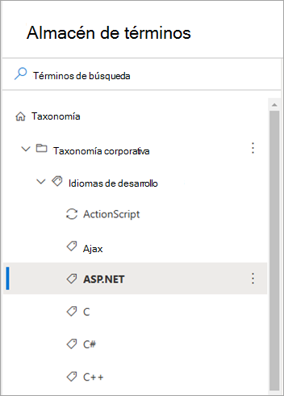
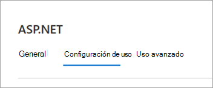
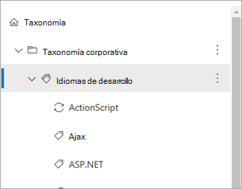
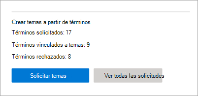
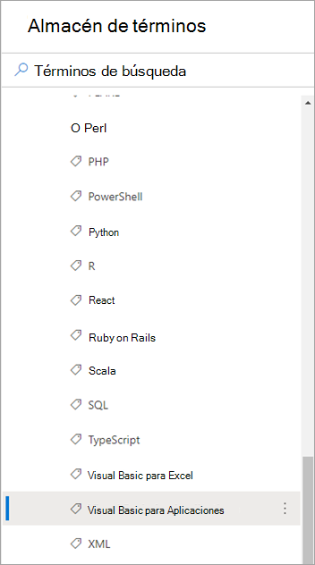
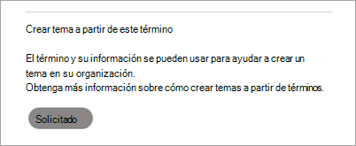
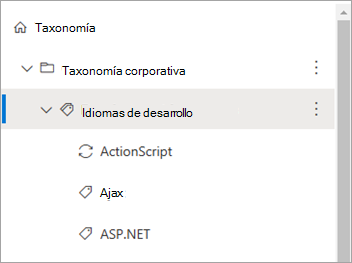
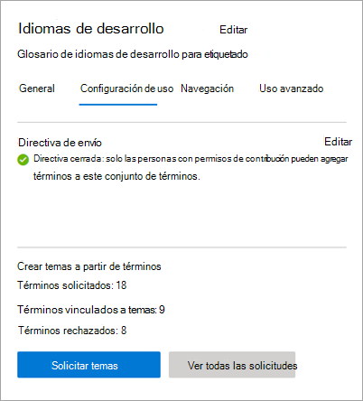
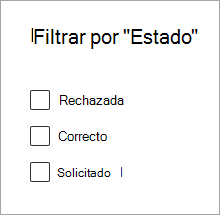

# Use SharePoint términos de taxonomía para crear temas en Temas Microsoft Viva

> [!Note] 
> Esta característica está disponible actualmente solo para los participantes que están en el programa de adopción temprana. Esta característica estará disponible para usuarios de todo el mundo en una fecha posterior.

Puede usar los términos SharePoint taxonomía para ayudar a guiar la inteligencia artificial (IA) para crear temas en Temas de Viva. El SharePoint taxonomía proporciona términos globales que están disponibles para todos los sitios. Los usuarios pueden crear temas que se corresponden con conceptos que se representan como términos. 

Debe tener permisos de edición para los términos globales que desea usar para realizar estas tareas.

<!---
> [!Note]
> This feature is available only for users who are licensed for Viva Topics.
--->

## Funcionamiento

Cuando alguien solicita crear un tema a partir de un término, el servicio de taxonomía retransmite información sobre el término a Viva Topics para la creación de un tema correspondiente. Esta información incluye lo siguiente:

- Nombre (etiqueta predeterminada)
- Sinónimos
- Descripción
- Archivos etiquetados con el término

El tema que se crea usa el nombre original del término, considera que los sinónimos son los nombres alternativos del tema y usa la descripción del término para la descripción del tema. Los archivos etiquetados con el término de taxonomía se consideran archivos "sugeridos" en el tema. A continuación, la IA sigue descubriendo contenido adicional para el tema.

> [!Note]
> Para que la creación del tema se haga correctamente, el término de taxonomía debe tener al menos un archivo etiquetado con él. Si no lo hace, el sistema rechaza la solicitud.

Después de crear un tema a partir de un término, el término sigue existiendo en el almacén SharePoint términos y no se ven afectados por la creación del tema. Seguirás siendo capaz de usarlo en SharePoint listas y bibliotecas.

Si se elimina un término, la eliminación no quita automáticamente el tema. Si Viva Topics identifica contenido relacionado con el tema que no es únicamente del término y su contenido etiquetado, el tema sigue existiendo.

Si la etiqueta o descripción predeterminada de un término cambia, Viva Topics evalúa los cambios y actualiza la información del tema si determina que el cambio es adecuado. El contenido etiquetado con el término también se pasa periódicamente a Temas de Viva. Si ya no hay contenido etiquetado con el término y Temas de Viva no ha identificado ningún otro contenido asociado al tema, es posible que se quite el tema.

Las actualizaciones del tema no afectan al término original.

## Iniciar una solicitud de creación de temas

Puede solicitar un solo término o varios términos en un conjunto de términos. La solicitud de creación de temas se inicia en el almacén de términos SharePoint moderna. Los usuarios que pueden editar el conjunto de términos tienen permiso para iniciar la solicitud. Estos usuarios incluyen administradores de almacén de términos, jefes de grupo y colaboradores.

### Solicitar un solo término

1. En el centro SharePoint administración, en la navegación izquierda, seleccione **Almacén de términos**.

     

2. En la **página Almacén de** términos, busque y seleccione el término que desea usar.

    

3. En la página término, seleccione la **pestaña Configuración de** uso.

    

4. En la **sección Crear tema de este término,** seleccione Solicitar **tema**.

    

### Solicitar varios términos en un conjunto de términos

1. En el centro SharePoint administración, en la navegación izquierda, seleccione **Almacén de términos**.

     

2. En la **página Almacén de** términos, busque y seleccione el conjunto de términos que desea usar.

    

3. En la página término, seleccione la **pestaña Configuración de** uso.

    

4. En la **sección Crear temas a partir de** términos, seleccione **Introducción.** Si ha creado solicitudes en el pasado, la opción que aparece es **Crear términos para la creación.**

    

    En la **sección Crear tema a partir de** términos, seleccione Temas de **solicitud**.

    

    1. En la **página Seleccionar términos para crear temas,** la jerarquía de términos dentro de este conjunto de términos está disponible para la selección.

        

    2. Para seleccionar términos específicos, seleccione cada término individualmente.

    3. También puede seleccionar todos los secundarios inmediatos de un nodo de la jerarquía. 

5. Después de seleccionar los términos para los que desea crear temas, seleccione **Enviar**.

    Viva Topics crea la solicitud y la pone en cola para procesarla. Viva Topics evalúa los términos y sus recursos asociados y crea nuevos temas o se combina con los temas existentes. Después de la solicitud inicial, el tema se creará en 24 horas.

## Ver el estado de la solicitud de creación de temas

Las solicitudes de creación de temas a partir de un término de taxonomía se divide en uno de tres estados: Solicitado, Correcto o Rechazado.

- **Requested:** indica que la solicitud está en cola y que el servicio recopila toda la información de términos necesaria. Una nueva solicitud puede permanecer en el estado Solicitado durante unas horas antes de que se mueva a uno de los dos estados finales.

- **Correcto:** indica que la solicitud se retransmitió correctamente a Temas de Viva con toda la información de término necesaria. Viva Topics crea el tema correspondiente en las próximas 24 horas.

- **Rechazado:** indica que la solicitud no se puede procesar porque no hay ningún archivo etiquetado con el término. Debe haber al menos un archivo etiquetado para que la solicitud se pueda realizar correctamente. Si los archivos más tarde se etiquetan con el término, puede crear manualmente una nueva solicitud para el término.

En el almacén de términos, puede ver el estado de las solicitudes mediante:

- Ir a un término individual.
- Visualización de todas las solicitudes de un conjunto de términos específico.

### Ver el estado de un solo término

1. En la **página Almacén de** términos, busque y seleccione el término para el que desea ver el estado.

    

2. En la página término, seleccione la **pestaña Configuración de** uso.

    

3. En la **sección Crear tema de este término,** vea el estado de la solicitud.

    

### Ver el estado de varios términos en un conjunto de términos

1. En la **página Almacén de** términos, busque y seleccione el conjunto de términos para el que desea ver el estado.

    

2. En la página término, seleccione la **pestaña Configuración de** uso.

    

    En la **sección Crear temas** a partir de términos, puede ver el número total de solicitudes, cuántos están vinculados a temas y cuántos se rechazaron.

3. Seleccione **Ver todas las solicitudes**.

4. En el **panel Todos los términos solicitados para** la creación de temas, vea el estado de las solicitudes de términos.

    

5. Si tiene muchas solicitudes, seleccione **Cargar más** para seguir cargando elementos adicionales.

    

6. Para revisar las solicitudes que se encuentran en un estado determinado, en la columna **Estado,** seleccione **Filtrar por**.

    

     Seleccione el estado por el que desea filtrar: **Rechazado,** **Correcto** o **Solicitado**.

    

<!---

## Identify topics created from terms (feature not ready yet)

After Viva Topics processes a request and creates a topic, you can see a topic card when you hover over a term name in the list of requests for the term set.

    

Also, if you go to individual terms, and select the **Usage settings** tab, the **Create topic from this term** section shows a topic card when you hover over the name.

    

Topic pages also indicate that the taxonomy is one of the sources for the topic.

**--Insert screenshot from final UX - source string in topic page--**

--->
