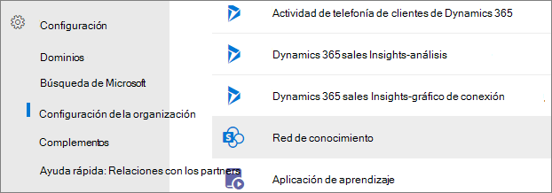
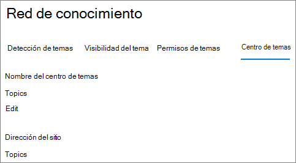

# Información general del Centro de temasTopic center overview

En Temas de Microsoft Viva, el centro de temas es un sitio de SharePoint moderno que sirve como centro de conocimientos para su organización.In Microsoft Viva Topics, the topic center is a Modern SharePoint site that serves as a center of knowledge for your organization. Se crea durante la instalación de [Viva Topics](set-up-topic-experiences.md) en el Centro de administración de Microsoft 365.It's created during [Viva Topics setup](set-up-topic-experiences.md) in the Microsoft 365 admin center.

El centro de temas tiene una página principal predeterminada con el elemento web Temas donde todos los usuarios con licencia pueden ver los temas a los que tienen una conexión.The topic center has a default home page with the Topics web part where all licensed users can see the topics to which they have a connection. 

Aunque todos los usuarios con licencia que puedan ver temas tendrán acceso al centro de temas, los administradores de conocimientos pueden administrar los temas a través de la página Administrar **temas.**While all licensed users who can view topics will have access to the topic center, knowledge managers can al manage topics through the **Manage topics** page. La pestaña Administrar temas solo se mostrará a los usuarios que tengan **permisos Administrar** temas.The Manage topics tab will only display to users who have the **Manage topics** permissions. 

## Dónde está mi Centro de temasWhere is my Topic center

El centro de temas se crea durante la instalación de Viva Topics.The topic center is created during Viva Topics setup. Una vez completada la instalación, un administrador puede encontrar la dirección URL en la [página de administración del centro de temas.](./topic-experiences-administration.md#to-access-topics-management-settings)After setup completes, an admin can find the URL on the [Topic center management page](./topic-experiences-administration.md#to-access-topics-management-settings).

1. En el Centro de administración de Microsoft 365, haga clic **en Configuración** y, a continuación, en Configuración de **la organización.**In the Microsoft 365 admin center, click **Settings**, then **Org settings**.
2. En la **pestaña Servicios,** haga clic en **Experiencias del tema**.On the **Services** tab, click **Topic Experiences**.

      

3. Seleccione la **pestaña Centro de** temas. En **Dirección del sitio** es un vínculo al Centro de temas.Select the **Topic center** tab. Under **Site address** is a link to your Topic center.

      

## Página principalHome page

 

> [!VIDEO https://www.microsoft.com/videoplayer/embed/RE4LAhZ]  

 

En la página principal del centro de temas, puede ver los temas de su organización a los que tiene una conexión.On the topic center home page, you can see the topics in your organization to which you have a connection.

- Conexiones sugeridas: verá los temas enumerados en **We've listed you on these topics. ¿Lo hemos hecho bien?**.Suggested connections - You will see topics listed under **We've listed you on these topics. Did we get it right?**. Estos son temas en los que se ha sugerido la conexión al tema a través de la IA.These are topics in which your connection to the topic has been suggested through AI. Por ejemplo, puede ser un autor de un archivo o sitio relacionado.For example, you may be an author of a related file or site. Se le pedirá que confirme que debe mantenerse en la lista como una persona relacionada para el tema.You are asked to confirm that you should stay listed as a related person for the topic.

     
 
- Conexiones confirmadas: se trata de temas en los que está anclado en la página del tema o ha confirmado una conexión sugerida al tema.Confirmed connections - These are topics in which you are pinned on the topic page or you've confirmed a suggested connection to the topic. Los temas pasarán de la sección sugerida a confirmada cuando confirme una conexión sugerida.Topics will move from the suggested to confirmed section when you confirm a suggested connection.
 
     

Una vez que un usuario confirma su conexión a un tema, el usuario puede realizar modificaciones en la página del tema para seleccionar su conexión.Once a user confirms their connection to a topic, the user can make edits to the topic page to curate their connection. Por ejemplo, pueden proporcionar más información sobre su conexión con el tema.For example, they can provide more information about their connection to the topic.

## Página Administrar temasManage topics page

Para trabajar en la sección **Administrar temas** del Centro de temas, debe tener los permisos *necesarios* administrar temas necesarios para el rol de administrador de conocimientos.To work in the **Manage Topics** section of Topic center, you need to have the required *Manage topics* permissions needed for the knowledge manager role. El administrador puede asignar estos permisos a los usuarios durante la configuración de administración de [conocimientos,](topic-experiences-knowledge-rules.md) o un administrador puede agregar nuevos usuarios después a través del Centro de administración de Microsoft 365.Your admin can assign these permissions to users during [knowledge management setup](set-up-topic-experiences.md), or new users can be [added afterwards](topic-experiences-knowledge-rules.md) by an admin through the Microsoft 365 admin center.

En la página Administrar temas, el panel de temas muestra todos los temas a los que tiene acceso que se identificaron desde las ubicaciones de origen especificadas.On the Manage Topics page, the topic dashboard shows all the topics, you have access to, that were identified from your specified source locations. Cada tema mostrará la fecha en que se descubrió el tema.Each topic will show the date the topic was discovered. Un usuario al que se **asignaron permisos** administrar temas puede revisar los temas no confirmados y elegir:A user who was assigned **Manage topics** permissions can review the unconfirmed topics and choose to:
- Confirmar el tema: resalta el tema para los usuarios que tienen acceso a los archivos y páginas relacionados con el tema y les permite ver la tarjeta de tema asociada y la página del tema.Confirm the topic: Highlights the topic to users who have access to the files and pages related to the topic, and lets them see the associated topic card and topic page.
- Publicar el tema: edite la información del tema para mejorar la calidad del tema que se identificó inicialmente y resalta el tema para todos los usuarios que tienen acceso a temas.Publish the topic: Edit the topic information to improve the quality of the topic that was initially identified, and highlights the topic to all users who have view access to topics. 
- Rechazar el tema: hace que el tema no esté disponible para los usuarios.Reject the topic: Makes the topic not available to users. El tema se mueve a la **pestaña Rechazado** y se puede confirmar más adelante si es necesario.The topic is moved to the **Rejected** tab and can be confirmed later if needed. 

> [!Note] 
> Vea [Administrar temas para](manage-topics.md) obtener más información sobre la administración de temas en la página Administrar temas.See [Manage topics](manage-topics.md) for more details about topic managing topics in the Manage topics page.

## Crear o editar un temaCreate or edit a topic

Si tiene permisos **crear y editar temas,** puede:If you have **Create and edit topics** permissions, you can:

- [Editar temas existentes:](edit-a-topic.md)puede realizar cambios en las páginas de temas existentes que se crearon mediante la detección.[Edit existing topics](edit-a-topic.md): You can make changes to existing topic pages that were created through discovery.
- [Crear nuevos temas:](create-a-topic.md)puede crear nuevos temas para los que no se encontraron a través de la detección, o si las herramientas de inteligencia artificial no encontraron suficiente evidencia para crear un tema.[Create new topics](create-a-topic.md): You can create new topics for ones that were not found through discovery, or if AI tools did not find enough evidence to create a topic.

## Consulte tambiénSee also

