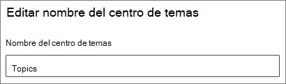

# Cambiar el nombre del centro de temas en Microsoft 365Change the name of the topic center in Microsoft 365

Puede cambiar el nombre del centro de temas en el [centro de administración de Microsoft 365](https://admin.microsoft.com).You can change the name of your topic center in the [Microsoft 365 admin center](https://admin.microsoft.com). Debe ser administrador global o administrador de SharePoint para realizar estas tareas.You must be a global administrator or SharePoint administrator to perform these tasks.

## Para acceder a la configuración de administración de temas:To access topics management settings:

1. En el centro de administración de Microsoft 365, haga clic en **configuración** y, a continuación, en configuración de la **organización**.In the Microsoft 365 admin center, click **Settings**, then **Org settings**.
2. En la pestaña **servicios** , haga clic en **red de conocimiento**.On the **Services** tab, click **Knowledge network**.

     

3. Seleccione la pestaña **centro de temas** . Consulte las secciones siguientes para obtener información sobre cada configuración.Select the **Topic center** tab. See the following sections for information about each setting.

     

##  Actualizar el nombre del centro de temasUpdate your topic center name

Para cambiar el nombre del centro del temaTo change the name of the topic center

1. En la pestaña **centro de temas** , en nombre del centro de **temas**, seleccione **Editar**.On the **Topic center** tab, under **Topic center name**, select **Edit**.
2. En la página **Editar nombre del centro de temas** , en el cuadro Nombre del centro de **temas** , escriba el nuevo nombre del centro de temas.On the **Edit topic center name** page, in the **Topic center name** box, type the new name for your topic center.
3. Seleccione **Guardar**.Select **Save**

      

## Vea tambiénSee also

[Administrar la detección de temas en Microsoft 365Manage topic discovery in Microsoft 365](topic-experiences-discovery.md)

[Administrar la visibilidad de los temas en Microsoft 365Manage topic visibility in Microsoft 365](topic-experiences-knowledge-rules.md)

[Administrar los permisos de temas en Microsoft 365Manage topic permissions in Microsoft 365](topic-experiences-user-permissions.md)
