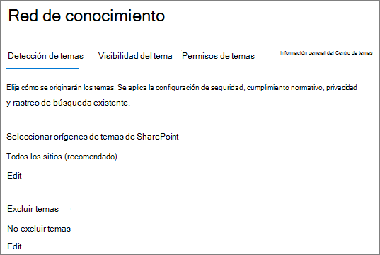

# <a name="manage-topic-discovery-in-microsoft-365"></a><span data-ttu-id="81d8d-103">Administrar la detección de temas en Microsoft 365</span><span class="sxs-lookup"><span data-stu-id="81d8d-103">Manage topic discovery in Microsoft 365</span></span>

<span data-ttu-id="81d8d-104">Puede administrar la configuración de detección de temas en el [centro de administración de Microsoft 365](https://admin.microsoft.com).</span><span class="sxs-lookup"><span data-stu-id="81d8d-104">You can manage topic discovery settings in the [Microsoft 365 admin center](https://admin.microsoft.com).</span></span> <span data-ttu-id="81d8d-105">Debe ser administrador global o administrador de SharePoint para realizar estas tareas.</span><span class="sxs-lookup"><span data-stu-id="81d8d-105">You must be a global administrator or SharePoint administrator to perform these tasks.</span></span>

## <a name="to-access-topics-management-settings"></a><span data-ttu-id="81d8d-106">Para acceder a la configuración de administración de temas:</span><span class="sxs-lookup"><span data-stu-id="81d8d-106">To access topics management settings:</span></span>

1. <span data-ttu-id="81d8d-107">En el centro de administración de Microsoft 365, haga clic en **configuración** y, a continuación, en configuración de la **organización**.</span><span class="sxs-lookup"><span data-stu-id="81d8d-107">In the Microsoft 365 admin center, click **Settings**, then **Org settings**.</span></span>
2. <span data-ttu-id="81d8d-108">En la pestaña **servicios** , haga clic en **red de conocimiento**.</span><span class="sxs-lookup"><span data-stu-id="81d8d-108">On the **Services** tab, click **Knowledge network**.</span></span>

     

3. <span data-ttu-id="81d8d-110">Seleccione la pestaña **detección de temas** . Consulte las secciones siguientes para obtener información sobre cada configuración.</span><span class="sxs-lookup"><span data-stu-id="81d8d-110">Select the **Topic discovery** tab. See the following sections for information about each setting.</span></span>

     

## <a name="select-sharepoint-topic-sources"></a><span data-ttu-id="81d8d-112">Seleccionar orígenes de temas de SharePoint</span><span class="sxs-lookup"><span data-stu-id="81d8d-112">Select SharePoint topic sources</span></span>

<span data-ttu-id="81d8d-113">Puede cambiar los sitios de SharePoint de la organización que se rastrearán en busca de temas.</span><span class="sxs-lookup"><span data-stu-id="81d8d-113">You can change the SharePoint sites in your organization that will be crawled for topics.</span></span>

<span data-ttu-id="81d8d-114">Si desea incluir o excluir una lista específica de sitios, puede usar la siguiente plantilla. csv:</span><span class="sxs-lookup"><span data-stu-id="81d8d-114">If you want to include or exclude a specific list of sites, you can use the following .csv template:</span></span>

``` csv
Site name,URL
```

<span data-ttu-id="81d8d-115">Si agrega sitios con el selector de sitios, se agregan a la lista de sitios existente para incluir o excluir.</span><span class="sxs-lookup"><span data-stu-id="81d8d-115">If you add sites using the site picker, they are added to the existing list of sites to include or exclude.</span></span> <span data-ttu-id="81d8d-116">Si carga un archivo. csv, se sobrescribirá cualquier lista existente.</span><span class="sxs-lookup"><span data-stu-id="81d8d-116">If you upload a .csv file, it overwrites any existing list.</span></span> <span data-ttu-id="81d8d-117">Si anteriormente ha incluido o excluido sitios específicos, puede descargar la lista como un archivo. csv, realizar cambios y cargar la lista nueva.</span><span class="sxs-lookup"><span data-stu-id="81d8d-117">If you have previously included or excluded specific sites, you and download the list as a .csv file, make changes, and upload the new list.</span></span>

<span data-ttu-id="81d8d-118">Para elegir sitios para la detección de temas</span><span class="sxs-lookup"><span data-stu-id="81d8d-118">To choose sites for topic discovery</span></span>

1. <span data-ttu-id="81d8d-119">En la pestaña **detección de temas** , en **seleccionar orígenes de temas de SharePoint**, seleccione **Editar**.</span><span class="sxs-lookup"><span data-stu-id="81d8d-119">On the **Topic discovery** tab, under **Select SharePoint topic sources**, select **Edit**.</span></span>
2. <span data-ttu-id="81d8d-120">En la página **seleccionar orígenes de temas de SharePoint** , seleccione los sitios de SharePoint que se rastrearán como orígenes para los temas durante la detección.</span><span class="sxs-lookup"><span data-stu-id="81d8d-120">On the **Select SharePoint topic sources** page, select which SharePoint sites will be crawled as sources for your topics during discovery.</span></span> <span data-ttu-id="81d8d-121">Esto incluye:</span><span class="sxs-lookup"><span data-stu-id="81d8d-121">This includes:</span></span>
    - <span data-ttu-id="81d8d-122">**Todos los sitios**: todos los sitios de SharePoint de su espacio empresarial.</span><span class="sxs-lookup"><span data-stu-id="81d8d-122">**All sites**: All SharePoint sites in your tenant.</span></span> <span data-ttu-id="81d8d-123">Esto captura los sitios actuales y futuros.</span><span class="sxs-lookup"><span data-stu-id="81d8d-123">This captures current and future sites.</span></span>
    - <span data-ttu-id="81d8d-124">**Todos, excepto los sitios seleccionados**: escriba los nombres de los sitios que desea excluir.</span><span class="sxs-lookup"><span data-stu-id="81d8d-124">**All, except selected sites**: Type the names of the sites you want to exclude.</span></span>  <span data-ttu-id="81d8d-125">También puede cargar una lista de sitios que desea excluir de la detección.</span><span class="sxs-lookup"><span data-stu-id="81d8d-125">You can also upload a list of sites you want to opt out from discovery.</span></span> <span data-ttu-id="81d8d-126">Los sitios que se creen en el futuro se incluirán como orígenes para la detección de temas.</span><span class="sxs-lookup"><span data-stu-id="81d8d-126">Sites created in the future will be included as sources for topic discovery.</span></span> 
    - <span data-ttu-id="81d8d-127">**Solo sitios seleccionados**: escriba los nombres de los sitios que desea incluir.</span><span class="sxs-lookup"><span data-stu-id="81d8d-127">**Only selected sites**: Type the names of the sites you want to include.</span></span> <span data-ttu-id="81d8d-128">También puede cargar una lista de sitios.</span><span class="sxs-lookup"><span data-stu-id="81d8d-128">You can also upload a list of sites.</span></span> <span data-ttu-id="81d8d-129">Los sitios que se creen en el futuro no se incluirán como orígenes para la detección de temas.</span><span class="sxs-lookup"><span data-stu-id="81d8d-129">Sites created in the future will not be included as sources for topic discovery.</span></span>
    - <span data-ttu-id="81d8d-130">**Sin sitios**: los temas no se generan ni se actualizan automáticamente con contenido de SharePoint.</span><span class="sxs-lookup"><span data-stu-id="81d8d-130">**No sites**: Topics won't be automatically generated or updated with SharePoint content.</span></span> <span data-ttu-id="81d8d-131">Los temas existentes permanecen en el centro de temas.</span><span class="sxs-lookup"><span data-stu-id="81d8d-131">Existing topics remain in the topic center.</span></span>

    
   
3. <span data-ttu-id="81d8d-133">Haga clic en **Guardar**.</span><span class="sxs-lookup"><span data-stu-id="81d8d-133">Click **Save**.</span></span>

## <a name="exclude-topics-by-name"></a><span data-ttu-id="81d8d-134">Excluir temas por nombre</span><span class="sxs-lookup"><span data-stu-id="81d8d-134">Exclude topics by name</span></span>

<span data-ttu-id="81d8d-135">Puede excluir los temas de la detección cargando una lista usando un archivo. csv.</span><span class="sxs-lookup"><span data-stu-id="81d8d-135">You can exclude topics from discovery by uploading a list using a .csv file.</span></span> <span data-ttu-id="81d8d-136">Si ya ha excluido los temas, puede descargar. csv, realizar cambios y cargarlo de nuevo.</span><span class="sxs-lookup"><span data-stu-id="81d8d-136">If you've previously excluded topics, you can download the .csv, make changes, and upload it again.</span></span>

1. <span data-ttu-id="81d8d-137">En la pestaña **detección** de temas, en **excluir temas**, seleccione **Editar**.</span><span class="sxs-lookup"><span data-stu-id="81d8d-137">On the **Topic discovery** tab, under **Exclude topics**, select **Edit**.</span></span>
2. <span data-ttu-id="81d8d-138">Haga clic en **excluir temas por nombre**.</span><span class="sxs-lookup"><span data-stu-id="81d8d-138">Click **Exclude topics by name**.</span></span>
3. <span data-ttu-id="81d8d-139">Si necesita crear una lista, descargue la plantilla. csv y agregue los temas que desea excluir (consulte *trabajar con la plantilla. csv* a continuación).</span><span class="sxs-lookup"><span data-stu-id="81d8d-139">If you need to create a list, download the .csv template and add the topics that you want to exclude (see *Working with the .csv template* below).</span></span> <span data-ttu-id="81d8d-140">Cuando el archivo esté listo, haga clic en **examinar** y cargue el archivo.</span><span class="sxs-lookup"><span data-stu-id="81d8d-140">When the file is ready, click **Browse** and upload the file.</span></span> <span data-ttu-id="81d8d-141">Si hay una lista existente, puede descargar el archivo. csv que contiene la lista.</span><span class="sxs-lookup"><span data-stu-id="81d8d-141">If there's an existing list, you can download the .csv containing the list.</span></span>
4. <span data-ttu-id="81d8d-142">Haga clic en **Guardar**.</span><span class="sxs-lookup"><span data-stu-id="81d8d-142">Click **Save**.</span></span>

    

### <a name="working-with-the-csv-template"></a><span data-ttu-id="81d8d-144">Trabajar con la plantilla. csv</span><span class="sxs-lookup"><span data-stu-id="81d8d-144">Working with the .csv template</span></span>

<span data-ttu-id="81d8d-145">Puede copiar la plantilla CSV a continuación:</span><span class="sxs-lookup"><span data-stu-id="81d8d-145">You can copy the csv template below:</span></span>

``` csv
Name (required),Expansion,MatchType- Exact/Partial (required)
```

<span data-ttu-id="81d8d-146">En la plantilla CSV, escriba la siguiente información sobre los temas que desea excluir:</span><span class="sxs-lookup"><span data-stu-id="81d8d-146">In the CSV template, enter the following information about the topics you want to exclude:</span></span>

- <span data-ttu-id="81d8d-147">**Name**: escriba el nombre del tema que desea excluir.</span><span class="sxs-lookup"><span data-stu-id="81d8d-147">**Name**: Type the name of the topic you want to exclude.</span></span> <span data-ttu-id="81d8d-148">Puede realizar esto de dos maneras:</span><span class="sxs-lookup"><span data-stu-id="81d8d-148">There are two ways to do this:</span></span>
    - <span data-ttu-id="81d8d-149">Coincidencia exacta: puede incluir el acrónimo o el nombre exacto (por ejemplo, *contoso* o *ATL*).</span><span class="sxs-lookup"><span data-stu-id="81d8d-149">Exact match: You can include the exact name or acronym (for example, *Contoso* or *ATL*).</span></span>
    - <span data-ttu-id="81d8d-150">Coincidencia parcial: puede excluir todos los temas que contengan una palabra específica.</span><span class="sxs-lookup"><span data-stu-id="81d8d-150">Partial match: You can exclude all topics that have a specific word in it.</span></span>  <span data-ttu-id="81d8d-151">Por ejemplo, *arco* excluirá todos los temas que contengan la palabra *Arc* , como *círculo arco*, *soldadura de arco de plasma* o arco de *formación*. Tenga en cuenta que no se excluirán los temas en los que se incluya el texto como parte de una palabra, como la *arquitectura*.</span><span class="sxs-lookup"><span data-stu-id="81d8d-151">For example, *arc* will exclude all topics with the word *arc* in it, such as *Arc circle*, *Plasma arc welding*, or *Training arc*. Note that it will not exclude topics in which the text is included as part of a word, such as *Architecture*.</span></span>
- <span data-ttu-id="81d8d-152">**Significa (opcional)**: Si desea excluir un acrónimo, escriba las palabras que representa el acrónimo.</span><span class="sxs-lookup"><span data-stu-id="81d8d-152">**Stands for (optional)**: If you want to exclude an acronym, type the words the acronym stands for.</span></span>
- <span data-ttu-id="81d8d-153">**MatchType-Exact/Partial**: escriba si el nombre que ha escrito es un tipo de coincidencia *exacta* o *parcial* .</span><span class="sxs-lookup"><span data-stu-id="81d8d-153">**MatchType-Exact/Partial**: Type whether the name you entered was an *exact* or *partial* match type.</span></span>

     

## <a name="see-also"></a><span data-ttu-id="81d8d-155">Vea también</span><span class="sxs-lookup"><span data-stu-id="81d8d-155">See also</span></span>

[<span data-ttu-id="81d8d-156">Administrar la visibilidad de los temas en Microsoft 365</span><span class="sxs-lookup"><span data-stu-id="81d8d-156">Manage topic visibility in Microsoft 365</span></span>](topic-experiences-knowledge-rules.md)

[<span data-ttu-id="81d8d-157">Administrar los permisos de temas en Microsoft 365</span><span class="sxs-lookup"><span data-stu-id="81d8d-157">Manage topic permissions in Microsoft 365</span></span>](topic-experiences-user-permissions.md)

[<span data-ttu-id="81d8d-158">Cambiar el nombre del centro de temas en Microsoft 365</span><span class="sxs-lookup"><span data-stu-id="81d8d-158">Change the name of the topic center in Microsoft 365</span></span>](topic-experiences-administration.md)

