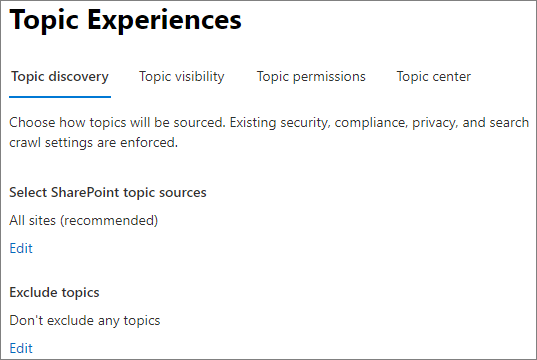
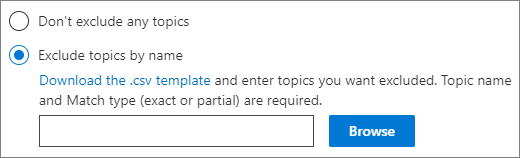

# <a name="manage-topic-discovery-in-microsoft-365"></a>Administrar la detección de temas en Microsoft 365

Puede administrar la configuración de detección de temas en el [centro de administración de Microsoft 365](https://admin.microsoft.com). Debe ser administrador global o administrador de SharePoint para realizar estas tareas.

## <a name="to-access-topics-management-settings"></a>Para acceder a la configuración de administración de temas:

1. En el centro de administración de Microsoft 365, haga clic en **configuración** y, a continuación, en configuración de la **organización**.
2. En la pestaña **servicios** , haga clic en **red de conocimiento**.

     

3. Seleccione la pestaña **detección de temas** . Consulte las secciones siguientes para obtener información sobre cada configuración.

     

## <a name="select-sharepoint-topic-sources"></a>Seleccionar orígenes de temas de SharePoint

Puede cambiar los sitios de SharePoint de la organización que se rastrearán en busca de temas.

Si desea incluir o excluir una lista específica de sitios, puede usar la siguiente plantilla. csv:

``` csv
Site name,URL
```

Si agrega sitios con el selector de sitios, se agregan a la lista de sitios existente para incluir o excluir. Si carga un archivo. csv, se sobrescribirá cualquier lista existente. Si anteriormente ha incluido o excluido sitios específicos, puede descargar la lista como un archivo. csv, realizar cambios y cargar la lista nueva.

Para elegir sitios para la detección de temas

1. En la pestaña **detección de temas** , en **seleccionar orígenes de temas de SharePoint**, seleccione **Editar**.
2. En la página **seleccionar orígenes de temas de SharePoint** , seleccione los sitios de SharePoint que se rastrearán como orígenes para los temas durante la detección. Esto incluye:
    - **Todos los sitios**: todos los sitios de SharePoint de su espacio empresarial. Esto captura los sitios actuales y futuros.
    - **Todos, excepto los sitios seleccionados**: escriba los nombres de los sitios que desea excluir.  También puede cargar una lista de sitios que desea excluir de la detección. Los sitios que se creen en el futuro se incluirán como orígenes para la detección de temas. 
    - **Solo sitios seleccionados**: escriba los nombres de los sitios que desea incluir. También puede cargar una lista de sitios. Los sitios que se creen en el futuro no se incluirán como orígenes para la detección de temas.
    - **Sin sitios**: los temas no se generan ni se actualizan automáticamente con contenido de SharePoint. Los temas existentes permanecen en el centro de temas.

    
   
3. Haga clic en **Guardar**.

## <a name="exclude-topics-by-name"></a>Excluir temas por nombre

Puede excluir los temas de la detección cargando una lista usando un archivo. csv. Si ya ha excluido los temas, puede descargar. csv, realizar cambios y cargarlo de nuevo.

1. En la pestaña **detección** de temas, en **excluir temas**, seleccione **Editar**.
2. Haga clic en **excluir temas por nombre**.
3. Si necesita crear una lista, descargue la plantilla. csv y agregue los temas que desea excluir (consulte *trabajar con la plantilla. csv* a continuación). Cuando el archivo esté listo, haga clic en **examinar** y cargue el archivo. Si hay una lista existente, puede descargar el archivo. csv que contiene la lista.
4. Haga clic en **Guardar**.

    

### <a name="working-with-the-csv-template"></a>Trabajar con la plantilla. csv

Puede copiar la plantilla CSV a continuación:

``` csv
Name (required),Expansion,MatchType- Exact/Partial (required)
```

En la plantilla CSV, escriba la siguiente información sobre los temas que desea excluir:

- **Name**: escriba el nombre del tema que desea excluir. Puede realizar esto de dos maneras:
    - Coincidencia exacta: puede incluir el acrónimo o el nombre exacto (por ejemplo, *contoso* o *ATL*).
    - Coincidencia parcial: puede excluir todos los temas que contengan una palabra específica.  Por ejemplo, *arco* excluirá todos los temas que contengan la palabra *Arc* , como *círculo arco*, *soldadura de arco de plasma* o arco de *formación*. Tenga en cuenta que no se excluirán los temas en los que se incluya el texto como parte de una palabra, como la *arquitectura*.
- **Significa (opcional)**: Si desea excluir un acrónimo, escriba las palabras que representa el acrónimo.
- **MatchType-Exact/Partial**: escriba si el nombre que ha escrito es un tipo de coincidencia *exacta* o *parcial* .

     

## <a name="see-also"></a>Vea también

[Administrar la visibilidad de los temas en Microsoft 365](topic-experiences-knowledge-rules.md)

[Administrar los permisos de temas en Microsoft 365](topic-experiences-user-permissions.md)

[Cambiar el nombre del centro de temas en Microsoft 365](topic-experiences-administration.md)

