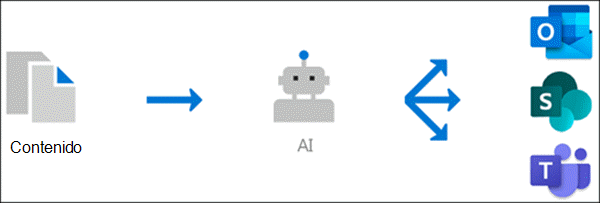

# Información general sobre las experiencias de temas (versión preliminar)

> [!Note] 
> El contenido de este artículo es para la versión preliminar privada de Project Cortex. [Obtenga más información acerca del Project Cortex](https://aka.ms/projectcortex).

El tema experiencias usa la tecnología Microsoft AI, Microsoft 365, Delve, Microsoft Graph, búsqueda y otros componentes y servicios para crear una red de conocimiento en el entorno de Microsoft 365. 

      

Su objetivo es convertir la información en conocimiento y entregarla a los usuarios en las aplicaciones que usan diariamente, como las páginas modernas de SharePoint y Microsoft Search.

El tema experiencias ayuda a solucionar un problema empresarial clave en muchas compañías, lo que proporciona la información a los usuarios cuando la necesitan. Por ejemplo, los nuevos empleados necesitan aprender rápidamente una gran cantidad de información nueva y se encuentran con términos que saben que no saben nada al leer a través de la información de la empresa. Para obtener más información, es posible que el usuario necesite desplazarse de lo que están haciendo y gastar tiempo valioso buscando detalles, como información sobre el término, quién en la organización es un experto en la materia y quizá sitios y documentos relacionados con el término.

El tema experiencias usa AI para buscar e identificar automáticamente los **temas** de la organización. Compila información sobre ellas, como una descripción breve, los expertos en la materia sobre el tema y los sitios, los archivos y las páginas que están relacionados con él. Un administrador o colaborador de conocimientos puede elegir actualizar la información del tema según sea necesario. Los temas están disponibles para los usuarios, lo que significa que, para cada instancia del tema que aparece en un sitio moderno de SharePoint en noticias y páginas, se resalta el texto. Los usuarios pueden elegir seleccionar el tema para obtener más información mediante el tema detalles. También se pueden encontrar temas en la búsqueda de SharePoint.

## Cómo se muestran los temas a los usuarios

Cuando se menciona un tema en contenido de las páginas y las noticias de SharePoint, se verá resaltado. Puede abrir el resumen del tema desde el resaltado. Abra el tema detalles en el título del Resumen. El tema mencionado se puede identificar automáticamente o se ha agregado a la página con una referencia directa al tema por parte del autor de la página. 

      

## Indización de conocimiento

El tema experiencias usa la tecnología Microsoft AI para identificar **temas** en su entorno de Microsoft 365.

Un tema es una frase o un término que es importante en cuanto a la organización. Tiene un significado específico para la organización y tiene recursos relacionados con ella que pueden ayudar a los usuarios a comprender lo que es y encontrar más información sobre ella.

Cuando se identifica un tema y el AI determina que tiene suficiente información para que sea un tema sugerido, se crea una **Página de tema** para que contenga la información recopilada a través de la indización de temas, por ejemplo:

- Nombres alternativos o acrónimos.
- Una breve descripción del tema.
- Usuarios que podrían conocer el tema.
- Archivos, páginas y sitios relacionados con el tema.

Los administradores del conocimiento pueden elegir rastrear todos los sitios de SharePoint de su inquilino para los temas o simplemente seleccionar determinados.

## Roles

Cuando use las experiencias de los temas en su entorno de Microsoft 365, los usuarios tendrán las siguientes funciones:

- Visor de temas: usuarios que podrán ver temas destacados en sitios modernos de SharePoint que tienen al menos acceso de *lectura* a y en Microsoft Search. Podrán seleccionar los elementos destacados del tema para ver los detalles del tema en las páginas del tema. Los visores de temas podrán enviar comentarios sobre la utilidad de los temas.

- Colaboradores: usuarios que tienen derechos para editar temas existentes o crear otros nuevos. Los administradores de conocimiento asignan permisos de colaborador a los usuarios a través del tema configuración de la experiencia en el centro de administración de Microsoft 365. Tenga en cuenta que también puede conceder a todos los visores de temas el permiso para editar y crear temas, de manera que también puedan contribuir a los temas que ven.

- Administradores de conocimiento: usuarios que guían los temas a través del ciclo de vida del tema. Administradores de conocimiento use la página **administrar temas** del centro del tema para confirmar o quitar los temas sugeridos: sugerencias, así como editar los temas existentes o crear otros nuevos, y son los únicos usuarios que tienen acceso a él. Los administradores de conocimiento asignan permisos de administrador de conocimiento a los usuarios a través del tema experiencia de administración en el centro de administración de Microsoft 365. 

- Administradores de conocimiento: administradores de conocimiento configurar experiencias de temas y administrarlas a través de los controles de administración en el centro de administración de Microsoft 365. Actualmente, un administrador global o de SharePoint de Microsoft 365 puede servir como administrador de conocimientos.

Consulte el [tema experiencias de roles](topic-experiences-roles.md) para obtener más información.

## Administración de temas

La administración de temas se lleva a cabo en la página **administrar temas** del **centro de temas** de la organización. El centro del tema se crea durante la instalación y sirve como centro de conocimientos para su organización. 

Mientras que todos los usuarios con licencia podrán ver los temas con los que están conectados en el centro de temas, solo los usuarios con permisos *administrar temas* (administradores de conocimiento) podrán ver y usar la página Administrar temas.

Los administradores de conocimiento podrán:

- Confirme o rechace los temas que se detectaron en su espacio empresarial.
- Cree temas nuevos de forma manual según sea necesario (por ejemplo, si no se proporcionó suficiente información para que se detectase a través de AI).
- Edite las páginas del tema existentes. 

Para obtener más información, vea [administrar temas en el centro](manage-topics.md) de temas.  

## Controles de administración

Los controles de administración en el centro de administración de Microsoft 365 le permiten administrar su red de conocimientos. Permiten a un administrador global o de SharePoint de Microsoft 365:

- Controlar qué usuarios de la organización pueden ver los temas en las páginas modernas de SharePoint o en los resultados de la búsqueda de SharePoint.
- Controle los sitios de SharePoint que se rastrearán para buscar temas.
- Configure la detección de temas para excluir temas específicos de que se encuentren.
- Controlar qué usuarios pueden administrar temas en el centro de temas.
- Controlar qué usuarios pueden crear y editar temas en el centro de temas.
- Controlar qué usuario podrá ver los temas.

Consulte [asignar permisos de usuario](https://docs.microsoft.com/microsoft-365/knowledge/plan-topic-experiences#user-permissions), [administrar la visibilidad](https://docs.microsoft.com/microsoft-365/knowledge/topic-experiences-knowledge-rules)de los temas y administrar la [detección de temas](https://docs.microsoft.com/microsoft-365/knowledge/topic-experiences-discovery) para obtener más información acerca de los controles de administración.

## Tema curation & comentarios

AI continuará trabajando continuamente para proporcionar sugerencias para mejorar los temas a medida que se produzcan cambios en el entorno. 

Es posible que los usuarios a los que permita el acceso vean temas en su trabajo diario se le pregunten si el tema les ha sido útil. AI examina estas respuestas y las usa para ayudar a determinar qué se muestra en los resúmenes de tema y en los detalles del tema.

Los usuarios con los permisos editar o crear temas pueden realizar actualizaciones en las páginas de temas directamente si quieren realizar correcciones o agregar información adicional. 

Además, los usuarios con los permisos adecuados pueden etiquetar elementos como la conversación de Yammer que son relevantes para un tema y agregarlos a un tema específico. 

## Consulte también

