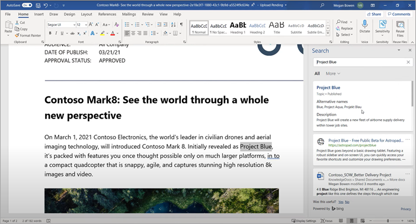

# Información general de Temas Microsoft VivaMicrosoft Viva Topics overview 

Viva Topics usa la tecnología de inteligencia artificial de Microsoft, Microsoft 365, Microsoft Graph, Búsqueda y otros componentes y servicios para aportar conocimiento a los usuarios en las aplicaciones de Microsoft 365 que usan todos los días, empezando por SharePoint páginas modernas, Búsqueda de Microsoft y Búsqueda en Word, PowerPoint, Outlook y Excel.Viva Topics uses Microsoft AI technology, Microsoft 365, Microsoft Graph, Search, and other components and services to bring knowledge to your users in the Microsoft 365 apps they use everyday, starting with SharePoint modern pages, Microsoft Search, and Search in Word, PowerPoint, Outlook, and Excel.

 

> [!VIDEO https://www.microsoft.com/videoplayer/embed/RE4LhZP]  

 

Viva Topics ayuda a abordar un problema empresarial clave en muchas empresas, ya que proporciona la información a los usuarios cuando la necesitan.Viva Topics helps to address a key business issue in many companies — providing the information to users when they need it. Por ejemplo, los nuevos empleados necesitan obtener mucha información nueva rápidamente y se encuentran con términos que no conocen al leer el contenido de la compañía.For example, new employees need to learn a lot of new information quickly, and encounter terms they know nothing about when reading through company information. Para obtener más información, es posible que el usuario deba dejar lo que está haciendo y dedicar un tiempo valioso a buscar detalles, como información sobre qué es el término, quién en la organización es un experto en la materia y quizás sitios y documentos relacionados con el término.To learn more, the user might need to step away from what they are doing and spend valuable time searching for details, such as information about what the term is, who in the organization is a subject matter expert, and maybe sites and documents that are related to the term.

Temas Viva usa inteligencia artificial para buscar e identificar automáticamente *temas* en su organización.Viva Topics uses AI to automatically search for and identify *topics* in your organization. Compilan información sobre ellos, como una breve descripción, personas que trabajan en el tema y sitios, archivos y páginas relacionados con él.It compiles information about them, such as a short description, people working on the topic, and sites, files, and pages that are related to it. Un gestores de información o colaborador puede actualizar la información del tema según sea necesario.A knowledge manager or contributor can choose to update the topic information as needed. Los temas están disponibles para los usuarios, lo que significa que, para cada instancia del tema que aparece en las noticias y páginas de un sitio moderno de SharePoint, el texto se resaltará.The topics are available to your users, which means that for every instance of the topic that appears in a modern SharePoint site in news and pages, the text will be highlighted. Los usuarios pueden seleccionar el tema para obtener más información sobre él en los detalles del tema.Users can choose to select the topic to learn more about it through the topic details. Los temas también pueden encontrarse en la búsqueda de SharePoint.Topics can also be found in SharePoint Search.

## Cómo se muestran los temas a los usuariosHow topics are displayed to users

Los temas se muestran a los usuarios a través de:Topics are displayed to users through:

- [Resaltados de temas](topic-experiences-overview.md#topic-highlights) en SharePoint páginas[Topic highlights](topic-experiences-overview.md#topic-highlights) in SharePoint pages
- Respuestas de temas en [los resultados de búsqueda](topic-experiences-overview.md#search-results)Topic answers in [search results](topic-experiences-overview.md#search-results)
- Búsqueda en [aplicaciones de office](topic-experiences-overview.md#office-application-search)Search in [office applications](topic-experiences-overview.md#office-application-search)
- [Página principal del centro](topic-experiences-overview.md#topic-center) de temas[Topic center](topic-experiences-overview.md#topic-center) home page

### Contenido destacado del temaTopic highlights

Cuando se menciona un tema en el contenido de noticias y páginas de SharePoint, lo verá resaltado.When a topic is mentioned in content on SharePoint news and pages, you'll see it highlighted. Puede abrir el resumen del tema desde el contenido resaltado.You can open the topic summary from the highlight. Abra los detalles del tema desde el título del resumen para ver la página de tema completa.Open the topic details from the title of the summary to view the full topic page. El tema mencionado podría identificarse automáticamente o podría haber sido agregado a la página con una referencia directa al tema por el autor de la página.The mentioned topic could be identified automatically or could have been added to the page with a direct reference to the topic by the page author. 

    

### Resultados de la búsquedaSearch results

Puede ver  una respuesta de tema en los resultados de la búsqueda cuando busca desde la página de inicio de SharePoint, la búsqueda en Office.com o la búsqueda desde un sitio de SharePoint después de cambiar el ámbito de búsqueda para incluir la organización completa.You can see a [topic answer](search.md#topic-answer) in search results when you search from the SharePoint start page, search on Office.com, or search from a SharePoint site after you you change the search scope to include the full organization. La respuesta al tema aparecerá en el tema de la lista de resultados y le dará un breve conjunto de información relacionada con ese tema.The topic answer will appear at the topic of the results list and give you a short set of information related to that topic. 

    

### Office búsqueda de aplicacionesOffice application search

Cuando usas la búsqueda en aplicaciones de Office como Word, PowerPoint, Outlook o Excel, ya sea a  través del cuadro de búsqueda o seleccionando Buscar en el menú contextual, las respuestas de los temas se muestran en los resultados de la búsqueda.When you use Search in Office apps such as Word, PowerPoint, Outlook, or Excel — either through the search box or by selecting **Search** in the context menu — topic answers are displayed in the search results.

   

   

### Centro de temasTopic center

Los usuarios pueden ver los temas de su organización a los que tienen una conexión en la página principal [del centro de temas](topic-center-overview.md#home-page).Users can see topics in their organization to which they have a connection on the [topic center home page](topic-center-overview.md#home-page).

## Indexación de informaciónKnowledge indexing

Temas Viva usa tecnología de inteligencia artificial de Microsoft para identificar los *temas* de su entorno de Microsoft 365.Viva Topics uses Microsoft AI technology to identify *topics* in your Microsoft 365 environment.

Un tema es una frase o un término que es significativo o importante para la organización.A topic is a phrase or term that is organizationally significant or important. Tiene un significado específico en la organización y cuenta con recursos relacionados que pueden ayudar a comprender qué es y a encontrar más información acerca de él.It has a specific meaning to the organization, and has resources related to it that can help people understand what it is and find more information about it. Hay muchos tipos diferentes de temas que serán importantes para su organización.There are lots of different types of topics that will be important to your organization. Inicialmente, la tecnología de inteligencia artificial de Microsoft se centra en los siguientes tipos:Initially, the Microsoft AI technology focuses on the following types:

- ProyectoProject
- EventoEvent
- OrganizaciónOrganization
- UbicaciónLocation
- ProductoProduct
- Trabajo creativoCreative work
- Campo de estudioField of study

Cuando se identifica un tema y la inteligencia artificial determina que tiene suficiente información para que sea un tema sugerido, una *página de tema* muestra la información que se ha recopilado a través de la indexación del tema, como la siguiente:When a topic is identified and AI determines that it has enough information for it to be a suggested topic, a *topic page* displays the information that was gathered through topic indexing, such as:

- Nombres y acrónimos alternativos.Alternate names and acronyms.
- Breve descripción del tema.A short description of the topic.
- Personas que puedan tener más información sobre el tema.People who might be knowledgeable about the topic.
- Archivos, páginas y sitios relacionados con el tema.Files, pages, and sites that are related to the topic.

Los administradores de información pueden rastrear todos los sitios de SharePoint de su espacio empresarial por temas o seleccionar algunos determinados.Your knowledge admins can choose to crawl all SharePoint sites in your tenant for topics, or to just select certain ones.

Para obtener más información, vea [Detección de temas y curación.](./topic-experiences-discovery-curation.md)For more information, see [Topic discovery and curation](./topic-experiences-discovery-curation.md).

## FuncionesRoles

Al usar Temas Viva en su entorno de Microsoft 365, los usuarios tendrán las siguientes funciones:When you use Viva Topics in your Microsoft 365 environment, your users will have the following roles:

- Visualizadores de temas: Usuarios que pueden ver contenido destacado de los temas en sitios modernos de SharePoint para los que tengan al menos acceso de *Lectura* y en Búsqueda de Microsoft.Topic viewers: Users who can see topic highlights on SharePoint modern sites that they have at least *Read* access to, and in Microsoft Search. Pueden seleccionar el contenido destacado de un tema para ver los detalles del mismo en las páginas de temas.They can select topic highlights to see topic details in topic pages. Los visualizadores de temas pueden aportar comentarios sobre lo útil que les resulta un tema a ellos.Topic viewers can provide feedback on how useful a topic is to them.

- Colaboradores: Usuarios que tienen permisos para editar los temas existentes o crear nuevos.Contributors: Users who have rights to edit existing topics or create new ones. Los administradores de información asignan permisos de colaborador a los usuarios a través de la configuración de Temas Viva en el Centro de administración de Microsoft 365.Knowledge admins assign contributor permissions to users through the Viva Topics settings in the Microsoft 365 admin center. Tenga en cuenta que también puede dar permiso a todos los visualizadores de temas para editar y crear temas para que todos puedan colaborar en los temas que ven.Note that you can also choose to give all topic viewers the permission to edit and create topics so that everyone can contribute to topics that they see.

- Gestores de información: Usuarios que guían los temas a través de su ciclo de vida.Knowledge managers: Users who guide topics through the topic lifecycle. Los administradores  de conocimientos usan la página Administrar temas del centro de temas para confirmar temas sugeridos por la IA, quitar temas que ya no son relevantes, así como editar temas existentes o crear otros nuevos y son los únicos usuarios que tienen acceso a él.Knowledge managers use the **Manage topics** page in the topic center to confirm AI-suggested topics, remove topics that are no longer relevant, as well as edit existing topics or create new ones, and are the only users who have access to it. Los administradores de información asignan permisos de gestores de información a los usuarios a través de la configuración de Temas Viva en el Centro de administración de Microsoft 365.Knowledge admins assign knowledge manager permissions to users through the Viva Topics admin settings in the Microsoft 365 admin center. 

- Administradores de conocimientos: los administradores establecen Viva Topics y lo administran a través de los controles de administración de la Centro de administración de Microsoft 365.Knowledge admins: Admins set up Viva Topics and manage it through the admin controls in the Microsoft 365 admin center. Actualmente, un administrador del servicio SharePoint o global de Microsoft 365 puede servir como administrador del información.Currently, a Microsoft 365 global or SharePoint administrator can serve as a knowledge admin.

Para obtener más información, vea [Roles de Temas de Viva](topic-experiences-roles.md).For more information, see [Viva Topics roles](topic-experiences-roles.md).

## Administración de temasTopic management

La administración de temas se realiza en la **página Administrar temas** del centro de temas de su *organización.*Topic management is done in the **Manage topics** page in your organization's *topic center*. El centro de temas se crea durante la instalación y sirve como centro de conocimiento para su organización.The topic center is created during setup and serves as your center of knowledge for your organization. 

Aunque todos los usuarios con licencia pueden ver los temas  con los que están conectados en el centro de temas, solo los usuarios con permisos administrar temas (administradores de conocimientos) pueden ver y usar la página Administrar **temas.**While all licensed users can see topics they're connected with in the topic center, only users with *Manage topics* permissions (knowledge managers) can view and use the **Manage topics** page.

Los gestores de información pueden realizar las siguientes acciones:Knowledge managers can:

- Confirmar o quitar los temas detectados en su espacio empresarial.Confirm or remove topics that were discovered in your tenant.
- Crear nuevos temas manualmente según sea necesario (por ejemplo, si no se ha proporcionado suficiente información para que lo detecte la inteligencia artificial).Create new topics manually as needed (for example, if not enough information was provided for it to be discovered through AI).
- Editar páginas de temas existentes.Edit existing topic pages.

Para obtener más información, vea [Manage topics in the topic center](manage-topics.md).For more information, see [Manage topics in the topic center](manage-topics.md).  

## Controles de administraciónAdmin controls

Los controles de administración Centro de administración de Microsoft 365 permiten administrar Temas de Viva.Admin controls in the Microsoft 365 admin center allow you to manage Viva Topics. Permiten a un administrador del servicio SharePoint o global de Microsoft 365 realizar las siguientes acciones:They allow a Microsoft 365 global or SharePoint administrator to:

- Controlar qué usuarios de su organización pueden ver temas en las páginas modernas de SharePoint o en los resultados de la búsqueda de SharePoint.Control which users in your organization are allowed to see topics in SharePoint modern pages or in SharePoint search results.
- Controlar los sitios de SharePoint que se rastrearán para identificar temas.Control which SharePoint sites will be crawled to identify topics.
- Excluir temas específicos de la búsqueda.Exclude specific topics from being found.
- Controlar qué usuarios pueden administrar temas en el centro de temas.Control which users can manage topics in the topic center.
- Controlar qué usuarios pueden crear y editar temas.Control which users can create and edit topics.
- Controlar qué usuarios pueden ver temas.Control which user can view topics.

Para obtener más información acerca de los controles de administración, vea [asignar permisos de usuario,](./plan-topic-experiences.md#user-permissions)administrar la [visibilidad del](./topic-experiences-knowledge-rules.md)tema y administrar la [detección de temas.](./topic-experiences-discovery.md)For more information about admin controls, see [assign user permissions](./plan-topic-experiences.md#user-permissions), [manage topic visibility](./topic-experiences-knowledge-rules.md), and [manage topic discovery](./topic-experiences-discovery.md).

## Comentarios y conservación de temasTopic curation & feedback

La inteligencia artificial trabajará sin descanso para ofrecerle sugerencias para mejorar los temas a medida que se produzcan cambios en su entorno.AI will continually work to provide you suggestions to improve your topics as changes occur in your environment. 

Los usuarios con permisos de edición o creación de temas pueden hacer actualizaciones en las páginas de temas directamente si quieren realizar correcciones o agregar información adicional.Users with edit or create topics permissions can make updates to topic pages directly if they want to make corrections or add additional information. También pueden agregar nuevos temas que la inteligencia artificial no ha sido capaz de identificar.They can also add new topics that AI wasn't able to identify. Si hay suficiente información sobre estos temas agregados manualmente y AI puede identificar este tipo de tema, las sugerencias adicionales de AI podrían mejorar estos temas agregados manualmente.If there's enough information on these manually added topics, and AI is able to identify this type of topic, additional suggestions from AI might enhance these manually added topics.

Es posible que se pregunte a los usuarios a los que permite acceder a ver temas en su trabajo diario si estos les han resultado útiles.Users that you allow access to see topics in their daily work might be asked if the topic was useful to them. El sistema examina estas respuestas y las usa para mejorar el contenido resaltado del tema y ayudar a determinar lo que se muestra en los resúmenes y detalles de los temas.The system looks at these responses and uses them to improve the topic highlight, and help determine what's shown on topic summaries and in topic details.

Para obtener más información, vea [Detección de temas y curación.](./topic-experiences-discovery-curation.md)For more information, see [Topic discovery and curation](./topic-experiences-discovery-curation.md).

## Vea tambiénSee also

[Use Búsqueda de Microsoft para buscar temas en Temas de VivaUse Microsoft Search to find topics in Viva Topics](./search.md)
